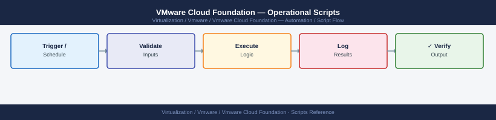

---
tags:
  - operations
  - vcf
  - vmware
---
# VMware Cloud Foundation — Operational Scripts


```powershell
┌──────────────────────────── VMware Cloud Foundation — Operational Scripts ────────────────────────────┐
│                                                                                                       │
│  PowerVCF scripts automate VCF operations: domain inventory, upgrade status,                          │
│  credential audit, certificate expiry check, and health report generation.                            │
│                                                                                                       │
│   ┌──────────────────────────────────────────────┐  ┌─────────────────────────────────────────────┐   │
│   │              Inventory Scripts               │  │            Health & Cert Scripts            │   │
│   │          Get-VCFDomain | Export-Csv          │  │           Request-VCFToken (auth)           │   │
│   │           Get-VCFHost (all hosts)            │  │         Get-VCFCertificate (expiry)         │   │
│   │        Get-VCFCluster (all clusters)         │  │       VMware.CloudFoundation.Reporting      │   │
│   │          Get-VCFCredential (audit)           │  │            Invoke-VcfHealthReport           │   │
│   └──────────────────────────────────────────────┘  └─────────────────────────────────────────────┘   │
│                                                                                                       │
│  PowerVCF scripts connect to SDDC Manager REST API; read-only ops need no approval.                   │
│                                                                                                       │
│                          ▼                                                 ▼                          │
│                                                                                                       │
│   ┌──────────────────────────────────────────────┐  ┌─────────────────────────────────────────────┐   │
│   │               Upgrade Scripts                │  │             Automation Examples             │   │
│   │         Get-VCFBundle (list bundles)         │  │            New-VCFDomain (create)           │   │
│   │            Start-VCFBundleUpload             │  │           Add-VCFHost (commission)          │   │
│   │          Start-VCFUpgrade (trigger)          │  │          Set-VCFCredential (rotate)         │   │
│   │          Get-VCFTask (status poll)           │  │          Watch upgrade via task ID          │   │
│   └──────────────────────────────────────────────┘  └─────────────────────────────────────────────┘   │
│                                                                                                       │
│  Physical Infrastructure (the hardware everything above runs on):                                     │
│  Scripts run from management jump host; connect to SDDC Manager on port 443;                          │
│  VMware.CloudFoundation.Reporting module needs PowerCLI + PowerVCF.                                   │
│                                                                                                       │
│  Key terms:                                                                                           │
│                                                                                                       │
│  PowerVCF       = PowerShell module for SDDC Manager automation                                       │
│  Request-VCFToken= authenticate and store bearer token for session                                    │
│  Get-VCFBundle  = list available upgrade bundles in depot/local                                       │
│  Start-VCFUpgrade= trigger upgrade for a domain or component                                          │
│  Get-VCFTask   = poll async task status by task ID                                                    │
│  Invoke-VcfHealthReport= generates HTML health report for all domains                                 │
│  Get-VCFCertificate= certificate expiry report for all components                                     │
│  New-VCFDomain = automate workload domain creation via API                                            │
│  Add-VCFHost   = commission new host to SDDC Manager                                                  │
│  Set-VCFCredential= trigger credential rotation for component                                         │
│  Reporting module= VMware.CloudFoundation.Reporting on PowerShell Gallery                             │
│  Task ID       = async operation ID; poll with Get-VCFTask until complete                             │
│                                                                                                       │
└───────────────────────────────────────────────────────────────────────────────────────────────────────┘
```

## Before you begin

- **Access:** vCenter read-only minimum; Administrator role for remediation steps
- **Timing:** safe to run during business hours unless a step is marked ⚠ (causes interruption)
- **Dependencies:** no active upgrades or migrations on the same infrastructure
- **Logging:** capture command output — paste into the change record on completion

---

---

## See also

- [VCF Operations — CLI Reference](cli-reference/)
- [VCF — Procedures](procedures/)

## Verify

- **Alarms:** vSphere Client → Home → Alarms — no new critical alarms after the operation
- **Events:** monitor the vCenter Events view for the affected object for 5 minutes
- **Health check:** run the morning health-check sequence for the affected product tier
