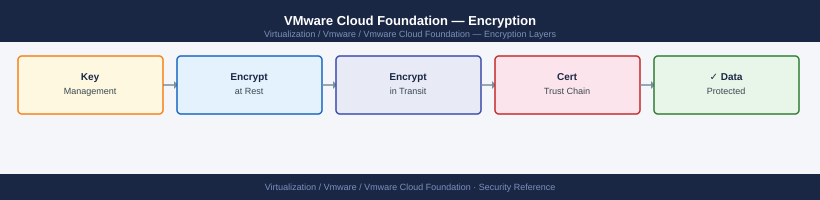

---
tags:
  - security
  - vcf
  - vmware
---
# VMware Cloud Foundation — Encryption

*Applies to: VMware vSphere 7.x / 8.x*

## Before you begin

- **Access:** vCenter Administrator role
- **Change management:** security changes require CAB approval in most environments
- **Rollback plan:** document current state before any security control change
- **Testing:** validate in a non-production environment first where possible

---

## See also

- [VCF — Hardening](../hardening/)
- [VCF — Health Checks](../../operations/health-checks/)
