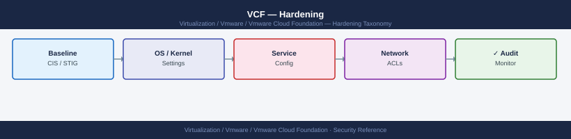

---
tags:
  - security
  - vcf
  - vmware
---
# VCF — Hardening

Hardening reference covering Hardening Checklist, Network Access Controls.

*Applies to: VCF 4.x / 5.x*

## Before you begin

- **Access:** vCenter Administrator role
- **Change management:** security changes require CAB approval in most environments
- **Rollback plan:** document current state before any security control change
- **Testing:** validate in a non-production environment first where possible

---

## Hardening Checklist

- [ ] All default passwords rotated via SDDC Manager Password Management at first use
- [ ] Password rotation schedule configured to 90 days (or per policy)
- [ ] SDDC Manager RBAC roles mapped to AD groups — no shared local accounts for day-to-day operations
- [ ] Local `admin` and `vcf` accounts locked after initial deployment; passwords stored in vault
- [ ] TLS 1.2 minimum enforced on all VCF component endpoints
- [ ] Certificates for all components replaced with CA-signed certificates via SDDC Manager Certificate Management
- [ ] Syslog forwarding to SIEM configured under Administration → Syslog
- [ ] Network access to SDDC Manager UI (TCP 443) restricted to management jump-host CIDR via firewall
- [ ] vSAN data-at-rest encryption enabled for workload domains handling sensitive data
- [ ] SDDC Manager audit logs reviewed monthly

## Network Access Controls

| Source | Destination | Port | Purpose |
|---|---|---|---|
| Management jump-host | SDDC Manager IP | TCP 443 | SDDC Manager UI/API |
| SDDC Manager | vCenter IPs | TCP 443 | Component management |
| SDDC Manager | NSX Manager IPs | TCP 443 | NSX API |
| SDDC Manager | ESXi management IPs | TCP 443, 902 | Host management |
| SDDC Manager | SIEM IP | UDP/TCP 514 or TLS 6514 | Syslog |

## See also

- [VMware Cloud Foundation — Access Control](../access-control/)
- [VMware Cloud Foundation — Authentication](../authentication/)
- [VCF — Health Checks](../../operations/health-checks/)
