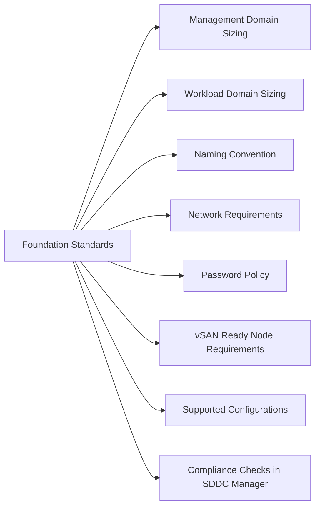

# VMware Cloud Foundation Standards

VCF deployments must adhere to strict naming and sizing standards to ensure SDDC Manager can successfully validate and manage all components throughout the lifecycle.



## Management Domain Sizing

| Component | Minimum | Recommended |
|---|---|---|
| ESXi hosts (management domain) | 4 | 6 |
| vSAN disk groups per host | 1 | 2 |
| Management NIC speed | 10 GbE | 25 GbE |
| SDDC Manager vCPU | 4 | 8 |
| SDDC Manager RAM | 16 GB | 24 GB |
| NSX Manager nodes | 3 (cluster) | 3 |
| vCenter RAM | 14 GB (small) | 24 GB (medium) |

## Workload Domain Sizing

| Component | Minimum | Notes |
|---|---|---|
| ESXi hosts per cluster | 3 | vSAN stretched: 4 (2 per site + witness) |
| Clusters per domain | 1 | Multiple clusters supported |
| Workload domains | 1 | Up to 15 per SDDC Manager |

## Naming Convention

All VCF components must have resolvable DNS names before deployment:

| Component | Format | Example |
|---|---|---|
| SDDC Manager | `sddc-mgr-<env>.<domain>` | `sddc-mgr-prod.corp.local` |
| vCenter | `vc-<domain>-<env>.<domain>` | `vc-mgmt-prod.corp.local` |
| NSX Manager | `nsx-<env>-<node#>.<domain>` | `nsx-prod-01.corp.local` |
| ESXi hosts | `esxi-<rack>-<unit>.<domain>` | `esxi-r01-u01.corp.local` |
| Network pools | `<dc>-<env>-pool-<purpose>` | `dc1-prod-pool-workload` |

## Network Requirements

| VMkernel | Purpose | Minimum Speed |
|---|---|---|
| Management (vmk0) | Host management, vCenter comms | 1 GbE |
| vMotion | Live migration traffic | 10 GbE |
| vSAN | vSAN storage traffic | 10 GbE (25 GbE recommended) |
| NSX overlay (TEP) | Geneve encapsulation | 10 GbE (25 GbE recommended) |

All VMkernel adapters must be on the VCF-managed VDS — standard vSwitches are not supported.

## Password Policy

SDDC Manager enforces password complexity on all managed accounts:

- Minimum 15 characters
- Must include uppercase, lowercase, number, and special character
- Maximum 30 characters
- Passwords rotate on a configurable schedule via Lifecycle Management

## vSAN Ready Node Requirements

All hosts in VCF must be validated against the vSAN Ready Node specification:

- Listed on the VMware Hardware Compatibility List (HCL)
- vSAN-certified SSD for cache tier
- Consistent hardware configuration within a cluster (CPU generation, NIC model)

```bash
# Check HCL compliance from SDDC Manager
# Lifecycle Management → Hardware Compatibility → Run HCL Check
```

## Supported Configurations

| Feature | Supported | Notes |
|---|---|---|
| vSAN ESA (Express Storage Architecture) | VCF 5.1+ | Requires NVMe drives |
| vSAN OSA (Original Storage Architecture) | All versions | Hybrid and all-flash |
| Stretched clusters | Yes | Requires witness host |
| NSX Federation | VCF 4.3+ | Cross-site policy management |
| Workload domains with FC storage | No | VCF uses vSAN only for principal storage |

## Compliance Checks in SDDC Manager

```bash
# SDDC Manager UI — run before any upgrade:
# Lifecycle Management → Precheck

# Precheck validates:
# - DNS resolution for all components
# - NTP synchronisation
# - Certificate expiry
# - vSAN health
# - Network pool capacity
# - Password rotation status
```
