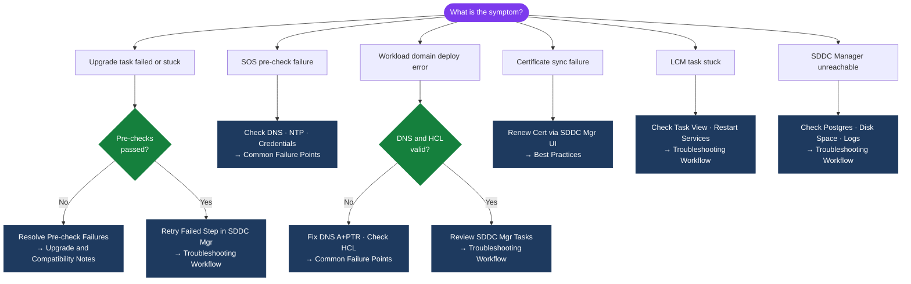

---
tags:
  - troubleshooting
  - vcf
  - vmware
search:
  boost: 1.5
---
# VCF Troubleshooting — Common Issues


<div class="kb-summary">
Common Issues reference covering Common Issues, Technical Deep Dive.

*Applies to: VCF 4.x / 5.x*
</div>


VCF Common Failure Points — Quick Reference


```d2
direction: down

symptom: Identify Symptom {shape: diamond}
general_troubleshooting: "General Troubleshooting" {shape: rectangle}
diagnostic_flow: "Diagnostic Flow" {shape: rectangle}
verify_resolution: "Verify resolution" {shape: rectangle}
resolution: Resolve or Escalate {shape: oval}

symptom -> general_troubleshooting: investigate
symptom -> diagnostic_flow: investigate
symptom -> verify_resolution: investigate
general_troubleshooting -> resolution
diagnostic_flow -> resolution
verify_resolution -> resolution
```

## General Troubleshooting

### Common Failure Points

- Lifecycle bundle issue
- Compatibility mismatch
- Password drift
- Certificate drift
- Workload domain health issue
- SDDC Manager service issue
- NSX/vCenter dependency failure
- DNS/NTP issue

### Troubleshooting Workflow

1. Confirm the impact and scope.
2. Check recent changes.
3. Review alerts, tasks, and events.
4. Validate DNS, NTP, authentication, and certificates.
5. Check service status.
6. Check storage and network dependencies.
7. Review logs.
8. Capture screenshots, timestamps, errors, and task IDs.
9. Escalate with clean evidence if needed.

### Upgrade and Compatibility Notes

- Check product interoperability before upgrades.
- Confirm supported version path.
- Confirm backup or rollback method.
- Confirm maintenance window.
- Run pre-checks before change work.
- Validate health after the change.
- Document version before and after.

### Best Practices

| Recommendation | Detail |
|---|---|
| Keep versions aligned. | Keep versions aligned. |
| Keep certificates tracked. | Keep certificates tracked. |
| Keep DNS and NTP clean. | Keep DNS and NTP clean. |
| Keep alerting actionable. | Keep alerting actionable. |
| Document support ownership. | Document support ownership. |
| Avoid undocumented changes. | Avoid undocumented changes. |

## Diagnostic Flow



---

## Before you begin

- **Access:** SSH to vCenter Shell and ESXi hosts; vSphere Client read access
- **Gather first:** recent error message text, event timestamps, and affected object names
- **Scope:** confirm whether the issue affects a single object, host, cluster, or site
- **Escalation:** open a vendor support ticket before running any destructive step
- **Logging:** document each command and output — required if escalation is needed

---

---

## See also

- [VCF Troubleshooting — Diagnostics](diagnostics/)
- [VCF Troubleshooting — Escalation](escalation/)
- [VCF — Health Checks](../operations/health-checks/)

## Verify resolution

- **Alarms cleared:** Home → Alarms — the triggering alarm is no longer active
- **Event log:** confirm no new related error events in the last 5 minutes
- **Functional test:** perform the action that was failing (connect, vMotion, storage I/O) — confirm it succeeds
- **Monitor:** leave the vSphere Client open for 10 minutes and confirm the issue does not recur
