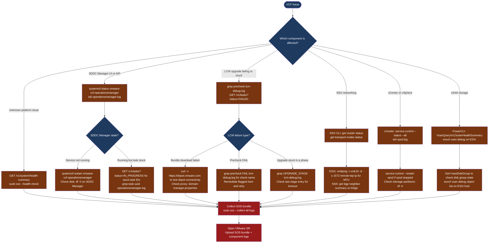

---
tags:
  - troubleshooting
  - vcf
  - vmware
search:
  boost: 1.5
---
# VCF — Diagnostics

<div class="kb-summary">
VMware Cloud Foundation diagnostic commands: check SDDC Manager services and health API, grep LCM upgrade logs for failures, diagnose NSX Manager cluster and transport nodes, collect the vc-support vCenter bundle, run the SOS utility for a full cross-component log bundle, and query the VCF health summary REST API.

*Applies to: VCF 4.x / 5.x*
</div>

```text
┌──────────────────────────────── VMware Cloud Foundation — Diagnostics ────────────────────────────────┐
│                                                                                                       │
│  VCF diagnostics use SDDC Manager task logs, SOS utility, component logs, and                         │
│  health reports to identify root causes across all VCF layers.                                        │
│                                                                                                       │
│   ┌──────────────────────────────────────────────┐  ┌─────────────────────────────────────────────┐   │
│   │              SDDC Manager Logs               │  │                 SOS Utility                 │   │
│   │             /var/log/vmware/vcf/             │  │     sudo sos --collect-all-logs             │   │
│   │            operationsmanager.log             │  │     sudo sos --health-check                 │   │
│   │           lcm-debug.log: LCM detail          │  │     sudo sos --connectivity-check           │   │
│   │         Tasks API: get failed tasks          │  │               Send ZIP to GSS               │   │
│   └──────────────────────────────────────────────┘  └─────────────────────────────────────────────┘   │
│                                                                                                       │
│  SOS utility generates a comprehensive bundle across all VCF components.                              │
│                                                                                                       │
│                          ▼                                                 ▼                          │
│                                                                                                       │
│   ┌──────────────────────────────────────────────┐  ┌─────────────────────────────────────────────┐   │
│   │            Component Diagnostics             │  │                Health Reports               │   │
│   │            vCenter: vc-support.sh            │  │    GET /v1/system/health-summary            │   │
│   │            NSX: get cluster status           │  │    GET /v1/domains — domain status          │   │
│   │           ESXi: vm-support bundle            │  │    GET /v1/hosts — host connectivity        │   │
│   │           vSAN: esxcli vsan debug            │  │    Get-VCFTask via PowerVCF                 │   │
│   └──────────────────────────────────────────────┘  └─────────────────────────────────────────────┘   │
│                                                                                                       │
│  Physical Infrastructure:                                                                             │
│  SDDC Manager appliance · Management domain vCenter + NSX + vSAN · Workload domain vCenter + NSX      │
│  SOS utility runs on SDDC Manager; component CLI access requires SSH to each appliance individually   │
│                                                                                                       │
│  Key terms:                                                                                           │
│  SOS utility   = VCF diagnostic bundle collector; /usr/lib/vmware-sddc-support/sos                    │
│  operationsmanager= SDDC Mgr main service log; task and API events                                    │
│  lcm-debug.log = LCM upgrade log; step-by-step upgrade stage progress and failures                    │
│  Tasks API     = GET /v1/tasks; lists failed or in-progress tasks with error details                  │
│  vc-support.sh = vCenter support bundle script; run on VCSA appliance                                 │
│  vmware-vcf-lcm= LCM systemd service; manages patch and upgrade orchestration                         │
│  Health summary= GET /v1/system/health-summary; cross-component health in one API call                │
│  Domain        = VCF workload boundary; each domain has its own vCenter, NSX, vSAN                    │
│  Credentials   = SDDC Mgr manages all component passwords; rotation failures show in /v1/credentials  │
│  Root access   = SOS utility requires root (sudo); SSH as vcf user then sudo                          │
│                                                                                                       │
└───────────────────────────────────────────────────────────────────────────────────────────────────────┘
```



## Before you begin

- **Access:** SSH to SDDC Manager (vcf user, then sudo for SOS); SSH to VCSA, NSX Manager, and ESXi hosts as needed; SDDC Manager admin credentials for the REST API
- **Gather first:** the specific symptom (LCM task failed, SDDC Manager unreachable, NSX transport node disconnected, vSAN health alarm), the affected domain name and task ID if visible, and when the issue started
- **Scope:** confirm whether the issue is in the management domain or a workload domain, and which component (SDDC Manager, LCM, NSX, vCenter, vSAN) shows the first error

---

## Step 1 — Check SDDC Manager services and health

```bash
# SSH to SDDC Manager
ssh vcf@sddc-manager.corp.example.com

# All VCF service statuses
systemctl list-units 'vmware-vcf-*' --no-pager
# Expected: all services active (running)

# Key services
systemctl status vmware-vcf-operationsmanager   # Core SDDC Manager
systemctl status vmware-vcf-lcm                 # Lifecycle Manager
systemctl status vmware-vcf-domainmanager       # Domain Manager
systemctl status vmware-vcf-commonsvcs          # Common Services (auth)

# Tail the main SDDC Manager log
sudo tail -100 /var/log/vmware/vcf/operationsmanager/operationsmanager.log | grep -i "error\|fail\|exception"

# Restart a specific service if stopped
sudo systemctl restart vmware-vcf-lcm
```

---

## Step 2 — Analyze LCM lifecycle and upgrade logs

`lcm-debug.log` is the primary log for all upgrade, patch, and bundle operations.

```bash
# Find precheck failures (most common first stop)
grep -i 'precheck.*FAIL\|compliance.*FAIL' \
  /var/log/vmware/vcf/lcm/lcm-debug.log | tail -50

# Find bundle download failures
grep -i 'download.*fail\|bundle.*error\|depot.*unreachable' \
  /var/log/vmware/vcf/lcm/lcm-debug.log

# Find upgrade stage progression (see which stage is stuck)
grep -i 'UPGRADE_STAGE\|stage.*complete\|stage.*failed' \
  /var/log/vmware/vcf/lcm/lcm-debug.log | tail -50

# Find a specific task by its UUID
grep "taskId=<task-uuid>" /var/log/vmware/vcf/lcm/lcm-debug.log

# Count errors per hour (useful for rate-of-failure analysis)
grep 'ERROR' /var/log/vmware/vcf/lcm/lcm-debug.log | \
  awk '{print $1, $2}' | cut -c1-13 | sort | uniq -c

# Test depot connectivity (for bundle download failures)
curl -v --max-time 30 https://depot.vmware.com/PROD2/evo/vmw/ 2>&1 | grep -E 'HTTP|Connected|SSL'

# Check proxy settings if depot is unreachable
cat /etc/vmware/vcf/domainmanager/domain-manager.properties | grep -i proxy
```

---

## Step 3 — Diagnose NSX Manager cluster and transport nodes

```bash
# SSH to NSX Manager
ssh admin@nsx-manager.corp.example.com

# Overall cluster health
get cluster status
# Expected: all 3 nodes STABLE

# Transport node summary
get transport-nodes status
# Expected: all nodes CONNECTED

# Logical router overview
get logical-routers

# BGP peer status on a gateway node
get logical-router <uuid> bgp neighbor summary

# Via REST API — degraded transport nodes
NSX="nsx-manager.corp.example.com"
AUTH="admin:NSXAdminPassword"

curl -sk -u "$AUTH" "https://$NSX/api/v1/transport-nodes/status-summary" | \
  python3 -c "import json,sys; d=json.load(sys.stdin); print(f\"Up={d.get('up_count','?')} Degraded={d.get('degraded_count','?')} Down={d.get('down_count','?')}\")"

# Find any transport node NOT in success state
curl -sk -u "$AUTH" "https://$NSX/api/v1/transport-nodes/status" | \
  python3 -c "
import json,sys
for tn in json.load(sys.stdin).get('results',[]):
    if tn.get('node_deployment_state',{}).get('state','') != 'success':
        print(f\"{tn.get('display_name','?')}: {tn.get('node_deployment_state',{}).get('state','?')}\")
"

# TEP MTU verification (from ESXi host)
vmkping -I vmk10 -d -s 1572 <remote-tep-ip>
# -d = DF bit; -s 1572 payload + 28 bytes header = 1600 total; must not fragment
```

---

## Step 4 — Check vCenter appliance

```bash
# SSH to vCenter Appliance as root
ssh root@vcenter.corp.example.com

# Check all vCenter services
service-control --status --all | grep -v RUNNING
# Expected: no output (all services running)

# Tail vpxd log for task and API errors
tail -100 /var/log/vmware/vpxd/vpxd.log | grep -i "error\|fatal"

# Disk space (full /storage/db causes cascading failures)
df -h | grep storage

# Generate vCenter support bundle
/usr/lib/vmware-vpx/scripts/vc-support.sh -p
ls -lh /var/tmp/vc-*.tgz
scp root@vcenter.corp.example.com:/var/tmp/vc-<date>-<id>.tgz /local/path/

# vCenter API health check
VCSA="vcenter.corp.example.com"
SESSION=$(curl -sk -u "administrator@vsphere.local:<pass>" \
  -X POST "https://$VCSA/rest/com/vmware/cis/session" | tr -d '"')
curl -sk -H "vmware-api-session-id: $SESSION" \
  "https://$VCSA/rest/appliance/health/system" | python3 -m json.tool
```

---

## Step 5 — Query SDDC Manager health API

```bash
# Authenticate to SDDC Manager REST API
TOKEN=$(curl -sk -X POST https://sddc-manager.corp.example.com/v1/tokens \
  -H "Content-Type: application/json" \
  -d '{"username":"admin","password":"AdminPassword"}' | \
  python3 -c "import json,sys; print(json.load(sys.stdin)['accessToken'])")

SDDC="sddc-manager.corp.example.com"

# Overall health summary (all components in one call)
curl -sk -H "Authorization: Bearer $TOKEN" \
  "https://$SDDC/v1/system/health-summary" | python3 -m json.tool

# Domain health (all workload domains)
curl -sk -H "Authorization: Bearer $TOKEN" \
  "https://$SDDC/v1/domains" | \
  python3 -c "
import json,sys
for d in json.load(sys.stdin).get('elements',[]):
    print(f\"{d['name']}: {d['status']} ({d['type']})\")
"

# Host health (all managed hosts)
curl -sk -H "Authorization: Bearer $TOKEN" \
  "https://$SDDC/v1/hosts" | \
  python3 -c "
import json,sys
for h in json.load(sys.stdin).get('elements',[]):
    if h.get('status') != 'ASSIGNED':
        print(f\"PROBLEM: {h['fqdn']}: {h.get('status','?')}\")
"

# Active tasks (for stuck tasks)
curl -sk -H "Authorization: Bearer $TOKEN" \
  "https://$SDDC/v1/tasks?status=IN_PROGRESS" | \
  python3 -c "
import json,sys
for t in json.load(sys.stdin).get('elements',[]):
    print(f\"{t['id']}: {t['name']} ({t['status']}) created={t.get('creationTimestamp','?')}\")
"

# Credentials not in ACTIVE state (rotation failures)
curl -sk -H "Authorization: Bearer $TOKEN" \
  "https://$SDDC/v1/credentials" | \
  python3 -c "
import json,sys
for c in json.load(sys.stdin).get('elements',[]):
    if c.get('credentialStatus') != 'ACTIVE':
        print(f\"{c['resourceName']} {c['accountName']}: {c.get('credentialStatus','?')}\")
"
```

---

## Step 6 — Collect SOS diagnostic bundle

```bash
# SSH to SDDC Manager and collect comprehensive log bundle
ssh vcf@sddc-manager.corp.example.com
sudo su -

# Full log collection (takes 20-40 minutes depending on cluster size)
/usr/lib/vmware-sddc-support/sos --collect-all-logs
# Output: /var/log/vmware/vcf/sddc-support/

# Health check only (faster — 5-10 minutes)
/usr/lib/vmware-sddc-support/sos --health-check

# Connectivity check only
/usr/lib/vmware-sddc-support/sos --connectivity-check

# List generated bundles
ls -lh /var/log/vmware/vcf/sddc-support/

# SCP the bundle to a transfer host
scp vcf@sddc-manager.corp.example.com:/var/log/vmware/vcf/sddc-support/<bundle>.zip ./
```

---

## Step 7 — VCF error code reference

| Error Code | Component | Meaning | Resolution |
|---|---|---|---|
| `LCM-3004` | LCM | Bundle download failed | Verify depot connectivity; check proxy settings |
| `LCM-3011` | LCM | Precheck failed — compliance | Run compliance check; remediate flagged items |
| `LCM-3015` | LCM | Upgrade vCenter — VAMI unreachable | Check VCSA VAMI service; restart if needed |
| `LCM-3020` | LCM | Host not in maintenance mode | Put host in maintenance or retry |
| `LCM-6003` | LCM | vSAN disk decommission timeout | Check vSAN resync progress; extend timeout |
| `NSX-2001` | NSX | Transport node config push failed | Check NSX agent on ESXi: `esxcli software vib list | grep nsx` |
| `NSX-4001` | NSX | BGP session down | Verify BGP config and upstream router reachability |
| `VSAN-0x00140029` | vSAN | Object degraded or absent | Check disk group health; look for disk failures |
| `VPXD-3016` | vCenter | HA configuration failed | Check HA cluster settings; verify storage connectivity |
| `CRED-1010` | SDDC Mgr | Credential rotation failed | Check account lockout; verify credential in SDDC Mgr vault |
| `DEPOT-001` | SDDC Mgr | Cannot reach online depot | Check DNS, proxy, firewall for depot.vmware.com |

---

## Log locations

| Component | Path / Command | What to look for |
|---|---|---|
| SDDC Manager | `/var/log/vmware/vcf/operationsmanager/operationsmanager.log` | Task and API errors |
| LCM | `/var/log/vmware/vcf/lcm/lcm-debug.log` | Precheck FAIL, upgrade stage errors |
| Domain Manager | `/var/log/vmware/vcf/domainmanager/domain-manager.log` | Domain expansion and host operations |
| vCenter | `/var/log/vmware/vpxd/vpxd.log` (on VCSA) | Task, event, and API errors |
| NSX Manager | `get log-file nsx-manager` (NSX CLI) | Control plane and cluster errors |
| Full bundle | `sudo sos --collect-all-logs` | All-in-one — required for VMware SR |

---

## See also

- [VCF Troubleshooting — Common Issues](common-issues/)
- [VCF Troubleshooting — Escalation](escalation/)

## Verify resolution

- `systemctl list-units vmware-vcf-*` shows all services active (running) on SDDC Manager
- `GET /v1/system/health-summary` returns all components in GREEN or HEALTHY state
- `GET /v1/tasks?status=IN_PROGRESS` returns an empty task list (no stuck tasks)
- LCM lifecycle operation completes: check `GET /v1/tasks/<task-id>` returns `status=SUCCESSFUL`
- NSX: `get cluster status` returns all Manager nodes STABLE; `get transport-nodes status` shows all CONNECTED
