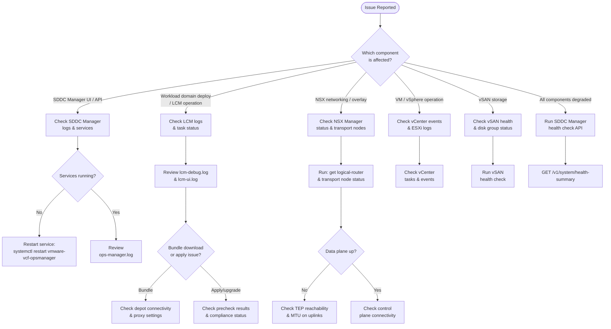

# VCF Troubleshooting — Diagnostics


<div class="kb-summary">
Effective VCF troubleshooting requires knowing where logs live, how to collect diagnostic bundles, and which API health checks to run first.
</div>

 This page covers log locations, bundle collection procedures, per-component diagnostic commands, a structured decision flowchart, and a reference table of common error codes.

---

## Diagnostic Decision Flowchart


```powershell
┌──────────────────────────────── VMware Cloud Foundation — Diagnostics ────────────────────────────────┐
│                                                                                                       │
│  VCF diagnostics use SDDC Manager task logs, SOS utility, component logs, and                         │
│  health reports to identify root causes across all VCF layers.                                        │
│                                                                                                       │
│   ┌──────────────────────────────────────────────┐  ┌─────────────────────────────────────────────┐   │
│   │              SDDC Manager Logs               │  │                 SOS Utility                 │   │
│   │             /var/log/vmware/vcf/             │  │           python3 sos.py --version          │   │
│   │            operationsmanager.log             │  │           sos.py --collect-dc-logs          │   │
│   │           upgrades.log: LCM detail           │  │          SOS: all component bundles         │   │
│   │         Tasks API: get failed tasks          │  │               Send ZIP to GSS               │   │
│   └──────────────────────────────────────────────┘  └─────────────────────────────────────────────┘   │
│                                                                                                       │
│  SOS utility generates a comprehensive bundle across all VCF components.                              │
│                                                                                                       │
│                          ▼                                                 ▼                          │
│                                                                                                       │
│   ┌──────────────────────────────────────────────┐  ┌─────────────────────────────────────────────┐   │
│   │            Component Diagnostics             │  │                Health Reports               │   │
│   │            vCenter: vc-support.sh            │  │            Invoke-VcfHealthReport           │   │
│   │            NSX: /api/v1/node/logs            │  │          SDDC Mgr: health dashboard         │   │
│   │           ESXi: vm-support bundle            │  │            PowerVCF: Get-VCFTask            │   │
│   │           vSAN: esxcli vsan debug            │  │           HTML report: all domains          │   │
│   └──────────────────────────────────────────────┘  └─────────────────────────────────────────────┘   │
│                                                                                                       │
│  Physical Infrastructure (the hardware everything above runs on):                                     │
│  Diagnostic access requires SSH to SDDC Manager appliance and each component;                         │
│  SOS utility must be run as root on SDDC Manager.                                                     │
│                                                                                                       │
│  Key terms:                                                                                           │
│                                                                                                       │
│  SOS utility   = VCF diagnostic bundle collector; /opt/vmware/sddc-support                            │
│  operationsmanager= SDDC Mgr main service log; task and API operations                                │
│  upgrades.log  = LCM upgrade details; step-by-step progress                                           │
│  Tasks API     = GET /v1/tasks; list failed/running tasks with errors                                 │
│  vc-support.sh = vCenter support bundle; run on VCSA appliance                                        │
│  NSX node logs = REST API to retrieve NSX manager diagnostic logs                                     │
│  vm-support    = ESXi diagnostic bundle; run on host shell                                            │
│  esxcli vsan   = vSAN diagnostic commands on ESXi host                                                │
│  Health report = HTML; generated by VMware.CloudFoundation.Reporting                                  │
│  Get-VCFTask   = PowerVCF; poll task status and retrieve error details                                │
│  /var/log/vmware= SDDC Mgr log root; multiple component subdirectories                                │
│  Root access   = SOS requires root; access via sudo after SSH                                         │
│                                                                                                       │
└───────────────────────────────────────────────────────────────────────────────────────────────────────┘
```
```bash

### SDDC Manager Services

```bash
# Check all VCF service statuses
systemctl list-units 'vmware-vcf-*' --no-pager

# Key services
systemctl status vmware-vcf-operationsmanager   # Core SDDC Manager
systemctl status vmware-vcf-lcm                 # Lifecycle Manager
systemctl status vmware-vcf-domainmanager       # Domain Manager
systemctl status vmware-vcf-commonsvcs          # Common Services (auth)

# Restart a service
systemctl restart vmware-vcf-lcm
```

---

## LCM (Lifecycle Manager) Log Analysis

`lcm-debug.log` is the primary log for all upgrade, patch, and bundle operations.

### Common LCM Analysis Commands

```bash
# Find a specific LCM task by task ID
grep "taskId=<task-uuid>" /var/log/vmware/vcf/lcm/lcm-debug.log

# Find bundle download failures
grep -i 'download.*fail\|bundle.*error\|depot.*unreachable' \
  /var/log/vmware/vcf/lcm/lcm-debug.log

# Find precheck failures (look for FAILED status)
grep -i 'precheck.*FAIL\|compliance.*FAIL' \
  /var/log/vmware/vcf/lcm/lcm-debug.log | tail -50

# Find upgrade stage progression
grep -i 'UPGRADE_STAGE\|stage.*complete\|stage.*failed' \
  /var/log/vmware/vcf/lcm/lcm-debug.log | tail -50

# Count errors per hour (useful for rate-of-failure analysis)
grep 'ERROR' /var/log/vmware/vcf/lcm/lcm-debug.log | \
  awk '{print $1, $2}' | cut -c1-13 | sort | uniq -c
```

### LCM Depot Connectivity Check

```bash
# From SDDC Manager — test depot connectivity
curl -v --max-time 30 https://depot.vmware.com/PROD2/evo/vmw/ 2>&1 | grep -E 'HTTP|Connected|SSL'

# Check proxy settings
cat /etc/vmware/vcf/domainmanager/domain-manager.properties | grep -i proxy

# DNS resolution test
nslookup depot.vmware.com
nslookup vcf-bundle-server.corp.example.com  # internal bundle server if applicable
```

---

## NSX Manager Diagnostics

### NSX Manager Status

```bash
# SSH to NSX Manager
ssh admin@nsx-manager.corp.example.com

# Overall cluster health
get cluster status

# Individual manager node status
get managers

# Transport node summary
get transport-nodes status

# Logical router summary
get logical-routers

# BGP peer status (on a gateway node)
get logical-router <uuid> bgp neighbor summary
```

### NSX Log Collection (from NSX CLI)

```bash
# Show recent system logs
get log-file syslog follow   # tail syslog in real time
get log-file nsx-manager     # NSX Manager application log
get log-file http            # Web API access log

# Export a diagnostic log bundle from NSX Manager
export support-bundle file <filename>.tgz
# Retrieve via SCP from /opt/vmware/nsx-manager-appliance/export/
```

### NSX API Diagnostics

```bash
NSX="nsx-manager.corp.example.com"
AUTH="admin:NSXAdminPassword"

# Overall system status
curl -sk -u "$AUTH" "https://$NSX/api/v1/node/status" | jq '{system_status}'

# Transport node health
curl -sk -u "$AUTH" "https://$NSX/api/v1/transport-nodes/status-summary" \
  | jq '{up_count, degraded_count, down_count, unknown_count}'

# Find degraded transport nodes
curl -sk -u "$AUTH" "https://$NSX/api/v1/transport-nodes/status" \
  | jq '.results[] | select(.node_deployment_state.state != "success") | {display_name, node_deployment_state}'

# Edge cluster status
curl -sk -u "$AUTH" "https://$NSX/api/v1/edge-clusters" \
  | jq '.results[] | {display_name, id}'

# Check control plane connectivity
curl -sk -u "$AUTH" "https://$NSX/api/v1/transport-nodes/<tn-id>/status" \
  | jq '{control_plane_connectivity, data_plane_connectivity}'
```

### TEP and MTU Verification

```bash
# From an ESXi host — verify TEP vmknic
esxcli network ip interface list | grep -i tep
esxcli network ip interface ipv4 get -i vmk10   # adjust vmknic name

# Ping another TEP (replace with actual TEP IPs)
vmkping -I vmk10 -d -s 1572 192.168.100.11   # -d = DF bit set; -s = packet size

# Check MTU on uplink vmknic
esxcli network ip interface list
esxcli network nic get -n vmnic0 | grep -i mtu
```

---

## vCenter Appliance Diagnostics

### vc-support Bundle

The `vc-support` bundle is the primary diagnostic artifact for VMware Support. Collect it from the VAMI or via CLI.

```bash
# SSH to vCenter Appliance as root
ssh root@vcenter.corp.example.com

# Generate support bundle (output to /var/tmp/)
/usr/lib/vmware-vpx/scripts/vc-support.sh -p    # includes performance data
/usr/lib/vmware-vpx/scripts/vc-support.sh        # standard bundle

# List generated bundles
ls -lh /var/tmp/vc-*.tgz

# SCP bundle to management workstation
scp root@vcenter.corp.example.com:/var/tmp/vc-<date>-<id>.tgz /local/path/
```

Alternatively from VAMI (`https://<vcsa>:5480`): **Monitor → Support → Create Support Bundle**.

### vCenter Service Status

```bash
# Check all vCenter services
service-control --status --all

# Start / stop specific services
service-control --start vmware-vpxd
service-control --stop  vmware-vpxd
service-control --restart vmware-vpxd

# Check vpxd (vCenter main daemon) log
tail -f /var/log/vmware/vpxd/vpxd.log

# Check vpxd health
/usr/lib/vmware-vmafd/bin/vmafd-cli get-status --server-name localhost

# List recent vCenter tasks with errors (last 24h)
/usr/lib/vmware-vpx/scripts/vcdb_query.py --query \
  "SELECT * FROM vpx_task WHERE state='error' AND create_time > NOW() - INTERVAL '24 hours';"
```

### vCenter API Health Check

```bash
VCSA="vcenter.corp.example.com"

# Check appliance health via REST
SESSION=$(curl -sk -u "administrator@vsphere.local:vSpherePassword" \
  -X POST "https://$VCSA/rest/com/vmware/cis/session" | tr -d '"')

curl -sk -H "vmware-api-session-id: $SESSION" \
  "https://$VCSA/rest/appliance/health/system" | jq '.'

curl -sk -H "vmware-api-session-id: $SESSION" \
  "https://$VCSA/rest/appliance/health/database-storage" | jq '.'

curl -sk -H "vmware-api-session-id: $SESSION" \
  "https://$VCSA/rest/appliance/health/memory" | jq '.'
```

---

## SDDC Manager Health Check API

```bash
# Authenticate
TOKEN=$(curl -sk -X POST https://sddc-manager.corp.example.com/v1/tokens \
  -H "Content-Type: application/json" \
  -d '{"username":"admin","password":"AdminPassword"}' | jq -r '.accessToken')

# Overall health summary
curl -sk -H "Authorization: Bearer $TOKEN" \
  "https://sddc-manager.corp.example.com/v1/system/health-summary" | jq '.'

# Domain health
curl -sk -H "Authorization: Bearer $TOKEN" \
  "https://sddc-manager.corp.example.com/v1/domains" \
  | jq '.elements[] | {name, status, type}'

# Host health
curl -sk -H "Authorization: Bearer $TOKEN" \
  "https://sddc-manager.corp.example.com/v1/hosts" \
  | jq '.elements[] | {hostName, status, domain}'

# Active tasks (check for stuck tasks)
curl -sk -H "Authorization: Bearer $TOKEN" \
  "https://sddc-manager.corp.example.com/v1/tasks?status=IN_PROGRESS" \
  | jq '.elements[] | {id, name, status, creationTimestamp}'

# Credentials health
curl -sk -H "Authorization: Bearer $TOKEN" \
  "https://sddc-manager.corp.example.com/v1/credentials" \
  | jq '.elements[] | select(.credentialStatus != "ACTIVE") | {resourceName, accountName, credentialStatus}'
```

---

## Log Bundle Collection

### SDDC Manager Log Bundle

```bash
# From SDDC Manager (SSH as vcf, then sudo)
sudo /usr/lib/vmware-sddc-support/sos --help              # list all options
sudo /usr/lib/vmware-sddc-support/sos --collect-all-logs  # full log collection
sudo /usr/lib/vmware-sddc-support/sos --health-check      # health check only
sudo /usr/lib/vmware-sddc-support/sos --connectivity-check # network checks

# Output location
ls -lh /var/log/vmware/vcf/sddc-support/
```

### vSAN Health and Diagnostics

```powershell
# Connect to vCenter
Connect-VIServer -Server vcenter.corp.example.com -User administrator@vsphere.local -Password "vSpherePassword"

# Run vSAN health check
$cluster   = Get-Cluster "VCF-Cluster-01"
$vsanHealth = Get-VsanView -Id "VsanVcClusterHealthSystem-vsan-cluster-health-system"
$health    = $vsanHealth.VsanQueryVcClusterHealthSummary($cluster.Id, $null, $null, $true, $null, $null, 'defaultView')

# Show overall health
$health.overallHealth
$health.groups | Select-Object groupName, groupHealth | Sort-Object groupHealth

# Check disk group status
Get-VsanDiskGroup -Cluster $cluster | Select-Object VMHost, IsMounted, @{N='State';E={$_.State}}

# Run ESXi host proactive tests
$vsanView = Get-VsanView -Id "VsanVcClusterHealthSystem-vsan-cluster-health-system"
$vsanView.VsanHealthRunVsanScanTest($cluster.Id, "network", $null)
```

---

## Common VCF Error Codes Reference

| Error Code / Pattern | Component | Meaning | Resolution |
|---|---|---|---|
| `SDDC-TASK-001` | SDDC Manager | Generic task failure | Check ops-manager.log for root cause |
| `LCM-3004` | LCM | Bundle download failed | Verify depot connectivity; check proxy |
| `LCM-3011` | LCM | Precheck failed — compliance issue | Run compliance check; remediate flagged items |
| `LCM-3015` | LCM | Upgrade vCenter failed — VAMI unreachable | Check VCSA VAMI service; restart if needed |
| `LCM-3020` | LCM | Host not in maintenance mode | Manually put host in maintenance or retry |
| `LCM-6003` | LCM | vSAN disk decommission timeout | Check vSAN resync progress; extend timeout |
| `NSX-2001` | NSX Manager | Transport node config push failed | Check NSX agent on ESXi: `esxcli software vib list | grep nsx` |
| `NSX-3010` | NSX Manager | Edge node not reachable | Verify Edge VM power state; check TEP IP |
| `NSX-4001` | NSX Manager | BGP session down | Verify BGP config and upstream router |
| `VSAN-0x00140029` | vSAN | Object degraded / absent | Check disk group health; look for disk failures |
| `VSAN-0x00140001` | vSAN | Disk is slow / unresponsive | Check disk hardware health; remove/replace disk |
| `VPXD-3016` | vCenter | HA configuration failed | Check HA cluster settings; verify storage connectivity |
| `VPXD-6000` | vCenter | DRS move failed | Check resource constraints and VM-host rules |
| `0x80004005` | vCenter / ESXi | Unspecified error during VM operation | Check vmware.log in VM directory; check datastore |
| `DEPOT-001` | SDDC Manager | Cannot reach online depot | Check DNS, proxy, firewall for depot.vmware.com |
| `CRED-1010` | SDDC Manager | Credential rotation failed | Check account lockout; verify credential in vault |

---

## Quick Diagnostic Command Reference

| Task | Command |
|---|---|
| SDDC Manager log tail | `tail -f /var/log/vmware/vcf/lcm/lcm-debug.log` |
| LCM errors | `grep ERROR /var/log/vmware/vcf/lcm/lcm-debug.log \| tail -50` |
| NSX cluster status | `get cluster status` (NSX CLI) |
| NSX transport nodes | `curl -sk -u admin:pass https://nsx/api/v1/transport-nodes/status-summary` |
| vCenter service status | `service-control --status --all` (VCSA shell) |
| vCenter health (REST) | `GET /rest/appliance/health/system` |
| SDDC health summary | `GET /v1/system/health-summary` |
| SDDC active tasks | `GET /v1/tasks?status=IN_PROGRESS` |
| vSAN health | `Get-VsanView ... VsanQueryVcClusterHealthSummary` |
| Collect all logs | `sudo /usr/lib/vmware-sddc-support/sos --collect-all-logs` |
