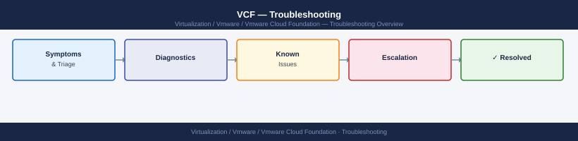

---
tags:
  - troubleshooting
  - vcf
  - vmware
search:
  boost: 1.5
---
# VCF Troubleshooting — Escalation

<div class="kb-summary">
How to open a Broadcom support case for VMware Cloud Foundation: what data to collect, how to set severity, step-by-step SR submission, and the escalation path when progress stalls.

*Applies to: VCF 4.x / 5.x*
</div>



---

```d2
direction: down

symptom: Identify Symptom {shape: diamond}
preescalation_selfcheck: "Pre-Escalation Self-Check" {shape: rectangle}
stepbystep_data_collection: "Step-by-Step Data Collection" {shape: rectangle}
how_to_open_the_sr_on_broadcom_suppo: "How to Open the SR on Broadcom Support Portal" {shape: rectangle}
escalation_path: "Escalation Path" {shape: rectangle}
what_not_to_do: "What NOT to Do" {shape: rectangle}
useful_commands_for_case_updates: "Useful Commands for Case Updates" {shape: rectangle}
resolution: Resolve or Escalate {shape: oval}

symptom -> preescalation_selfcheck: investigate
symptom -> stepbystep_data_collection: investigate
symptom -> how_to_open_the_sr_on_broadcom_suppo: investigate
symptom -> escalation_path: investigate
symptom -> what_not_to_do: investigate
symptom -> useful_commands_for_case_updates: investigate
preescalation_selfcheck -> resolution
stepbystep_data_collection -> resolution
how_to_open_the_sr_on_broadcom_suppo -> resolution
escalation_path -> resolution
what_not_to_do -> resolution
useful_commands_for_case_updates -> resolution
```

## Before you begin

- **Access required:** SSH access to SDDC Manager (`vcf-admin` user); vSphere Client read access; Broadcom support account with entitlement to VCF
- **Do this first:** collect all data below before touching anything — Broadcom will ask for it in the first response, and having it ready cuts resolution time significantly
- **Do not retry:** if SDDC Manager shows a stuck or failed task, do not click Retry. Retrying a failed lifecycle task can leave component versions in a mixed state that is harder to recover from
- **Document as you go:** paste every command and its output into a running notes document — this becomes your timeline for the SR

---

## Pre-Escalation Self-Check

Run this before opening an SR. Many VCF issues are resolvable without Broadcom.

| Check | What to do | Expected result |
|---|---|---|
| SDDC Manager UI accessible | Browse to `https://<sddc-mgr-fqdn>` | Login page loads |
| SDDC Manager services running | SSH → `systemctl status operationsmanager` | `active (running)` |
| vCenter reachable from SDDC Mgr | SSH → `curl -sk https://<vcenter-fqdn>/ui/` | Returns HTML |
| NSX Manager reachable | SSH → `curl -sk https://<nsx-mgr-fqdn>/api/v1/node/version` | Returns JSON with version |
| vSAN health | vSphere Client → Monitor → vSAN → Health | All green |
| NTP in sync | SSH → `timedatectl status` | `System clock synchronized: yes` |
| Failed tasks | SDDC Manager UI → Tasks | Note any tasks with status FAILED and copy their Task ID |
| SOS health summary | See collection steps below | No `ERROR` lines in output |

---

## Step-by-Step Data Collection

Run all of these before opening the SR. SSH to SDDC Manager as `vcf-admin`.

### 1. Get the VCF version

```bash
# SSH to SDDC Manager
ssh vcf-admin@<sddc-mgr-fqdn>

# Check VCF version — note the full build number, not just the release
cat /etc/vmware/vcf/domainManagerApp/vcf-version.properties
# Example output:  BUILD_NUMBER=23480823  VCF_VERSION=5.2.0.0
```

### 2. Run the SOS health summary (quick — takes ~2 minutes)

```bash
# Run from SDDC Manager shell as vcf-admin
python3 /opt/vmware/sddc-support/sos --health-summary

# Save the output to a file — you will attach this to the SR
python3 /opt/vmware/sddc-support/sos --health-summary 2>&1 | tee /tmp/sos-health-$(date +%F).txt
```

Look for any line containing `ERROR` or `FAILED`. These are the items to include in your SR description.

### 3. Run the full SOS bundle (takes 15–30 minutes)

```bash
# Full bundle — required for any lifecycle or complex issue
python3 /opt/vmware/sddc-support/sos \
  --with-host-logs \
  --skip-known-host-check \
  2>&1 | tee /tmp/sos-full-$(date +%F).txt

# The bundle is saved to /var/log/vmware/vcf/sddc-support/sos-YYYYMMDD-HHMMSS/
# Compress it for upload
cd /var/log/vmware/vcf/sddc-support/
tar czf /tmp/sos-bundle-$(date +%F).tar.gz sos-*/
```

### 4. Collect the SDDC Manager support bundle

```bash
# SDDC Manager support bundle — separate from SOS
vcf-support-bundle --type sddc
# Output goes to /var/log/vmware/vcf/sddc-support/
# Check for the file with today's date and copy it to /tmp/
```

### 5. Collect the failed task ID

In the SDDC Manager UI: go to **Lifecycle** → **Tasks** (or **Administration** → **Tasks** depending on VCF version). Find the failed task. Copy the Task ID (a long UUID string like `d2c8a4f1-...`). Paste it into your SR description.

### 6. Write the timeline

Create a plain text file with this structure:

```text
VCF version: 5.2.0.0 build 23480823
Issue first observed: 2026-06-14 14:30 UTC
Last known good state: 2026-06-14 13:00 UTC (after patching ESXi hosts)
Changes made in the 24h before the issue:
  - 13:00: ESXi patch applied to 4 hosts via LCM
  - 14:10: NSX upgrade initiated
  - 14:25: NSX upgrade task showed FAILED
Steps already taken:
  - Checked NSX Manager UI — Manager cluster shows degraded
  - Did NOT retry the upgrade task
Blast radius: NSX overlay networking degraded, VMs retain connectivity via existing routes
```

---

## How to Open the SR on Broadcom Support Portal

1. Go to **support.broadcom.com** and sign in with your Broadcom account (formerly VMware Customer Connect / My VMware).
   - If you do not have an account: click **Register** on the sign-in page and use your company email. Entitlement is linked to your company's Broadcom contract.

2. Click **Open a New Case** (top navigation bar).

3. Under **Select Product Family**, choose **VMware Cloud Foundation**.

4. Under **Product Version**, select the exact version from your `vcf-version.properties` output.

5. Under **Request Type**, select **Technical** for operational issues. Use **Licensing** only for license activation problems.

6. Under **Severity**, select:
   - **S1 — Critical**: SDDC Manager is down and you cannot manage the environment; vSAN is degraded with data at risk; production VMs are inaccessible
   - **S2 — Major**: A key lifecycle workflow is failing (upgrade, patch, expansion) but VMs are running; you have a temporary workaround
   - **S3 — Minor**: Non-critical feature is degraded; single-component issue; cluster remains healthy
   - **S4 — General**: How-to question, documentation request, or non-urgent configuration help

7. In the **Summary** field, write one sentence: product + symptom + scope. Example: `VCF 5.2.0.0 — NSX upgrade task failed at 14:25 UTC, NSX Manager cluster degraded, overlay network impacted across one workload domain`.

8. In the **Description** field, paste:
   - The VCF version and build number
   - The failed task ID (if applicable)
   - The timeline you wrote in Step 6 above
   - The SOS health summary output (paste the ERROR lines, not the full output)
   - What you have already tried and what happened

9. Under **Attachments**, upload:
   - `sos-bundle-YYYY-MM-DD.tar.gz` — the full SOS bundle
   - `sos-health-YYYY-MM-DD.txt` — the health summary
   - Any screenshots of the SDDC Manager task failure
   - The SDDC Manager support bundle (if collected)

10. Click **Submit**. You will receive a case number by email immediately.

11. **S1 only:** On the case confirmation page, a phone number is displayed for your region (NA, EMEA, APAC). Call it immediately — do not wait for an engineer to respond to the portal ticket.

---

## Escalation Path

If progress stalls after initial assignment, follow these steps in order:

```text
Step 1 — Open case at support.broadcom.com with SOS bundle attached (see above)
         ↓
Step 2 — T1 support acknowledges and confirms SOS received (typically 30 min–4 hr)
         ↓
Step 3 — If no meaningful progress in 4 hours for S1 or 1 business day for S2:
         → Reply in the case and ask for escalation to a VCF Senior Engineer (T2)
         → State: "Requesting T2 VCF SE assignment — issue impact: [describe]"
         ↓
Step 4 — T2 VCF SE is assigned; they will schedule a live Zoom/Webex session
         → Have SSH access to SDDC Manager and NSX Manager ready for the call
         ↓
Step 5 — If T2 cannot resolve and issue requires code-level investigation:
         → T2 escalates internally to T3 (engineering) — you do not need to do this manually
         ↓
Step 6 — For data loss risk, security incidents, or 24h+ with no resolution:
         → Request a Critical Situation (CritSit) engagement
         → In the case: "Requesting CritSit — [reason: data at risk / 24h outage / revenue impact]"
         → CritSit brings a dedicated team lead + exec visibility
```

---

## What NOT to Do

These actions make the situation worse and will be the first thing Broadcom asks about.

| Do NOT do this | Why | What to do instead |
|---|---|---|
| Retry a stuck SDDC Manager task | Leaves components at mixed upgrade versions; harder to recover | Wait for Broadcom guidance on whether retry is safe |
| Restart SDDC Manager (`systemctl restart operationsmanager`) | Can corrupt in-flight workflow state | Only restart if explicitly told to by GSS |
| Reboot NSX Manager VMs | Can cause split-brain in the NSX Manager cluster | Wait for T2 guidance |
| Delete and re-create a failed workflow | Loses audit trail; may not fix root cause | Document the failed task ID and escalate |
| Apply additional patches or upgrades | Adds variables to an already-broken environment | Freeze all changes until resolution |
| Run SOS while upgrade is in progress | Interferes with active lifecycle operations | Wait for task to complete or fail before running SOS |

---

## Useful Commands for Case Updates

Paste these outputs into case updates to show Broadcom the current state.

```bash
# SDDC Manager service status — paste into every case update
systemctl status operationsmanager lcm domainmanager sddc-manager-svc 2>&1

# Recent SDDC Manager logs (last 200 lines)
journalctl -u operationsmanager -n 200 --no-pager 2>&1

# VCF task status via API (get bearer token first)
TOKEN=$(curl -sk -X POST https://sddc-mgr.local/v1/tokens \
  -H 'Content-Type: application/json' \
  -d '{"username":"administrator@vsphere.local","password":"<pass>"}' \
  | python3 -c "import sys,json; print(json.load(sys.stdin)['accessToken'])")

# List failed tasks
curl -sk -X GET "https://sddc-mgr.local/v1/tasks?status=FAILED" \
  -H "Authorization: Bearer $TOKEN" | python3 -m json.tool

# vSAN health summary (run from vCenter shell or PowerCLI)
# In vSphere Client: Monitor → vSAN → Health — screenshot and attach

# NSX Manager cluster status
curl -sk -u admin:<password> https://nsx-mgr.local/api/v1/cluster/status \
  | python3 -m json.tool
```

---

## Support Portal and SLA Reference

| Severity | Definition | Initial Response SLA |
|---|---|---|
| S1 — Critical | Production down; SDDC Manager inaccessible; vSAN data at risk; no workaround | 30 minutes (24×7) |
| S2 — Major | Key workflow failing; major feature unavailable; workaround exists | 4 hours (business hours + on-call) |
| S3 — Minor | Non-critical feature degraded; single component impacted; cluster healthy | 1 business day |
| S4 — General | How-to questions, feature requests, documentation | 2 business days |

Your entitlement level (Production, Premier, Mission Critical) may override these SLAs. Check your contract.

---

## See also

- [VCF Troubleshooting — Diagnostics](diagnostics/)
- [VCF Troubleshooting — Common Issues](common-issues/)

---

## Verify resolution

- Confirm the failed task is no longer showing in SDDC Manager Tasks view
- Run `python3 /opt/vmware/sddc-support/sos --health-summary` and confirm no `ERROR` lines
- Verify the specific component (NSX, vCenter, ESXi) that was degraded shows healthy in the SDDC Manager dashboard
- Perform the operation that was failing (run a small lifecycle update, vMotion a test VM) and confirm it succeeds
- Monitor for 15 minutes — leave the SDDC Manager Tasks view open and confirm no new failures appear
