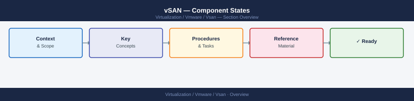

---
tags:
  - architecture
  - vmware
  - vsan
  - vsphere-8
---
# vSAN — Component States

<div class="kb-summary">
How vSAN classifies each object component's health — from the initial ABSENT state through DEGRADED and STALE to REBUILDING — and what each state means operationally for data protection and admin action.

*Applies to: vSAN 7.x · 8.x*
</div>



---

```d2
direction: right

center: "vSAN" {shape: hexagon}
the_four_operational_states: "The Four Operational States" {shape: rectangle}
state_transition_diagram: "State Transition Diagram" {shape: rectangle}
the_clomrepairdelay_timer: "The clomRepairDelay Timer" {shape: rectangle}
when_objects_become_inaccessible: "When Objects Become INACCESSIBLE" {shape: rectangle}

center -> the_four_operational_states
center -> state_transition_diagram
center -> the_clomrepairdelay_timer
center -> when_objects_become_inaccessible
```

## The Four Operational States

### ABSENT

**What it means:** The component's host or disk group is temporarily unreachable. The data is not confirmed lost — vSAN does not yet know if the host will return.

**When it happens:**
- Host rebooted (e.g. patching, driver update)
- Network partition isolating the host
- Host put into maintenance mode with Ensure Accessibility (not Full Migration)
- Temporary power interruption to a single host

**What vSAN does:** Nothing yet. The `clomRepairDelay` timer starts counting. Default is 60 minutes.

**What you should do:** If the outage is planned and short (reboot, patch), do nothing — let the timer run. If the host doesn't return within the timer window, investigate.

```bash
# Check for absent components
esxcli vsan debug component list | grep -i absent

# Check which objects own absent components
esxcli vsan debug object list | grep -i absent
```

**Risk during ABSENT:** The object is running with reduced redundancy but is fully accessible. One more failure of a different component means data loss (for FTT=1 objects). For FTT=2, one absent + one degraded still leaves the object accessible.

---

### DEGRADED

**What it means:** The component is confirmed lost. Either the `clomRepairDelay` timer expired without the host returning, or the disk failed permanently. vSAN now knows it needs to create a replacement component.

**When it happens:**
- `clomRepairDelay` timer expires and host has not returned
- Disk group failed (cache SSD or multiple capacity disk failures)
- Disk marked as failed via the vSAN UI or CLI
- Host permanently removed from the cluster

**What vSAN does:** CLOM schedules a rebuild. It selects a target host and disk group with sufficient free capacity to place the new component. The object transitions to REBUILDING.

**What you should do:** Monitor resync. If the rebuild does not start within 5–10 minutes of the state changing to DEGRADED, check capacity headroom and cluster health.

```bash
# List degraded objects
esxcli vsan debug object list | grep -i degraded

# Check resync queue — rebuild should appear here
esxcli vsan debug resync summary get

# Check capacity — rebuild requires free space
esxcli vsan storage list | grep -E "Used Capacity|Free Capacity"
```

**Risk during DEGRADED:** The object has zero redundancy for FTT=1. Any further failure of the remaining component causes data loss and the object becomes INACCESSIBLE. Treat all DEGRADED objects as P1 until rebuild completes.

---

### STALE

**What it means:** The component exists on a healthy disk, but its data is behind. The host was offline or partitioned while writes occurred to other copies of the object. When the host reconnects, the component needs to catch up before it can serve reads.

**When it happens:**
- Host returns after a brief outage during which the VM was still running
- Network partition resolved — the host was isolated but the cluster continued operating
- Host exits maintenance mode (Ensure Accessibility mode — data was not fully migrated)

**What vSAN does:** CLOM schedules a delta-sync — only the changed blocks need to be copied, not the full object. This is significantly faster than a full rebuild.

**What you should do:** Wait. STALE components resolve automatically via delta-sync. Do not remove the disk or the host while sync is in progress.

```bash
# STALE components appear in resync list
esxcli vsan debug resync list | grep -i stale

# Monitor delta-sync completion
watch -n 30 "esxcli vsan debug resync summary get"
```

**Risk during STALE:** The object remains accessible — reads go to the up-to-date copies while the STALE component syncs. Protection is temporarily reduced (similar to DEGRADED) but recovery is faster because data already exists on the disk.

---

### REBUILDING

**What it means:** vSAN is actively writing a new component to replace a DEGRADED one. Data is being copied from the healthy component(s) to a new location.

**When it happens:**
- After a DEGRADED state triggers CLOM to schedule a rebuild
- After policy change (e.g. FTT increase requires additional components)
- After rebalance operation moves a component to a different host

**What vSAN does:** Copies data from remaining healthy components to the new target location. During rebuild, I/O continues normally — the VM is not paused. However, rebuild I/O competes with VM workload I/O.

**What you should do:** Monitor progress. Do not perform further changes to the cluster (adding/removing hosts or disks) until rebuild completes.

```bash
# Monitor rebuild progress
esxcli vsan debug resync summary get
# Shows: Active resyncing components, bytes remaining, estimated time

# Detailed per-object rebuild status
esxcli vsan debug resync list
```

**Throttle rebuild during business hours:**

```bash
# Limit rebuild to 500 IOPS (reduce VM impact)
esxcli vsan debug resync throttle set --throttle 500

# Remove throttle during off-hours for faster completion
esxcli vsan debug resync throttle set --throttle 0
```

**Risk during REBUILDING:** Same as DEGRADED — the object still has only one copy until the rebuild completes. Do not perform any maintenance on other hosts during a rebuild unless it is unavoidable.

---

## State Transition Diagram

```text
                    Host rebooted / network partition
                              │
                              ▼
                          ABSENT
                     (clomRepairDelay timer)
                         /          \
              Host returns        Timer expires
              (< 60 min)          (default 60 min)
                  │                      │
                  ▼                      ▼
               HEALTHY             DEGRADED
                                        │
                              CLOM schedules rebuild
                                        │
                                        ▼
                                  REBUILDING
                                        │
                              Rebuild completes
                                        │
                                        ▼
                                    HEALTHY

Host returns after write-divergence:
    ABSENT → (reconnect) → STALE → (delta-sync) → HEALTHY
```

---

## The clomRepairDelay Timer

`clomRepairDelay` is the number of minutes vSAN waits after a component goes ABSENT before treating it as DEGRADED and triggering a rebuild.

**Default:** 60 minutes

**Why it exists:** Unnecessary rebuilds waste I/O bandwidth and increase resync time. If a host reboots for a patch and returns in 20 minutes, there is no point triggering a full rebuild. The timer prevents that.

**Trade-off:** A longer timer means the cluster runs in a reduced-protection state for longer. If a second failure happens during the wait, the object becomes INACCESSIBLE.

**Recommended values:**

| Environment | Value | Rationale |
|---|---|---|
| Standard production | 60 min | Default — balanced between unnecessary rebuild and protection window |
| Frequent rolling reboots (patch cycles) | 120–180 min | Avoid rebuild churn during planned maintenance |
| High-value data (databases) | 30 min | Shorter protection window; accept more rebuild I/O |
| Never exceed | 240 min | Risk of 4-hour unprotected window is too high |

**Adjust the timer:**

```bash
# View current value
esxcli vsan cluster get | grep -i repair

# Set via vCenter UI
# Cluster → Configure → vSAN → Advanced Options → clomRepairDelay
```

---

## When Objects Become INACCESSIBLE

INACCESSIBLE is not a component state — it is an object-level state that occurs when there are no accessible copies of a component remaining. The VM stops responding to I/O.

**Causes:**
- FTT=1 object: both copies become unavailable simultaneously (two host failures, network partition splitting both copies off)
- FTT=1 stretched cluster: both sites go down (witness alone cannot serve data)
- Majority of components absent/degraded simultaneously before rebuild completes

**Immediate response:**
1. Do not reboot or power-cycle hosts — the data is likely still on disk.
2. Check which hosts are unreachable and restore connectivity first.
3. If a host hardware failure caused it, restore the host rather than immediately decommissioning.
4. If data is genuinely lost, restore from backup.

```bash
# Identify inaccessible objects
esxcli vsan debug object list | grep -i inaccessible

# Check which components are involved
esxcli vsan debug component list | grep -i inaccessible
```

Escalate immediately to VMware GSS for any inaccessible object state — see Troubleshooting → Escalation.
