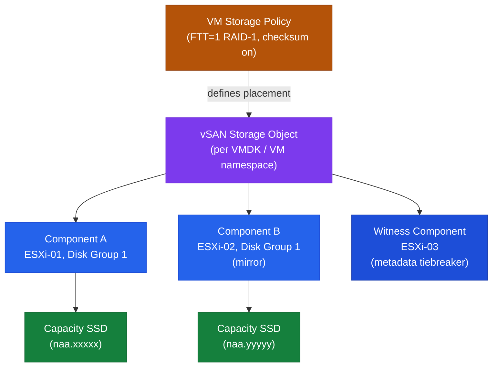
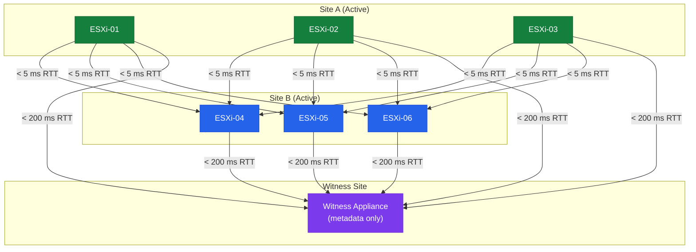

# vSAN — Components

## Component Hierarchy



## Core Components

| Component | Description |
|---|---|
| **Disk Group** | Unit of storage on each host: one cache device + one or more capacity devices (OSA). ESA uses NVMe only with no separate cache tier. |
| **CLOM** | Cluster Level Object Manager — policy compliance, placement decisions, and triggering resyncs when policy is violated. |
| **DOM** | Distributed Object Manager — handles I/O for each vSAN object; coordinates reads and writes across hosts. |
| **LSOM** | Local Log-Structured Object Manager — manages on-disk layout within disk groups. |
| **CMMDS** | Cluster Monitoring Membership Directory Service — tracks cluster membership and health metadata. |
| **vSAN Datastore** | The logical datastore namespace visible to vCenter and all cluster hosts. |
| **vSAN Witness** | Lightweight host or appliance holding only metadata for 2-node clusters — tiebreaker arbitration. |

## Disk Group Design

**Original Storage Architecture (OSA) — vSAN 6.x / 7.x:**
- 1 cache SSD + up to 7 capacity drives per disk group
- Up to 5 disk groups per host
- All-Flash: cache tier used for write buffering only
- Hybrid: cache tier used for both read caching and write buffering

**Express Storage Architecture (ESA) — vSAN 8.0+:**
- NVMe-only; no separate cache tier
- Each NVMe contributes directly to capacity with inline compression
- Minimum 4 hosts required; higher throughput and lower latency than OSA

## FTT and RAID Policies

| FTT | RAID Method | Minimum Hosts | Space Overhead |
|---|---|---|---|
| 1 | RAID-1 (Mirroring) | 3 | 2x |
| 1 | RAID-5 (Erasure Coding) | 4 | 1.33x |
| 2 | RAID-6 (Erasure Coding) | 6 | 1.5x |
| 2 | RAID-1 (Mirroring) | 5 | 3x |
| 3 | RAID-1 (Mirroring) | 7 | 4x |

Erasure Coding (RAID-5/6) is supported on All-Flash and ESA only.

## Stretched Cluster

A vSAN Stretched Cluster spans two active data sites with a third witness site:

- **Site A and Site B:** Both active, hold RAID-1 mirrors of each VM object
- **Witness Site:** Holds only metadata; acts as tiebreaker for split-brain prevention



Network requirements:

| Link | Maximum Latency |
|---|---|
| Site A to Site B | < 5 ms RTT |
| Data sites to Witness | < 200 ms RTT |

## Technical Reference

vSAN is part of the virtualization platform. This section covers technical operations, troubleshooting, upgrade planning, and support handoff.

### Platform Role

vSAN provides software-defined storage by pooling local disks from ESXi hosts and presenting policy-based storage to virtual machines.

### Core Components

- vSAN cluster
- Disk groups or ESA storage pools
- Cache and capacity devices
- Storage policies
- Objects and components
- Witness or fault domains where used
- Resync engine
- Health service

### Main Dependencies

- DNS resolution
- NTP/time sync
- Authentication source
- Management network
- Storage access
- Certificate trust
- Monitoring
- Backup/recovery process
- Vendor support access

### Ports and Protocols

| Use | Protocol | Port |
|-----|----------|------|
| vSAN transport | TCP/UDP | 2233 |
| vSAN cluster service | TCP | 12321 |
| vCenter management | HTTPS | 443 |
| DNS | TCP/UDP | 53 |
| NTP | UDP | 123 |

### Key Logs

- `/var/log/vmkernel.log`
- `/var/log/vsanmgmt.log`
- `/var/log/clomd.log`
- `/var/log/cmmdsd.log`
- `/var/log/vobd.log`

### Health Checks

- Confirm management access.
- Review current alarms.
- Review recent failed tasks.
- Validate DNS and NTP.
- Confirm certificate status.
- Check service health.
- Check capacity and performance.
- Confirm monitoring data is current.
- Review recent changes.

### Useful Commands

```bash
esxcli vsan cluster get
esxcli vsan health cluster list
esxcli vsan storage list
esxcli vsan debug object list
esxcli network ip interface list
vsish -e get /vmkModules/lsom/disks/
```

### Common Failure Points

- Disk failure
- Disk group issue
- Capacity pressure
- Object non-compliance
- Resync backlog
- Network packet loss
- Fault domain imbalance
- Policy mismatch

### Troubleshooting Workflow

1. Confirm the impact and scope.
2. Check recent changes.
3. Review alerts, tasks, and events.
4. Validate DNS, NTP, authentication, and certificates.
5. Check service status.
6. Check storage and network dependencies.
7. Review logs.
8. Capture screenshots, timestamps, errors, and task IDs.
9. Escalate with clean evidence if needed.

### Upgrade and Compatibility Notes

- Check product interoperability before upgrades.
- Confirm supported version path.
- Confirm backup or rollback method.
- Confirm maintenance window.
- Run pre-checks before change work.
- Validate health after the change.
- Document version before and after.

### Best Practices

| Recommendation | Detail |
|---|---|
| Keep versions aligned. | Keep versions aligned. |
| Keep certificates tracked. | Keep certificates tracked. |
| Keep DNS and NTP clean. | Keep DNS and NTP clean. |
| Keep alerting actionable. | Keep alerting actionable. |
| Document support ownership. | Document support ownership. |
| Avoid undocumented changes. | Avoid undocumented changes. |
