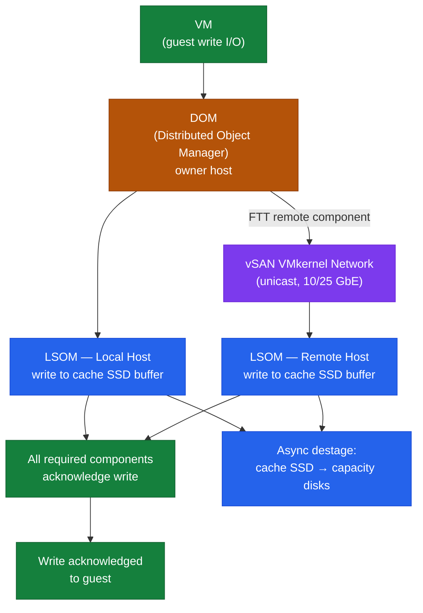
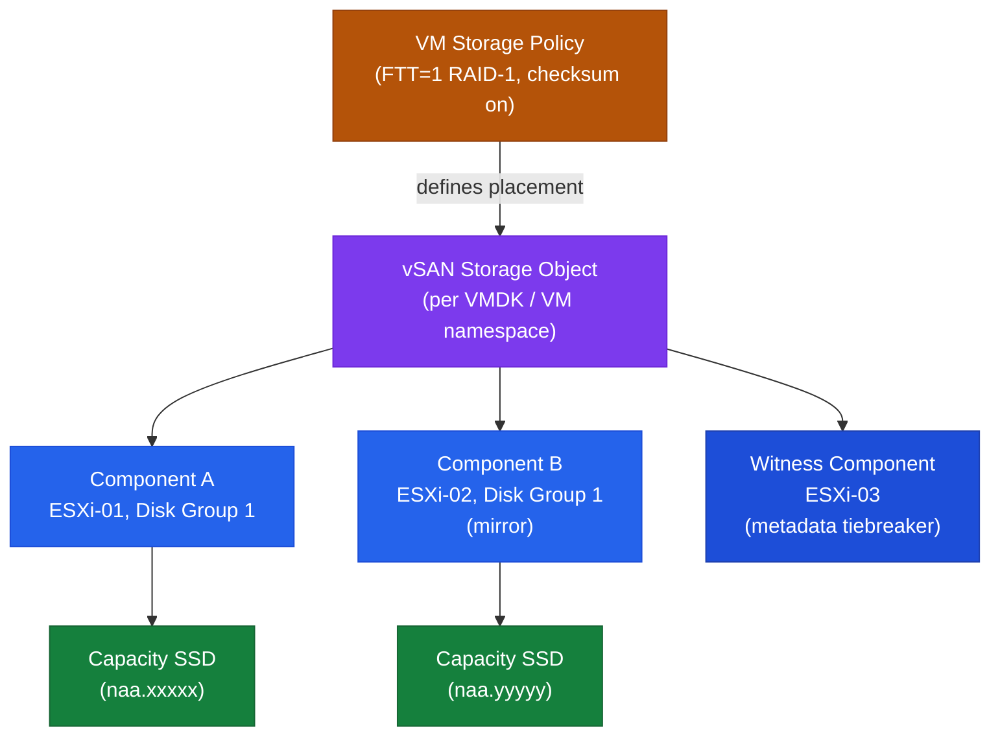

---
tags:
  - architecture
  - vmware
  - vsan
  - vsphere-8
---
# vSAN — How It Works


<div class="kb-summary">
How It Works reference covering Storage Architecture Modes, Objects and Components, Write Path, Read Path, Core Components and 1 more sections.

*Applies to: vSAN 7.x · 8.x*
</div>


## Storage Architecture Modes

### Original Storage Architecture (OSA) — vSAN 6.x / 7.x

OSA uses a two-tier model within each disk group: a dedicated flash cache device and one or more capacity devices.


### Object Placement — FTT=1 RAID-5 (4 hosts minimum)

```text
VM VMDK Object
├── Data stripe 1 → ESXi-01
├── Data stripe 2 → ESXi-02
├── Data stripe 3 → ESXi-03
└── Parity stripe → ESXi-04
```

### FTT and RAID Policy Reference

| FTT | RAID Method | Minimum Hosts | Space Overhead |
|---|---|---|---|
| 1 | RAID-1 (Mirroring) | 3 | 2x |
| 1 | RAID-5 (Erasure Coding) | 4 | 1.33x |
| 2 | RAID-6 (Erasure Coding) | 6 | 1.5x |
| 2 | RAID-1 (Mirroring) | 5 | 3x |
| 3 | RAID-1 (Mirroring) | 7 | 4x |

Erasure Coding (RAID-5/6) is supported on All-Flash and ESA only.

---

## Write Path

**OSA write path:**

1. VM issues a write to vSAN VMDK.
2. DOM receives the write on the owner host.
3. DOM sends the write to each component's home host via the vSAN VMkernel network.
4. On each host, LSOM writes to the disk group's cache SSD write buffer.
5. Once all required components acknowledge, DOM acknowledges the write to the VM.
6. Data is de-staged from cache to capacity disks asynchronously in the background.



**ESA write path:** DOM routes to component locations; LSOM writes directly to NVMe with inline compression — no cache tier.

**Implication:** Write latency is bounded by the slowest component acknowledgement. FTT=1 RAID-1 requires a round trip to a remote host — vSAN network latency directly contributes to front-end write latency.

---

## Read Path

**OSA read path (all-flash):**

1. VM issues a read.
2. DOM identifies the component owner — preferentially the local copy on the same host as the VM.
3. LSOM reads from the capacity SSD on the local disk group.
4. If not local, DOM fetches from a remote host's component via the vSAN network.

**Read locality:** vSAN preferentially reads from the local component copy. After vMotion, read preference follows the new host — minimising cross-host network traffic.

**Hybrid OSA only:** Frequently accessed data may be served from the cache SSD read cache (30% of cache) rather than the HDD capacity tier.

---

## Core Components



| Component | Role |
|---|---|
| **CLOM** | Cluster Level Object Manager — policy compliance, placement decisions, triggering resyncs |
| **DOM** | Distributed Object Manager — handles I/O for each vSAN object across hosts |
| **LSOM** | Local Log-Structured Object Manager — manages on-disk layout within disk groups |
| **CMMDS** | Cluster Monitoring Membership Directory Service — tracks cluster membership and health metadata |
| **vSAN Datastore** | Logical datastore namespace visible to vCenter and all cluster hosts |
| **vSAN Witness** | Lightweight host or appliance holding only metadata for 2-node clusters — tiebreaker arbitration |

---

## Ports and Logs

| Use | Protocol | Port |
|---|---|---|
| vSAN transport | TCP/UDP | 2233 |
| vSAN cluster service | TCP | 12321 |
| vCenter management | HTTPS | 443 |
| DNS | TCP/UDP | 53 |
| NTP | UDP | 123 |

**Key log files (ESXi host):**

- `/var/log/vmkernel.log`
- `/var/log/vsanmgmt.log`
- `/var/log/clomd.log`
- `/var/log/cmmdsd.log`
- `/var/log/vobd.log`


---

## SIOC — Storage I/O Control

vSAN uses SIOC v2 (policy-based I/O control) to enforce per-VM IOPS limits directly via SPBM. Unlike legacy SIOC, limits are embedded in the storage policy and enforced at the DOM layer.

| Property | Detail |
|---|---|
| **Policy setting** | `IOPS Limit for Object` in SPBM (0 = unlimited) |
| **Enforcement point** | DOM owner on each host — queues and throttles when limit reached |
| **Scope** | Per VMDK object; each disk can have a different limit |
| **Monitoring** | vCenter → vSAN → Monitor → Performance → Virtual Machines |
| **Impact** | Protects shared cluster from I/O-hungry VMs; latency increases when limit is hit |

```bash
# Check current IOPS limits on a datastore via PowerCLI
Get-SpbmStoragePolicy | Get-SpbmRule | Where-Object { $_.Capability -like "*IOPS*" }

# View SIOC stats per VM object via esxcli
esxcli vsan debug object list | grep -E "Object|IOPS"
```

**When to set limits:** Noisy-neighbour workloads (backups, bulk transfers) degrading production VMs. Set a low IOPS limit on backup VMs; leave production VMs unlimited or set a floor via shares.

---

## See also

- [vSAN — Design Standards](design-standards/)
- [vSAN — Deploy](../deploy/)
- [vSAN — Integrations](integrations/)
