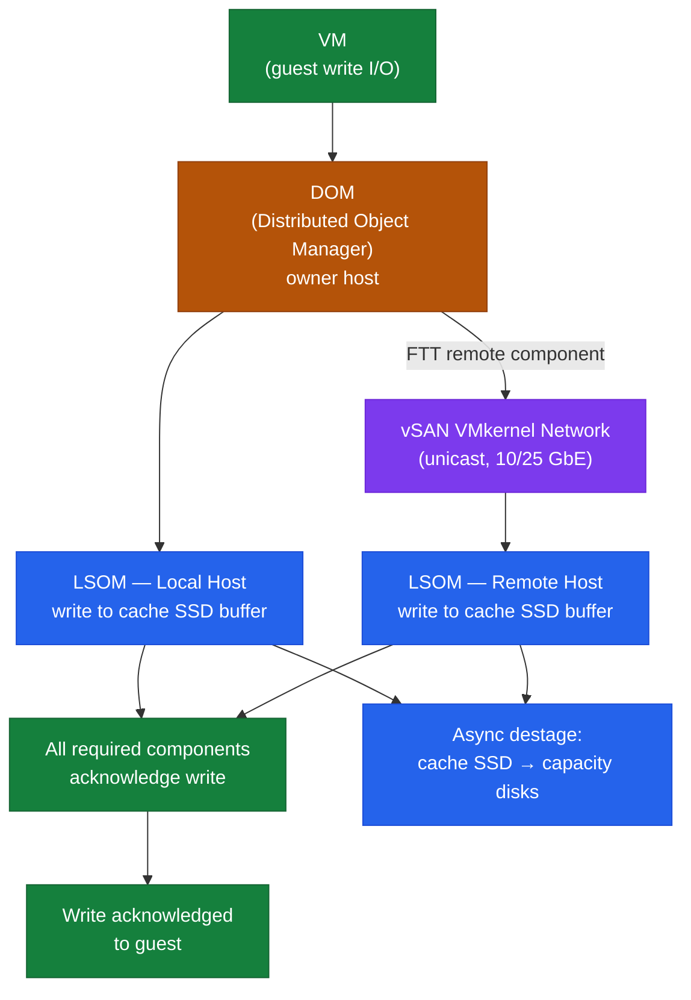
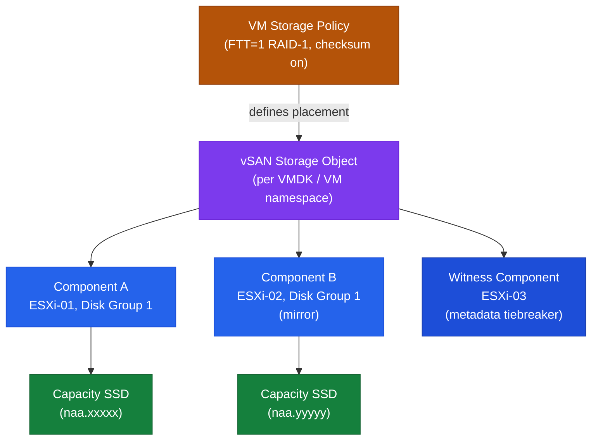

# vSAN — How It Works


<div class="kb-summary">
How It Works reference covering Storage Architecture Modes, Objects and Components, Write Path, Read Path, Core Components and 1 more sections.
</div>

## Storage Architecture Modes

### Original Storage Architecture (OSA) — vSAN 6.x / 7.x

OSA uses a two-tier model within each disk group: a dedicated flash cache device and one or more capacity devices.

```text
ESXi Host (OSA)
└── Disk Group 1
    ├── Cache SSD (NVMe or SATA SSD) — write buffer + read cache
    ├── Capacity Disk 1 (SSD or HDD)
    ├── Capacity Disk 2
    └── Capacity Disk N (up to 7 per group)
└── Disk Group 2 (optional, up to 5 per host)
    └── ...
```
```
┌───────────────────────────────────────── vSAN — How It Works ─────────────────────────────────────────┐
│                                                                                                       │
│  vSAN pools local disks from ESXi hosts into a shared datastore; data is                              │
│  distributed across hosts using a policy-driven object-based storage model.                           │
│                                                                                                       │
│   ┌──────────────────────────────────────────────┐  ┌─────────────────────────────────────────────┐   │
│   │                  Data Path                   │  │                 Disk Groups                 │   │
│   │            VM write → vSAN object            │  │          1 cache NVMe/SSD per group         │   │
│   │           Policy: FTT + RAID type            │  │         1-7 capacity disks per group        │   │
│   │          Components placed on hosts          │  │          Express Storage Arch (ESA)         │   │
│   │           Witness: metadata quorum           │  │              All-NVMe: ESA only             │   │
│   └──────────────────────────────────────────────┘  └─────────────────────────────────────────────┘   │
│                                                                                                       │
│  Each object (VMDK) is split into components placed across hosts per the storage policy.              │
│                                                                                                       │
│                          ▼                                                 ▼                          │
│                                                                                                       │
│   ┌──────────────────────────────────────────────┐  ┌─────────────────────────────────────────────┐   │
│   │             Cluster Requirements             │  │                Fault Domains                │   │
│   │             Min 3 hosts (FTT=1)              │  │         Rack awareness: per-rack FD         │   │
│   │             10GbE+ vSAN VMkernel             │  │         Stretched: 2 sites + witness        │   │
│   │         Unicast: no multicast needed         │  │          FD isolates host failures          │   │
│   │           Health: periodic resync            │  │             Min 3 FDs for FTT=1             │   │
│   └──────────────────────────────────────────────┘  └─────────────────────────────────────────────┘   │
│                                                                                                       │
│  Physical Infrastructure (the hardware everything above runs on):                                     │
│  vSAN requires dedicated SSDs/NVMe for cache and HDDs/SSDs for capacity on each host;                 │
│  10GbE+ network with dedicated vSAN VMkernel adapter.                                                 │
│                                                                                                       │
│  Key terms:                                                                                           │
│                                                                                                       │
│  Object        = vSAN storage unit; one VMDK = one or more objects                                    │
│  Component     = slice of an object placed on a single host                                           │
│  Witness       = metadata-only component; tie-breaker for quorum                                      │
│  FTT           = Failures To Tolerate; policy setting; FTT=1 needs 3 hosts                            │
│  RAID-1        = mirroring; FTT=1: 2 data + 1 witness                                                 │
│  RAID-5        = erasure coding; FTT=1: 4 hosts; more space-efficient                                 │
│  Disk group    = cache + capacity disks on one host; O(SA: per host)                                  │
│  ESA           = Express Storage Architecture; vSAN 8+; all-NVMe only                                 │
│  Fault domain  = logical grouping of hosts; failure unit for placement                                │
│  Stretched cluster= 2 active sites + 1 witness site; RPO=0 across sites                               │
│  Resync        = after host failure/return, components rebalanced                                     │
│  VMkernel      = special NIC adapter; vSAN uses vmk for cluster traffic                               │
│                                                                                                       │
└───────────────────────────────────────────────────────────────────────────────────────────────────────┘
```

### Object Placement — FTT=1 RAID-5 (4 hosts minimum)

```text
VM VMDK Object
├── Data stripe 1 → ESXi-01
├── Data stripe 2 → ESXi-02
├── Data stripe 3 → ESXi-03
└── Parity stripe → ESXi-04
```

### FTT and RAID Policy Reference

| FTT | RAID Method | Minimum Hosts | Space Overhead |
|---|---|---|---|
| 1 | RAID-1 (Mirroring) | 3 | 2x |
| 1 | RAID-5 (Erasure Coding) | 4 | 1.33x |
| 2 | RAID-6 (Erasure Coding) | 6 | 1.5x |
| 2 | RAID-1 (Mirroring) | 5 | 3x |
| 3 | RAID-1 (Mirroring) | 7 | 4x |

Erasure Coding (RAID-5/6) is supported on All-Flash and ESA only.

---

## Write Path

**OSA write path:**

1. VM issues a write to vSAN VMDK.
2. DOM receives the write on the owner host.
3. DOM sends the write to each component's home host via the vSAN VMkernel network.
4. On each host, LSOM writes to the disk group's cache SSD write buffer.
5. Once all required components acknowledge, DOM acknowledges the write to the VM.
6. Data is de-staged from cache to capacity disks asynchronously in the background.



**ESA write path:** DOM routes to component locations; LSOM writes directly to NVMe with inline compression — no cache tier.

**Implication:** Write latency is bounded by the slowest component acknowledgement. FTT=1 RAID-1 requires a round trip to a remote host — vSAN network latency directly contributes to front-end write latency.

---

## Read Path

**OSA read path (all-flash):**

1. VM issues a read.
2. DOM identifies the component owner — preferentially the local copy on the same host as the VM.
3. LSOM reads from the capacity SSD on the local disk group.
4. If not local, DOM fetches from a remote host's component via the vSAN network.

**Read locality:** vSAN preferentially reads from the local component copy. After vMotion, read preference follows the new host — minimising cross-host network traffic.

**Hybrid OSA only:** Frequently accessed data may be served from the cache SSD read cache (30% of cache) rather than the HDD capacity tier.

---

## Core Components



| Component | Role |
|---|---|
| **CLOM** | Cluster Level Object Manager — policy compliance, placement decisions, triggering resyncs |
| **DOM** | Distributed Object Manager — handles I/O for each vSAN object across hosts |
| **LSOM** | Local Log-Structured Object Manager — manages on-disk layout within disk groups |
| **CMMDS** | Cluster Monitoring Membership Directory Service — tracks cluster membership and health metadata |
| **vSAN Datastore** | Logical datastore namespace visible to vCenter and all cluster hosts |
| **vSAN Witness** | Lightweight host or appliance holding only metadata for 2-node clusters — tiebreaker arbitration |

---

## Ports and Logs

| Use | Protocol | Port |
|---|---|---|
| vSAN transport | TCP/UDP | 2233 |
| vSAN cluster service | TCP | 12321 |
| vCenter management | HTTPS | 443 |
| DNS | TCP/UDP | 53 |
| NTP | UDP | 123 |

**Key log files (ESXi host):**

- `/var/log/vmkernel.log`
- `/var/log/vsanmgmt.log`
- `/var/log/clomd.log`
- `/var/log/cmmdsd.log`
- `/var/log/vobd.log`


---

## SIOC — Storage I/O Control

```
```
┌───────────────────────────────────────── vSAN — How It Works ─────────────────────────────────────────┐
│                                                                                                       │
│  vSAN pools local disks from ESXi hosts into a shared datastore; data is                              │
│  distributed across hosts using a policy-driven object-based storage model.                           │
│                                                                                                       │
│   ┌──────────────────────────────────────────────┐  ┌─────────────────────────────────────────────┐   │
│   │                  Data Path                   │  │                 Disk Groups                 │   │
│   │            VM write → vSAN object            │  │          1 cache NVMe/SSD per group         │   │
│   │           Policy: FTT + RAID type            │  │         1-7 capacity disks per group        │   │
│   │          Components placed on hosts          │  │          Express Storage Arch (ESA)         │   │
│   │           Witness: metadata quorum           │  │              All-NVMe: ESA only             │   │
│   └──────────────────────────────────────────────┘  └─────────────────────────────────────────────┘   │
│                                                                                                       │
│  Each object (VMDK) is split into components placed across hosts per the storage policy.              │
│                                                                                                       │
│                          ▼                                                 ▼                          │
│                                                                                                       │
│   ┌──────────────────────────────────────────────┐  ┌─────────────────────────────────────────────┐   │
│   │             Cluster Requirements             │  │                Fault Domains                │   │
│   │             Min 3 hosts (FTT=1)              │  │         Rack awareness: per-rack FD         │   │
│   │             10GbE+ vSAN VMkernel             │  │         Stretched: 2 sites + witness        │   │
│   │         Unicast: no multicast needed         │  │          FD isolates host failures          │   │
│   │           Health: periodic resync            │  │             Min 3 FDs for FTT=1             │   │
│   └──────────────────────────────────────────────┘  └─────────────────────────────────────────────┘   │
│                                                                                                       │
│  Physical Infrastructure (the hardware everything above runs on):                                     │
│  vSAN requires dedicated SSDs/NVMe for cache and HDDs/SSDs for capacity on each host;                 │
│  10GbE+ network with dedicated vSAN VMkernel adapter.                                                 │
│                                                                                                       │
│  Key terms:                                                                                           │
│                                                                                                       │
│  Object        = vSAN storage unit; one VMDK = one or more objects                                    │
│  Component     = slice of an object placed on a single host                                           │
│  Witness       = metadata-only component; tie-breaker for quorum                                      │
│  FTT           = Failures To Tolerate; policy setting; FTT=1 needs 3 hosts                            │
│  RAID-1        = mirroring; FTT=1: 2 data + 1 witness                                                 │
│  RAID-5        = erasure coding; FTT=1: 4 hosts; more space-efficient                                 │
│  Disk group    = cache + capacity disks on one host; O(SA: per host)                                  │
│  ESA           = Express Storage Architecture; vSAN 8+; all-NVMe only                                 │
│  Fault domain  = logical grouping of hosts; failure unit for placement                                │
│  Stretched cluster= 2 active sites + 1 witness site; RPO=0 across sites                               │
│  Resync        = after host failure/return, components rebalanced                                     │
│  VMkernel      = special NIC adapter; vSAN uses vmk for cluster traffic                               │
│                                                                                                       │
└───────────────────────────────────────────────────────────────────────────────────────────────────────┘
```

### Object Placement — FTT=1 RAID-5 (4 hosts minimum)

```text
VM VMDK Object
├── Data stripe 1 → ESXi-01
├── Data stripe 2 → ESXi-02
├── Data stripe 3 → ESXi-03
└── Parity stripe → ESXi-04
```

### FTT and RAID Policy Reference

| FTT | RAID Method | Minimum Hosts | Space Overhead |
|---|---|---|---|
| 1 | RAID-1 (Mirroring) | 3 | 2x |
| 1 | RAID-5 (Erasure Coding) | 4 | 1.33x |
| 2 | RAID-6 (Erasure Coding) | 6 | 1.5x |
| 2 | RAID-1 (Mirroring) | 5 | 3x |
| 3 | RAID-1 (Mirroring) | 7 | 4x |

Erasure Coding (RAID-5/6) is supported on All-Flash and ESA only.

---

## Write Path

**OSA write path:**

1. VM issues a write to vSAN VMDK.
2. DOM receives the write on the owner host.
3. DOM sends the write to each component's home host via the vSAN VMkernel network.
4. On each host, LSOM writes to the disk group's cache SSD write buffer.
5. Once all required components acknowledge, DOM acknowledges the write to the VM.
6. Data is de-staged from cache to capacity disks asynchronously in the background.


**ESA write path:** DOM routes to component locations; LSOM writes directly to NVMe with inline compression — no cache tier.

**Implication:** Write latency is bounded by the slowest component acknowledgement. FTT=1 RAID-1 requires a round trip to a remote host — vSAN network latency directly contributes to front-end write latency.

---

## Read Path

**OSA read path (all-flash):**

1. VM issues a read.
2. DOM identifies the component owner — preferentially the local copy on the same host as the VM.
3. LSOM reads from the capacity SSD on the local disk group.
4. If not local, DOM fetches from a remote host's component via the vSAN network.

**Read locality:** vSAN preferentially reads from the local component copy. After vMotion, read preference follows the new host — minimising cross-host network traffic.

**Hybrid OSA only:** Frequently accessed data may be served from the cache SSD read cache (30% of cache) rather than the HDD capacity tier.

---

## Core Components


| Component | Role |
|---|---|
| **CLOM** | Cluster Level Object Manager — policy compliance, placement decisions, triggering resyncs |
| **DOM** | Distributed Object Manager — handles I/O for each vSAN object across hosts |
| **LSOM** | Local Log-Structured Object Manager — manages on-disk layout within disk groups |
| **CMMDS** | Cluster Monitoring Membership Directory Service — tracks cluster membership and health metadata |
| **vSAN Datastore** | Logical datastore namespace visible to vCenter and all cluster hosts |
| **vSAN Witness** | Lightweight host or appliance holding only metadata for 2-node clusters — tiebreaker arbitration |

---

## Ports and Logs

| Use | Protocol | Port |
|---|---|---|
| vSAN transport | TCP/UDP | 2233 |
| vSAN cluster service | TCP | 12321 |
| vCenter management | HTTPS | 443 |
| DNS | TCP/UDP | 53 |
| NTP | UDP | 123 |

**Key log files (ESXi host):**

- `/var/log/vmkernel.log`
- `/var/log/vsanmgmt.log`
- `/var/log/clomd.log`
- `/var/log/cmmdsd.log`
- `/var/log/vobd.log`


---

## SIOC — Storage I/O Control

```
┌────────────────────────── SIOC — Storage I/O Control Congestion Management ───────────────────────────┐
│                                                                                                       │
│  SIOC monitors a shared datastore for latency congestion. When latency exceeds the                    │
│  threshold, it enforces per-VM I/O shares to prevent noisy VMs starving others.                       │
│                                                                                                       │
│    Normal state (latency below threshold):                                                            │
│    │  No SIOC enforcement  ·  All VMs issue I/O at full speed  ·  Threshold: 30 ms default            │
│                                                                                                       │
│    Congested state (latency ≥ threshold):                                                             │
│    │                                                                                                  │
│    ├── SIOC activates — measures each VM I/O demand                                                   │
│    ├── Distributes IOPS proportionally according to per-VM shares:                                    │
│    │     VM-A  shares: High  (2000) → gets 4× more IOPS than VM-C                                     │
│    │     VM-B  shares: Normal (1000) → gets 2× more IOPS than VM-C                                    │
│    │     VM-C  shares: Low   (500)  → gets baseline allocation                                        │
│    └── SIOC throttles VMs exceeding their share allocation via I/O scheduler                          │
│                                                                                                       │
│    SIOC vs NIOC:                                                                                      │
│    ┌──────────────────────────────────────┬───────────────────────────────────────┐                   │
│    │  SIOC                                │  NIOC                                 │                   │
│    │  Storage I/O Control                 │  Network I/O Control                  │                   │
│    │  Shared datastore throttling         │  Shared uplink throttling             │                   │
│    │  Triggered by latency threshold      │  Triggered by uplink % saturation     │                   │
│    │  Per-VM shares on VMDK               │  Per traffic-class shares             │                   │
│    └──────────────────────────────────────┴───────────────────────────────────────┘                   │
│                                                                                                       │
│    SIOC        = Storage I/O Control; requires Enterprise Plus; enabled per datastore                 │
│    Threshold   = latency (ms) that triggers SIOC; default 30 ms; tune per array type                  │
│    Shares      = per-VM relative priority; same High/Normal/Low as CPU/mem shares                     │
│    IOPS limit  = absolute cap per VM VMDK; enforced regardless of contention                          │
│                                                                                                       │
└───────────────────────────────────────────────────────────────────────────────────────────────────────┘
```
