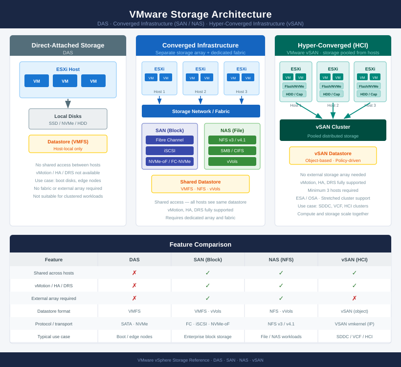
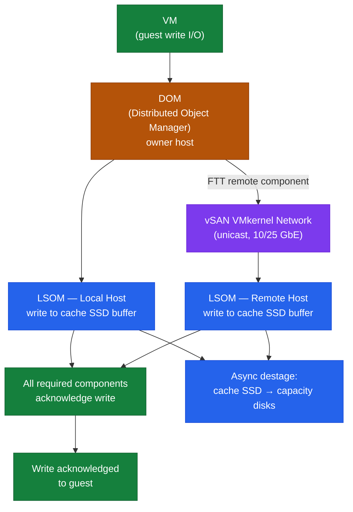
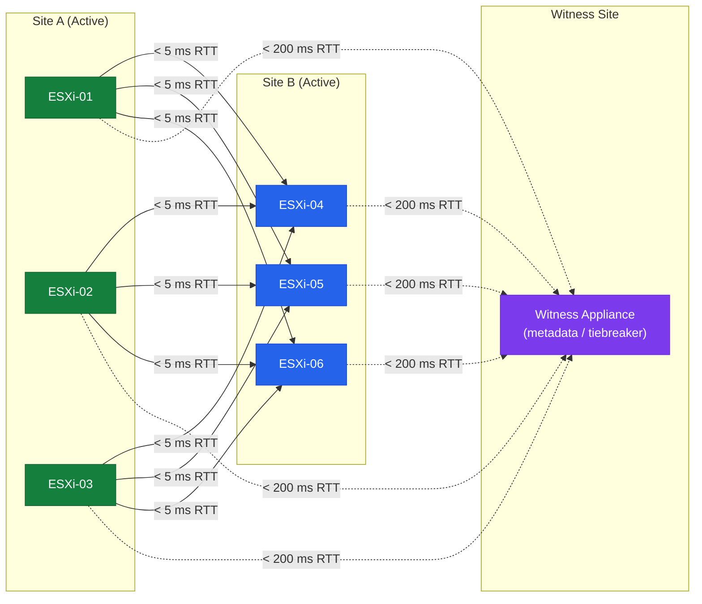

# vSAN — Architecture Overview

## VMware Storage Architecture



---

## Cluster Topology


## Overview

vSAN pools local disks across ESXi hosts to create a distributed shared datastore. Compute and storage run on the same ESXi hosts, eliminating the need for an external SAN or NAS. The vSAN datastore is presented as a single shared storage namespace to all hosts in the cluster.

vSAN is policy-driven: each VM's storage characteristics (availability, performance, capacity) are defined by a VM Storage Policy assigned at provisioning time.

---

## Storage Architecture Modes

### Original Storage Architecture (OSA) — vSAN 6.x / 7.x

OSA uses a two-tier model within each disk group: a dedicated flash cache device and one or more capacity devices.

```
ESXi Host (OSA)
└── Disk Group 1
    ├── Cache SSD (NVMe or SATA SSD) — write buffer + read cache
    ├── Capacity Disk 1 (SSD or HDD)
    ├── Capacity Disk 2
    └── Capacity Disk N (up to 7 per group)
└── Disk Group 2 (optional, up to 5 per host)
    └── ...
```

**All-Flash OSA:** Cache SSD handles write buffering only. Reads are served directly from capacity SSDs — no read cache needed (flash media is fast enough).

**Hybrid OSA:** Cache SSD handles both write buffering (70% of cache) and read caching (30% of cache). HDDs serve as capacity. Only suitable where cost constraints prevent all-flash configurations.

### Express Storage Architecture (ESA) — vSAN 8.0+

ESA eliminates the separate cache tier. Every NVMe device contributes directly to capacity with inline compression and space efficiency enabled by default.

```
ESXi Host (ESA)
└── Storage Pool
    ├── NVMe Device 1 (capacity + performance)
    ├── NVMe Device 2
    └── NVMe Device N
```

**ESA characteristics:**
- NVMe-only — no SATA or SAS SSDs
- No separate cache tier; each NVMe device is both cache and capacity
- Inline compression enabled by default (transparent to VMs)
- Requires minimum 4 hosts (vs 3 for OSA)
- Separate ESA-specific HCL — OSA certified devices are not automatically ESA compatible
- Higher throughput and lower latency than OSA, particularly at scale

---

## How vSAN Stores Data

### Objects and Components

vSAN does not store files as raw bytes on individual disks. Instead, it stores **objects** — logical storage containers that are distributed across the cluster according to the storage policy.

Each object is divided into **components** — the actual physical chunks stored on individual disk groups. Component placement is managed automatically by CLOM (Cluster Level Object Manager) based on the storage policy.

**VM storage objects:**

| Object Type | Description |
|---|---|
| VM Home Namespace | VM configuration files (`.vmx`, `.nvram`, logs) |
| VMDK | Each virtual disk — largest and most I/O-intensive object |
| VM Swap | Memory swap file — size equals VM configured RAM; only active when host is memory-pressured |
| Snapshot Delta Disk | Created per snapshot; grows with writes to the VM while snapshot is active |
| Instant Clone Memory Object | Memory state of an instant clone parent (linked clone scenarios) |

### RAID Striping

For large VMDKs (> 255 GB by default), vSAN automatically creates multiple stripes — each VMDK component is split across multiple disk groups on the same host. This improves per-object throughput.

Stripe width can be configured in the storage policy (`Number of disk stripes per object`), though the default of 1 is appropriate for most workloads.

### Object Placement and Fault Domains

CLOM places object components to satisfy the storage policy's FTT requirement. For FTT=1 RAID-1:

```
VM VMDK Object
├── Component A → ESXi-01, Disk Group 1
├── Component B → ESXi-02, Disk Group 1  (mirror)
└── Witness      → ESXi-03               (tiebreaker metadata only)
```

For FTT=1 RAID-5 (4 hosts minimum):

```
VM VMDK Object
├── Data stripe 1 → ESXi-01
├── Data stripe 2 → ESXi-02
├── Data stripe 3 → ESXi-03
└── Parity stripe → ESXi-04
```

Components are placed on different hosts to ensure no single host failure takes down the object.

---

## Write Path

Understanding the write path helps diagnose latency and capacity issues:

**OSA write path:**

1. VM issues a write to vSAN VMDK.
2. DOM (Distributed Object Manager) receives the write on the owner host.
3. DOM sends the write to each component's home host (via vSAN VMkernel network for non-local components).
4. On each host, LSOM (Local Storage Object Manager) writes to the disk group's cache SSD write buffer.
5. Once all required components acknowledge (based on FTT policy), DOM acknowledges the write to the VM.
6. Data is de-staged from cache to capacity disks asynchronously in the background.



**ESA write path:**

1. VM issues a write.
2. DOM receives and routes to component locations.
3. LSOM writes directly to NVMe storage with inline compression — no separate cache tier.
4. Acknowledgement after all required components confirm.

**Implication:** vSAN write latency is bounded by the slowest required acknowledgement in the policy. With FTT=1 RAID-1 and components on two different hosts, the write must travel across the vSAN network to the remote host and back. This makes vSAN network latency a direct contributor to front-end write latency.

---

## Read Path

**OSA read path (all-flash):**

1. VM issues a read.
2. DOM determines which component is the owner (typically the local copy if on the same host as the VM).
3. LSOM reads from the capacity SSD on the local disk group.
4. If data is not local, DOM fetches from a remote host's component via the vSAN VMkernel network.
5. Data returned to the VM.

**Cache hit (OSA hybrid only):** If the requested data is in the cache SSD's read cache, it is served from flash (low latency) rather than the HDD capacity tier.

**All-flash read locality:** vSAN preferentially reads from the local copy of a component (the component on the same host as the running VM). This minimises network traffic and latency. If the VM is migrated via vMotion, the local read preference follows the new home host.

---

## vSAN and vCenter

vSAN is exclusively managed through vCenter Server. The vSAN management plane is embedded in vCenter — there is no standalone vSAN manager.

**What vCenter manages:**
- Cluster creation and disk group claim
- Storage policy management (SPBM)
- Skyline Health checks and alerts
- Capacity reporting
- Stretched cluster and fault domain configuration
- File Services
- Encryption and KMS integration
- Performance Service (metrics collection)
- Upgrade via vSphere Lifecycle Manager (vLCM)

**Data plane independence:** If vCenter is offline, existing VMs continue running on vSAN without interruption. The data plane (CMMDS, DOM, LSOM) operates within the ESXi hosts independently. No configuration changes can be made while vCenter is down, but running workloads are not affected.

---

## Network Architecture

vSAN requires a dedicated VMkernel adapter on each host for vSAN traffic. This is separate from the management, vMotion, and NSX TEP VMkernel adapters.

**Since vSAN 6.6: Unicast only.** vSAN no longer uses multicast. Each host maintains a unicast agent list — the vSAN VMkernel IPs of all peer hosts. vCenter populates and manages this list automatically.

**Required network characteristics:**

| Parameter | Requirement |
|---|---|
| Speed | 10 GbE minimum; 25 GbE recommended for ESA or dense clusters |
| MTU | 9000 (jumbo frames) end-to-end — switch, NIC, and port group |
| Latency (intra-cluster) | < 1 ms RTT recommended; < 5 ms maximum |
| Redundancy | Teamed NICs (active-active or active-standby) on vDS |
| RDMA | Optional (RoCE v2) for ESA ultra-low latency workloads |

**Verify MTU end-to-end:**

```bash
vmkping -I vmk2 -d -s 8972 <peer_vsan_vmk_ip>
# Must succeed — any failure indicates MTU mismatch in path
```

---

## Stretched Cluster Architecture

A vSAN Stretched Cluster extends the cluster across two physical data sites with a third witness site.

```
Site A (Active)          Site B (Active)          Witness Site
  ESXi-01                  ESXi-04                  Witness Appliance
  ESXi-02                  ESXi-05                  (metadata only)
  ESXi-03                  ESXi-06
      │                        │                        │
      └────────────────────────┴────────────────────────┘
                     vSAN VMkernel Network
```



**Data placement:** Every VM object has a component on Site A AND a component on Site B (RAID-1 across sites). The witness holds only the tiebreaker metadata.

**Site failure handling:** If Site A fails, Site B has a complete copy of all data. The witness confirms quorum for Site B, allowing Site B to continue as the active site without data loss.

**Key constraints:**
- Site A to Site B: < 5 ms RTT
- Data sites to witness: < 200 ms RTT
- Minimum 2 hosts per data site (4 data hosts total)
- Storage policy uses per-site FTT in addition to cross-site FTT
- Stretched cluster requires a specific vSAN licence

---

## Capacity Management Fundamentals

vSAN capacity must account for more than raw data size:

| Overhead | Source |
|---|---|
| FTT overhead | RAID-1 = 2x; RAID-5 = 1.33x; RAID-6 = 1.5x |
| vSAN operations reserve | ~10% of raw capacity reserved by vSAN for internal operations |
| Resync buffer | Need capacity for rebuilding one host's worth of data during maintenance |
| Snapshot delta disks | Can grow rapidly — monitor and consolidate regularly |
| VM swap objects | One swap object per powered-on VM = VM RAM size |

**Practical capacity rule:** Never exceed 70% used capacity. Maintain at minimum 30% free to ensure resync operations can complete during maintenance.

```bash
# Check cluster capacity
esxcli vsan cluster get

# PowerCLI capacity report
Get-VsanSpaceUsage -Cluster (Get-Cluster "VSAN-LON-01") |
    Select TotalCapacityGB, FreeCapacityGB, UsedCapacityGB
```

---

## In this section

<div class="kb-grid kb-grid-3">
<a class="kb-card" href="components/"><strong>Components</strong><span>Core components, services, and technical specifications.</span></a>
<a class="kb-card" href="integrations/"><strong>Integrations</strong><span>Integration with other platforms and external systems.</span></a>
<a class="kb-card" href="standards/"><strong>Standards</strong><span>Sizing guidelines, design standards, and best practices.</span></a>
</div>
