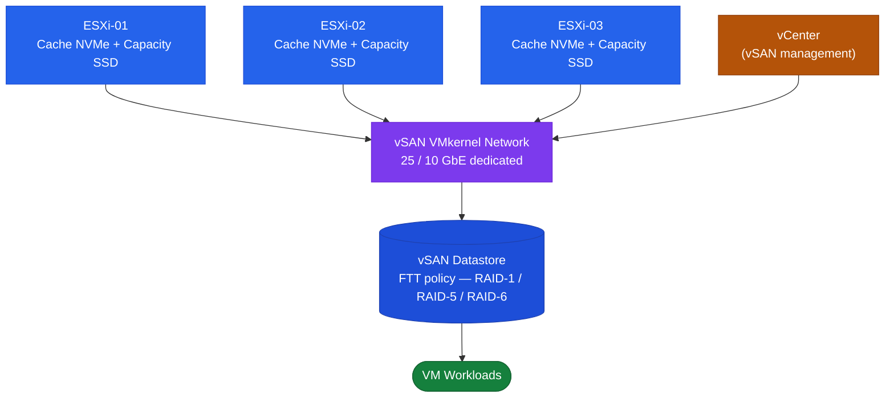

# vSAN — Architecture Overview

VMware supports four storage architectures. This section covers vSAN in depth.

| Architecture | Storage location | Shared across hosts | vMotion / HA / DRS |
|---|---|---|---|
| DAS | Local to host | No | No |
| SAN (FC / iSCSI / NVMe-oF) | External array | Yes | Yes |
| NAS (NFS / SMB) | External array | Yes | Yes |
| vSAN (HCI) | Pooled from hosts | Yes | Yes |

## VMware Storage Architecture

<a class="kb-card" href="how-it-works/"><strong>How It Works</strong>Storage architecture modes, objects, data path, and core components.</a>
<a class="kb-card" href="integrations/"><strong>Integrations</strong>vCenter, NSX, File Services, and Aria Operations.</a>
<a class="kb-card" href="design-standards/"><strong>Design Standards</strong>Network requirements, storage policies, naming conventions, and capacity planning.</a>

---

## Cluster Topology

