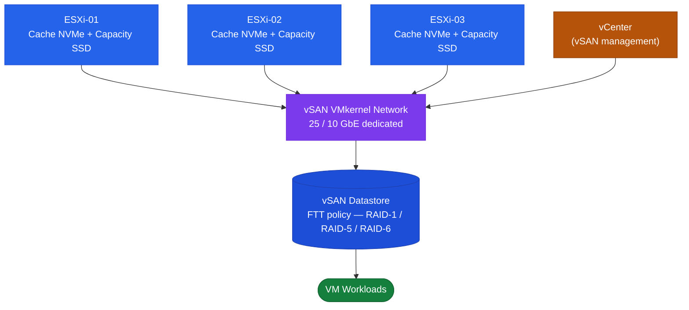

# vSAN — Architecture Overview

## Cluster Topology

## Overview

vSAN pools local disks across ESXi hosts to create a distributed shared datastore. Compute and storage run on the same ESXi hosts, eliminating the need for an external SAN or NAS. The vSAN datastore is presented as a single shared storage namespace to all hosts in the cluster.

vSAN is policy-driven: each VM's storage characteristics (availability, performance, capacity) are defined by a VM Storage Policy assigned at provisioning time.
