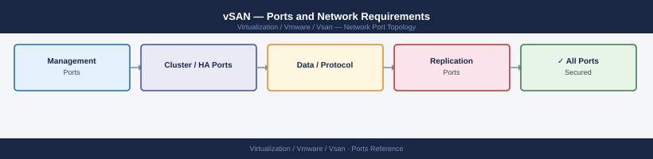

---
tags:
  - vsan
  - networking
  - firewall
  - ports
  - vsphere
  - vsphere-7
  - vsphere-8
---
# vSAN — Ports and Network Requirements

<div class="kb-summary">
Firewall port reference for VMware vSAN. Covers intra-cluster data plane, health service, iSCSI target, stretched cluster witness, and HCI Mesh cross-cluster traffic. Required for any L3 boundary in the vSAN path.

*Applies to: vSAN 7.x / 8.x*
</div>



## Before you begin

- For standard vSAN clusters, place all vSAN VMkernel adapters on a dedicated L2 network (same VLAN, no firewall) — L3 filtering between nodes introduces latency variance that can impact performance
- For stretched clusters and witness traffic, ports below must be open on the L3 boundary (inter-site firewall and witness firewall)
- vSAN traffic must use dedicated VMkernel adapters — never share with management or vMotion VMkernels
- HCI Mesh cross-cluster traffic (vSAN 7.0+) also requires these ports across the cluster boundary

---

## Intra-Cluster Traffic (ESXi host to ESXi host)

Open on L3 boundaries only (standard clusters on L2 require no firewall rules):

| Port | Protocol | Between | Purpose |
|---|---|---|---|
| 12345 | UDP | vSAN VMkernel adapters | CMMDS — Cluster Monitoring, Membership and Directory Service (metadata and heartbeat) |
| 12346 | UDP | vSAN VMkernel adapters | CMMDS — unicast heartbeat (node-to-node) |
| 2233 | TCP | vSAN VMkernel adapters | RDT — Reliable Datagram Transport (vSAN data I/O) |

---

## Stretched Cluster — Witness Appliance Traffic

The witness appliance uses its **management IP** for vSAN witness traffic (not a separate VMkernel).

| Port | Protocol | Source | Destination | Purpose |
|---|---|---|---|---|
| 12345 | UDP | Site A/B ESXi vSAN vmk | Witness appliance management IP | CMMDS witness heartbeat |
| 12346 | UDP | Site A/B ESXi vSAN vmk | Witness appliance management IP | CMMDS unicast |
| 2233 | TCP | Site A/B ESXi vSAN vmk | Witness appliance management IP | RDT witness traffic |
| 8080 | TCP | vCenter Server | Witness appliance management IP | vSAN witness REST API (provisioning and health queries) |

---

## Stretched Cluster — Inter-Site Traffic

| Port | Protocol | Between | Purpose |
|---|---|---|---|
| 12345 | UDP | Site A vSAN vmk ↔ Site B vSAN vmk | CMMDS cross-site metadata |
| 12346 | UDP | Site A vSAN vmk ↔ Site B vSAN vmk | CMMDS cross-site heartbeat |
| 2233 | TCP | Site A vSAN vmk ↔ Site B vSAN vmk | RDT cross-site data synchronisation |

Latency requirement: ≤5 ms RTT between sites for standard stretched cluster; ≤200 ms RTT to witness.

---

## vSAN Health Service

The vSAN health service communicates through the management network, not the vSAN VMkernel:

| Port | Protocol | Source | Destination | Purpose |
|---|---|---|---|---|
| 443 | TCP | vCenter Server | ESXi management IP | vSAN health queries and proactive tests |
| 443 | TCP | ESXi management IP | vCenter Server | Health service callback |
| 443 | TCP | vCenter Server | Broadcom / VMware cloud health service | Cloud Health (CEIP, proactive support) — outbound |

---

## vSAN iSCSI Target (Optional)

When vSAN iSCSI target service is enabled (remote compute use case):

| Port | Protocol | Source | Destination | Purpose |
|---|---|---|---|---|
| 3260 | TCP | iSCSI initiator hosts | ESXi vSAN VMkernel IP | vSAN iSCSI target |

The iSCSI target service listens on the vSAN VMkernel adapter, not the management IP. Verify with:
```bash
esxcli vsan iscsi target list
```

---

## HCI Mesh — Cross-Cluster Storage (vSAN 7.0+)

HCI Mesh allows one vSAN cluster to mount another cluster's vSAN datastore as a remote datastore. Requires the same vSAN data plane ports across the cluster boundary:

| Port | Protocol | Between | Purpose |
|---|---|---|---|
| 12345 | UDP | Compute cluster vSAN vmk ↔ Storage cluster vSAN vmk | CMMDS |
| 12346 | UDP | Compute cluster vSAN vmk ↔ Storage cluster vSAN vmk | CMMDS |
| 2233 | TCP | Compute cluster vSAN vmk ↔ Storage cluster vSAN vmk | RDT data |

---

## vSAN File Service (vSAN 7.0+)

When vSAN File Service is enabled (NFS/SMB shares on vSAN):

| Port | Protocol | Source | Purpose |
|---|---|---|---|
| 2049 | TCP/UDP | NFS clients | NFS v3/v4 file access |
| 445 | TCP | SMB clients | SMB file access |
| 111 | TCP/UDP | NFS clients | rpcbind |

---

## Firewall Zone Summary

| From | To | Ports | Notes |
|---|---|---|---|
| ESXi vSAN vmk | ESXi vSAN vmk | 12345/12346 UDP, 2233 TCP | Same L2 = no firewall needed |
| ESXi vSAN vmk (both sites) | Witness appliance mgmt IP | 12345/12346 UDP, 2233 TCP | Must cross inter-site/witness firewall |
| Site A vSAN vmk | Site B vSAN vmk | 12345/12346 UDP, 2233 TCP | Inter-site firewall; ≤5 ms RTT |
| vCenter | Witness appliance | 8080 TCP | vSAN witness REST API |
| iSCSI initiators | ESXi vSAN vmk | 3260 TCP | vSAN iSCSI target (if enabled) |
| NFS clients | vSAN File Service IP | 2049, 111 | vSAN File Service (if enabled) |

---

## Verify

```bash
# From ESXi SSH — verify vSAN VMkernel adapter
esxcli vsan network list

# From ESXi SSH — test connectivity to another host's vSAN vmk
vmkping -I vmk2 <peer-vsan-vmk-ip>

# From ESXi SSH — test connectivity to witness appliance
vmkping -I vmk2 <witness-mgmt-ip>

# From ESXi SSH — check vSAN cluster health
esxcli vsan health cluster list

# From ESXi SSH — check CMMDS status
esxcli vsan debug vmdk list

# From vCenter PowerCLI — vSAN network config
Get-VsanView -Id "VsanVcNetworkConfigSystem-vsan-vc-network-config-system" |
  Invoke-Method -Name "VsanQueryVcNetworkConfig"
```

---

## See also

- [ESXi — Ports](../../esxi/architecture/ports.md)
- [vCenter — Ports](../../vcenter/architecture/ports.md)
- [vSAN — Architecture](how-it-works/)
- [vSAN — Deploy](../../vsan/deploy/)
- [vSAN — Operations](../../vsan/operations/)
