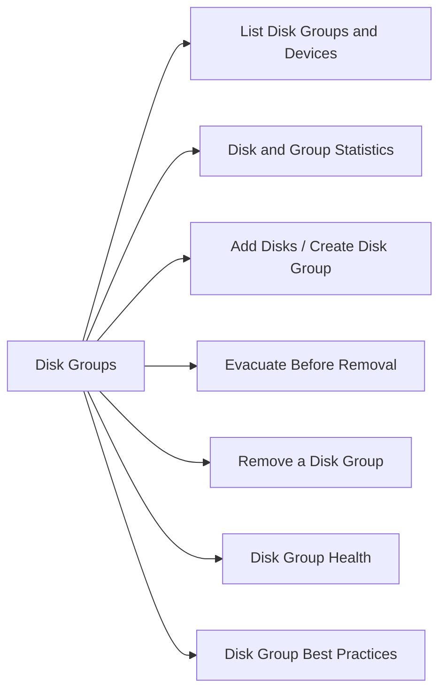

# Disk Groups

> Part of the [vSAN CLI Reference](../).



## List Disk Groups and Devices

```bash
# All vSAN storage devices — shows SSD (cache tier) and capacity disks
esxcli vsan storage list

# Summarised disk group view — which SSD is group leader
esxcli vsan storage list | grep -E "Is SSD|Disk Group UUID|VSAN UUID"
```

## Disk and Group Statistics

```bash
# I/O stats per disk (reads, writes, errors, latency)
esxcli vsan storage stats get

# Per-disk detail (include health state)
esxcli vsan storage list | grep -E "naa\.|Health|State"
```

## Add Disks / Create Disk Group

```bash
# Add a cache SSD and one or more capacity disks (creates new disk group)
esxcli vsan storage add -s <ssd_naa> -d <capacity_naa1> -d <capacity_naa2>

# Add capacity disk to existing disk group
esxcli vsan storage add -s <existing_ssd_naa> -d <new_capacity_naa>
```

## Evacuate Before Removal

Always evacuate data before removing a disk to avoid data loss:

```bash
# Evacuate a disk (moves data to other hosts, waits for completion)
esxcli vsan storage evacuate -d <device_naa>

# Check resync progress during evacuation
esxcli vsan debug resync list

# Confirm no remaining data on disk
esxcli vsan storage list | grep <device_naa>
```

## Remove a Disk Group

```bash
# Remove a cache SSD (removes entire disk group — evacuate first)
esxcli vsan storage remove -s <ssd_naa>

# Remove a single capacity disk from a group
esxcli vsan storage remove -d <capacity_naa>
```

## Disk Group Health

```bash
# Check for degraded or absent components
esxcli vsan debug object list | grep -v healthy

# vSAN health check — disk layer
esxcli vsan health cluster get | grep -i disk

# Overall health summary
esxcli vsan health summary get
```

## Disk Group Best Practices

| Guideline | Reason |
|---|---|
| 1 SSD : 7 capacity disks max | Beyond 7, cache hit rate drops significantly |
| Evacuate before any disk removal | Prevents component loss |
| Match capacity disk sizes within a group | Avoids uneven wear and wasted space |
| Use `esxcli vsan debug resync list` before maintenance | Ensure no active rebuild before removing another disk |
| Replace failed disk within 24h | vSAN has single-failure tolerance — second failure = data loss |
