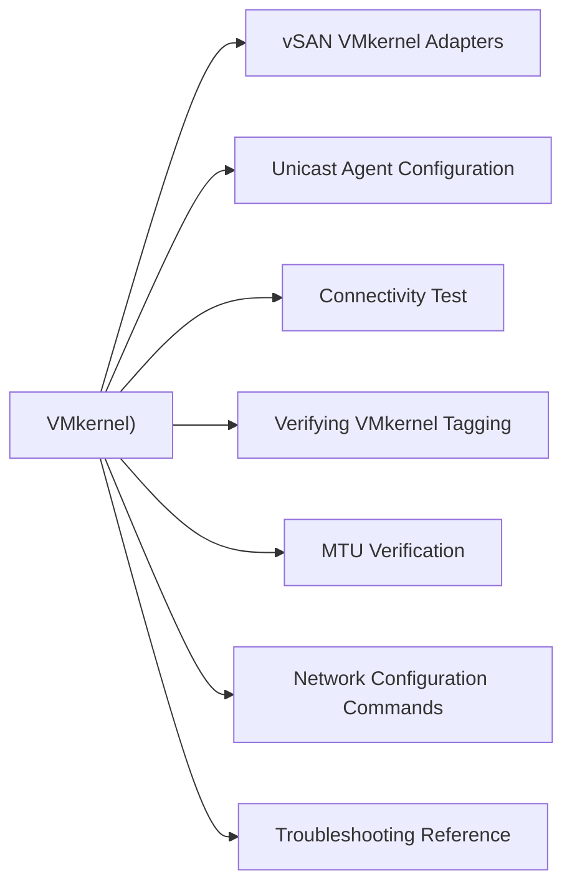

# Networking (vSAN VMkernel)

> Part of the [vSAN CLI Reference](../).



## vSAN VMkernel Adapters

```bash
# List VMkernel adapters tagged for vSAN traffic
esxcli vsan network list

# Output fields: adapter name, IP, gateway, traffic type tag
```

## Unicast Agent Configuration

vSAN uses unicast by default (multicast no longer required from vSAN 6.6+).

```bash
# View unicast agent config — shows peer IPs for each vSAN VMkernel
esxcli vsan network ipconfig list

# Per-adapter unicast peers (who this host talks to in the cluster)
esxcli vsan network ipconfig list | grep -E "Adapter|Unicast"
```

## Connectivity Test

```bash
# Test vSAN network connectivity to all cluster peers
esxcli vsan debug network test

# This sends UDP probes to all known unicast agents and reports latency / loss
```

## Verifying VMkernel Tagging

```bash
# Confirm vmk is tagged for vSAN
esxcli network ip interface tag get -i vmk2   # replace vmk2 with actual adapter

# Expected output includes: VSAN

# Add vSAN tag to a VMkernel (if missing)
esxcli network ip interface tag add -i vmk2 -t VSAN
```

## MTU Verification

vSAN performs best with jumbo frames (MTU 9000) end-to-end.

```bash
# Check VMkernel MTU
esxcli network ip interface list | grep -A5 vmk2

# Test large packet through physical switches (ping with don't-fragment)
vmkping -I vmk2 -d -s 8972 <peer_vmk_ip>

# Expected: no packet loss. If loss occurs — switch or NIC MTU mismatch
```

## Network Configuration Commands

```bash
# Add a vSAN VMkernel (if not using vSphere UI)
esxcli vsan network ip add -i vmk2

# Remove a VMkernel from vSAN network config
esxcli vsan network ip remove -i vmk2
```

## Troubleshooting Reference

| Symptom | Check |
|---|---|
| Cluster health: Network issues | `esxcli vsan debug network test` — look for packet loss |
| High vSAN latency | `vmkping -d -s 8972` — check MTU along path |
| Host isolated from cluster | `esxcli vsan network ipconfig list` — unicast agents populated? |
| vSAN VMkernel missing | `esxcli network ip interface tag get` — VSAN tag present? |
| Multicast warning in health | Informational from vSAN 6.6+; unicast is default and correct |
