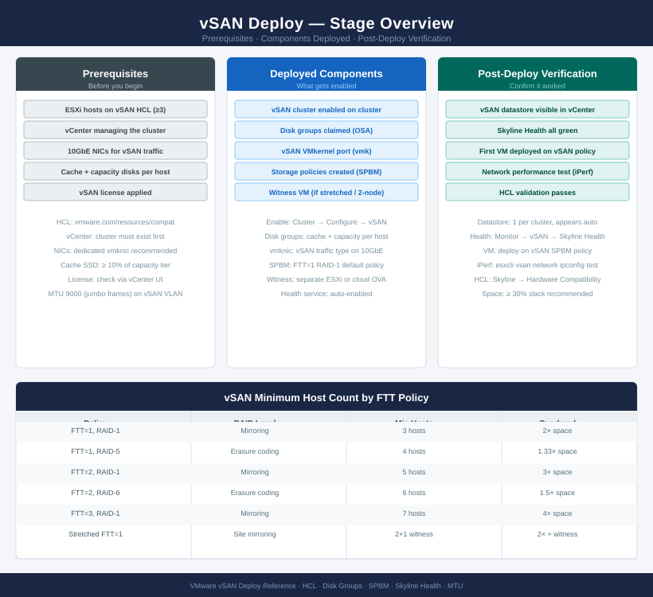
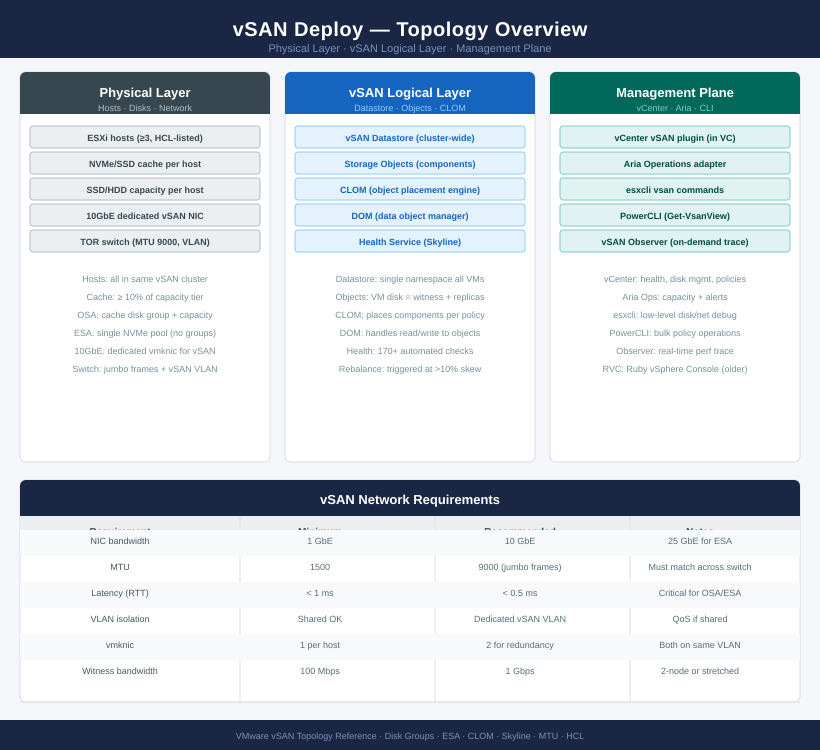

---
tags:
  - deployment
  - vmware
  - vsan
  - vsphere-8
search:
  boost: 2
---
# vSAN — Deploy

<div class="kb-summary">
End-to-end deployment guide from bare metal to a validated vSAN cluster. Phases 1–3 cover the physical and hypervisor foundation; Phases 4–7 cover vSAN-specific enablement, policy configuration, and end-to-end validation.

*Applies to: vSAN 7.x / 8.x*
</div>





---

```d2
direction: right

plan: "Plan" {shape: oval}
phase_1_physical_layer: "Phase 1 — Physical Layer" {shape: rectangle}
phase_2_esxi_installation_and_firstb: "Phase 2 — ESXi Installation and First-Boot Config" {shape: rectangle}
phase_3_vcenter_deployment_and_initi: "Phase 3 — vCenter Deployment and Initial Configuration" {shape: rectangle}
phase_4_dvswitch_and_vsan_network_se: "Phase 4 — dvSwitch and vSAN Network Setup" {shape: rectangle}
phase_5_vsan_cluster_enablement: "Phase 5 — vSAN Cluster Enablement" {shape: rectangle}
phase_6_aria_suite_lifecycle_and_mon: "Phase 6 — Aria Suite Lifecycle and Monitoring\n(Optional)" {shape: rectangle}
validate: "Validate" {shape: oval}

plan -> phase_1_physical_layer
phase_1_physical_layer -> phase_2_esxi_installation_and_firstb
phase_2_esxi_installation_and_firstb -> phase_3_vcenter_deployment_and_initi
phase_3_vcenter_deployment_and_initi -> phase_4_dvswitch_and_vsan_network_se
phase_4_dvswitch_and_vsan_network_se -> phase_5_vsan_cluster_enablement
phase_5_vsan_cluster_enablement -> phase_6_aria_suite_lifecycle_and_mon
phase_6_aria_suite_lifecycle_and_mon -> validate
```

## Before you begin

<!-- video-link -->
!!! tip "Video Walkthrough"
    [:fontawesome-brands-youtube: How to Build a VMware vSAN Express Storage Architecture Cluster — Step by Step](https://www.youtube.com/watch?v=RDauebK14Nw){ .md-button }
<!-- /video-link -->

- **Access:** vCenter Administrator role and SSH access to VCSA/ESXi hosts
- **Environment:** DNS, NTP, and network connectivity verified before starting
- **Change management:** change request approved; maintenance window scheduled
- **Rollback:** snapshot or backup taken immediately before deployment begins
- **Time estimate:** 30–90 minutes — do not start if less than 2 hours are available

---

!!! warning "Disk claim is destructive"
    Claiming disks for vSAN **erases all existing data** on those disks. Confirm disk selection before proceeding — this action cannot be undone.

## Phase 1 — Physical Layer

**Exit criterion:** All hosts powered on, reachable via OOB management, cabling verified, and HCL compliance confirmed.

### BIOS / UEFI Settings

Configure on every host before ESXi installation:

| Setting | Required Value | Reason |
|---|---|---|
| Boot mode | UEFI (preferred) or Legacy BIOS | UEFI required for Secure Boot and TPM 2.0 |
| Hyperthreading | Enabled | Required for ESXi CPU scheduling |
| Virtualisation extensions | Intel VT-x / AMD-V: Enabled | Required for VM execution |
| Power management | Maximum Performance (disable C-states) | Avoids latency spikes from CPU power state transitions |
| NUMA nodes | Match physical topology | Do not interleave NUMA nodes across CPU sockets |
| Turbo boost | Enabled | Improves burst throughput |
| SR-IOV | Enabled if using SR-IOV NICs | Required for direct-pass NIC features |

### Network Cabling

- Connect all hosts to ToR switches with the correct port profile (trunk/access, VLAN tags).
- Verify 25 GbE (minimum) for vSAN traffic. 10 GbE is supported but not recommended for new deployments.
- Confirm jumbo frames (MTU 9000) are configured on every switch port, trunk, and uplink the vSAN traffic traverses.
- Connect OOB management (iDRAC/iLO) to a separate management switch or VLAN.

### OOB Management Configuration (iDRAC / iLO)

Configure on each host:
1. Assign a static IP to iDRAC or iLO.
2. Create a dedicated admin user (do not use the default `root`/`admin` credentials).
3. Enable remote console (HTML5 or Java) — needed for ESXi installation.
4. Set hostname in iDRAC/iLO to match the planned ESXi hostname.

### HCL Verification

Before installation, verify every component against the [VMware Compatibility Guide](https://www.vmware.com/resources/compatibility):

- Server model and BIOS version
- NIC model and firmware
- HBA model and firmware (if used)
- Cache SSD model and firmware (must be exact match)
- Capacity disk model and firmware (must be exact match)

**HCL failures at this stage are cheaper to fix than after cluster deployment.**

---

## Phase 2 — ESXi Installation and First-Boot Config

**Exit criterion:** All hosts running ESXi with correct IP, hostname, NTP, DNS, and SSH accessible.

### Install ESXi

Install ESXi from bootable ISO (USB, iDRAC virtual media, or PXE):

1. Boot from ESXi ISO.
2. Accept EULA, select install disk (use a dedicated boot device — not a vSAN disk).
3. Set root password.
4. Complete installation and reboot.

Recommended boot device: dedicated M.2 SSD, SD card (with a 2-card redundant BOSS card), or USB (not recommended for production).

### First-Boot Configuration (DCUI)

Immediately after first boot, via the Direct Console User Interface (F2 → System Customization):

```text
Configure Management Network:
  → Network Adapters: select the correct management NIC (vmnic0 or vmnic1)
  → IP Configuration: set static IP, subnet, gateway
  → DNS Configuration: set DNS servers and hostname (FQDN)
  → Custom DNS Suffixes: add your domain

Test Management Network → confirm all tests pass
Restart Management Network → apply changes
```

### ESXi Shell and SSH Configuration

```bash
# Enable SSH from DCUI: Troubleshooting Options → Enable SSH
# Or via vSphere Client after adding to vCenter

# Test SSH access
ssh root@esxi-01.example.com

# Set NTP (from ESXi shell)
esxcli system ntp set -s ntp1.example.com -s ntp2.example.com
esxcli system ntp set -e yes

# Verify NTP
esxcli system ntp get
esxcli system ntp stats

# Confirm hostname
esxcli system hostname get
```


```text title="Expected output"
The authenticity of host 'esxi-01.example.com (192.168.1.45)' can't be established.
ECDSA key fingerprint is SHA256:aBcD1234eFgH5678iJkL9012mNoPqRsT3456uVwXyZ.
Are you sure you want to continue connecting (yes/no)? yes
Warning: Permanently added 'esxi-01.example.com,192.168.1.45' (ECDSA) to /etc/ssh/known_hosts.
root@esxi-01.example.com's password:
root@esxi-01:~]

NTP Configured for:
   Server: ntp1.example.com
   Server: ntp2.example.com
NTP Enabled: true

NTP Sync State: synchronized
Remote Clock Stratum: 2
Reference Clock ID: 0x9f6e0a0a
Synchronized: true
Offset: -0.002 ms
Frequency: 0.000 ppm
Jitter: 0.156 ms

Hostname: esxi-01.example.com
Domain Name: example.com
```

!!! warning "Common errors"
    **`ssh: Could not resolve hostname esxi-01.example.com: Name or service not known`** — Verify the hostname is resolvable by checking DNS or using the IP address directly (ssh root@192.168.1.45).
    **`Error: NTP set failed: Unable to set NTP servers`** — Confirm the NTP server hostnames are reachable and that firewall rules allow UDP port 123 outbound from the ESXi host.
    **`Error: NTP stats not available`** — Wait 30-60 seconds after enabling NTP for the host to synchronize with the configured servers, then retry the stats command.
### Verify Connectivity

From a management workstation:
```bash
ping esxi-01.example.com
nslookup esxi-01.example.com    # Forward DNS
nslookup <esxi-management-ip>   # Reverse DNS
ssh root@esxi-01.example.com
```


```text title="Expected output"
PING esxi-01.example.com (192.168.1.45) 56(84) bytes of data.
64 bytes from esxi-01.example.com (192.168.1.45): icmp_seq=1 ttl=64 time=2.34 ms
64 bytes from esxi-01.example.com (192.168.1.45): icmp_seq=2 ttl=64 time=1.98 ms
64 bytes from esxi-01.example.com (192.168.1.45): icmp_seq=3 ttl=64 time=2.11 ms
^C
--- esxi-01.example.com statistics ---
3 packets transmitted, 3 received, 0% packet loss, time 2003ms
rtt min/avg/max/stddev = 1.98/2.14/2.34/0.15 ms

Server:		192.168.1.10
Address:	192.168.1.10#53

Name:	esxi-01.example.com
Address: 192.168.1.45

Server:		192.168.1.10
Address:	192.168.1.10#53
45.1.168.192.in-addr.arpa	name = esxi-01.example.com.

The authenticity of host 'esxi-01.example.com (192.168.1.45)' can't be established.
ECDSA key fingerprint is SHA256:aBcD1234EfGhIjKlMnOpQrStUvWxYz5678+9/0AbCdE.
Are you sure you want to continue connecting (yes/no/[fingerprint])? yes
Warning: Permanently added 'esxi-01.example.com,192.168.1.45' (ECDSA) to /root/.ssh/known_hosts.
root@esxi-01.example.com's password:
```

!!! warning "Common errors"
    **`ping: esxi-01.example.com: Name or service not known`** — Verify DNS resolution by checking /etc/resolv.conf and ensure the ESXi hostname is registered in DNS or add it to /etc/hosts.
    **`nslookup: can't resolve 'esxi-01.example.com': No address associated with hostname`** — Confirm the ESXi host's management IP is correctly registered in DNS or use the IP address directly instead of the hostname.
    **`ssh: connect to host esxi-01.example.com port 22: Connection refused`** — Verify SSH is enabled on the ESXi host via the vSphere Client and check that the management network is reachable.
Repeat for every host. All must have working forward and reverse DNS before vCenter deployment.

---

## Phase 3 — vCenter Deployment and Initial Configuration

**Exit criterion:** vCenter running, all ESXi hosts added to a cluster object, and basic vCenter services configured.

### Deploy the VCSA

1. Mount the VCSA ISO on a workstation.
2. Run the installer: `vcsa-ui-installer/<platform>/installer`.
3. **Stage 1 — Deploy:** select deployment target (an ESXi host), provide VCSA IP and sizing, set SSO password.
4. **Stage 2 — Setup:** configure NTP, SSH, SSO domain (default: `vsphere.local`), enable CEIP (optional).
5. Wait for deployment to complete (~30 minutes).

### Post-Deployment vCenter Configuration

**From vSphere Client (browser to VCSA IP):**

1. Create a **Datacenter** object.
2. Create a **Cluster** object inside the Datacenter. Do NOT enable vSAN, DRS, or HA at this stage.
3. Add all ESXi hosts to the cluster: right-click cluster → Add Hosts.
4. Accept host thumbprints, enter root credentials for each host.

### License Assignment

```text
vSphere Client → Administration → Licenses → Add License Key
→ assign vSphere + vSAN licenses to cluster and hosts
```

### Configure vCenter NTP

vCenter and all ESXi hosts must be synchronised to the same NTP source. Drift > 500 ms causes vSAN health warnings.

```bash
# Verify vCenter NTP from VCSA shell (SSH as root)
chronyc tracking
# Reference time must match ESXi hosts
```


```text title="Expected output"
Reference ID    : 91.189.89.198 (ntp.ubuntu.com)
Stratum         : 2
Ref time (UTC)  : Wed Nov 15 14:32:18 2023
System time     : 0.000000123 seconds fast of NTP time
Latest offset   : +0.000156 sec
RMS offset      : 0.000089 sec
Frequency       : -12.456 ppm slow
Residual freq   : +0.002 ppm
Skew            : 0.087 ppm
Root delay      : 0.031456 sec
Root dispersion : 0.015234 sec
Update interval : 64.2 sec
Leap status     : Normal
```

!!! warning "Common errors"
    **`506 Cannot talk to daemon`** — Ensure the chronyd service is running with `systemctl start chronyd` on the VCSA.
    **`Stratum         : 16`** — The NTP server is unreachable or misconfigured; verify network connectivity and NTP server address in `/etc/chrony.conf`.
---

## Phase 4 — dvSwitch and vSAN Network Setup

**Exit criterion:** All hosts have a vSAN vmkernel with MTU 9000 confirmed end-to-end to all peers.

### Create the Distributed Virtual Switch

```text
vSphere Client → Datacenter → Actions → Distributed Switch → New Distributed Switch
→ Name: vDS-Prod
→ Version: match ESXi version
→ Uplinks: 2 (one per physical NIC used for vSAN/vMotion)
→ Default port group: delete (create named groups below)
```

Add all hosts to the dvSwitch and assign physical uplinks:

```text
dvSwitch → Actions → Add and Manage Hosts
→ Add hosts → assign vmnic2 to Uplink 1, vmnic3 to Uplink 2 (adjust for your hardware)
```

### Create Port Groups

| Port Group Name | VLAN | Traffic Type |
|---|---|---|
| PG-vSAN | 100 (example) | vSAN VMkernel |
| PG-vMotion | 200 (example) | vMotion VMkernel |
| PG-Management | 10 (example) | Management (if moving vmk0) |
| PG-VM-Production | 300+ | Virtual machine traffic |

### Create the vSAN VMkernel on Each Host

**From vSphere Client:**

For each host: Host → Configure → Networking → VMkernel adapters → Add Networking

```text
→ Select: Existing distributed port group → PG-vSAN
→ Enable: vSAN traffic service tag
→ IP: static, e.g. 192.168.100.1x/24 (per host)
→ MTU: 9000
```

Or via PowerCLI:

```powershell
$hosts = Get-VMHost -Location (Get-Cluster "VSAN-LON-01")
$dvs = Get-VDSwitch "vDS-Prod"
$pg = Get-VDPortgroup "PG-vSAN"

foreach ($h in $hosts) {
    $hostNum = [int]($h.Name -replace ".*-0*","")
    New-VMHostNetworkAdapter -VMHost $h -VirtualSwitch $dvs `
        -PortGroup $pg -IP "192.168.100.$hostNum" -SubnetMask "255.255.255.0" `
        -Mtu 9000 -VsanTrafficEnabled $true
}
```

### Verify MTU End-to-End

```bash
# From each host — test to every other vSAN vmk IP in the cluster
# Replace IPs with your vSAN VMkernel addresses
vmkping -I vmk2 -d -s 8972 192.168.100.12
vmkping -I vmk2 -d -s 8972 192.168.100.13
vmkping -I vmk2 -d -s 8972 192.168.100.14
# 0% packet loss on all tests = MTU correct end-to-end
```


```text title="Expected output"
PING 192.168.100.12 (192.168.100.12): 56 data bytes
64 bytes from 192.168.100.12: icmp_seq=0 ttl=64 time=0.542 ms
64 bytes from 192.168.100.12: icmp_seq=1 ttl=64 time=0.518 ms
64 bytes from 192.168.100.12: icmp_seq=2 ttl=64 time=0.531 ms
64 bytes from 192.168.100.12: icmp_seq=3 ttl=64 time=0.525 ms
--- 192.168.100.12 statistics ---
4 packets transmitted, 4 packets received, 0% packet loss
round-trip min/avg/max = 0.518/0.529/0.542 ms

PING 192.168.100.13 (192.168.100.13): 56 data bytes
64 bytes from 192.168.100.13: icmp_seq=0 ttl=64 time=1.247 ms
64 bytes from 192.168.100.13: icmp_seq=1 ttl=64 time=1.263 ms
64 bytes from 192.168.100.13: icmp_seq=2 ttl=64 time=1.251 ms
64 bytes from 192.168.100.13: icmp_seq=3 ttl=64 time=1.255 ms
--- 192.168.100.13 statistics ---
4 packets transmitted, 4 packets received, 0% packet loss
round-trip min/avg/max = 1.247/1.254/1.263 ms

PING 192.168.100.14 (192.168.100.14): 56 data bytes
64 bytes from 192.168.100.14: icmp_seq=0 ttl=64 time=0.789 ms
64 bytes from 192.168.100.14: icmp_seq=1 ttl=64 time=0.801 ms
64 bytes from 192.168.100.14: icmp_seq=2 ttl=64 time=0.795 ms
64 bytes from 192.168.100.14: icmp_seq=3 ttl=64 time=0.798 ms
--- 192.168.100.14 statistics ---
4 packets transmitted, 4 packets received, 0% packet loss
round-trip min/avg/max = 0.789/0.796/0.801 ms
```

!!! warning "Common errors"
    **`PING 192.168.100.12 (192.168.100.12): 56 data bytes — No response from host`** — Verify the vSAN VMkernel IP is correct and the network path between hosts is unblocked.
    **`Unknown interface vmk2`** — Confirm vmk2 exists on this host with `esxcli network ip interface list` and use the correct VMkernel interface name.
    **`4 packets transmitted, 0 packets received, 100% packet loss`** — Check that the vSAN network MTU is set to 9000 on all physical switches and VMkernel interfaces with `esxcli network ip
Any packet loss means MTU 9000 is not configured somewhere in the path (switch port, trunk, uplink). Fix before enabling vSAN.

### Configure NIOC (If Sharing NICs)

If vSAN, vMotion, and VM traffic share the same uplinks, configure Network I/O Control:

```text
dvSwitch → Configure → Network I/O Control → Enable
→ System Traffic → vSAN: set reservation to 50% (minimum)
→ System Traffic → vMotion: set reservation to 25%
```

---

## Phase 5 — vSAN Cluster Enablement

**Exit criterion:** vSAN enabled, disk groups claimed on all hosts, storage policies created, and Skyline Health showing all green.

### Enable vSAN on the Cluster

**From vSphere Client:**

```text
Cluster → Configure → vSAN → Services → Configure
→ Select: Single site cluster (or 2-node / Stretched)
→ Deduplication and Compression: disable for now (enable after validation)
→ Encryption: disable for now (enable after validation)
→ Allow reduced redundancy: leave unchecked
→ Next → claim disks
```

### Claim Disks (OSA)

On the Disk Claim screen, vSAN presents eligible disks per host:

- **Cache tier:** assign the fastest device (NVMe SSD, or SATA SSD for cache). One per disk group.
- **Capacity tier:** assign remaining eligible devices. Up to 7 per disk group.

Best practice: one disk group per host with all eligible disks. Multiple disk groups per host are supported but add management complexity.

```bash
# Verify disk groups created on each host
esxcli vsan storage list | grep -E "Disk Group UUID|Is SSD|Health"
```


```text title="Expected output"
Disk Group UUID: 52e4a1c3-8f2b-4a9e-b1d2-7c9e3f5a2b1d
Is SSD: true
Health: Healthy
Disk Group UUID: 52e4a1c3-8f2b-4a9e-b1d2-7c9e3f5a2b1e
Is SSD: true
Health: Healthy
Disk Group UUID: 52e4a1c3-8f2b-4a9e-b1d2-7c9e3f5a2b1f
Is SSD: true
Health: Healthy
```

!!! warning "Common errors"
    **`Error: Unknown command or namespace vsan storage list`** — Verify vSAN is licensed and enabled on the cluster, then reconnect the ESXi host to vCenter.
    **`(empty output)`** — Run the command on each ESXi host individually using SSH; the command does not aggregate across hosts from a single execution point.
### Verify vSAN Cluster Formation

```bash
# Confirm all hosts are cluster members
esxcli vsan cluster get
# All hosts should appear in the member list; one is Master

# Run initial health check
esxcli vsan health cluster get
# All tests should PASS
```


```text title="Expected output"
Cluster UUID: 52d4a8f1-7c2e-4f3a-9b1a-8e3d2c1f5a9b
Cluster Master: esx-prod-01.lab.local
Member UUIDs:
  52d4a8f1-7c2e-4f3a-9b1a-8e3d2c1f5a9b (esx-prod-01.lab.local)
  63e5b9g2-8d3f-5g4b-0c2b-9f4e3d2g6b0c (esx-prod-02.lab.local)
  74f6c0h3-9e4g-6h5c-1d3c-0g5f4e3h7c1d (esx-prod-03.lab.local)

Cluster Health Status: HEALTHY
Test Results:
  Cluster: PASS
  Physical disk: PASS
  Memory: PASS
  Network: PASS
  Connectivity: PASS
```

!!! warning "Common errors"
    **`Cluster UUID: <unknown>`** — Ensure all hosts are licensed for vSAN and the cluster has been properly initialized with `esxcli vsan cluster new`.
    **`Cluster Health Status: DEGRADED`** — Check individual host health with `esxcli vsan health host get` and verify network connectivity between cluster members.
**From vSphere Client:**
Cluster → Monitor → vSAN → Skyline Health — resolve any warnings before proceeding.

### Create Storage Policies

Create the standard policy set before provisioning any VMs:

```powershell
Connect-VIServer <vcenter>

# FTT=1 RAID-5 (4+ nodes) — general workloads
New-SpbmStoragePolicy -Name "VSAN-T2-FTT1-RAID5" `
    -AnyOfRuleSets @(
        New-SpbmRuleSet -AllOfRules @(
            New-SpbmRule -AnyOfCapabilities @(
                New-SpbmCapability -Name "VSAN.hostFailuresToTolerate" -Value 1),
            New-SpbmRule -AnyOfCapabilities @(
                New-SpbmCapability -Name "VSAN.replicaPreference" -Value "RAID-5")
        )
    )

# FTT=2 RAID-6 (6+ nodes) — Tier-1 databases
New-SpbmStoragePolicy -Name "VSAN-T1-FTT2-RAID6" `
    -AnyOfRuleSets @(
        New-SpbmRuleSet -AllOfRules @(
            New-SpbmRule -AnyOfCapabilities @(
                New-SpbmCapability -Name "VSAN.hostFailuresToTolerate" -Value 2),
            New-SpbmRule -AnyOfCapabilities @(
                New-SpbmCapability -Name "VSAN.replicaPreference" -Value "RAID-6")
        )
    )

# FTT=1 RAID-1 (3 nodes minimum) — dev/test
New-SpbmStoragePolicy -Name "VSAN-DEV-FTT1-RAID1" `
    -AnyOfRuleSets @(
        New-SpbmRuleSet -AllOfRules @(
            New-SpbmRule -AnyOfCapabilities @(
                New-SpbmCapability -Name "VSAN.hostFailuresToTolerate" -Value 1),
            New-SpbmRule -AnyOfCapabilities @(
                New-SpbmCapability -Name "VSAN.replicaPreference" -Value "RAID-1")
        )
    )
```

### Enable vSAN Performance Service

```text
Cluster → Configure → vSAN → Services → Performance Service → Enable
```

Without this, performance metrics are not collected and the Performance view in Monitor is empty.

---

## Phase 6 — Aria Suite Lifecycle and Monitoring (Optional)

**Exit criterion:** If Aria Operations is in scope, vSAN adapter configured and dashboards showing cluster data.

This phase is optional — skip if not deploying Aria Operations.

### Deploy Aria Suite Lifecycle Manager

Aria Suite Lifecycle (previously vRealize Suite Lifecycle Manager) is the deployment orchestrator for Aria Operations, Aria Log Insight, and Aria Automation.

1. Deploy Aria Suite Lifecycle OVA to the vSAN datastore.
2. Configure with vCenter credentials.
3. Use Lifecycle Manager to deploy Aria Operations with the appropriate T-shirt size.

### Configure vSAN Adapter in Aria Operations

1. Aria Operations → Administration → Solutions → VMware vSAN → Configure.
2. Add vCenter as a data source — the vSAN adapter pulls metrics automatically.
3. Import the vSAN management pack if not bundled.

### Configure Alert Thresholds

| Metric | Warning | Critical |
|---|---|---|
| vSAN capacity used | 65% | 75% |
| Resync queue (bytes) | > 0 for 2h | > 0 for 8h |
| Object health (non-healthy) | > 0 | > 0 for 30 min |
| Read latency | > 5 ms | > 10 ms |
| Write latency | > 10 ms | > 20 ms |
| Disk SMART errors | Any | Any |

---

## Phase 7 — End-to-End Validation

**Exit criterion:** All checks in this phase pass. Sign off on the deployment and hand to operations.

### Skyline Health — All Green

```text
Cluster → Monitor → vSAN → Skyline Health
→ All categories must show green
→ Resolve every warning before sign-off
```

```bash
# CLI equivalent
esxcli vsan health cluster get | grep -v PASS
# Expected: no output (all tests pass)
```


```text title="Expected output"
(no output — command completes silently)
```

!!! warning "Common errors"
    **`Error: Could not connect to the specified host. The session is not authenticated.`** — Authenticate to the ESXi host or vCenter using `esxcli -s <host> -u <user> -p <password>` before running vsan commands.
    **`Error: Unknown command or namespace 'vsan'.`** — Verify vSAN is licensed and enabled on the cluster; if not installed, the vsan namespace will not be available in esxcli.
### Storage Policy Compliance

```powershell
# No VMs should be non-compliant
Get-SpbmEntityConfiguration | Where-Object { $_.ComplianceStatus -ne "compliant" }
# Expected: no output
```

### Disk Group Verification

```bash
# All disk groups healthy, all hosts member of cluster
esxcli vsan cluster get
esxcli vsan storage list | grep -E "Disk Group|Health|State"
```


```text title="Expected output"
Cluster UUID: 52d4a8f0-1a2c-4d8e-9b3f-7e2c1a5d9f4b
Cluster Health: Healthy
Cluster Status: Running
Member Count: 4
Disk Format Version: 13

Disk Group: Group 1 (52d4a8f0-1a2c-4d8e-9b3f-7e2c1a5d9f4c)
Health: Healthy
State: Enabled
Disk Group: Group 2 (52d4a8f0-1a2c-4d8e-9b3f-7e2c1a5d9f4d)
Health: Healthy
State: Enabled
Disk Group: Group 3 (52d4a8f0-1a2c-4d8e-9b3f-7e2c1a5d9f4e)
Health: Healthy
State: Enabled
```

!!! warning "Common errors"
    **`VSAN Cluster is not enabled on this host`** — Enable vSAN on the host through vCenter or run `esxcli vsan cluster new` to initialize the cluster.
    **`Unknown command or namespace vsan`** — Install or enable the vSAN license and ensure the vSAN VIB is installed with `esxcli software vib list | grep vsan`.
### MTU Verification (Final Check)

```bash
# From every host to every other host
vmkping -I vmk2 -d -s 8972 <all-other-vsan-vmk-ips>
# 0% loss on all tests
```


```text title="Expected output"
PING 192.168.100.11 (192.168.100.11): 56 data bytes
64 bytes from 192.168.100.11: icmp_seq=0 ttl=64 time=1.234 ms
64 bytes from 192.168.100.11: icmp_seq=1 ttl=64 time=1.156 ms
64 bytes from 192.168.100.11: icmp_seq=2 ttl=64 time=1.289 ms
64 bytes from 192.168.100.11: icmp_seq=3 ttl=64 time=1.198 ms
--- 192.168.100.11 statistics ---
4 packets transmitted, 4 packets received, 0% packet loss
round-trip min/avg/max = 1.156/1.219/1.289 ms

PING 192.168.100.12 (192.168.100.12): 56 data bytes
64 bytes from 192.168.100.12: icmp_seq=0 ttl=64 time=2.045 ms
64 bytes from 192.168.100.12: icmp_seq=1 ttl=64 time=1.987 ms
64 bytes from 192.168.100.12: icmp_seq=2 ttl=64 time=2.134 ms
64 bytes from 192.168.100.12: icmp_seq=3 ttl=64 time=2.056 ms
--- 192.168.100.12 statistics ---
4 packets transmitted, 4 packets received, 0% packet loss
round-trip min/avg/max = 1.987/2.055/2.134 ms
```

!!! warning "Common errors"
    **`PING 192.168.100.11 (192.168.100.11): 56 data bytes — 100% packet loss`** — Verify vmk2 is bound to the correct vSAN network and check physical switch connectivity between hosts.
    **`Unknown host 192.168.100.11`** — Confirm the vSAN vmk IP addresses are correct and reachable from the current host's management network.
    **`Cannot find device vmk2`** — Ensure vmk2 exists on this host by running `esxcli network ip interface list` and create it if missing.
### Deploy a Test VM

Provision a test VM on the vSAN datastore using the standard storage policy:

1. Deploy from template or create new VM.
2. Select storage policy `VSAN-T2-FTT1-RAID5`.
3. Power on the VM.
4. Verify storage policy compliance: VM → Monitor → Policies.

### Simulate a Host Failure (Confidence Test)

> **Warning:** Only run on a cluster with no production workloads.

1. Confirm cluster health is green and all objects compliant.
2. Put one host into maintenance mode with **Ensure Accessibility** (simulates an unplanned failure).
3. Verify VMs on that host migrate or remain accessible.
4. Confirm objects show ABSENT but NOT inaccessible.
5. Exit maintenance mode.
6. Confirm resync completes and all objects return to Healthy.

```bash
# Monitor during simulated failure
watch -n 10 "esxcli vsan debug object list | grep -v Healthy | wc -l"
# Count should return to 0 after host exits maintenance
```


```text title="Expected output"
Every 10.0s: esxcli vsan debug object list | grep -v Healthy | wc -l
```
### Performance Baseline

Run a baseline I/O test to capture initial performance figures:

```powershell
# Enable performance service (if not already)
# Run from vCenter → Cluster → Monitor → vSAN → Performance
# Record: read latency, write latency, IOPS at idle

# Optional: run HCIBench for a full load test
# Deploy HCIBench OVA → configure test profile → run → export report
```

Store the baseline numbers in a runbook. They become the reference for future troubleshooting.

### Final Sign-Off Checklist

- [ ] All Skyline Health checks green
- [ ] All objects compliant with storage policy
- [ ] MTU 9000 confirmed end-to-end on all hosts
- [ ] NTP synchronised on all hosts and vCenter (< 500 ms drift)
- [ ] DNS forward and reverse resolution working for all hosts
- [ ] Storage policies created: T1-FTT2-RAID6, T2-FTT1-RAID5, DEV-FTT1-RAID1
- [ ] Performance service enabled and collecting metrics
- [ ] Test VM deployed and policy-compliant
- [ ] Simulated failure test passed
- [ ] Performance baseline recorded
- [ ] vSAN HCL compliance confirmed for all disks
- [ ] Capacity headroom > 30% confirmed
- [ ] Monitoring alerts configured (if Aria Operations deployed)
- [ ] Runbook updated with cluster-specific IPs, VLANs, and disk NAAs

---

## See also

- [vSAN — How It Works](../architecture/how-it-works/)
- [vSAN — Health Checks](../operations/health-checks/)
- [vSAN — Common Issues](../troubleshooting/common-issues/)

## Verify

- **Skyline Health:** Cluster → Monitor → vSAN → Skyline Health — all checks green
- **Disk groups:** Cluster → Configure → vSAN → Disk Management — all disk groups Healthy
- **Object compliance:** Cluster → Monitor → vSAN → Virtual Objects — all Compliant
- **Performance service:** Cluster → Monitor → vSAN → Performance — graphs populating within 5 min
