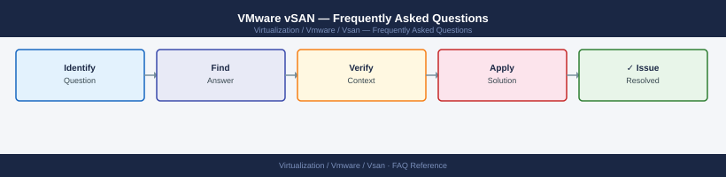

---
tags:
  - vsan
  - faq
  - operations
---
# VMware vSAN — Frequently Asked Questions

Common questions about VMware vSAN operations, configuration, and troubleshooting. For step-by-step procedures, see the <a href="index.md">Operations</a> section.

## General

**Q: What vSAN version is recommended?**
A: vSAN ships with vSphere — use the version matching your vCenter/ESXi 8.0 Update 3 deployment. Check: vCenter → Cluster → Configure → vSAN → General → vSAN Version.

**Q: How do I check the current VMware vSAN version?**
A: `vCenter → Cluster → Configure → vSAN → General → vSAN Version`

## Configuration

**Q: What is the default storage policy and when should it change?**
A: Default is FTT=1 (RAID-1), meaning data is mirrored across 2 hosts. Increase to FTT=2 for mission-critical VMs (tolerates 2 host failures, requires 5+ hosts for RAID-6). Use RAID-5/6 erasure coding for space efficiency over 4+ hosts.

**Q: How do I enable vSAN deduplication and compression?**
A: Cluster → Configure → vSAN → Services → Deduplication and Compression → Enable. All-flash only. Services apply cluster-wide (per disk group). Expect 1.5-2x space savings for typical VDI workloads; variable for databases.

## Operations

**Q: How do I patch vSAN hosts without downtime?**
A: Use vLCM with cluster remediation. vLCM puts one host into maintenance mode at a time (evacuating vSAN components), patches it, reboots, and waits for vSAN resync before moving to the next host. Never patch more than 1 host at a time in a 4-node cluster.

**Q: What is the correct procedure to add a new disk group to a vSAN host?**
A: Ensure the drives are unclaimed. vCenter → Host → Configure → vSAN → Disk Management → Claim Disks. Select the cache and capacity drives. vSAN builds the disk group and rebalances automatically.

## Troubleshooting

**Q: vSAN health shows yellow 'Performance service'. What does it mean?**
A: The vSAN performance service (stats collection) is degraded or disabled. Enable it: Cluster → Monitor → vSAN → Performance → Enable vSAN Performance Service. Yellow is non-critical — storage continues to function normally.

**Q: vSAN storage latency is elevated — where do I start?**
A: Check vSAN performance service: Cluster → Monitor → vSAN → Performance → Backend. Review disk group cache hit ratio. Check for rebalancing activity (`resync` operations). Verify physical disk health with `esxcli vsan storage list`.

## Backup and Recovery

**Q: How often should I back up vSAN configuration?**
A: vSAN configuration is part of the vCenter/cluster config — back up vCenter daily. For vSAN stretched cluster witness VM, back it up separately. Storage policies are in vCenter — they are included in the vCenter backup.

**Q: Can I recover from a disk failure in a vSAN cluster?**
A: vSAN automatically re-replicates data after a disk or host failure, as long as the cluster remains above the FTT threshold. Replace the failed disk. vSAN rebuilds the component on the new disk. Monitor with `esxcli vsan debug object list`.

## See Also

- [VMware vSAN Operations](index.md)
- [VMware vSAN Troubleshooting](../troubleshooting/index.md)
