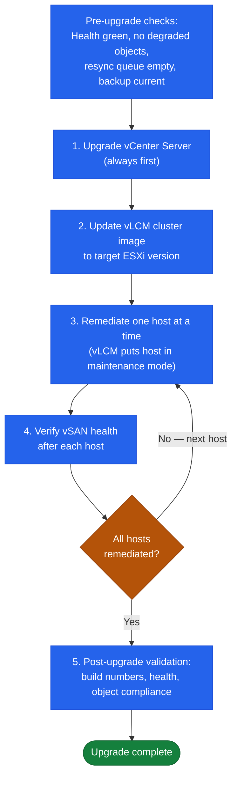

# vSAN — Install & Upgrade

```text
VSAN UPGRADE SEQUENCE (host-by-host rolling)

  Pre-checks
  ├── Health: all green
  ├── No degraded objects
  └── Resync queue empty
         │
         ▼
  Step 1 — Upgrade vCenter Server (always first)
         │
         ▼
  Step 2 — Update vLCM Cluster Image
           (target ESXi build + certified driver versions)
         │
         ▼
  ┌──────────────────────────────────────────────────┐
  │  Per-Host Remediation Loop (one host at a time)  │
  │                                                  │
  │  ESXi-01 → Maintenance Mode (Full Data Mig.)     │
  │          → vLCM upgrades ESXi + drivers          │
  │          → Host exits maintenance mode           │
  │          → Verify vSAN health (must be green)    │
  │          → Verify resync complete (0 bytes)       │
  │                                                  │
  │  ESXi-02 → same sequence                         │
  │  ESXi-03 → same sequence                         │
  │  ... (all hosts)                                 │
  └──────────────────────────────────────────────────┘
         │
         ▼
  Post-upgrade validation
  ├── All hosts on new ESXi build
  ├── vSAN health all green
  ├── Disk format version current
  └── Object compliance 100%
```

## vSAN Version Matrix

vSAN versions are tied to vSphere releases. There is no standalone vSAN upgrade path — upgrading vSAN means upgrading vSphere.

| vSphere Version | vSAN Version | Key Features | General Support EOL |
|---|---|---|---|
| vSphere 6.7 U3 | vSAN 6.7 | All-flash, stretched cluster, encryption | October 2022 |
| vSphere 7.0 U3 | vSAN 7.0 | File Services, HCI Mesh, OSA improvements | April 2025 |
| vSphere 8.0 U1 | vSAN 8.0 (ESA) | Express Storage Architecture, NVMe-only, inline compression | TBA (current) |
| vSphere 8.0 U2+ | vSAN 8.0 U2 | ESA capacity improvements, ESA RAID-5/6 | TBA (current) |

Check the current Broadcom Product Lifecycle page at https://support.broadcom.com for up-to-date EOL dates. Do not operate clusters on end-of-general-support versions.

## Upgrade Procedure

vSAN upgrades are performed through the vSphere Lifecycle Manager (vLCM) cluster image workflow. Never upgrade ESXi hosts manually on a vSAN cluster — always use vLCM to ensure vSAN health is validated at each step.



**Pre-upgrade checks:**

```bash
# Verify cluster health (from any ESXi host in the cluster)
esxcli vsan health cluster list

# Check for degraded objects
esxcli vsan debug object list | grep -i degraded

# Verify resync queue is empty
esxcli vsan debug resync summary
```

All health checks must pass before beginning an upgrade. Resolve any degraded objects or active resyncs before proceeding.

**Upgrade sequence:**

1. Upgrade vCenter Server first (never upgrade ESXi before vCenter on a vSAN cluster).
2. Update vLCM cluster image baseline to the target ESXi version.
3. Remediate one host at a time via vLCM. vLCM will:
   - Place the host in maintenance mode with the "Ensure Accessibility" or "Full Data Migration" option.
   - Validate vSAN health before and after each host.
   - Upgrade ESXi and NVMe/disk controller drivers in a single reboot.
4. Verify vSAN health after each host remediation before proceeding to the next.

**FTT requirement during upgrade:**

vSAN must maintain policy compliance throughout the upgrade. With FTT=1, one host is in maintenance at a time — the cluster needs at least 3 remaining healthy hosts. With FTT=2, at least 5 hosts must remain healthy while one is in maintenance.

If the cluster does not have sufficient hosts to maintain FTT during the upgrade, either:
- Temporarily change the storage policy to a lower FTT (accept reduced protection).
- Add hosts before upgrading.

**Post-upgrade validation:**

```bash
# Verify all hosts on new build
esxcli system version get

# Verify vSAN health
esxcli vsan health cluster list

# Check object compliance
esxcli vsan debug object list | grep -i noncompliant
```

## ESA Migration

The Express Storage Architecture (ESA) introduced in vSAN 8.0 is not an in-place upgrade from OSA. Migration requires a new cluster build.

**Migration options:**

1. **Build a new ESA cluster** in the same vCenter and Storage vMotion VMs from the OSA cluster to the ESA cluster. This is the recommended approach for minimal downtime.
2. **Site-level failover** (for stretched clusters): fail over to one site, rebuild the other as ESA, then fail back and rebuild the original site.
3. **Backup and restore** via Veeam or another backup tool: restore VMs to the new ESA cluster.

ESA requires:
- vSphere 8.0 or later.
- NVMe devices on the ESA-specific HCL (different from OSA HCL).
- Minimum 4 hosts.
- All hosts in the cluster must use ESA; mixed OSA/ESA is not supported.

## Driver and Firmware

vSAN is highly sensitive to disk controller driver versions. Use only hardware on the VMware HCL and only the driver versions certified for the specific controller and vSAN version.

```bash
# Check disk controller driver version
esxcli software vib list | grep -i <controller-name>

# Check device/firmware info
esxcli storage core device list
```

**vLCM with hardware support manager:** If the server vendor (Dell, HPE, Lenovo) provides a vSphere Lifecycle Manager Hardware Support Manager plugin, use it to manage firmware and driver updates alongside ESXi updates in a single vLCM image. This ensures certified driver/firmware combinations are applied together.

**Key rule:** Never apply an ESXi patch without also verifying that the disk controller driver version in the vLCM image is HCL-certified for vSAN. Mismatched drivers are a leading cause of disk group failures post-upgrade.
