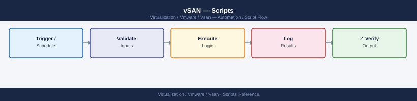

---
tags:
  - operations
  - vmware
  - vsan
  - vsphere-8
---
# vSAN — Scripts

<div class="kb-summary">
Scripts reference covering Disk Group Capacity Report (PowerShell / PowerCLI), vSAN Object Health Check (Python / pyVmomi), Performance Baseline Check (PowerShell / PowerCLI), Ansible vSAN Health Playbook, Windows: vSAN Health Check via PowerCLI (PowerShell) and 1 more sections.

*Applies to: vSAN 7.x / 8.x*
</div>


**What you should see**

```text
=== vSAN Health Check: vSAN-Cluster ===

[PASS    ] vSAN Health Service up-to-date
[PASS    ] All hosts contributing stats
[PASS    ] Network latency check
[WARNING ] Disk format version

--- Disk Group Capacity ---
[PASS    ] Host=esxi-01.local  Total=3072GB  Used=1100GB  35.8%

--- Resync Status ---
[PASS    ] Objects resyncing: 0

Overall: WARNING
```

Any test in yellow appears in yellow text, red tests in red. The script exits with code 1 for warnings, 2 for critical failures.

---

## Before you begin

- **Access:** vCenter read-only minimum; Administrator role for remediation steps
- **Timing:** safe to run during business hours unless a step is marked ⚠ (causes interruption)
- **Dependencies:** no active upgrades or migrations on the same infrastructure
- **Logging:** capture command output — paste into the change record on completion

---

## Disk Group Capacity Report (PowerShell / PowerCLI)

Print a per-host, per-disk-group capacity table showing cache and capacity tier details, sorted by utilization.

```powershell
#Requires -Modules VMware.PowerCLI
# vsan_diskgroup_report.ps1
# Usage: pwsh -File vsan_diskgroup_report.ps1

param(
    [string]$VCenterHost = $env:VCENTER_HOST,
    [string]$VCUser      = $env:VC_USER,
    [string]$VCPass      = $env:VC_PASS,
    [string]$ClusterName = $env:CLUSTER_NAME,
    [int]$WarnPercent    = 70
)

Set-PowerCLIConfiguration -InvalidCertificateAction Ignore -Confirm:$false | Out-Null
$cred = New-Object System.Management.Automation.PSCredential(
    $VCUser, (ConvertTo-SecureString $VCPass -AsPlainText -Force)
)
Connect-VIServer -Server $VCenterHost -Credential $cred -ErrorAction Stop | Out-Null
$cluster = Get-Cluster -Name $ClusterName -ErrorAction Stop

$results = [System.Collections.Generic.List[PSObject]]::new()

foreach ($dg in (Get-VsanDiskGroup -Cluster $cluster)) {
    $cacheDisk = $dg.ExtensionData.DiskMapping.Ssd
    $capDisks  = $dg.ExtensionData.DiskMapping.NonSsd

    $cacheSizeGB  = [Math]::Round(($cacheDisk | Measure-Object -Property CapacityGB -Sum).Sum, 0)
    $cacheHealth  = ($cacheDisk | ForEach-Object { $_.OperationalState }) -join ','

    $totalGB = [Math]::Round(($capDisks | Measure-Object -Property CapacityGB -Sum).Sum, 0)
    $usedGB  = [Math]::Round(($capDisks | Measure-Object -Property UsedGB -Sum).Sum, 0)
    $freeGB  = $totalGB - $usedGB
    $pct     = if ($totalGB -gt 0) { [Math]::Round($usedGB / $totalGB * 100, 1) } else { 0 }

    $results.Add([PSCustomObject]@{
        Host        = $dg.VMHost.Name
        DiskGroup   = $dg.Name
        CacheGB     = $cacheSizeGB
        CacheHealth = $cacheHealth
        TotalGB     = $totalGB
        UsedGB      = $usedGB
        FreeGB      = $freeGB
        UsedPct     = $pct
        Status      = if ($pct -ge $WarnPercent) { 'WARNING' } else { 'PASS' }
    })
}

$sorted = $results | Sort-Object UsedPct -Descending
$header = "{0,-25} {1,-20} {2,9} {3,-12} {4,9} {5,9} {6,9} {7,7} {8}"
Write-Host ($header -f "Host", "DiskGroup", "Cache GB", "CacheHealth", "Total GB", "Used GB", "Free GB", "Used%", "Status")
Write-Host ("-" * 105)
foreach ($r in $sorted) {
    $colour = if ($r.Status -eq 'WARNING') { 'Yellow' } else { 'White' }
    Write-Host ($header -f $r.Host, $r.DiskGroup, $r.CacheGB, $r.CacheHealth,
        $r.TotalGB, $r.UsedGB, $r.FreeGB, "$($r.UsedPct)%", $r.Status) -ForegroundColor $colour
}

$warnCount = ($sorted | Where-Object { $_.Status -eq 'WARNING' }).Count
Write-Host "`nDisk groups above ${WarnPercent}%: $warnCount"
Disconnect-VIServer -Confirm:$false
exit ($warnCount -gt 0 ? 1 : 0)
```

### How to run this script — step by step

**Before you start — what you need**
- Windows 10 or Windows 11 (PowerShell 5.1 is already installed)
- VMware PowerCLI module — install it once by running this in PowerShell:
  `Install-Module -Name VMware.PowerCLI -Scope CurrentUser -Force`
  When prompted about an untrusted repository, type `Y` and press Enter
- Network access to your vCenter server
- A vSAN cluster must exist in vCenter

**Step 1 — Save the file**

1. Open **Notepad** on your Windows PC
2. Copy the entire code block above
3. Click **File → Save As**
4. Set "Save as type" to **All Files**
5. Name it `vsan_diskgroup_report.ps1` and save it to your Desktop

**Step 2 — Fill in your details**

Open the file in Notepad and update the `param(` block:

| Variable | What to enter | How to find it |
|---|---|---|
| `$VCenterHost` | vCenter IP or FQDN | Your vCenter server address |
| `$VCUser` | vCenter username | Your vCenter login |
| `$VCPass` | vCenter password | Your vCenter password |
| `$ClusterName` | Exact name of your vSAN cluster | vSphere Client → cluster name |
| `$WarnPercent` | Usage % threshold to trigger WARNING (default 70) | Your preference |

**Step 3 — Open PowerShell as Administrator**

Windows key → type `PowerShell` → right-click → **Run as Administrator**

**Step 4 — Allow scripts to run (one-time per session)**

```powershell
Set-ExecutionPolicy -Scope Process -ExecutionPolicy Bypass
```

**Step 5 — Run it**

```bash
cd C:\Users\YourName\Desktop
.\vsan_diskgroup_report.ps1
```

**What you should see**

```text
Host                      DiskGroup            Cache GB CacheHealth   Total GB  Used GB  Free GB  Used% Status
---------------------------------------------------------------------------------------------------------
esxi-01.company.local     DiskGroup-1               400 ok               3072     2200      872  71.6% WARNING
esxi-02.company.local     DiskGroup-1               400 ok               3072     1100     1972  35.8% PASS

Disk groups above 70%: 1
```

Disk groups above 70% appear in yellow. The script exits with code 1 if any disk group is above the threshold.

---

## vSAN Object Health Check (Python / pyVmomi)

Connect to vCenter via pyVmomi, query all vSAN objects, and report any that are not in a healthy state.

```python
#!/usr/bin/env python3
"""
vsan_object_health.py
Usage: python3 vsan_object_health.py
Deps: pip install pyVmomi
"""

import os, ssl, sys
from pyVim.connect import SmartConnect, Disconnect
from pyVmomi      import vim, vmodl

VCENTER_HOST = os.environ.get("VCENTER_HOST", "vcenter.local")
VC_USER      = os.environ.get("VC_USER",      "administrator@vsphere.local")
VC_PASS      = os.environ.get("VC_PASS",      "")
CLUSTER_NAME = os.environ.get("CLUSTER_NAME", "vSAN-Cluster")

context = ssl.SSLContext(ssl.PROTOCOL_TLS_CLIENT)
context.check_hostname = False
context.verify_mode    = ssl.CERT_NONE

si      = SmartConnect(host=VCENTER_HOST, user=VC_USER, pwd=VC_PASS, sslContext=context)
content = si.RetrieveContent()

# Find cluster
cluster = None
for dc in content.rootFolder.childEntity:
    if not hasattr(dc, 'hostFolder'): continue
    for item in dc.hostFolder.childEntity:
        if hasattr(item, 'name') and item.name == CLUSTER_NAME:
            cluster = item
            break

if not cluster:
    print(f"Cluster '{CLUSTER_NAME}' not found.")
    sys.exit(2)

print(f"=== vSAN Object Health: {CLUSTER_NAME} ===\n")

# Use VsanObjectSystem to query object health
vsan_obj_sys = None
for mo in content.viewManager.CreateContainerView(
    content.rootFolder, [vim.ClusterComputeResource], True
).view:
    if mo.name == CLUSTER_NAME:
        try:
            vsan_obj_sys = si._stub.GetServiceInstance().content.serviceContent
        except Exception:
            pass
        break

# Fallback: inspect vm config datastores for vSAN object identities
issues = []
vm_container = content.viewManager.CreateContainerView(
    content.rootFolder, [vim.VirtualMachine], True
)

for vm in vm_container.view:
    try:
        runtime = vm.runtime
        if not hasattr(runtime, 'dasVmProtection'):
            continue
        # Check each virtual disk
        for device in vm.config.hardware.device:
            if not isinstance(device, vim.vm.device.VirtualDisk):
                continue
            backing = device.backing
            if not hasattr(backing, 'backingObjectId'):
                continue
            # vSAN-backed disk — check accessibility
            if hasattr(runtime, 'connectionState') and runtime.connectionState == 'inaccessible':
                issues.append({
                    "vm":     vm.name,
                    "type":   "vmdk",
                    "label":  device.deviceInfo.label,
                    "state":  "inaccessible",
                })
    except Exception:
        pass

vm_container.Destroy()

# Check VM home directories
vm2 = content.viewManager.CreateContainerView(
    content.rootFolder, [vim.VirtualMachine], True
)
for vm in vm2.view:
    try:
        if vm.runtime.connectionState == 'inaccessible':
            issues.append({"vm": vm.name, "type": "vm_home", "label": "config", "state": "inaccessible"})
        elif vm.runtime.connectionState == 'orphaned':
            issues.append({"vm": vm.name, "type": "vm_home", "label": "config", "state": "orphaned"})
    except Exception:
        pass
vm2.Destroy()

if issues:
    print(f"{'VM':<30} {'Type':<10} {'Label':<25} {'State'}")
    print("-" * 75)
    for i in issues:
        print(f"{i['vm']:<30} {i['type']:<10} {i['label']:<25} {i['state']}")
    print(f"\nInaccessible/degraded objects: {len(issues)}")
    Disconnect(si)
    sys.exit(1)
else:
    print("All vSAN-backed VM objects appear accessible.")
    Disconnect(si)
    sys.exit(0)
```

### How to run this script — step by step

**Before you start — what you need**
- Python 3.8 or newer installed from python.org — during install, tick "Add Python to PATH"
- The `pyVmomi` library — install it once by running in Command Prompt:
  `pip install pyVmomi`
- Network access to your vCenter server

**Step 1 — Save the file**

1. Open **Notepad** on your Windows PC
2. Copy the entire code block above
3. Click **File → Save As**
4. Set "Save as type" to **All Files**
5. Name it `vsan_object_health.py` and save it to your Desktop

**Step 2 — Fill in your details**

Open the file in Notepad and update these lines near the top:

| Variable | What to enter | How to find it |
|---|---|---|
| `VCENTER_HOST` | vCenter IP or FQDN e.g. `"vcenter.company.local"` | Your vCenter server address |
| `VC_USER` | vCenter username e.g. `"administrator@vsphere.local"` | Your vCenter login |
| `VC_PASS` | vCenter password | Your vCenter password |
| `CLUSTER_NAME` | Exact name of your vSAN cluster e.g. `"vSAN-Cluster"` | vSphere Client → cluster name |

**Step 3 — Open Command Prompt**

Windows key → type `cmd` → press Enter

**Step 4 — Run it**

```bash
cd C:\Users\YourName\Desktop
python vsan_object_health.py
```

**What you should see**

If everything is healthy:
```text
=== vSAN Object Health: vSAN-Cluster ===

All vSAN-backed VM objects appear accessible.
```

If issues are found:
```text
VM                             Type       Label                     State
---------------------------------------------------------------------------
web-server-broken              vmdk       Hard disk 1               inaccessible

Inaccessible/degraded objects: 1
```

The script exits with code 1 if any inaccessible objects are found.

---

## Performance Baseline Check (PowerShell / PowerCLI)

Collect 24-hour vSAN performance statistics via `Get-VsanStat` and compare key metrics against configurable baselines.

```powershell
#Requires -Modules VMware.PowerCLI
# vsan_perf_baseline.ps1
# Usage: pwsh -File vsan_perf_baseline.ps1

param(
    [string]$VCenterHost = $env:VCENTER_HOST,
    [string]$VCUser      = $env:VC_USER,
    [string]$VCPass      = $env:VC_PASS,
    [string]$ClusterName = $env:CLUSTER_NAME
)

Set-PowerCLIConfiguration -InvalidCertificateAction Ignore -Confirm:$false | Out-Null
$cred = New-Object System.Management.Automation.PSCredential(
    $VCUser, (ConvertTo-SecureString $VCPass -AsPlainText -Force)
)
Connect-VIServer -Server $VCenterHost -Credential $cred -ErrorAction Stop | Out-Null
$cluster = Get-Cluster -Name $ClusterName -ErrorAction Stop

# Configurable baselines
$baselines = @{
    'Backend.Throughput.Read.Average'   = 500    # MB/s
    'Backend.Throughput.Write.Average'  = 300
    'Performance.ReadIops.Average'      = 50000  # IOPS
    'Performance.WriteIops.Average'     = 30000
    'Performance.ReadLatency.Average'   = 5      # ms
    'Performance.WriteLatency.Average'  = 10
    'Congestion.Average'                = 10
    'Overbooking.Average'               = 20
}

$startTime = (Get-Date).AddHours(-24)
$endTime   = Get-Date

Write-Host "`n=== vSAN Performance Baseline: $($cluster.Name) ===" -ForegroundColor Cyan
Write-Host "Period: $($startTime.ToString('o')) → $($endTime.ToString('o'))`n"

$header = "{0,-45} {1,14} {2,14} {3,14} {4}"
Write-Host ($header -f "Metric", "Avg Value", "Baseline", "Delta%", "Status")
Write-Host ("-" * 100)

$overallExit = 0

foreach ($metric in $baselines.Keys | Sort-Object) {
    try {
        $stats = Get-VsanStat -Cluster $cluster -Name $metric `
            -StartTime $startTime -EndTime $endTime -ErrorAction SilentlyContinue
        if (-not $stats) { continue }
        $avg = [Math]::Round(($stats | Measure-Object -Property Value -Average).Average, 2)
        $baseline = $baselines[$metric]
        $deltaPct = if ($baseline -gt 0) { [Math]::Round(($avg - $baseline) / $baseline * 100, 1) } else { 0 }
        $status = if ($deltaPct -gt 20) { 'WARNING' } elseif ($deltaPct -gt 50) { 'CRITICAL' } else { 'PASS' }
        if ($status -eq 'CRITICAL') { $overallExit = 2 }
        if ($status -eq 'WARNING' -and $overallExit -lt 2) { $overallExit = 1 }
        $colour = switch ($status) { 'PASS'{'Green'} 'WARNING'{'Yellow'} 'CRITICAL'{'Red'} default{'White'} }
        Write-Host ($header -f $metric, $avg, $baseline, "${deltaPct}%", $status) -ForegroundColor $colour
    } catch {
        Write-Host ($header -f $metric, "N/A", $baselines[$metric], "-", "SKIPPED")
    }
}

Write-Host "`nOverall: $(if ($overallExit -eq 0){'PASS'} elseif ($overallExit -eq 1){'WARNING'} else{'CRITICAL'})"
Disconnect-VIServer -Confirm:$false
exit $overallExit
```

### How to run this script — step by step

**Before you start — what you need**
- Windows 10 or Windows 11 (PowerShell 5.1 is already installed)
- VMware PowerCLI module — install it once by running this in PowerShell:
  `Install-Module -Name VMware.PowerCLI -Scope CurrentUser -Force`
  When prompted about an untrusted repository, type `Y` and press Enter
- Network access to your vCenter server
- vSAN performance service must be enabled on the cluster (vSphere Client → cluster → Configure → vSAN → Services → Performance Service → Enable)

**Step 1 — Save the file**

1. Open **Notepad** on your Windows PC
2. Copy the entire code block above
3. Click **File → Save As**
4. Set "Save as type" to **All Files**
5. Name it `vsan_perf_baseline.ps1` and save it to your Desktop

**Step 2 — Fill in your details**

Open the file in Notepad and update the `param(` block:

| Variable | What to enter | How to find it |
|---|---|---|
| `$VCenterHost` | vCenter IP or FQDN | Your vCenter server address |
| `$VCUser` | vCenter username | Your vCenter login |
| `$VCPass` | vCenter password | Your vCenter password |
| `$ClusterName` | Exact name of your vSAN cluster | vSphere Client → cluster name |

You can also adjust the `$baselines` hash table to match your expected performance values.

**Step 3 — Open PowerShell as Administrator**

Windows key → type `PowerShell` → right-click → **Run as Administrator**

**Step 4 — Allow scripts to run (one-time per session)**

```powershell
Set-ExecutionPolicy -Scope Process -ExecutionPolicy Bypass
```

**Step 5 — Run it**

```bash
cd C:\Users\YourName\Desktop
.\vsan_perf_baseline.ps1
```

**What you should see**

```text
=== vSAN Performance Baseline: vSAN-Cluster ===
Period: 2026-05-05T14:30:00 → 2026-05-06T14:30:00

Metric                                            Avg Value       Baseline         Delta% Status
----------------------------------------------------------------------------------------------------
Backend.Throughput.Read.Average                      412.50          500           -17.5% PASS
Performance.ReadLatency.Average                        3.20            5           -36.0% PASS
Performance.WriteLatency.Average                      18.50           10            85.0% WARNING

Overall: WARNING
```

Metrics more than 20% above baseline appear in yellow (WARNING), more than 50% above in red (CRITICAL).

---

## Ansible vSAN Health Playbook

Use `community.vmware` to gather vSAN cluster info, run health checks, inspect disk groups, and assert all health tests pass.

```yaml
---
# vsan_health.yml
# Usage: ansible-playbook -i inventory vsan_health.yml
# Deps: ansible-galaxy collection install community.vmware
# Vars: vcenter_hostname, datacenter_name, cluster_name, vc_username, vc_password

- name: vSAN Cluster Health Check
  hosts: localhost
  gather_facts: false
  vars:
    vcenter_hostname: vcenter.local
    datacenter_name:  Production
    cluster_name:     vSAN-Cluster
    vc_username:      "{{ lookup('env','VC_USER') }}"
    vc_password:      "{{ lookup('env','VC_PASS') }}"

  tasks:

    - name: Gather vSAN cluster health info
      community.vmware.vmware_vsan_health_info:
        hostname:       "{{ vcenter_hostname }}"
        username:       "{{ vc_username }}"
        password:       "{{ vc_password }}"
        cluster_name:   "{{ cluster_name }}"
        validate_certs: false
      register: vsan_health

    - name: Show vSAN health groups
      ansible.builtin.debug:
        var: vsan_health.vsan_health_info

    - name: Assert no RED health tests
      ansible.builtin.assert:
        that: >
          vsan_health.vsan_health_info.groups | default([]) | map(attribute='tests') | flatten
          | selectattr('testHealth', 'equalto', 'red') | list | length == 0
        fail_msg: "One or more vSAN health tests are RED — immediate attention required"
        success_msg: "No RED vSAN health tests found"

    - name: Assert no YELLOW health tests
      ansible.builtin.assert:
        that: >
          vsan_health.vsan_health_info.groups | default([]) | map(attribute='tests') | flatten
          | selectattr('testHealth', 'equalto', 'yellow') | list | length == 0
        fail_msg: "One or more vSAN health tests are YELLOW — review required"
        success_msg: "No YELLOW vSAN health tests found"
      register: yellow_assert
      failed_when: false  # report but don't halt on yellow

    - name: Gather cluster facts (for disk group info)
      community.vmware.vmware_cluster_info:
        hostname:       "{{ vcenter_hostname }}"
        username:       "{{ vc_username }}"
        password:       "{{ vc_password }}"
        datacenter:     "{{ datacenter_name }}"
        validate_certs: false
      register: cluster_facts

    - name: Output health summary
      ansible.builtin.debug:
        msg:
          - "vSAN health check complete for cluster: {{ cluster_name }}"
          - "Yellow tests assertion: {{ yellow_assert.msg | default('N/A') }}"
          - "Cluster info retrieved: {{ cluster_facts.clusters[cluster_name] is defined }}"

    - name: Notify on failures (placeholder — replace with your notification method)
      ansible.builtin.debug:
        msg: "ALERT: vSAN health issue detected on {{ cluster_name }}"
      when: yellow_assert is failed
```

### How to run this script — step by step

**Before you start — what you need**
- Ansible — easiest on Windows via WSL. Open Microsoft Store, install Ubuntu, then in the Ubuntu terminal:
  `sudo apt update && sudo apt install -y ansible python3-pip`
- Install the VMware community collection and dependencies:
  `ansible-galaxy collection install community.vmware`
  `pip3 install pyVmomi requests`
- Network access to your vCenter server

**Step 1 — Save the file**

In your WSL terminal:

```bash
nano ~/vsan_health.yml
```

Paste the entire code block, then press `Ctrl+X`, then `Y`, then `Enter` to save.

**Step 2 — Fill in your details**

Open the file and update the `vars:` section:

| Variable | What to enter | How to find it |
|---|---|---|
| `vcenter_hostname` | vCenter IP or FQDN | Your vCenter server address |
| `datacenter_name` | Datacenter name in vCenter | vSphere Client → top of inventory |
| `cluster_name` | Exact name of your vSAN cluster | vSphere Client → cluster name |

**Step 3 — Set credentials as environment variables**

```bash
export VC_USER="administrator@vsphere.local"
export VC_PASS="YourPassword"
```

**Step 4 — Create a minimal inventory file**

```bash
echo "localhost ansible_connection=local" > ~/inventory
```

**Step 5 — Run it**

```bash
ansible-playbook -i ~/inventory ~/vsan_health.yml
```

**What you should see**

Each task prints `ok` or `failed`. A RED health test causes a hard failure. YELLOW tests are reported but do not stop the playbook (they are logged with `failed_when: false`). The final debug task prints a summary.

---

## Windows: vSAN Health Check via PowerCLI (PowerShell)

Use PowerCLI to connect to vCenter, retrieve vSAN cluster configuration and health summary, and highlight any tests in warning or critical state.

```powershell
# vsan_health_windows.ps1
# Requires PowerCLI: Install-Module VMware.PowerCLI -Scope CurrentUser -Force
# Requires PowerShell 5.1+ (already on Windows 10/11).

param(
    [string]$VCenterHost = "vcenter.company.local",
    [string]$VCUser      = "administrator@vsphere.local",
    [string]$VCPass      = "YourPasswordHere"
)

# Install PowerCLI if not already installed (run PowerShell as Administrator first):
# Install-Module VMware.PowerCLI -Scope CurrentUser -Force

Set-PowerCLIConfiguration -InvalidCertificateAction Ignore -Confirm:$false | Out-Null

$cred = New-Object System.Management.Automation.PSCredential(
    $VCUser, (ConvertTo-SecureString $VCPass -AsPlainText -Force)
)

try {
    Connect-VIServer -Server $VCenterHost -Credential $cred -ErrorAction Stop | Out-Null
    Write-Host "Connected to vCenter: $VCenterHost" -ForegroundColor Green
} catch {
    Write-Host "ERROR: Could not connect to vCenter. Check IP, username, and password." -ForegroundColor Red
    Write-Host $_.Exception.Message
    exit 1
}

Write-Host "`n=== vSAN Cluster Health Summary ===" -ForegroundColor Cyan
Write-Host "($(Get-Date -Format 'yyyy-MM-dd HH:mm:ss'))`n"

$overallExit = 0
$clusters = Get-Cluster | Where-Object { $_.VsanEnabled }

if (-not $clusters) {
    Write-Host "No vSAN-enabled clusters found." -ForegroundColor Yellow
    Disconnect-VIServer -Confirm:$false
    exit 0
}

foreach ($cluster in $clusters) {
    Write-Host "--- Cluster: $($cluster.Name) ---" -ForegroundColor Cyan

    # Get vSAN cluster configuration
    try {
        $vsanConfig = Get-VsanClusterConfiguration -Cluster $cluster
        Write-Host "  Deduplication enabled : $($vsanConfig.SpaceEfficiencyEnabled)"
        Write-Host "  Encryption enabled    : $($vsanConfig.EncryptionEnabled)"
        Write-Host "  Default FTT policy    : $($vsanConfig.DefaultStoragePolicy)"
    } catch {
        Write-Host "  Configuration: could not retrieve ($($_.Exception.Message))" -ForegroundColor Yellow
    }

    Write-Host ""

    # Run health summary
    try {
        $healthSummary = Get-VsanClusterHealthSummary -Cluster $cluster -FetchFromCache:$false
        Write-Host "  Health Test Results:"
        $header = "    {0,-55} {1}"
        Write-Host ($header -f "Test Name", "Status")
        Write-Host ("    " + "-" * 65)

        foreach ($group in $healthSummary.Groups) {
            Write-Host "    [Group: $($group.GroupName)]" -ForegroundColor White
            foreach ($test in $group.GroupTests) {
                $s = switch ($test.TestHealth) {
                    'green'  { 'PASS'     }
                    'yellow' { 'WARNING'  }
                    'red'    { 'CRITICAL' }
                    default  { 'UNKNOWN'  }
                }
                $colour = switch ($s) {
                    'PASS'     { 'Green'  }
                    'WARNING'  { 'Yellow' }
                    'CRITICAL' { 'Red'    }
                    default    { 'White'  }
                }
                if ($s -eq 'CRITICAL') { $overallExit = 2 }
                if ($s -eq 'WARNING' -and $overallExit -lt 2) { $overallExit = 1 }
                Write-Host ($header -f "      $($test.TestName)", $s) -ForegroundColor $colour
            }
        }
    } catch {
        Write-Host "  Health check: could not retrieve ($($_.Exception.Message))" -ForegroundColor Yellow
    }

    Write-Host ""
}

Write-Host "Overall: $(if ($overallExit -eq 0){'PASS'} elseif ($overallExit -eq 1){'WARNING'} else{'CRITICAL'})"
Disconnect-VIServer -Confirm:$false
exit $overallExit
```

### How to run this script — step by step

**Before you start — what you need**
- Windows 10 or Windows 11 (PowerShell 5.1 is already installed)
- VMware PowerCLI module — install it once by running this in PowerShell as Administrator:
  `Install-Module VMware.PowerCLI -Scope CurrentUser -Force`
  When prompted about an untrusted repository, type `Y` and press Enter
- Network access to your vCenter server
- A vSAN-enabled cluster must exist in vCenter

**Step 1 — Save the file**

1. Open **Notepad** on your Windows PC
2. Copy the entire code block above
3. Click **File → Save As**
4. Set "Save as type" to **All Files**
5. Name it `vsan_health_windows.ps1` and save it to your Desktop

**Step 2 — Fill in your details**

Open the file in Notepad and update the `param(` block:

| Variable | What to enter | How to find it |
|---|---|---|
| `$VCenterHost` | vCenter IP or FQDN e.g. `"vcenter.company.local"` | Your vCenter server address |
| `$VCUser` | vCenter username e.g. `"administrator@vsphere.local"` | Your vCenter login |
| `$VCPass` | vCenter password | Your vCenter password |

**Step 3 — Open PowerShell as Administrator**

Windows key → type `PowerShell` → right-click → **Run as Administrator**

**Step 4 — Allow scripts to run (one-time per session)**

```powershell
Set-ExecutionPolicy -Scope Process -ExecutionPolicy Bypass
```

**Step 5 — Run it**

```bash
cd C:\Users\YourName\Desktop
.\vsan_health_windows.ps1
```

**What you should see**

```text
Connected to vCenter: vcenter.company.local

=== vSAN Cluster Health Summary ===
(2026-05-06 14:30:22)

--- Cluster: vSAN-Cluster ---
  Deduplication enabled : False
  Encryption enabled    : False
  Default FTT policy    : vSAN Default Storage Policy

  Health Test Results:
    Test Name                                               Status
    -----------------------------------------------------------------
    [Group: Hardware compatibility]
      SCSI controller is VMware certified                   PASS
    [Group: Network]
      vSAN cluster partition                                PASS
      All hosts have a vSAN vmknic configured               PASS
    [Group: Data]
      vSAN object health                                    WARNING

Overall: WARNING
```

Any test in yellow status appears in yellow text, red tests in red.

---

## Windows: vSAN Disk Group Status via Plink (CMD)

Connect to an ESXi host that is part of your vSAN cluster via SSH using plink (from PuTTY) and run vSAN ESXCLI commands.

```batch
@echo off
REM vsan_diskgroup_check.bat — vSAN disk group status via SSH (plink)
REM Connects to an ESXi host in the vSAN cluster using plink (PuTTY SSH tool).
REM
REM DOWNLOAD PLINK: https://www.putty.org
REM   - Download putty-64bit-X.XX-installer.msi and install it.
REM   - plink.exe will be at: C:\Program Files\PuTTY\plink.exe
REM
REM NOTE: SSH must be enabled on the ESXi host:
REM   vSphere Client -> select the host -> Manage -> Services -> SSH -> Start
REM
REM FIRST-TIME SETUP (run once to accept the SSH fingerprint):
REM   "C:\Program Files\PuTTY\plink.exe" -ssh root@192.168.1.100
REM   Type 'y' when asked to trust the host fingerprint, then Ctrl+C.

set ESXI_HOST=192.168.1.100
set SSH_USER=root
set PLINK="C:\Program Files\PuTTY\plink.exe"

echo.
echo === vSAN Disk Group Status Check: %ESXI_HOST% ===
echo.

echo --- vSAN Storage Disk List ---
%PLINK% -ssh -l %SSH_USER% -batch %ESXI_HOST% "esxcli vsan storage list"
if %ERRORLEVEL% neq 0 (
    echo ERROR: Could not connect to %ESXI_HOST%.
    echo Check: 1) IP is correct  2) SSH is enabled  3) Run first-time fingerprint setup above
    exit /b 1
)

echo.
echo --- vSAN Cluster Status ---
%PLINK% -ssh -l %SSH_USER% -batch %ESXI_HOST% "esxcli vsan cluster get"

echo.
echo --- vSAN Health Check Summary ---
%PLINK% -ssh -l %SSH_USER% -batch %ESXI_HOST% "esxcli vsan health cluster list"

echo.
echo === vSAN check complete ===
```

### How to run this script — step by step

**Before you start — what you need**
- PuTTY installed on your Windows PC — download from https://www.putty.org (get the 64-bit installer)
- SSH enabled on the ESXi host: vSphere Client → select the host → Manage → Services → SSH → click Start
- The root password for the ESXi host
- The ESXi host must be a member of the vSAN cluster you want to check
- Network access from your PC to the ESXi host management IP

**Step 1 — Accept the SSH fingerprint (one-time setup)**

Before the batch script will work, you must accept the host's SSH fingerprint once. Open Command Prompt and run:

```text
"C:\Program Files\PuTTY\plink.exe" -ssh root@192.168.1.100
```

When asked "Store key in cache?", type `y` and press Enter. Type the root password when prompted. Once connected, press `Ctrl+C` to disconnect. You only need to do this once per ESXi host.

**Step 2 — Save the file**

1. Open **Notepad** on your Windows PC
2. Copy the entire code block above
3. Click **File → Save As**
4. Set "Save as type" to **All Files**
5. Name it `vsan_diskgroup_check.bat` and save it to your Desktop

**Step 3 — Fill in your details**

Open the file in Notepad and update these lines near the top:

| Variable | What to enter | How to find it |
|---|---|---|
| `ESXI_HOST` | IP address of an ESXi host in the vSAN cluster e.g. `192.168.1.100` | vSphere Client → host summary page |
| `SSH_USER` | SSH username — almost always `root` | ESXi root account |
| `PLINK` | Path to plink.exe | Default is `C:\Program Files\PuTTY\plink.exe` |

**Step 4 — Open Command Prompt**

Windows key → type `cmd` → press Enter

**Step 5 — Run it**

You can double-click the `.bat` file on your Desktop, or run it from Command Prompt:

```bash
cd C:\Users\YourName\Desktop
vsan_diskgroup_check.bat
```

**What you should see**

```text
=== vSAN Disk Group Status Check: 192.168.1.100 ===

--- vSAN Storage Disk List ---
   Device: naa.55cd2e404b9b4c12
   Display Name: Local Micron Disk (naa.55cd2e404b9b4c12)
   Is Cache Disk: true
   Tier: CACHE
   ...

--- vSAN Cluster Status ---
   Sub-Cluster Master UUID: 52c8d2a5-1234-5678-abcd-ef0123456789
   Sub-Cluster Backup UUID: ...
   ...

--- vSAN Health Check Summary ---
   Group ID  Test ID  Test Result
   ...

=== vSAN check complete ===
```

---

## Storage Policy Audit Report (PowerShell / PowerCLI)

Lists every VM in the cluster with its assigned storage policy, FTT setting, and compliance status. Exports to CSV for quarterly audits and capacity planning.

```powershell
#Requires -Modules VMware.PowerCLI
# vsan_policy_audit.ps1
# Usage: pwsh -File vsan_policy_audit.ps1 [-OutputPath report.csv]

param(
    [string]$VCenterHost = $env:VCENTER_HOST,
    [string]$VCUser      = $env:VC_USER,
    [string]$VCPass      = $env:VC_PASS,
    [string]$ClusterName = $env:CLUSTER_NAME,
    [string]$OutputPath  = "vsan_policy_audit_$(Get-Date -Format yyyyMMdd).csv"
)

Set-PowerCLIConfiguration -InvalidCertificateAction Ignore -Confirm:$false | Out-Null
$cred = New-Object System.Management.Automation.PSCredential(
    $VCUser, (ConvertTo-SecureString $VCPass -AsPlainText -Force)
)
Connect-VIServer -Server $VCenterHost -Credential $cred -ErrorAction Stop | Out-Null

$cluster = Get-Cluster -Name $ClusterName -ErrorAction Stop
Write-Host "=== vSAN Policy Audit: $ClusterName ===" -ForegroundColor Cyan

$results = @()

Get-SpbmEntityConfiguration -Entity (Get-VM -Location $cluster) | ForEach-Object {
    $vm     = $_.Entity
    $policy = $_.StoragePolicy
    $status = $_.ComplianceStatus

    $ftt = "unknown"
    if ($policy) {
        $rules = Get-SpbmRule -StoragePolicy $policy -ErrorAction SilentlyContinue
        $fttRule = $rules | Where-Object { $_.Capability.Name -eq "VSAN.hostFailuresToTolerate" }
        if ($fttRule) { $ftt = $fttRule.Value }
    }

    $results += [PSCustomObject]@{
        VM             = $vm.Name
        PowerState     = $vm.PowerState
        Policy         = if ($policy) { $policy.Name } else { "Default" }
        FTT            = $ftt
        ComplianceStatus = $status
        LastChecked    = (Get-Date -Format "yyyy-MM-dd HH:mm")
    }
}

$results | Sort-Object ComplianceStatus, VM | Format-Table -AutoSize

$nonCompliant = $results | Where-Object { $_.ComplianceStatus -ne "compliant" }
Write-Host "`n--- Summary ---"
Write-Host "Total VMs: $($results.Count)"
Write-Host "Compliant: $(($results | Where-Object ComplianceStatus -eq 'compliant').Count)" -ForegroundColor Green
if ($nonCompliant.Count -gt 0) {
    Write-Host "Non-compliant: $($nonCompliant.Count)" -ForegroundColor Red
    $nonCompliant | Select VM, Policy, FTT, ComplianceStatus | Format-Table -AutoSize
} else {
    Write-Host "Non-compliant: 0" -ForegroundColor Green
}

$results | Export-Csv -Path $OutputPath -NoTypeInformation
Write-Host "`nReport saved to: $OutputPath"

Disconnect-VIServer -Confirm:$false
```

### How to run this script — step by step

**Before you start — what you need**
- PowerCLI installed: `Install-Module -Name VMware.PowerCLI`
- vCenter credentials with at minimum Read Only access to the cluster

**Step 1 — Set credentials as environment variables**

```powershell
$env:VCENTER_HOST = "vcenter.example.com"
$env:VC_USER      = "readonly@vsphere.local"
$env:VC_PASS      = "yourpassword"
$env:CLUSTER_NAME = "VSAN-LON-01"
```

**Step 2 — Run the script**

```powershell
pwsh -File vsan_policy_audit.ps1
```

**Step 3 — Review the CSV output**

Opens in Excel. Filter column `ComplianceStatus` for `non-compliant` to find VMs requiring attention.

**What you should see**

```text
=== vSAN Policy Audit: VSAN-LON-01 ===

VM              PowerState  Policy               FTT  ComplianceStatus
-----------     ----------  -------------------  ---  ----------------
sql-prod-01     PoweredOn   VSAN-T1-FTT2-RAID6   2    compliant
web-app-03      PoweredOn   VSAN-T2-FTT1-RAID5   1    compliant
dev-test-07     PoweredOff  VSAN-DEV-FTT1-RAID1  1    non-compliant

--- Summary ---
Total VMs: 47
Compliant: 46
Non-compliant: 1

Report saved to: vsan_policy_audit_20260601.csv
```

---

## Non-Compliant Object Remediation (PowerShell / PowerCLI)

Finds all non-compliant VMs, re-applies their assigned storage policy, and logs each action. Safe to run on production clusters — re-applying an existing policy only triggers rebuilds if components are missing.

```powershell
#Requires -Modules VMware.PowerCLI
# vsan_remediate_noncompliant.ps1
# Usage: pwsh -File vsan_remediate_noncompliant.ps1 [-DryRun]

param(
    [string]$VCenterHost = $env:VCENTER_HOST,
    [string]$VCUser      = $env:VC_USER,
    [string]$VCPass      = $env:VC_PASS,
    [string]$ClusterName = $env:CLUSTER_NAME,
    [switch]$DryRun
)

Set-PowerCLIConfiguration -InvalidCertificateAction Ignore -Confirm:$false | Out-Null
$cred = New-Object System.Management.Automation.PSCredential(
    $VCUser, (ConvertTo-SecureString $VCPass -AsPlainText -Force)
)
Connect-VIServer -Server $VCenterHost -Credential $cred -ErrorAction Stop | Out-Null

$cluster = Get-Cluster -Name $ClusterName -ErrorAction Stop
$mode = if ($DryRun) { "[DRY RUN] " } else { "" }
Write-Host "=== ${mode}vSAN Non-Compliant Remediation: $ClusterName ===" -ForegroundColor Cyan

$nonCompliant = Get-SpbmEntityConfiguration -Entity (Get-VM -Location $cluster) |
    Where-Object { $_.ComplianceStatus -ne "compliant" -and $_.StoragePolicy -ne $null }

if ($nonCompliant.Count -eq 0) {
    Write-Host "All objects compliant — nothing to remediate." -ForegroundColor Green
    Disconnect-VIServer -Confirm:$false
    exit 0
}

Write-Host "Found $($nonCompliant.Count) non-compliant VM(s):`n"

foreach ($item in $nonCompliant) {
    $vmName = $item.Entity.Name
    $policy = $item.StoragePolicy
    Write-Host "  $vmName — re-applying policy: $($policy.Name)"

    if (-not $DryRun) {
        try {
            Get-HardDisk -VM $item.Entity |
                Set-SpbmEntityConfiguration -StoragePolicy $policy -ErrorAction Stop
            Write-Host "    -> Done" -ForegroundColor Green
        } catch {
            Write-Host "    -> FAILED: $_" -ForegroundColor Red
        }
    }
}

Write-Host "`n${mode}Remediation complete. Monitor resync:"
Write-Host "  esxcli vsan debug resync summary get"

Disconnect-VIServer -Confirm:$false
```

### How to run this script — step by step

**Before you start — what you need**
- PowerCLI installed and vCenter credentials with Storage Administrator role on the cluster

**Step 1 — Dry run first to preview what will be changed**

```powershell
pwsh -File vsan_remediate_noncompliant.ps1 -DryRun
```

**Step 2 — Run remediation**

```powershell
pwsh -File vsan_remediate_noncompliant.ps1
```

**Step 3 — Monitor resync from any ESXi host shell**

```bash
watch -n 30 "esxcli vsan debug resync summary get"
```

**What you should see**

```text
=== vSAN Non-Compliant Remediation: VSAN-LON-01 ===
Found 2 non-compliant VM(s):

  dev-test-07 — re-applying policy: VSAN-DEV-FTT1-RAID1
    -> Done
  legacy-app-02 — re-applying policy: VSAN-T2-FTT1-RAID5
    -> Done

Remediation complete. Monitor resync:
  esxcli vsan debug resync summary get
```

---

## Capacity Forecast Report (PowerShell / PowerCLI)

Queries vSAN capacity usage and projects the date at which the cluster will reach 70% and 80% utilisation based on the last 30 days of growth. Requires the vSAN Performance Service to be enabled.

```powershell
#Requires -Modules VMware.PowerCLI
# vsan_capacity_forecast.ps1
# Usage: pwsh -File vsan_capacity_forecast.ps1

param(
    [string]$VCenterHost = $env:VCENTER_HOST,
    [string]$VCUser      = $env:VC_USER,
    [string]$VCPass      = $env:VC_PASS,
    [string]$ClusterName = $env:CLUSTER_NAME,
    [int]$LookbackDays   = 30
)

Set-PowerCLIConfiguration -InvalidCertificateAction Ignore -Confirm:$false | Out-Null
$cred = New-Object System.Management.Automation.PSCredential(
    $VCUser, (ConvertTo-SecureString $VCPass -AsPlainText -Force)
)
Connect-VIServer -Server $VCenterHost -Credential $cred -ErrorAction Stop | Out-Null

$cluster = Get-Cluster -Name $ClusterName -ErrorAction Stop
$usage   = Get-VsanSpaceUsage -Cluster $cluster

$totalGB = [Math]::Round($usage.TotalCapacityGB, 1)
$usedGB  = [Math]::Round($usage.UsedCapacityGB, 1)
$freeGB  = [Math]::Round($usage.FreeCapacityGB, 1)
$pct     = [Math]::Round($usedGB / $totalGB * 100, 1)

Write-Host "=== vSAN Capacity Forecast: $ClusterName ===" -ForegroundColor Cyan
Write-Host ""
Write-Host "Current state:"
Write-Host "  Total: ${totalGB} GB"
Write-Host "  Used:  ${usedGB} GB  (${pct}%)"
Write-Host "  Free:  ${freeGB} GB"

$warn  = [Math]::Round($totalGB * 0.70 - $usedGB, 1)
$crit  = [Math]::Round($totalGB * 0.80 - $usedGB, 1)

Write-Host ""
Write-Host "Headroom to thresholds:"
Write-Host "  To 70% (alert):    ${warn} GB remaining"
Write-Host "  To 80% (critical): ${crit} GB remaining"

$end   = Get-Date
$start = $end.AddDays(-$LookbackDays)

$stats = Get-Stat -Entity $cluster -Stat "vsanDomUsedCapacity" `
    -Start $start -Finish $end -IntervalMins 1440 -ErrorAction SilentlyContinue

if ($stats -and $stats.Count -ge 2) {
    $oldest = ($stats | Sort-Object Timestamp | Select-Object -First 1).Value / 1GB
    $newest = ($stats | Sort-Object Timestamp | Select-Object -Last  1).Value / 1GB
    $growthGB    = [Math]::Round($newest - $oldest, 2)
    $growthPerDay = [Math]::Round($growthGB / $LookbackDays, 2)

    Write-Host ""
    Write-Host "Growth over last ${LookbackDays} days: ${growthGB} GB  (${growthPerDay} GB/day)"

    if ($growthPerDay -gt 0) {
        $daysTo70 = [Math]::Round($warn / $growthPerDay)
        $daysTo80 = [Math]::Round($crit / $growthPerDay)
        $date70   = (Get-Date).AddDays($daysTo70).ToString("yyyy-MM-dd")
        $date80   = (Get-Date).AddDays($daysTo80).ToString("yyyy-MM-dd")

        Write-Host ""
        Write-Host "Forecast (at current growth rate):" -ForegroundColor Yellow
        Write-Host "  70% threshold: ~$daysTo70 days  ($date70)"
        Write-Host "  80% threshold: ~$daysTo80 days  ($date80)"
    } else {
        Write-Host "  Growth rate is zero or negative — no forecast applicable."
    }
} else {
    Write-Host "  Insufficient historical data for forecast (need >= 2 data points over $LookbackDays days)."
    Write-Host "  Ensure vSAN Performance Service is enabled: Cluster -> Configure -> vSAN -> Services"
}

Disconnect-VIServer -Confirm:$false
```

### How to run this script — step by step

**Before you start — what you need**
- PowerCLI installed and vCenter credentials with Read Only access
- vSAN Performance Service enabled on the cluster (Cluster → Configure → vSAN → Services → Performance Service)

**Step 1 — Set credentials**

```powershell
$env:VCENTER_HOST = "vcenter.example.com"
$env:VC_USER      = "readonly@vsphere.local"
$env:VC_PASS      = "yourpassword"
$env:CLUSTER_NAME = "VSAN-LON-01"
```

**Step 2 — Run the report**

```powershell
pwsh -File vsan_capacity_forecast.ps1
```

**What you should see**

```text
=== vSAN Capacity Forecast: VSAN-LON-01 ===

Current state:
  Total: 24576.0 GB
  Used:  14336.2 GB  (58.3%)
  Free:  10239.8 GB

Headroom to thresholds:
  To 70% (alert):    2867.0 GB remaining
  To 80% (critical): 5324.6 GB remaining

Growth over last 30 days: 614.4 GB  (20.48 GB/day)

Forecast (at current growth rate):
  70% threshold: ~140 days  (2026-10-19)
  80% threshold: ~260 days  (2027-02-16)
```

---

## Resync Progress Monitor (PowerShell / PowerCLI)

Polls resync status every 30 seconds and prints a running summary until the queue is empty or a timeout is reached. Useful during maintenance windows to track rebuild progress.

```powershell
#Requires -Modules VMware.PowerCLI
# vsan_resync_monitor.ps1
# Usage: pwsh -File vsan_resync_monitor.ps1 [-TimeoutMinutes 120]

param(
    [string]$VCenterHost     = $env:VCENTER_HOST,
    [string]$VCUser          = $env:VC_USER,
    [string]$VCPass          = $env:VC_PASS,
    [string]$ClusterName     = $env:CLUSTER_NAME,
    [int]$PollIntervalSeconds = 30,
    [int]$TimeoutMinutes     = 120
)

Set-PowerCLIConfiguration -InvalidCertificateAction Ignore -Confirm:$false | Out-Null
$cred = New-Object System.Management.Automation.PSCredential(
    $VCUser, (ConvertTo-SecureString $VCPass -AsPlainText -Force)
)
Connect-VIServer -Server $VCenterHost -Credential $cred -ErrorAction Stop | Out-Null

$cluster  = Get-Cluster -Name $ClusterName -ErrorAction Stop
$deadline = (Get-Date).AddMinutes($TimeoutMinutes)

Write-Host "=== vSAN Resync Monitor: $ClusterName ===" -ForegroundColor Cyan
Write-Host "Polling every ${PollIntervalSeconds}s — timeout at $($deadline.ToString('HH:mm'))`n"
Write-Host ("{0,-8} {1,-25} {2,-15} {3,-15}" -f "Time", "Active Components", "Bytes Remaining", "Status")
Write-Host ("-" * 70)

while ((Get-Date) -lt $deadline) {
    $status = Get-VsanResyncStatus -Cluster $cluster
    $active = $status.ActiveResyncComponentCount
    $bytes  = if ($status.BytesToSync -gt 0) {
                  "$([Math]::Round($status.BytesToSync / 1GB, 2)) GB"
              } else { "0" }

    $color = if ($active -eq 0) { "Green" } else { "Yellow" }
    $state = if ($active -eq 0) { "COMPLETE" } else { "IN PROGRESS" }

    Write-Host ("{0,-8} {1,-25} {2,-15} {3,-15}" -f `
        (Get-Date -Format "HH:mm:ss"), $active, $bytes, $state) -ForegroundColor $color

    if ($active -eq 0) {
        Write-Host "`nResync complete." -ForegroundColor Green
        Disconnect-VIServer -Confirm:$false
        exit 0
    }

    Start-Sleep -Seconds $PollIntervalSeconds
}

Write-Host "`nTimeout reached — resync still in progress." -ForegroundColor Red
Write-Host "Run 'esxcli vsan debug resync summary get' from an ESXi host to check current state."
Disconnect-VIServer -Confirm:$false
exit 1
```

### How to run this script — step by step

**Before you start — what you need**
- PowerCLI installed and vCenter credentials with Read Only access to the cluster

**Step 1 — Set credentials and run**

```powershell
$env:VCENTER_HOST = "vcenter.example.com"
$env:VC_USER      = "readonly@vsphere.local"
$env:VC_PASS      = "yourpassword"
$env:CLUSTER_NAME = "VSAN-LON-01"

pwsh -File vsan_resync_monitor.ps1 -TimeoutMinutes 240
```

**Step 2 — Wait for completion**

The script polls every 30 seconds and exits automatically when resync reaches zero.

**What you should see**

```text
=== vSAN Resync Monitor: VSAN-LON-01 ===
Polling every 30s — timeout at 14:30

Time     Active Components         Bytes Remaining  Status
----------------------------------------------------------------------
09:12:04 47                        382.14 GB        IN PROGRESS
09:12:34 47                        378.92 GB        IN PROGRESS
09:13:04 43                        371.55 GB        IN PROGRESS
...
10:44:11 2                         0.18 GB          IN PROGRESS
10:44:41 0                         0                COMPLETE

Resync complete.
```

---

## See also

- [vSAN Operations — CLI Reference](../cli-reference/)
- [vSAN — Procedures](../procedures/)

## Verify

- **Alarms:** vSphere Client → Home → Alarms — no new critical alarms after the operation
- **Events:** monitor the vCenter Events view for the affected object for 5 minutes
- **Health check:** run the morning health-check sequence for the affected product tier
