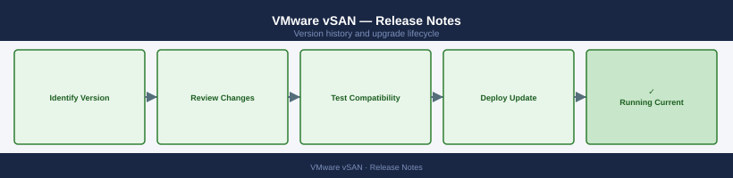

---
tags:
  - vmware
  - vsan
  - vsphere-8
---
# VMware vSAN — Release Notes

Version history and release notes for VMware vSAN.

## Version History

| Version | Released | Summary | Notes |
|---------|----------|---------|-------|
| 8.0 U3 | 2024-Q3 | ESA stretched cluster GA, compression enhancements | [Release Notes](#) |
| 8.0 U2 | 2024-Q1 | Express Storage Architecture (ESA) improvements | [Release Notes](#) |
| 8.0 U1 | 2023-Q2 | vSAN 8 ESA initial GA, HCI mesh updates | [Release Notes](#) |
| 7.0 U3 | 2022-Q4 | vSAN Max disaggregated storage preview | [Release Notes](#) |
| 7.0 U2 | 2022-Q1 | HCI mesh GA, vSAN File Services scale-out | [Release Notes](#) |

## Key Terminology

**Update (U)**
: vSAN update numbering suffix (e.g. 8.0 U3) — incremental feature and fix release within a major version.

**ESA (Express Storage Architecture)**
: vSAN 8 redesigned storage stack replacing legacy OSA; requires NVMe-only disk groups.

**vSAN SKU**
: Licensing tier that determines feature availability: Standard, Advanced, Enterprise, Enterprise Plus.

**Build Number**
: Unique ESXi/vSAN build identifier used to confirm exact patch level after upgrade.

## Upgrade Path

Use the vSphere Lifecycle Manager (vLCM) image-based baseline to upgrade vSAN clusters. Validate interoperability with the [VMware Compatibility Guide](https://www.vmware.com/resources/compatibility/search.php) before upgrading. Always upgrade vCenter and ESXi to the target version before upgrading the vSAN disk format. For ESA clusters, a full rolling evacuation is performed per host.
