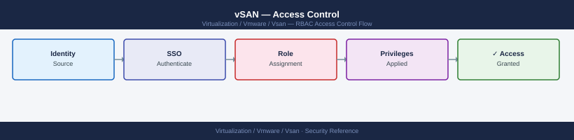

---
tags:
  - security
  - vmware
  - vsan
  - vsphere-8
---
# vSAN — Access Control


<div class="kb-summary">
vSAN access control is implemented through vCenter's Role-Based Access Control (RBAC) system. There is no separate vSAN permission model — all vSAN management actions require vCenter permissions on the cluster or datacenter objects.

*Applies to: vSAN 7.x / 8.x*
</div>



```d2
direction: down

external: External / Untrusted {shape: rectangle}
custom_roles: "Custom Roles" {shape: rectangle}
assigning_permissions: "Assigning Permissions" {shape: rectangle}
storage_policy_access_control: "Storage Policy Access Control" {shape: rectangle}
vsan_datastore_access: "vSAN Datastore Access" {shape: rectangle}
privileged_access_governance: "Privileged Access Governance" {shape: rectangle}
access_control_for_stretched_cluster: "Access Control for Stretched Clusters" {shape: rectangle}
core: "vSAN Core" {shape: hexagon}

external -> custom_roles: traffic in
custom_roles -> assigning_permissions
assigning_permissions -> storage_policy_access_control
storage_policy_access_control -> vsan_datastore_access
vsan_datastore_access -> privileged_access_governance
privileged_access_governance -> access_control_for_stretched_cluster
access_control_for_stretched_cluster -> core: secured path
```

## Before you begin

- **Access:** vCenter Administrator role
- **Change management:** security changes require CAB approval in most environments
- **Rollback plan:** document current state before any security control change
- **Testing:** validate in a non-production environment first where possible

---

## Custom Roles

### vSAN Read-Only Role (Monitoring)

For monitoring systems (Aria Operations, Nagios, custom scripts) that only need to read vSAN status.

```powershell
$monitorPrivileges = @(
    "System.Anonymous", "System.Read", "System.View",
    "VsanHealth.ClusterHealth.Get",
    "StorageProfile.View",
    "Datastore.Browse",
    "Performance.ModifyIntervals",
    "Global.VCServer"
)

New-VIRole -Name "vSAN-Monitor-RO" `
    -Privilege (Get-VIPrivilege -Id $monitorPrivileges)
```

### vSAN Policy Administrator

For users who design and manage storage policies but do not manage physical hardware.

```powershell
$policyAdminPrivileges = @(
    "System.Anonymous", "System.Read", "System.View",
    "StorageProfile.View",
    "StorageProfile.Update",
    "VsanHealth.ClusterHealth.Get",
    "Datastore.Browse",
    "VirtualMachine.Config.ChangeTracking"  # needed to apply policy changes to VMs
)

New-VIRole -Name "vSAN-PolicyAdmin" `
    -Privilege (Get-VIPrivilege -Id $policyAdminPrivileges)
```

---

## Assigning Permissions

### Assign Role to AD Group

Always assign permissions to AD groups, not individual users. This simplifies onboarding and offboarding.

```powershell
# Assign vSAN-StorageOperator role to an AD group on the cluster
New-VIPermission `
    -Entity (Get-Cluster "VSAN-LON-01") `
    -Principal "EXAMPLE\vSAN-Operators" `
    -Role "vSAN-StorageOperator" `
    -Propagate $true

# Assign monitoring role to a service account
New-VIPermission `
    -Entity (Get-Cluster "VSAN-LON-01") `
    -Principal "EXAMPLE\svc-aria-vcenter" `
    -Role "vSAN-Monitor-RO" `
    -Propagate $true
```

**From vCenter UI:**
Cluster → Permissions → Add → select identity source → search for group or user → select role → check Propagate

### Verify Effective Permissions

```powershell
# List all permissions on a cluster
Get-VIPermission -Entity (Get-Cluster "VSAN-LON-01") |
    Select Principal, Role, Propagate |
    Format-Table -AutoSize

# Check what a specific user can do
$cluster = Get-Cluster "VSAN-LON-01"
Get-VIPermission -Entity $cluster | Where-Object { $_.Principal -like "*StorageOps*" }
```

---

## Storage Policy Access Control

Storage policies (SPBM) have their own permission layer within vCenter. Control who can create, edit, and assign policies.

| Privilege | Who Needs It |
|---|---|
| `StorageProfile.View` | All users who provision VMs on vSAN (to select policies) |
| `StorageProfile.Update` | Storage administrators who design and manage policies |
| `StorageProfile.Delete` | Storage administrators only |

```powershell
# Check storage policy permissions
Get-VIPermission -Entity (Get-vCenter) |
    Where-Object { $_.Role -match "PolicyAdmin\|Administrator" }
```

**Protect production policies:** Do not allow VM owners or application teams to modify or create storage policies. Only the storage team should manage the canonical policy set.

---

## vSAN Datastore Access

The vSAN datastore is presented as a single namespace. VM placement on the vSAN datastore is controlled by:

1. **vCenter RBAC:** The user or service account provisioning the VM must have `Datastore.FileManagement` on the vSAN datastore.
2. **Storage Policy compliance:** The vSAN datastore only accepts objects that comply with the assigned storage policy.

**Restrict access to the vSAN datastore by cluster:**

```powershell
# Remove Read-Only access inherited from parent for a non-privileged group
# (Add No Access permission at the datastore level to block inheritance)
$vsanDS = Get-Datastore "vsanDatastore"
New-VIPermission `
    -Entity $vsanDS `
    -Principal "EXAMPLE\AppTeam-NonPrivileged" `
    -Role "NoAccess" `
    -Propagate $false
```

---

## Privileged Access Governance

### Break-Glass Accounts

Maintain documented break-glass procedures for scenarios where AD authentication is unavailable:

- `administrator@vsphere.local` credentials stored in a physical safe or a PAM tool.
- ESXi root credentials stored per host in the PAM tool.
- KMS admin credentials (separate from vCenter access) stored with the same controls.

Review and rotate break-glass credentials at least quarterly.

### Audit Access Reviews

Perform a quarterly review of vCenter permissions:

```powershell
# Export all permissions across the vCenter inventory
$allPerms = @()
$allObjects = Get-View -ViewType All | Where-Object { $_.MoRef.Type -in @("ClusterComputeResource","HostSystem","Datastore","Datacenter") }
foreach ($obj in $allObjects) {
    $perms = Get-VIPermission -Entity (Get-VIObject -MoRef $obj.MoRef) -ErrorAction SilentlyContinue
    $allPerms += $perms
}
$allPerms | Select Entity, Principal, Role, Propagate |
    Export-Csv "vcenter_permissions_$(Get-Date -Format yyyyMMdd).csv" -NoTypeInformation
```

Review the export for:
- Accounts that should no longer have access (leavers, role changes).
- Accounts with more privileges than their role requires.
- Service accounts assigned Administrator instead of a minimal role.
- Permissions assigned to individual users instead of groups.

### Separation of Duties

| Function | Responsible Role |
|---|---|
| vSAN hardware configuration (disk groups) | Storage Administrator |
| Storage policy design and approval | Storage Architect |
| VM provisioning (selecting policies) | VM Operator (with View on policies only) |
| Encryption key management | Security / KMS Administrator |
| Backup job configuration | Backup Administrator |
| vCenter and SSO user management | Identity Administrator |

No single person should hold both "Storage Administrator" and "KMS Administrator" roles for production systems.

---

## Access Control for Stretched Clusters

The witness host (vSAN Witness Appliance or physical ESXi) requires:

- Management access from the vCenter managing the production cluster.
- Connectivity on the vSAN witness vmkernel network.
- No production VM workloads running on the witness.

**Restrict witness host access:**

- Assign only `Read Only` vCenter role to operations staff on the witness host.
- Only the vSAN service account and vCenter itself need write access to the witness.
- Do not join the witness host to the same AD OU as production hosts — it is a lower-privilege asset.

```powershell
# Assign read-only access to the witness host for monitoring only
New-VIPermission `
    -Entity (Get-VMHost "vsanwitness-lon.example.com") `
    -Principal "EXAMPLE\vSAN-Operators" `
    -Role "ReadOnly" `
    -Propagate $false
```

## See also

- [vSAN — Authentication](authentication/)
- [vSAN — Hardening](hardening/)
