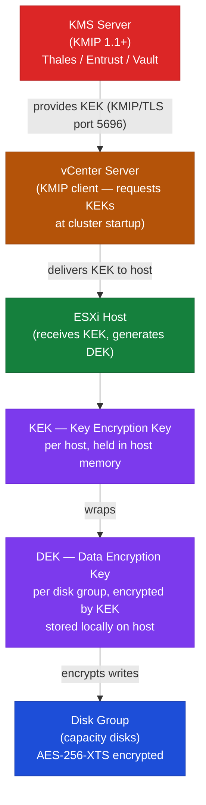

# vSAN — Encryption

vSAN supports two complementary encryption modes: data-at-rest encryption (D@RE) and data-in-transit encryption. Both are optional and independently configurable. This page covers architecture, KMS integration, enabling procedures, and operational considerations.

---

## Encryption Architecture

### Data-at-Rest Encryption (D@RE)

vSAN D@RE encrypts all data written to disk at the disk group level, below the storage policy layer. Encryption is transparent to VMs and storage policies — no changes to guest OS or VMDK files are required.

**Key hierarchy:**

```text
vCenter (Key Management Service client)
    └── KMS Server (Key Provider)
            └── Key Encryption Key (KEK) — per host
                    └── Data Encryption Key (DEK) — per disk group
                            └── Encrypted data on disk
```



- **KMS (Key Management Service):** External server holding the KEKs. vCenter connects to the KMS to retrieve keys at startup.
- **KEK:** Host-level key provided by KMS. Used to encrypt the DEK stored locally on the host.
- **DEK:** Disk-group-level key generated by ESXi. Encrypted by the KEK and stored on the host. Used to encrypt actual data on disk.

Data is encrypted when written to the LSOM layer and decrypted in-memory when read. Encryption/decryption happens on the ESXi host CPU using AES-256-XTS.

**What is protected:**

| Item | Encrypted |
|---|---|
| VMDK data on vSAN disks | Yes |
| VM swap files on vSAN | Yes |
| vSAN object metadata | Yes |
| vSAN in-memory data | No (in-flight on DRAM only) |
| vMotion traffic | No (separate vMotion encryption) |
| Snapshots on vSAN | Yes |

### Data-in-Transit Encryption

vSAN data-in-transit encryption encrypts host-to-host vSAN traffic (data plane traffic on the vSAN VMkernel network). This protects against packet capture between hosts on the same cluster network.

- Uses AES-256-GCM with ephemeral session keys.
- Keys are negotiated directly between ESXi hosts — no KMS involvement.
- Does not require a KMS, independent of D@RE.
- Small CPU overhead per host; negligible on modern CPUs with AES-NI.

---

## Key Management Service (KMS) Integration

### Supported KMS Providers

vSAN D@RE requires an external KMS that supports KMIP 1.1 or later. Supported providers include:

| Vendor | Product |
|---|---|
| Thales | CipherTrust Manager (formerly SafeNet KeySecure) |
| Entrust | KeyControl |
| HashiCorp | Vault with KMIP secrets engine |
| IBM | Security Guardium Key Lifecycle Manager |
| Dell Technologies | Apex Key Manager |
| Utimaco | HSM-based KMIP appliance |

### Add KMS to vCenter

```powershell
# PowerCLI — add KMS cluster to vCenter
Connect-VIServer <vcenter>

Add-KeyManagementServer `
    -Name "prod-kms" `
    -Address "kms.example.com" `
    -Port 5696 `
    -UserName <kmip-username> `
    -Password <kmip-password>
```

**From vCenter UI:**
vSphere Client → vCenter → Configure → Key Providers → Add Standard Key Provider

**Required KMS configuration:**

1. Create a KMIP client certificate in vCenter (vCenter → Configure → Key Providers → the provider → Download certificate).
2. Import that certificate into the KMS as a trusted client.
3. Verify the trust: in vCenter, the KMS status shows "Normal" (green check).

**KMS connectivity requirements:**

| Source | Destination | Port | Protocol |
|---|---|---|---|
| vCenter | KMS | 5696 | TCP (KMIP/TLS) |
| ESXi hosts | KMS | 5696 | TCP (KMIP/TLS) — required at startup |

If ESXi hosts cannot reach the KMS at startup, encrypted disk groups cannot be mounted and VMs will not power on.

### KMS Redundancy

A single KMS server is a critical single point of failure. Always configure:

- **KMS cluster:** Minimum two KMS nodes with active-active or active-passive replication.
- **Two KMS clusters in vCenter:** Add a primary and a secondary KMS. vCenter will fail over automatically.
- **Key backup:** Export and securely store a copy of all KEKs offline per vendor procedure.

---

## Enabling Data-at-Rest Encryption

**Prerequisites:**
- KMS is configured in vCenter and showing Normal status.
- All hosts in the cluster are running ESXi 6.2 or later.
- vSAN cluster is healthy (no degraded objects, no active resync).
- Maintenance window is scheduled — enabling encryption triggers a full disk format, which causes all disk groups to be rebuilt.

**Enabling encryption triggers a rolling disk group reformat.** All data is evacuated from each disk group before it is reformatted and rebuilt. This is equivalent to a full cluster resync and can take several hours to days depending on cluster size. Do not enable encryption during production hours.

### Enable via vCenter UI

1. vSphere Client → Cluster → Configure → vSAN → Services → Data Services
2. Enable **vSAN Encryption** → select the KMS cluster → click Apply.
3. vCenter initiates the rolling disk group reformat. Monitor progress in Recent Tasks.

### Enable via PowerCLI

```powershell
Connect-VIServer <vcenter>
$cluster = Get-Cluster "VSAN-LON-01"
$kmsCluster = Get-KeyManagementServer -Name "prod-kms"

Set-VsanClusterConfiguration `
    -Configuration (Get-VsanClusterConfiguration -Cluster $cluster) `
    -EncryptionEnabled $true `
    -KmsCluster $kmsCluster
```

### Verify Encryption Status

```bash
# From ESXi host — check disk group encryption status
esxcli vsan storage list | grep -i encrypt

# Or check LSOM encryption state
vsish -e get /vmkModules/lsom/disks/<disk_uuid>/info | grep encrypt
```

```powershell
# PowerCLI — verify encryption is enabled
Get-VsanClusterConfiguration -Cluster (Get-Cluster "VSAN-LON-01") |
    Select EncryptionEnabled, KmsCluster
```

---

## Enabling Data-in-Transit Encryption

Data-in-transit encryption can be enabled independently of D@RE and does not require a KMS.

**No disk reformat required** — this setting takes effect without data migration.

### Enable via vCenter UI

1. vSphere Client → Cluster → Configure → vSAN → Services → Data Services
2. Enable **vSAN Data-In-Transit Encryption** → click Apply.

### Enable via PowerCLI

```powershell
Connect-VIServer <vcenter>
$cluster = Get-Cluster "VSAN-LON-01"
$config = Get-VsanClusterConfiguration -Cluster $cluster

Set-VsanClusterConfiguration `
    -Configuration $config `
    -DataInTransitEncryptionEnabled $true
```

### Verify In-Transit Encryption

```bash
# From ESXi host
esxcli vsan cluster get | grep -i "encryption"

# Check vSAN network config for encryption mode
esxcli vsan network list | grep -i encrypt
```

---

## Key Rotation

Regular key rotation limits exposure if keys are compromised. Rotate KEKs (not DEKs — DEK rotation would require full disk reformat).

### Rotate KEKs

```powershell
# Trigger KEK rotation on the cluster
$cluster = Get-Cluster "VSAN-LON-01"
$vsanConfig = Get-VsanClusterConfiguration -Cluster $cluster
Invoke-VsanClusterKeyRotation -Configuration $vsanConfig
```

**From vCenter UI:**
Cluster → Configure → vSAN → Services → Data Services → Rekey

KEK rotation is a rolling operation — each host requests a new KEK from the KMS, re-encrypts its local DEK, and updates the stored encrypted DEK. No disk reformatting occurs. No impact to running VMs.

**Deep rekey (DEK rotation):** Deep rekey rotates the DEKs themselves, which requires a disk group reformat equivalent to initial encryption enablement. Only perform deep rekey if DEKs are suspected to be compromised. Schedule an extended maintenance window.

---

## Encryption and Deduplication / Compression

vSAN deduplication and compression must be evaluated alongside encryption:

- **OSA:** Deduplication and compression are applied before encryption. Data is deduplicated, then compressed, then encrypted on disk. Space savings are preserved.
- **ESA:** Inline compression is always active. Encryption is applied after inline compression. Space savings are preserved.
- **All-flash OSA:** Deduplication operates at the cache layer. With encryption enabled, deduplication effectiveness is slightly reduced because identical blocks produce different ciphertext (cipher block chaining with unique IVs per block). However, deduplication operates on plaintext before encryption in vSAN's implementation, so deduplication ratios are not meaningfully impacted.

---

## Operational Considerations

### KMS Unavailability

If the KMS becomes unreachable:

- **Running VMs:** Continue running normally. DEKs are cached in host memory — no immediate impact.
- **Host reboot:** If a host reboots and cannot reach the KMS, it cannot mount encrypted disk groups. VMs on that host will not power on until KMS is reachable.
- **vCenter restart:** vCenter reconnects to KMS on startup. If unavailable, cluster management is reduced but existing VMs continue running.

**Mitigation:** Always configure a clustered, redundant KMS with at least two nodes and a secondary KMS cluster in vCenter.

### Secure Drive Erase on Disk Removal

With vSAN D@RE enabled, removing a disk from the cluster does not require physical drive shredding. Destroying the DEK cryptographically erases all data on the disk — a process called crypto-erase.

```bash
# Remove a disk group (DEK is destroyed, data is cryptographically erased)
esxcli vsan storage remove -s <cache_ssd_naa>
```

After DEK destruction, even if the physical drive is accessed directly, the encrypted data cannot be recovered without the DEK. This satisfies NIST 800-88 crypto-erase for drive decommission.

### Audit and Compliance

- Key operations (key creation, rotation, deletion) are logged in the KMS audit log.
- vSAN encryption events are logged in vCenter events: **vSphere Client → Cluster → Monitor → Events** — filter for "encryption".
- Include KMS audit logs in your SIEM or log aggregation platform.
- Document encryption enablement date and KMS configuration in the cluster's change record.

### Troubleshooting Encryption Issues

| Symptom | Cause | Resolution |
|---|---|---|
| Disk group fails to mount after host reboot | KMS unreachable at boot | Restore KMS connectivity; restart hostd on ESXi host |
| vCenter shows KMS status "Error" | Certificate trust broken | Re-import vCenter client cert into KMS |
| Encryption enable fails with "Cannot proceed" | Active resync or degraded objects | Resolve object health before enabling encryption |
| KMS cluster shows "Untrusted" | KMS server cert not trusted by vCenter | Import KMS server certificate into vCenter trusted certs |
| Key rotation stuck | One host cannot reach KMS | Check ESXi-to-KMS network path (port 5696, TLS) |

```bash
# Check KMS connectivity from ESXi host
nc -zv kms.example.com 5696

# Check encryption-related errors in VMkernel log
grep -i "encrypt\|kmip\|kms" /var/log/vmkernel.log | tail -50
```
