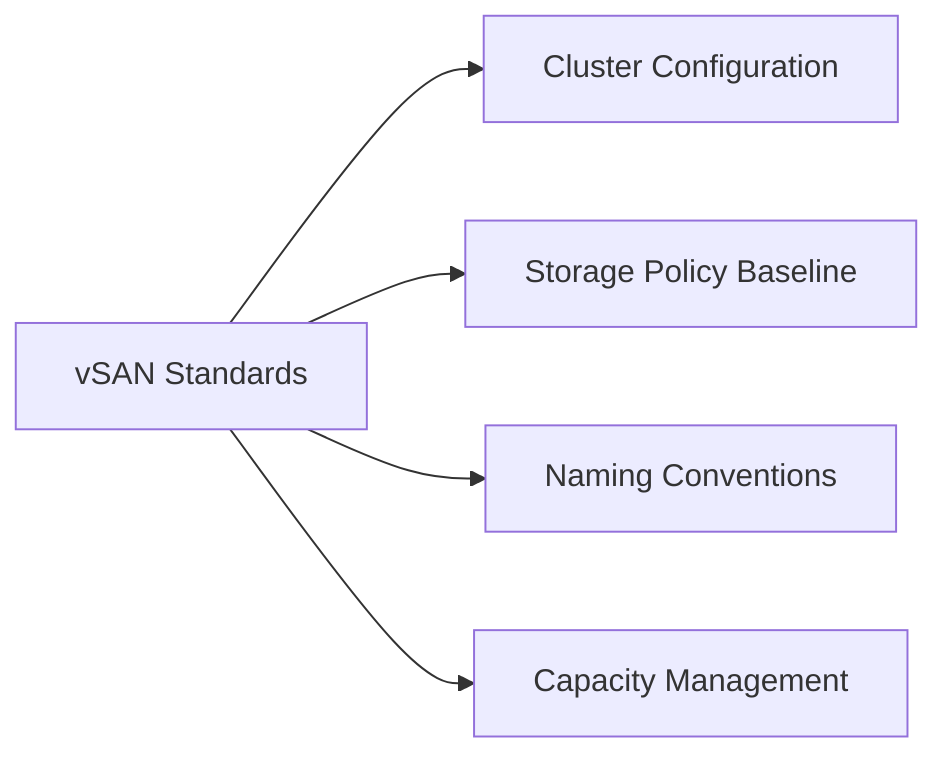

# VMware vSAN Standards



## Cluster Configuration

Apply the following configuration baseline to every vSAN cluster before placing it in production.

**Host requirements:**

| Item | Requirement |
|---|---|
| Minimum nodes | 3 (FTT=1 RAID-1); 4 for RAID-5; 6 for RAID-6 |
| vSAN vmkernel adapter | Dedicated vmk on each host (vmk2 by convention) |
| Network speed | 10 GbE minimum; 25 GbE recommended for ESA or high-density |
| MTU | 9000 (jumbo frames) end-to-end on vSAN network |
| NIC allocation | Dedicated NIC or NIC pair for vSAN traffic (separate from management and vMotion) |
| RDMA | Optional (RDMA over RoCE v2) for ESA ultra-low latency |
| All hosts identical | Identical CPU, RAM, and disk group configuration per cluster for balanced capacity |

**Network validation before cluster creation:**

```bash
# Verify MTU 9000 end-to-end
vmkping -I vmk2 -d -s 8972 <remote-vsan-vmk-ip>
```

Ping must succeed at the large packet size. If it fails, check switch port MTU, vDS port group MTU, and vmkernel adapter MTU.

## Storage Policy Baseline

Define storage policies in vCenter before provisioning VMs. Assign policies by workload tier.

| Workload Tier | Policy Name | FTT | RAID | Checksum | Notes |
|---|---|---|---|---|---|
| Tier-1 Databases | `VSAN-T1-FTT2-RAID6` | 2 | RAID-6 | Enabled | 6+ node cluster required |
| Tier-2 General | `VSAN-T2-FTT1-RAID5` | 1 | RAID-5 | Enabled | 4+ node cluster required |
| Dev/Test | `VSAN-DEV-FTT1-RAID1` | 1 | RAID-1 | Enabled | 3+ node cluster |
| Stretched Cluster | `VSAN-STRETCH-FTT1-SITE` | 1 | RAID-1 per site | Enabled | Affinity rule per site |

**Object space reservation:** Set to 0% unless workloads require thick provisioning. Thin provisioning is the default for vSAN.

**Flash read cache reservation:** Set to 0% for all-flash clusters (not applicable). OSA hybrid clusters may benefit from a non-zero value for latency-sensitive workloads.

**Checksum:** Enable object checksum on all production storage policies. Checksum detects silent data corruption at the component level and triggers resync automatically.

## Naming Conventions

Consistent naming makes multi-cluster environments manageable and aligns with vCenter inventory organisation.

| Object | Pattern | Example |
|---|---|---|
| vSAN Cluster | `VSAN-<SITE>-<NN>` | `VSAN-LON-01` |
| Storage Policy (Tier-1) | `VSAN-T1-FTT<n>-RAID<n>` | `VSAN-T1-FTT2-RAID6` |
| Storage Policy (Tier-2) | `VSAN-T2-FTT<n>-RAID<n>` | `VSAN-T2-FTT1-RAID5` |
| Storage Policy (Dev) | `VSAN-DEV-FTT<n>-RAID<n>` | `VSAN-DEV-FTT1-RAID1` |
| Stretched Cluster Policy | `VSAN-STRETCH-<tag>` | `VSAN-STRETCH-FTT1-SITE` |
| Witness Appliance | `vsanwitness-<site>` | `vsanwitness-lon` |

Disk group components are not individually named in vSAN (managed at the host level). Document the physical disk-to-disk-group mapping in the host build record.

## Capacity Management

vSAN capacity management requires proactive monitoring. Resync operations during host failures or upgrades consume capacity above and beyond normal usage.

**Alert thresholds:**

| Threshold | Action |
|---|---|
| 70% used capacity | Alert — plan cluster expansion or data migration |
| 80% used capacity | Escalation alert — immediate action required; vSAN operations reserve is at risk |
| > 80% used capacity | vSAN may refuse new write operations or object provisioning |

**Capacity reserve (slack):**

Always maintain a minimum 30% free capacity:

- 10% for vSAN operations reserve (internal metadata and resync)
- 10% for resync buffer during host maintenance (one host's worth of data must be resynced)
- 10% operational headroom

**Monitoring commands:**

```bash
# Check cluster capacity from any ESXi host
esxcli vsan storage list
esxcli vsan cluster get

# PowerCLI capacity overview
Get-VsanSpaceUsage -Cluster <clustername>
```

Capacity monitoring should also be configured in Aria Operations with an alert policy targeting the 70% threshold.
