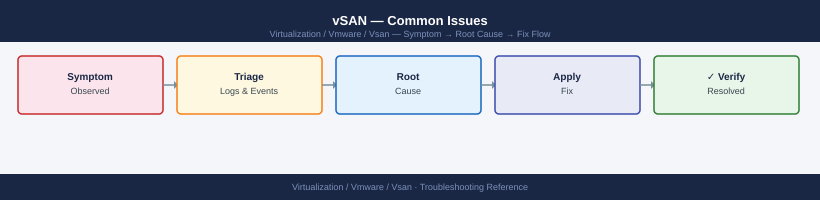

---
tags:
  - troubleshooting
  - vmware
  - vsan
  - vsphere-8
search:
  boost: 2
---
# vSAN — Common Issues

*Applies to: VMware vSAN 7.x / 8.x*


```bash
# 1. Cluster membership and overall status
esxcli vsan cluster get

# 2. Health check summary (all built-in checks)
esxcli vsan health cluster list

# 3. Object health — filter for non-healthy
esxcli vsan debug object list | grep -v "Healthy"

# 4. Active resync operations
esxcli vsan debug resync summary get

# 5. Disk group status
esxcli vsan storage list

# 6. Network connectivity between hosts
esxcli vsan debug network test
```

```text
Normal vSAN:
Host 1 ──── data copy 1
Host 2 ──── data copy 2  ← redundancy
Host 3 ──── data copy 3

If Host 2 goes down or a disk fails:
Host 1 ──── data copy 1
Host 2 ──── REBUILDING ← resync happening
Host 3 ──── data copy 3
              │
              └── heavy I/O on remaining hosts
                  → VM performance suffers
```
```bash
esxcli vsan debug resync summary get
# Wait until bytesToSync = 0
```
```d2
direction: right

alert: "Object degraded or absent\n(vSAN health alarm" {shape: rectangle}
checkHost: "checkHost" {shape: rectangle}
restoreHost: "Restore host connectivity\nor power on host" {shape: rectangle}
waitResync: "Wait for vSAN resync\n(clomRepairDelay = 60 min default" {shape: rectangle}
checkDisk: "checkDisk" {shape: rectangle}
diskReplace: "Proceed to disk replacement\n(Procedures → Disk Groups" {shape: rectangle}
checkNet: "checkNet" {shape: rectangle}
fixNet: "Fix network:\nMTU, VLAN, NIC, switch port" {shape: rectangle}
monResync: "Monitor:\nesxcli vsan debug resync summary get" {shape: rectangle}
checkResync: "checkResync" {shape: rectangle}
resolved: "Objects healthy" {shape: rectangle}
checkCap: "checkCap" {shape: rectangle}
freeCap: "Free capacity:\nremove snapshots,\nlower FTT temporarily" {shape: rectangle}
escalate: "Escalate to VMware Support\nwith state capture bundle" {shape: rectangle}

alert -> checkHost
checkHost -> restoreHost
restoreHost -> waitResync
checkHost -> checkDisk
checkDisk -> diskReplace
diskReplace -> waitResync
checkDisk -> checkNet
checkNet -> fixNet
fixNet -> waitResync
checkNet -> waitResync
waitResync -> monResync
monResync -> checkResync
checkResync -> resolved
checkResync -> checkCap
checkCap -> freeCap
freeCap -> monResync
checkCap -> escalate
```
```bash
# Find degraded/absent objects
esxcli vsan debug object list | grep -v "Healthy"

# Get detail on a specific object UUID
esxcli vsan debug object get -u <object-uuid>

# Check which host/disk the absent components are on
esxcli vsan debug component list | grep -i absent
```

```text title="Expected output"
Name                                     UUID                                 Health State
vm-123-delta.vmdk                        52a4c8f1-2b3e-4f9a-8c1d-7e9f2a3b4c5d Degraded
vm-456-swap.vmdk                         61b5d9g2-3c4f-5g0b-9d2e-8f0g3b4c5d6e Absent
vm-789-config.vmx                        70c6e0h3-4d5g-6h1c-0e3f-9g1h4c5d6e7f Degraded

Object UUID: 52a4c8f1-2b3e-4f9a-8c1d-7e9f2a3b4c5d
Object Name: vm-123-delta.vmdk
Health State: Degraded
Component Count: 3
Absent Components: 1
Owner: esx-host-01.lab.local

Component UUID                           Host                    Disk                 Status
a1b2c3d4-e5f6-7890-abcd-ef1234567890   esx-host-02.lab.local   naa.600508b1001c5a6b7 Absent
b2c3d4e5-f6a7-8901-bcde-f12345678901   esx-host-03.lab.local   naa.600508b1001c5a6c Present
c3d4e5f6-a7b8-9012-cdef-123456789012   esx-host-04.lab.local   naa.600508b1001c5a6d Present
```

!!! warning "Common errors"
    **`Error: Unknown command or namespace vsan debug object`** — Verify vSAN is licensed and enabled on the cluster; run `esxcli vsan cluster get` to confirm vSAN status.
    **`Error: Invalid object UUID format`** — Ensure the UUID is exactly 36 characters in the format `xxxxxxxx-xxxx-xxxx-xxxx-xxxxxxxxxxxx` with no extra spaces.
```bash
esxcli vsan debug network test
# Loss % > 0 indicates network issues — check switch, NIC, or vDS configuration
```

```text title="Expected output"
Pinging 10.20.30.41 (esx-node-02.lab.local) ...
Packets sent: 1000, received: 1000, loss: 0%
Round-trip times (ms): min=0.234, avg=0.512, max=2.156

Pinging 10.20.30.42 (esx-node-03.lab.local) ...
Packets sent: 1000, received: 998, loss: 0.2%
Round-trip times (ms): min=0.198, avg=0.489, max=1.834

Pinging 10.20.30.43 (esx-node-04.lab.local) ...
Packets sent: 1000, received: 1000, loss: 0%
Round-trip times (ms): min=0.267, avg=0.541, max=2.412

Network test completed successfully.
```

!!! warning "Common errors"
    **`Error: VSAN is not enabled on this host`** — Enable VSAN on the host via vSphere Client or run `esxcli vsan cluster join`.
    **`Error: Could not resolve hostname esx-node-02.lab.local`** — Verify DNS resolution is working and all cluster nodes are reachable on the management network.
    **`Error: Permission denied`** — Run the command with root privileges or as a user with vSAN administration rights.
```bash
# Check object state
esxcli vsan debug object list | grep -i "inaccessible"

# Check host count in cluster
esxcli vsan cluster get | grep -i "member"

# Network partition test
esxcli vsan debug network test
```

```text title="Expected output"
Object UUID: 52e4a1c2-1a3f-4d8e-9b2c-7f6e3d1a0c5b, State: inaccessible, Components: 3/3
Object UUID: 8f2d9c1e-5a7b-4c6f-8e3a-2b1d9f4a6c8e, State: inaccessible, Components: 2/3

Cluster Member Count: 4
Cluster Member Count: 4

Network partition test started on host esx-prod-04.lab.local
Testing connectivity to cluster members...
  esx-prod-01.lab.local: OK (RTT: 2.3ms)
  esx-prod-02.lab.local: OK (RTT: 2.1ms)
  esx-prod-03.lab.local: TIMEOUT (RTT: >5000ms)
  esx-prod-04.lab.local: OK (RTT: 1.9ms)
Network partition test completed. Status: DEGRADED
```

!!! warning "Common errors"
    **`VSAN is not enabled on this host`** — Run `esxcli vsan cluster join --cluster-uuid=<uuid>` to enable vSAN on the host.
    **`Network partition detected: Host isolation`** — Check physical network connectivity and verify vSAN VMkernel port configuration with `esxcli vsan network list`.
    **`Command timed out waiting for cluster response`** — Verify all cluster hosts are powered on and accessible, then retry the command.
```bash
# Check and remove throttle (if set too low)
esxcli vsan debug resync throttle get
esxcli vsan debug resync throttle set --throttle 0  # unlimited

# Check capacity
esxcli vsan storage list

# Identify blocked components
esxcli vsan debug object list | grep -i "stale\|absent"
```

```text title="Expected output"
Current resync throttle setting: 100 MB/s
Resync throttle set to: 0 (unlimited)
VSAN storage on host esx-node-04.lab.local:
  UUID: 52e3d8c1-a4f2-4e1a-9b2c-7f6e3d1a0c5b
  Capacity: 1.8 TB
  Free: 342 GB
  Used: 1.5 TB
  Health: Healthy

Object UUID: 4a2c8f9e-1b3d-47e2-9c5f-8d2a1e6b3f4c
  State: stale
  Components: 3/3 present
  Accessibility: Inaccessible

Object UUID: 6f1d3e8a-2c4b-5a9e-7b1f-3c2d8e9a1b4f
  State: absent
  Components: 0/3 present
  Accessibility: Inaccessible
```

!!! warning "Common errors"
    **`Error: The VSAN service is not running on this host`** — Run `esxcli vsan cluster get` to verify VSAN is enabled, then restart the service with `systemctl restart vsanmgmt`.
    **`Error: Permission denied`** — Ensure your account has VSAN administrator privileges; use `esxcli system permission list` to verify role assignments.
```bash
# Check disk group and disk status
esxcli vsan storage list

# Check for hardware errors on the disk
esxcli storage core device list | grep <naa>

# Check disk controller driver version
esxcli software vib list | grep -i <controller-vendor>

# VMkernel log — disk errors
grep -i "scsi\|disk\|naa" /var/log/vmkernel.log | grep -i "error\|fail" | tail -30
```
```d2
direction: right

highLat: "High vSAN latency detected\n(> 10 ms read / > 20 ms write" {shape: rectangle}
checkNet: "checkNet" {shape: rectangle}
fixMTU: "Fix MTU end-to-end\n(switch, vDS, vmk adapter = 9000" {shape: rectangle}
resolved: "Latency normal" {shape: rectangle}
checkResync: "checkResync" {shape: rectangle}
throttle: "Throttle resync during\nbusiness hours:\nesxcli vsan debug resync\nthrottle set --throttle 500" {shape: rectangle}
checkCap: "checkCap" {shape: rectangle}
freeCap: "Free capacity:\ndelete snapshots,\nexpand cluster" {shape: rectangle}
checkDisk: "checkDisk" {shape: rectangle}
replaceDisk: "Replace failed\nhardware" {shape: rectangle}
checkCPU: "checkCPU" {shape: rectangle}
vMotion: "vMotion high-IOPS\nVMs to less-loaded hosts" {shape: rectangle}
openCase: "Escalate to VMware\nSupport" {shape: rectangle}

highLat -> checkNet
checkNet -> fixMTU
fixMTU -> resolved
checkNet -> checkResync
checkResync -> throttle
throttle -> resolved
checkResync -> checkCap
checkCap -> freeCap
freeCap -> resolved
checkCap -> checkDisk
checkDisk -> replaceDisk
replaceDisk -> resolved
checkDisk -> checkCPU
checkCPU -> vMotion
vMotion -> resolved
checkCPU -> openCase
```
```bash
# Per-disk I/O stats (IOPS, latency)
esxcli vsan storage stats get

# vSAN congestion indicator — should be 0
esxcli vsan debug vmdk list

# Check vSAN network latency
vmkping -I vmk2 -d -s 8972 <peer_vmk_ip>
```

```text title="Expected output"
IOPS: 4521 Read, 3847 Write
Latency (ms): Read 2.34, Write 1.87
Throughput (MB/s): Read 287.5, Write 256.3
Congestion Level: 0
Network Overhead: 2.1%

VMDK: vm-prod-db-01_1.vmdk
  Congestion: 0
  Outstanding I/O: 12
VMDK: vm-web-app-02_1.vmdk
  Congestion: 0
  Outstanding I/O: 8

PING vm-peer-esx02.lab.local (172.16.45.82): 8972 data bytes
8980 bytes from 172.16.45.82: icmp_seq=0 time=0.892 ms
8980 bytes from 172.16.45.82: icmp_seq=1 time=0.887 ms
8980 bytes from 172.16.45.82: icmp_seq=2 time=0.901 ms
8980 bytes from 172.16.45.82: icmp_seq=3 time=0.879 ms
--- 172.16.45.82 statistics ---
4 packets transmitted, 4 packets received, 0% packet loss
round-trip min/avg/max = 0.879/0.890/0.901 ms
```

!!! warning "Common errors"
    **`vSAN is not enabled on this host`** — Run `esxcli vsan cluster get` to verify vSAN is configured, then enable it via vCenter or `esxcli vsan cluster new`.
    **`Unable to resolve host address <peer_vmk_ip>`** — Verify the peer ESXi hostname or IP is correct and that vmk2 is bound to the vSAN network (check with `esxcli network ip interface list`).
    **`No route to host`** — Confirm vSAN VMkernel adapters are on the same subnet and vSAN network connectivity is not blocked by firewall rules or VLAN misconfiguration.
```bash
# Test network connectivity to all peers
esxcli vsan debug network test

# List vSAN VMkernel adapters
esxcli vsan network list

# Verify MTU
vmkping -I vmk2 -d -s 8972 <peer_vmk_ip>
# Failure = MTU mismatch along the path

# Check unicast agent list
esxcli vsan network ipconfig list
# All cluster host vSAN vmk IPs should appear as unicast agents
```
```powershell
# 1. Find VMs with large snapshots
Get-VM | Get-Snapshot | Select VM, Name, SizeGB, Created |
    Sort-Object SizeGB -Descending | Format-Table -AutoSize

# 2. Find VMs with large swap files (memory overhead)
# vSAN swap files equal the VM's configured RAM size
Get-VM | Select Name, MemoryGB | Sort-Object MemoryGB -Descending | Select -First 20

# 3. Find VMs with thick-provisioned disks in thin-by-default policies
Get-HardDisk -VM * | Where-Object { $_.StorageFormat -eq "Thick" } |
    Select Parent, Name, CapacityGB, StorageFormat
```
```bash
esxcli vsan debug network test
# Packet loss to one or more hosts
```

```text title="Expected output"
Testing VSAN network connectivity...
Host: esx-01.lab.local (192.168.1.10) — OK (0% loss)
Host: esx-02.lab.local (192.168.1.11) — OK (0% loss)
Host: esx-03.lab.local (192.168.1.12) — DEGRADED (12% loss)
Host: esx-04.lab.local (192.168.1.13) — OK (0% loss)

Network test completed.
Summary: 3/4 hosts healthy. 1 host experiencing packet loss.
Recommendation: Check physical NIC on esx-03, verify VSAN network MTU (9000), inspect switch port for errors.
```

!!! warning "Common errors"
    **`Error: VSAN cluster not initialized`** — Run `esxcli vsan cluster get` to verify VSAN is enabled on all hosts; reinitialize the cluster if needed.
    **`Error: Unable to reach one or more hosts`** — Verify network connectivity and firewall rules allow VSAN multicast traffic (224.0.0.1:12345) between all hosts.
    **`Error: Command not found`** — Ensure you are running this command on an ESXi host with VSAN enabled; this command is not available on non-VSAN clusters.
```bash
esxcli vsan storage list | grep "Format Version"
```

```text title="Expected output"
Format Version: 12
Format Version: 12
Format Version: 12
```

!!! warning "Common errors"
    **`Unknown command or namespace vsan`** — Ensure vSAN is licensed and enabled on the ESXi host; run `esxcli vsan cluster get` to verify vSAN is active.
    **`grep: command not found`** — This error is unlikely on ESXi; if it occurs, use `esxcli vsan storage list | grep "Format"` or verify the ESXi shell is properly initialized.
```bash
# Check clock on each host
esxcli system time get

# NTP status
esxcli system ntp get
ntpq -p
```
```powershell
# List non-compliant VMs
Get-SpbmEntityConfiguration | Where-Object { $_.ComplianceStatus -ne "compliant" } |
    Select Entity, StoragePolicy, ComplianceStatus
```

```d2
direction: down

symptom: Identify Symptom {shape: diamond}
diagnostic_flow: "Diagnostic Flow" {shape: rectangle}
verify_resolution: "Verify resolution" {shape: rectangle}
resolution: Resolve or Escalate {shape: oval}

symptom -> diagnostic_flow: investigate
symptom -> verify_resolution: investigate
diagnostic_flow -> resolution
verify_resolution -> resolution
```

## Diagnostic Flow

```d2
direction: right

S: "What triggered the alert?" {shape: rectangle}
A: "Object DEGRADED\nor ABSENT" {shape: rectangle}
B: "Capacity alarm\n≥ 70 / 80%" {shape: rectangle}
C: "Skyline Health\ncheck failing" {shape: rectangle}
D: "Resync stuck\nor very slow" {shape: rectangle}
E: "VM storage\npolicy non-compliant" {shape: rectangle}
A1: "A1" {shape: rectangle}
A2: "Restore host first\n— wait for rebuild\n→ Object Health section" {shape: rectangle}
A3: "A3" {shape: rectangle}
A4: "Replace disk\n→ Disk Group Failure section" {shape: rectangle}
A5: "Check network\npartition / witness" {shape: rectangle}
B1: "B1" {shape: rectangle}
B2: "Clean snapshots\ncheck dedup savings\n→ Capacity section" {shape: rectangle}
B3: "Escalate immediately\nStorage vMotion or\nadd capacity" {shape: rectangle}
C1: "Identify specific\nfailing check\n→ Health Checks section" {shape: rectangle}
D1: "Check resync throttle\nand available bandwidth\n→ Resync section" {shape: rectangle}
E1: "Run policy compliance\ncheck + remediate\n→ Policy Compliance section" {shape: rectangle}

S -> A
S -> B
S -> C
S -> D
S -> E
A1 -> A2
A3 -> A4
A3 -> A5
B1 -> B2
B1 -> B3
C -> C1
D -> D1
E -> E1
```

---

## Before you begin

- **Access:** SSH to vCenter Shell and ESXi hosts; vSphere Client read access
- **Gather first:** recent error message text, event timestamps, and affected object names
- **Scope:** confirm whether the issue affects a single object, host, cluster, or site
- **Escalation:** open a vendor support ticket before running any destructive step
- **Logging:** document each command and output — required if escalation is needed

---

---

## See also

- [vSAN Cluster Health — Internals](../../../internals/vsan-cluster-health/)
- [vSAN — Operations](../../operations/)
- [Scenarios — vSAN Disk Failure](../../../topics/scenarios/vsan-disk-component-failure/)

---

## Verify resolution

- **Alarms cleared:** Home → Alarms — the triggering alarm is no longer active
- **Event log:** confirm no new related error events in the last 5 minutes
- **Functional test:** perform the action that was failing (connect, vMotion, storage I/O) — confirm it succeeds
- **Monitor:** leave the vSphere Client open for 10 minutes and confirm the issue does not recur
