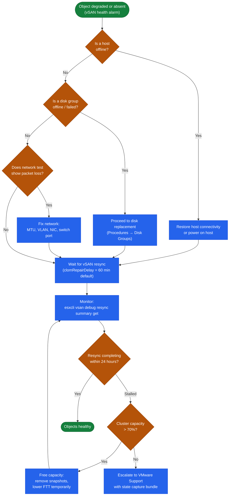
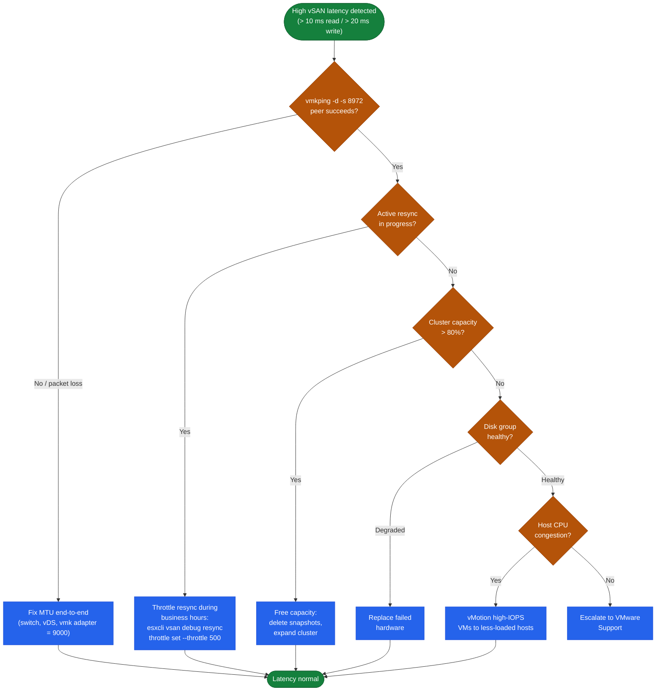

---
tags:
  - troubleshooting
  - vmware
  - vsan
  - vsphere-8
---
# vSAN — Common Issues

```bash
# 1. Cluster membership and overall status
esxcli vsan cluster get

# 2. Health check summary (all built-in checks)
esxcli vsan health cluster list

# 3. Object health — filter for non-healthy
esxcli vsan debug object list | grep -v "Healthy"

# 4. Active resync operations
esxcli vsan debug resync summary get

# 5. Disk group status
esxcli vsan storage list

# 6. Network connectivity between hosts
esxcli vsan debug network test
```
```text
┌──────────────────────────────────────── vSAN — Common Issues ─────────────────────────────────────────┐
│                                                                                                       │
│  Common vSAN issues: degraded components, resync stalls, disk failures, network                       │
│  latency causing I/O aborts, capacity alarms, and policy non-compliance.                              │
│                                                                                                       │
│   ┌──────────────────────────────────────────────┐  ┌─────────────────────────────────────────────┐   │
│   │             Degraded Components              │  │                Resync Stalls                │   │
│   │            Symptom: health UI red            │  │         Resync bytes not decreasing         │   │
│   │           Check: disk SMART errors           │  │          Check: host in maint mode          │   │
│   │           Fix: replace failed disk           │  │             Fix: exit maint mode            │   │
│   │         60-min timer before rebuild          │  │            Bandwidth limit: raise           │   │
│   └──────────────────────────────────────────────┘  └─────────────────────────────────────────────┘   │
│                                                                                                       │
│  Degraded = policy at risk; check health UI immediately; resync removes the risk.                     │
│                                                                                                       │
│                          ▼                                                 ▼                          │
│                                                                                                       │
│   ┌──────────────────────────────────────────────┐  ┌─────────────────────────────────────────────┐   │
│   │             Network & I/O Issues             │  │           Capacity & Policy Issues          │   │
│   │        I/O abort: check MTU mismatch         │  │             Capacity >70%: alert            │   │
│   │        Latency spike: resync traffic         │  │           Non-compliant: re-apply           │   │
│   │           MTU test: vSAN health UI           │  │          Dedup savings gone: expand         │   │
│   │         NIC team fail: check uplinks         │  │           Stretched: witness down           │   │
│   └──────────────────────────────────────────────┘  └─────────────────────────────────────────────┘   │
│                                                                                                       │
│  Physical Infrastructure (the hardware everything above runs on):                                     │
│  Most issues trace to: disk SMART failure, network MTU mismatch, host in maintenance,                 │
│  or capacity >70%; check all four before deep investigation.                                          │
│                                                                                                       │
│  Key terms:                                                                                           │
│                                                                                                       │
│  Degraded      = replica lost; policy not met; data at risk                                           │
│  Absent        = component missing <60min; vSAN waits before rebuilding                               │
│  60-min timer  = vSAN delay before treating absent as degraded                                        │
│  SMART error   = disk pre-failure indicator; replace proactively                                      │
│  MTU mismatch  = jumbo frames not configured end-to-end; causes I/O errors                            │
│  Resync BW     = configurable limit; default 128Mbps; raise for faster rebuild                        │
│  Policy non-compliant= VM does not meet FTT policy; fix = re-apply policy                             │
│  Witness down  = stretched cluster loses quorum; VMs may stall                                        │
│  NIC team fail = check uplink status on vDS; failover should be automatic                             │
│  Dedup savings = dedup ratio drops when data is incompressible                                        │
│  I/O abort     = VM I/O fails; check vSAN health for root cause                                       │
│  Capacity 70%  = alert threshold; keep 30% free for resync headroom                                   │
│                                                                                                       │
└───────────────────────────────────────────────────────────────────────────────────────────────────────┘
```
```text
Normal vSAN:
Host 1 ──── data copy 1
Host 2 ──── data copy 2  ← redundancy
Host 3 ──── data copy 3

If Host 2 goes down or a disk fails:
Host 1 ──── data copy 1
Host 2 ──── REBUILDING ← resync happening
Host 3 ──── data copy 3
              │
              └── heavy I/O on remaining hosts
                  → VM performance suffers
```
```bash
esxcli vsan debug resync summary get
# Wait until bytesToSync = 0
```

```bash
# Find degraded/absent objects
esxcli vsan debug object list | grep -v "Healthy"

# Get detail on a specific object UUID
esxcli vsan debug object get -u <object-uuid>

# Check which host/disk the absent components are on
esxcli vsan debug component list | grep -i absent
```
```bash
esxcli vsan debug network test
# Loss % > 0 indicates network issues — check switch, NIC, or vDS configuration
```
```bash
# Check object state
esxcli vsan debug object list | grep -i "inaccessible"

# Check host count in cluster
esxcli vsan cluster get | grep -i "member"

# Network partition test
esxcli vsan debug network test
```
```bash
# Check and remove throttle (if set too low)
esxcli vsan debug resync throttle get
esxcli vsan debug resync throttle set --throttle 0  # unlimited

# Check capacity
esxcli vsan storage list

# Identify blocked components
esxcli vsan debug object list | grep -i "stale\|absent"
```
```bash
# Check disk group and disk status
esxcli vsan storage list

# Check for hardware errors on the disk
esxcli storage core device list | grep <naa>

# Check disk controller driver version
esxcli software vib list | grep -i <controller-vendor>

# VMkernel log — disk errors
grep -i "scsi\|disk\|naa" /var/log/vmkernel.log | grep -i "error\|fail" | tail -30
```

```bash
# Per-disk I/O stats (IOPS, latency)
esxcli vsan storage stats get

# vSAN congestion indicator — should be 0
esxcli vsan debug vmdk list

# Check vSAN network latency
vmkping -I vmk2 -d -s 8972 <peer_vmk_ip>
```
```bash
# Test network connectivity to all peers
esxcli vsan debug network test

# List vSAN VMkernel adapters
esxcli vsan network list

# Verify MTU
vmkping -I vmk2 -d -s 8972 <peer_vmk_ip>
# Failure = MTU mismatch along the path

# Check unicast agent list
esxcli vsan network ipconfig list
# All cluster host vSAN vmk IPs should appear as unicast agents
```
```powershell
# 1. Find VMs with large snapshots
Get-VM | Get-Snapshot | Select VM, Name, SizeGB, Created |
    Sort-Object SizeGB -Descending | Format-Table -AutoSize

# 2. Find VMs with large swap files (memory overhead)
# vSAN swap files equal the VM's configured RAM size
Get-VM | Select Name, MemoryGB | Sort-Object MemoryGB -Descending | Select -First 20

# 3. Find VMs with thick-provisioned disks in thin-by-default policies
Get-HardDisk -VM * | Where-Object { $_.StorageFormat -eq "Thick" } |
    Select Parent, Name, CapacityGB, StorageFormat
```
```bash
esxcli vsan debug network test
# Packet loss to one or more hosts
```
```bash
esxcli vsan storage list | grep "Format Version"
```
```bash
# Check clock on each host
esxcli system time get

# NTP status
esxcli system ntp get
ntpq -p
```
```powershell
# List non-compliant VMs
Get-SpbmEntityConfiguration | Where-Object { $_.ComplianceStatus -ne "compliant" } |
    Select Entity, StoragePolicy, ComplianceStatus
```
