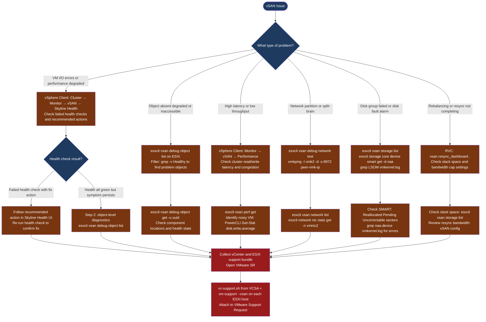

---
tags:
  - troubleshooting
  - vmware
  - vsan
  - vsphere-8
search:
  boost: 1.5
---
# vSAN — Diagnostics

<div class="kb-summary">
vSAN diagnostic commands: check all vSAN health checks from the Skyline Health UI and esxcli, inspect object and component health with esxcli vsan debug, run MTU tests and vmkping to isolate network partition issues, collect SMART data and LSOM errors for disk failures, and generate the vCenter and ESXi support bundle for VMware SRs.

*Applies to: vSAN 7.x / 8.x*
</div>

```text
┌───────────────────────────────────────── vSAN — Diagnostics ──────────────────────────────────────────┐
│                                                                                                       │
│   ┌───────────────────────────────────────────────────────────────────────────────────────────────┐   │
│   │   Start here: vSphere Client → Cluster → Monitor → vSAN → Skyline Health                     │    │
│   │   Object absent/degraded: esxcli vsan debug object list | grep -v Healthy                    │    │
│   │   Performance issue: vSAN Perf Service graphs → esxcli vsan perf get                         │    │
│   │   Network partition: esxcli vsan debug network test → vmkping -d -s 8972 peer-vmk-ip         │    │
│   └───────────────────────────────────────────────────────────────────────────────────────────────┘   │
│                                                                                                       │
│   ┌──────────────────────────────────────────────┐  ┌─────────────────────────────────────────────┐   │
│   │               Health UI Checks               │  │               CLI Diagnostics               │   │
│   │           vSAN Health: all green?            │  │           esxcli vsan debug object          │   │
│   │          Object health: policy met?          │  │         cmmds-tool find -t DOM_NAME         │   │
│   │           Network: MTU test pass?            │  │           esxcli vsan storage list          │   │
│   │           Disk: all SMART healthy?           │  │         vsan.resync_dashboard (RVC)         │   │
│   └──────────────────────────────────────────────┘  └─────────────────────────────────────────────┘   │
│                                                                                                       │
│  Start in health UI; drill to object level with esxcli for per-component detail.                      │
│                                                                                                       │
│                          ▼                                                 ▼                          │
│                                                                                                       │
│   ┌──────────────────────────────────────────────┐  ┌─────────────────────────────────────────────┐   │
│   │           Performance Diagnostics            │  │                Log Collection               │   │
│   │          vSAN Perf: latency graphs           │  │         VC support bundle: host logs        │   │
│   │         vsanObserver: per-host stats         │  │           vm-support on host shell          │   │
│   │        IOPS/throughput per datastore         │  │               vsan_health*.log              │   │
│   │         NIC utilisation: esxtop net          │  │             vsantraces: I/O path            │   │
│   └──────────────────────────────────────────────┘  └─────────────────────────────────────────────┘   │
│                                                                                                       │
│  Physical Infrastructure:                                                                             │
│  ESXi hosts (NVMe/SSD local disks) · vCenter managing the cluster · vSAN vmkernel (vmk2) network      │
│  vSAN Skyline Health Service · vSAN Performance Service (enables perf graphs)                         │
│                                                                                                       │
│  Key terms:                                                                                           │
│  cmmds-tool    = Cluster Membership and Directory Service CLI; resolves object/component UUIDs        │
│  DOM_NAME      = Distributed Object Manager; per-object UUID and placement                            │
│  RVC           = Ruby vSphere Console; vsan.resync_dashboard shows resync status                      │
│  vsanObserver  = performance data collection tool; requires RVC; writes HTML report                   │
│  vsan trace    = detailed I/O path log; written per host to /tmp/vsantrace                            │
│  vm-support    = ESXi support bundle generator; per host; includes vSAN logs                          │
│  esxtop net    = real-time ESXi NIC stats; throughput + drops                                         │
│  MTU test      = vmkping with -d -s 8972 to verify jumbo frames end-to-end                            │
│  IOPS graph    = vSAN Performance Service; must be enabled before data is available                   │
│  vsan_health   = health service log; check for ERROR lines                                            │
│  Object health = per-VM health; shows absent/degraded components                                      │
│  SMART         = disk self-test; Reallocated/Pending sectors are pre-failure indicators               │
│                                                                                                       │
└───────────────────────────────────────────────────────────────────────────────────────────────────────┘
```



## Before you begin

- **Access:** vSphere Client with cluster admin privileges; SSH to ESXi hosts as root; SSH to VCSA as root
- **Gather first:** the specific symptom (object UUID from vSAN alarm, affected VM name, latency metric, health check name), the affected host or disk, and when the issue started
- **Scope:** confirm whether the issue affects one object, one disk group, one host, or the whole cluster — check vSAN health UI first before running CLI commands
- **Performance Service:** vSAN performance graphs require the vSAN Performance Service to be enabled on the cluster; without it, no historical data is available

---

## Step 1 — Check vSAN Skyline Health

```bash
# From ESXi shell — run the built-in health check
esxcli vsan health cluster list

# Or run it from vSphere Client:
# vSphere Client → Cluster → Monitor → vSAN → Skyline Health → Retest
```

| Health category | What it checks |
|---|---|
| Data | Object policy compliance, rebuild capacity, resync status |
| Network | MTU, multicast, vSAN VMkernel reachability |
| Physical disk | SMART, capacity tier health, deduplication metadata |
| Cluster | Advanced configuration consistency, vCenter connectivity |
| Performance | Performance service status, stats DB disk usage |

**Key CLI checks from ESXi shell:**

```bash
# Cluster partition status
esxcli vsan cluster get
# Expected: Sub-Cluster Master UUID matches across all hosts

# All hosts in the vSAN cluster
esxcli vsan cluster unicastagent list

# vSAN network interfaces and tagged VMkernel adapters
esxcli vsan network list
# Expected: a VMkernel adapter with vSAN traffic type
```

---

## Step 2 — Performance diagnostics

### Baseline CLI checks

```bash
# SSH to ESXi host as root

# Real-time vSAN performance statistics
esxcli vsan perf get

# VMDK-level performance (per running virtual disk)
esxcli vsan debug vmdk list

# Physical disk I/O breakdown
esxcli vsan debug disk list
```

### vSAN Performance from vCenter UI

vSphere Client → Cluster → Monitor → vSAN → Performance

| View | Key Metrics |
|---|---|
| Cluster | Read IOPS, Write IOPS, Read Throughput, Write Throughput, Read Latency, Write Latency |
| Host | Per-host breakdown of the above |
| Disk Group | Cache write buffer utilisation, capacity disk IOPS |
| VM | Per-VM front-end IOPS and latency (requires Performance Service) |
| Virtual Disk | Per-VMDK IOPS and latency |

**Alert thresholds for investigation:**

| Metric | Investigate at |
|---|---|
| Read latency (front-end) | > 10 ms sustained |
| Write latency (front-end) | > 20 ms sustained |
| Back-end read latency | > 30 ms (indicates disk issue, not just resync) |
| Congestion | > 0 for > 5 minutes |
| Cache write buffer (OSA) | > 95% sustained |

### Collect performance statistics via CLI

```bash
# Real-time storage stats (refresh every 5 seconds for 60 seconds)
watch -n 5 "esxcli vsan storage stats get 2>&1 | head -40"

# Network latency between hosts (MTU-sized packets)
vmkping -I vmk2 -d -s 8972 <peer_vmk_ip> -c 100

# Check for NIC errors (drops, errors, retransmits)
esxcli network nic stats get -n vmnic2
```

### Identify noisy VMs

```powershell
# PowerCLI — top 10 VMs by write IOPS over last 1 hour
$cluster = Get-Cluster "VSAN-LON-01"
$end   = Get-Date
$start = $end.AddHours(-1)

Get-VM -Location $cluster | ForEach-Object {
    $stats = Get-Stat -Entity $_ -Stat "disk.write.average" `
        -Start $start -Finish $end -IntervalMins 5 -ErrorAction SilentlyContinue
    if ($stats) {
        [PSCustomObject]@{
            VM   = $_.Name
            AvgWriteKBps = [Math]::Round(($stats | Measure-Object -Property Value -Average).Average, 0)
        }
    }
} | Sort-Object AvgWriteKBps -Descending | Select -First 10
```

---

## Step 3 — Object and component diagnostics

### List all objects and health

```bash
# List all vSAN objects
esxcli vsan debug object list

# Objects that are not healthy
esxcli vsan debug object list | grep -v "Healthy"

# Filter by specific health states
esxcli vsan debug object list | grep -i "absent"
esxcli vsan debug object list | grep -i "degraded"
esxcli vsan debug object list | grep -i "inaccessible"
```

### Object detail

```bash
# Detailed view of a specific object (get UUID from object list)
esxcli vsan debug object get -u <object-uuid>
```

This shows:
- Object type (vmnamespace, vmswap, vdisk)
- Component locations (which host/disk each component is on)
- Component health state
- Active policy and current compliance

### Component detail

```bash
# List all components
esxcli vsan debug component list

# Components on a specific host
esxcli vsan debug component list | grep <host-uuid>

# Absent components
esxcli vsan debug component list | grep -i "absent"
```

### Map object to VM

```powershell
# Find which VM owns a specific vSAN object UUID
Connect-VIServer <vcenter>

$targetUUID = "<object-uuid>"
Get-VM | ForEach-Object {
    $vm = $_
    $vm.ExtensionData.Config.Hardware.Device |
        Where-Object { $_ -is [VMware.Vim.VirtualDisk] } |
        ForEach-Object {
            if ($_.Backing.BackingObjectId -eq $targetUUID) {
                Write-Host "VM: $($vm.Name), Disk: $($_.DeviceInfo.Label)"
            }
        }
}
```

---

## Step 4 — Network diagnostics

### End-to-end connectivity test

```bash
# vSAN built-in network test (tests all unicast agents)
esxcli vsan debug network test

# Manual ping to specific peer (replace with peer vSAN vmkernel IP)
vmkping -I vmk2 192.168.100.11

# Large packet test (MTU 9000)
vmkping -I vmk2 -d -s 8972 192.168.100.11

# Test to all cluster hosts (scripted)
PEERS="192.168.100.11 192.168.100.12 192.168.100.13"
for p in $PEERS; do
    echo -n "Ping $p: "
    vmkping -I vmk2 -d -s 8972 $p -c 10 | grep -E "loss|received"
done
```

### Verify vSAN VMkernel configuration

```bash
# Confirm vmkernel adapter and vSAN tag
esxcli vsan network list
esxcli network ip interface tag get -i vmk2
# Expected output: VSAN tag present

# Verify IP and MTU
esxcli network ip interface list | grep -A10 vmk2

# Check routing — all vSAN peers must be on same subnet or route must exist
esxcli network ip route ipv4 list
```

### NIC and switch diagnostics

```bash
# Check NIC link speed and duplex
esxcli network nic get -n vmnic2

# Check for NIC errors
esxcli network nic stats get -n vmnic2

# Check CDP/LLDP — what switch port is connected
esxcli network nic get -n vmnic2 | grep -i "CDP\|LLDP\|switch"
```

Expected NIC state: 25 GbE or 10 GbE, full duplex, zero errors. Any errors/discards on the NIC indicate physical layer issues (cable, SFP, switch port).

---

## Step 5 — Disk and disk group diagnostics

### Disk health

```bash
# All vSAN storage devices and their health
esxcli vsan storage list

# SMART data for a specific disk
esxcli storage core device smart get -d <naa>
# Check: Reallocated sectors, Pending sectors, Uncorrectable errors — any non-zero = failing drive

# Disk I/O errors in vmkernel log
grep "naa.<device-id>" /var/log/vmkernel.log | grep -i "err\|fail\|abort" | tail -20
```

### Disk group status

```bash
# Disk group composition — cache and capacity disks
esxcli vsan storage list | grep -E "Is SSD|Disk Group UUID|naa\.|Display Name|Tier"

# Check for LSOM errors
grep -i "lsom\|diskgroup" /var/log/vmkernel.log | grep -i "err\|fail" | tail -30
```

### Force a disk check (LSOM)

```bash
# Run a vSAN storage check (surface scan-equivalent for vSAN)
esxcli vsan storage check

# This runs the built-in disk consistency check — may take several minutes
# Output shows any inconsistencies found
```

---

## Step 6 — Advanced diagnostics (vsish and RVC)

### vsish diagnostics

`vsish` (vSphere Internal Shell) provides low-level kernel statistics. Use only when directed by VMware Support.

```bash
# Access vsish
vsish

# List vSAN disk information at kernel level
get /vmkModules/lsom/disks/

# Get specific disk stats
get /vmkModules/lsom/disks/<disk-uuid>/stats

# CMMDS internal state
get /reliability/cmmds/

# Exit vsish
exit
```

### RVC diagnostic commands (legacy)

RVC (Ruby vSphere Console) is available on the VCSA appliance for older cluster diagnostics.

```bash
# SSH to VCSA, then launch RVC
rvc administrator@vsphere.local@vcenter.example.com

# Navigate to cluster
ls
cd localhost/Production/computers/VSAN-LON-01/

# Run full health check
vsan.health.health_check .

# Disk stats per host
vsan.disks_stats .

# Object compliance report
vsan.obj_status_report .

# Resync dashboard
vsan.resync_dashboard . --refresh-rate 30

# Network diagnostics
vsan.test_network_perf .
```

RVC is primarily useful for vSAN 6.x clusters. Modern clusters (7.x/8.x) should use `esxcli vsan` commands and the Skyline Health UI.

---

## Step 7 — Collect support bundle

Collect a support bundle before opening a VMware support case. The bundle includes logs from all cluster hosts and vCenter.

### From vCenter UI

vSphere Client → Menu → Administration → Export System Logs

Select:
- vCenter Server logs
- All ESXi hosts in the vSAN cluster
- Include vSAN logs (checkbox in the export dialog)

This generates a `.zip` file with all logs consolidated.

### From VCSA shell

```bash
# Generate support bundle from VCSA (SSH to VCSA as root)
vc-support.sh -l /tmp/vc-support-bundle

# This generates a .tgz in /tmp — download via SCP or SFTP
```

### From ESXi shell (individual host)

```bash
# Collect ESXi support bundle with vSAN logs
vm-support --log-level 6 --vsan

# Output written to /var/tmp/vmsupport/
# Transfer to support-accessible location
scp /var/tmp/vmsupport/*.tgz user@jumphost:/tmp/
```

### vSAN-specific log collection

```bash
# Collect vSAN traces (more detailed than standard support bundle)
esxcli vsan trace get -t 300 -d /tmp/vsantrace

# Collect CMMDS state dump
python /usr/lib/vmware/vsan/bin/cmmds-tool.py enumerate -d /tmp/cmmds-dump.json
```

---

## Log locations

| Log / Source | Path / Command | What to look for |
|---|---|---|
| vSAN health | vSphere Client → Cluster → Monitor → vSAN → Skyline Health | Failed health checks with recommended actions |
| vmkernel.log | `/var/log/vmkernel.log` on ESXi | LSOM errors, disk faults, network partition events |
| vsan_health.log | `/var/log/vmware/vsan-health/vsan-health.log` on VCSA | Health service internal errors |
| vSAN performance | vSphere Client → Monitor → vSAN → Performance | Latency, IOPS, throughput graphs |
| cmmds dump | `cmmds-tool.py enumerate -d /tmp/dump.json` on ESXi | Object/component UUID mapping and state |
| vSAN trace | `esxcli vsan trace get` on ESXi | Detailed I/O path events for VMware Support |
| Support bundle | `vc-support.sh` on VCSA + `vm-support --vsan` on ESXi | All-in-one — required for VMware SR |

---

## See also

- [vSAN — Common Issues](common-issues/)
- [vSAN — Escalation](escalation/)

## Verify resolution

- vSAN Skyline Health shows all checks green: vSphere Client → Cluster → Monitor → vSAN → Skyline Health
- `esxcli vsan debug object list | grep -v Healthy` returns no output — all objects healthy
- `vmkping -I vmk2 -d -s 8972 <peer-vmk-ip>` shows 0% packet loss to all cluster peers
- vSAN Performance graphs show latency below thresholds (read < 10 ms, write < 20 ms)
- No new LSOM or disk errors: `grep -i "lsom\|fail" /var/log/vmkernel.log | tail -10`
- `esxcli vsan cluster get` shows consistent Sub-Cluster Master UUID across all hosts
