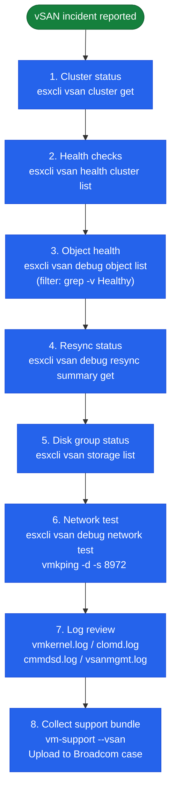

# vSAN — Diagnostics

Diagnostic procedures for vSAN performance, object health, network issues, and disk failures. Use this page when initial health checks do not identify the root cause and deeper investigation is required.

---

## Diagnostic Sequence



## Log Locations

| Log | Location | Contents |
|---|---|---|
| VMkernel | `/var/log/vmkernel.log` | ESXi kernel messages — disk I/O errors, NIC errors, vSAN module messages |
| vSAN management | `/var/log/vsanmgmt.log` | vSAN management plane — health checks, policy changes |
| CLOM | `/var/log/clomd.log` | Cluster Level Object Manager — placement decisions, resync triggers |
| CMMDS | `/var/log/cmmdsd.log` | Cluster monitoring, membership, and directory service — host join/leave events |
| LSOM | `/var/log/vsand.log` | Local Storage Object Manager — on-disk I/O, disk group events |
| VOBD | `/var/log/vobd.log` | vSphere Object-Based Datastore — datastore events |
| Hostd | `/var/log/hostd.log` | Host daemon — vCenter-to-host API, task execution |
| vSAN DDP | `/var/log/vsan-dp.log` | Data protection and IO stats |
| ESXi syslog | `/var/log/syslog.log` | General syslog — includes vsand and clomd messages |

**Useful grep patterns:**

```bash
# Disk errors in vmkernel log
grep -i "scsi\|disk\|naa\|devio\|abort" /var/log/vmkernel.log | grep -i "err\|fail\|warn" | tail -50

# vSAN object events (CLOM decisions)
grep -i "resync\|rebuild\|absent\|degrade" /var/log/clomd.log | tail -50

# CMMDS membership changes (hosts joining/leaving)
grep -i "member\|join\|leave\|partition" /var/log/cmmdsd.log | tail -30

# vSAN management health events
grep -i "fail\|warn\|error" /var/log/vsanmgmt.log | tail -50
```

---

## Performance Diagnostics

### Baseline Checks

```bash
# vSAN Performance Service must be enabled
esxcli vsan perf get

# If disabled, enable from vCenter
# Cluster → Configure → vSAN → Services → Performance Service → Enable
```

### ESXi-Level Performance Stats

```bash
# I/O stats per storage device (IOPS, throughput, latency, errors)
esxcli vsan storage stats get

# vSAN VMDK-level I/O stats
esxcli vsan debug vmdk list

# Congestion indicator (per disk group) — should be 0
esxcli vsan debug disk list
```

### vSAN Performance from vCenter UI

vSphere Client → Cluster → Monitor → vSAN → Performance

| View | Key Metrics |
|---|---|
| Cluster | Read IOPS, Write IOPS, Read Throughput, Write Throughput, Read Latency, Write Latency |
| Host | Per-host breakdown of the above |
| Disk Group | Cache write buffer utilisation, capacity disk IOPS |
| VM | Per-VM front-end IOPS and latency (requires Performance Service) |
| Virtual Disk | Per-VMDK IOPS and latency |

**Alert thresholds for investigation:**

| Metric | Investigate at |
|---|---|
| Read latency (front-end) | > 10 ms sustained |
| Write latency (front-end) | > 20 ms sustained |
| Back-end read latency | > 30 ms (indicates disk issue, not just resync) |
| Congestion | > 0 for > 5 minutes |
| Cache write buffer (OSA) | > 95% sustained |

### Collect Performance Statistics via CLI

```bash
# Real-time storage stats (refresh every 5 seconds for 60 seconds)
watch -n 5 "esxcli vsan storage stats get 2>&1 | head -40"

# Network latency between hosts (MTU-sized packets)
vmkping -I vmk2 -d -s 8972 <peer_vmk_ip> -c 100

# Check for NIC errors (drops, errors, retransmits)
esxcli network nic stats get -n vmnic2
```

### Identify Noisy VMs

```powershell
# PowerCLI — top 10 VMs by write IOPS over last 1 hour
$cluster = Get-Cluster "VSAN-LON-01"
$end   = Get-Date
$start = $end.AddHours(-1)

Get-VM -Location $cluster | ForEach-Object {
    $stats = Get-Stat -Entity $_ -Stat "disk.write.average" `
        -Start $start -Finish $end -IntervalMins 5 -ErrorAction SilentlyContinue
    if ($stats) {
        [PSCustomObject]@{
            VM   = $_.Name
            AvgWriteKBps = [Math]::Round(($stats | Measure-Object -Property Value -Average).Average, 0)
        }
    }
} | Sort-Object AvgWriteKBps -Descending | Select -First 10
```

---

## Object and Component Diagnostics

### List All Objects and Health

```bash
# List all vSAN objects
esxcli vsan debug object list

# Objects that are not healthy
esxcli vsan debug object list | grep -v "Healthy"

# Filter by specific health states
esxcli vsan debug object list | grep -i "absent"
esxcli vsan debug object list | grep -i "degraded"
esxcli vsan debug object list | grep -i "inaccessible"
```

### Object Detail

```bash
# Detailed view of a specific object (get UUID from object list)
esxcli vsan debug object get -u <object-uuid>
```

This shows:
- Object type (vmnamespace, vmswap, vdisk)
- Component locations (which host/disk each component is on)
- Component health state
- Active policy and current compliance

### Component Detail

```bash
# List all components
esxcli vsan debug component list

# Components on a specific host
esxcli vsan debug component list | grep <host-uuid>

# Absent components
esxcli vsan debug component list | grep -i "absent"
```

### Map Object to VM

```powershell
# Find which VM owns a specific vSAN object UUID
Connect-VIServer <vcenter>

$targetUUID = "<object-uuid>"
Get-VM | ForEach-Object {
    $vm = $_
    $vm.ExtensionData.Config.Hardware.Device |
        Where-Object { $_ -is [VMware.Vim.VirtualDisk] } |
        ForEach-Object {
            if ($_.Backing.BackingObjectId -eq $targetUUID) {
                Write-Host "VM: $($vm.Name), Disk: $($_.DeviceInfo.Label)"
            }
        }
}
```

---

## Network Diagnostics

### End-to-End Connectivity Test

```bash
# vSAN built-in network test (tests all unicast agents)
esxcli vsan debug network test

# Manual ping to specific peer (replace with peer vSAN vmkernel IP)
vmkping -I vmk2 192.168.100.11

# Large packet test (MTU 9000)
vmkping -I vmk2 -d -s 8972 192.168.100.11

# Test to all cluster hosts (scripted)
PEERS="192.168.100.11 192.168.100.12 192.168.100.13"
for p in $PEERS; do
    echo -n "Ping $p: "
    vmkping -I vmk2 -d -s 8972 $p -c 10 | grep -E "loss|received"
done
```

### Verify vSAN VMkernel Configuration

```bash
# Confirm vmkernel adapter and vSAN tag
esxcli vsan network list
esxcli network ip interface tag get -i vmk2

# Expected output: VSAN tag present

# Verify IP and MTU
esxcli network ip interface list | grep -A10 vmk2

# Check routing — all vSAN peers must be on same subnet or route must exist
esxcli network ip route ipv4 list
```

### NIC and Switch Diagnostics

```bash
# Check NIC link speed and duplex
esxcli network nic get -n vmnic2

# Check for NIC errors
esxcli network nic stats get -n vmnic2

# Check CDP/LLDP — what switch port is connected
esxcli network nic get -n vmnic2 | grep -i "CDP\|LLDP\|switch"
```

Expected NIC state: 25 GbE or 10 GbE, full duplex, zero errors. Any errors/discards on the NIC indicate physical layer issues (cable, SFP, switch port).

---

## Disk and Disk Group Diagnostics

### Disk Health

```bash
# All vSAN storage devices and their health
esxcli vsan storage list

# SMART data for a specific disk
esxcli storage core device smart get -d <naa>
# Check: Reallocated sectors, Pending sectors, Uncorrectable errors — any non-zero = failing drive

# Disk I/O errors in vmkernel log
grep "naa.<device-id>" /var/log/vmkernel.log | grep -i "err\|fail\|abort" | tail -20
```

### Disk Group Status

```bash
# Disk group composition — cache and capacity disks
esxcli vsan storage list | grep -E "Is SSD|Disk Group UUID|naa\.|Display Name|Tier"

# Check for LSOM errors
grep -i "lsom\|diskgroup" /var/log/vmkernel.log | grep -i "err\|fail" | tail -30
```

### Force a Disk Check (LSOM)

```bash
# Run a vSAN storage check (surface scan-equivalent for vSAN)
esxcli vsan storage check

# This runs the built-in disk consistency check — may take several minutes
# Output shows any inconsistencies found
```

---

## Support Bundle Collection

Collect a support bundle before opening a VMware support case. The bundle includes logs from all cluster hosts and vCenter.

### From vCenter UI

vSphere Client → Menu → Administration → Export System Logs

Select:
- vCenter Server logs
- All ESXi hosts in the vSAN cluster
- Include vSAN logs (checkbox in the export dialog)

This generates a `.zip` file with all logs consolidated.

### From VCSA Shell

```bash
# Generate support bundle from VCSA (SSH to VCSA as root)
vc-support -l /tmp/vc-support-bundle

# This generates a .tgz in /tmp — download via SCP or SFTP
```

### From ESXi Shell (Individual Host)

```bash
# Collect ESXi support bundle (runs vm-support)
vm-support --log-level 6 --vsan

# Output written to /var/tmp/vmsupport/
# Transfer to support-accessible location
scp /var/tmp/vmsupport/*.tgz user@jumphost:/tmp/
```

### vSAN-Specific Log Collection

```bash
# Collect vSAN traces (more detailed than standard support bundle)
esxcli vsan trace get -t 300 -d /tmp/vsantrace

# Collect CMMDS state dump
python /usr/lib/vmware/vsan/bin/cmmds-tool.py enumerate -d /tmp/cmmds-dump.json
```

---

## vsish Diagnostics (Advanced)

`vsish` (vSphere Internal Shell) provides low-level kernel statistics. Use only when directed by VMware Support.

```bash
# Access vsish
vsish

# List vSAN disk information at kernel level
get /vmkModules/lsom/disks/

# Get specific disk stats
get /vmkModules/lsom/disks/<disk-uuid>/stats

# CMMDS internal state
get /reliability/cmmds/

# Exit vsish
exit
```

---

## RVC Diagnostic Commands (Legacy)

RVC (Ruby vSphere Console) is available on the VCSA appliance for older cluster diagnostics.

```bash
# SSH to VCSA, then launch RVC
rvc administrator@vsphere.local@vcenter.example.com

# Navigate to cluster
ls
cd localhost/Production/computers/VSAN-LON-01/

# Run full health check
vsan.health.health_check .

# Disk stats per host
vsan.disks_stats .

# Object compliance report
vsan.obj_status_report .

# Resync dashboard
vsan.resync_dashboard . --refresh-rate 30

# Network diagnostics
vsan.test_network_perf .
```

RVC is primarily useful for vSAN 6.x clusters. Modern clusters (7.x/8.x) should use `esxcli vsan` commands and the Skyline Health UI.
