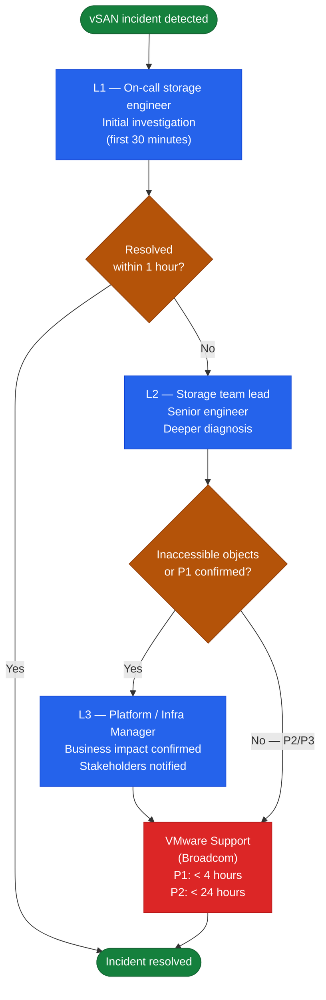

---
tags:
  - troubleshooting
  - vmware
  - vsan
  - vsphere-8
---
# vSAN — Escalation


<div class="kb-summary">
Guidance on when to escalate vSAN incidents to VMware (Broadcom) support, what to collect before opening a case, and how to manage escalation effectively.
</div>

```text
┌────────────────────────────────────────── vSAN — Escalation ──────────────────────────────────────────┐
│                                                                                                       │
│  Escalate vSAN issues to VMware GSS when data is at risk, resync is stalled,                          │
│  or cluster is degraded below FTT policy with no recovery path.                                       │
│                                                                                                       │
│   ┌──────────────────────────────────────────────┐  ┌─────────────────────────────────────────────┐   │
│   │             Escalation Triggers              │  │             Pre-Escalation Steps            │   │
│   │            Multiple disk failures            │  │            Collect support bundle           │   │
│   │             All objects degraded             │  │           Run vm-support on hosts           │   │
│   │           Resync stalled >4 hours            │  │          Note exact error messages          │   │
│   │         Data inaccessible / I/O hang         │  │          Capture cmmds-tool output          │   │
│   └──────────────────────────────────────────────┘  └─────────────────────────────────────────────┘   │
│                                                                                                       │
│  Multiple simultaneous disk failures require urgent GSS engagement; data may be at risk.              │
│                                                                                                       │
│                          ▼                                                 ▼                          │
│                                                                                                       │
│   ┌──────────────────────────────────────────────┐  ┌─────────────────────────────────────────────┐   │
│   │                GSS Engagement                │  │               Escalation Path               │   │
│   │            Open P1 SR immediately            │  │             T1: triage + bundle             │   │
│   │          Include vSAN build number           │  │             T2: vSAN SE assigned            │   │
│   │          Attach support bundle ZIP           │  │            T3: engineering review           │   │
│   │            Do NOT power off hosts            │  │             CritSit if data lost            │   │
│   └──────────────────────────────────────────────┘  └─────────────────────────────────────────────┘   │
│                                                                                                       │
│  Physical Infrastructure (the hardware everything above runs on):                                     │
│  Do not touch physical disks or power cycle hosts without GSS guidance when data                      │
│  is degraded; further failures may push below quorum threshold.                                       │
│                                                                                                       │
│  Key terms:                                                                                           │
│                                                                                                       │
│  Degraded      = FTT policy not met; one more failure = data loss                                     │
│  Quorum        = majority of object components must be accessible                                     │
│  I/O hang      = VMs stalled waiting for storage; immediate P1                                        │
│  Support bundle= includes all vSAN host logs + CMMDS metadata                                         │
│  vm-support    = per-host diagnostic bundle; run on all affected hosts                                │
│  cmmds-tool    = shows component placement; critical for GSS triage                                   │
│  P1 SR         = highest priority SR; triggers 24/7 oncall response                                   │
│  CritSit       = Critical Situation; executive escalation; 24/7 war room                              │
│  T2/T3         = senior SE or engineering involvement                                                 │
│  Do not power off= hosts hold component data; powering off worsens state                              │
│  Build number  = vSAN version from: esxcli vsan cluster get                                           │
│  GSS           = Global Support Services (VMware/Broadcom)                                            │
│                                                                                                       │
└───────────────────────────────────────────────────────────────────────────────────────────────────────┘
```
## Support Bundle

Generate a full support bundle before opening the case (see Diagnostics → Support Bundle Collection):

```bash
# VCSA shell — generate support bundle
vc-support -l /tmp/vc-support-$(date +%Y%m%d).tgz

# ESXi host shell — per-host bundle for each affected host
vm-support --log-level 6 --vsan
```

Upload the bundle to the case when prompted. Bundles can be uploaded via the Broadcom support portal or via the `sftp` transfer instructions provided in the case.

---

## Opening the Case

### Broadcom Support Portal

URL: [https://support.broadcom.com](https://support.broadcom.com)

1. Log in with your Broadcom account (linked to your support entitlement).
2. Navigate to **Support** → **Open a Support Request**.
3. Select product: **VMware vSAN** or **VMware vSphere**.
4. Enter severity and summary.
5. Paste the environment information and state capture output.
6. Attach the support bundle.

### Phone Escalation (P1)

For P1 cases, do not rely on portal submission alone. Call the VMware support line:
- North America: +1 (877) 486-9273
- EMEA: +44 (0)3453 700 100
- Full list: [https://support.broadcom.com/](https://support.broadcom.com/)

State "Priority 1 — production down" clearly at the start of the call. Request direct assignment to a vSAN support engineer.

---

## Working the Case

### What to Expect from VMware Support

| Stage | Typical Timeline | What Happens |
|---|---|---|
| Initial response | P1: < 30 min; P2: < 2 hours; P3: < 8 hours | Engineer assigned; initial data request |
| Data analysis | 1–4 hours after data receipt | Engineer reviews bundle, logs, state capture |
| Root cause | P1: same day; P2: 1–3 days | Identified or escalated to engineering |
| Resolution | Varies | Workaround or patch provided |

### Maintain a Case Log

Keep a running log of:
- Case number and assigned engineer name.
- All data submitted and when.
- Each action taken and its result.
- Timestamps of all communications.

This is especially important for P1 cases where multiple engineers may be involved across shifts.

### Escalate Within Support (if Needed)

If progress stalls:

1. Request escalation to a senior vSAN engineer or vSAN team lead.
2. If case severity is not being treated appropriately, contact your account team or TAM (Technical Account Manager).
3. For critical data loss scenarios, request a Conference Bridge call with the vSAN engineering team.

---

## Internal Escalation Path

Define your internal escalation path before an incident occurs:



| Level | Role | When |
|---|---|---|
| L1 | On-call storage engineer | Initial investigation — first 30 minutes |
| L2 | Storage team lead / senior engineer | L1 cannot resolve within 1 hour, or any inaccessible objects |
| L3 | Platform or infrastructure manager | P1 incident declared, business impact confirmed |
| Vendor | VMware Support | L2 cannot identify root cause within 4 hours (P1) or 24 hours (P2) |

Document the escalation path in your runbook and ensure on-call contacts are current and tested.

---

## Post-Incident Actions

After a vSAN incident is resolved, complete the following:

### Root Cause Analysis (RCA)

| Section | Contents |
|---|---|
| Incident summary | What failed, when, what was impacted |
| Timeline | Chronological list of events, detections, and actions |
| Root cause | Hardware failure, software bug, misconfiguration, operator error |
| Contributing factors | Capacity headroom, FTT policy, monitoring gaps |
| Resolution | Steps taken to resolve |
| Preventive actions | What changes will prevent recurrence |

### Preventive Actions Checklist

After any disk or disk group failure:

- [ ] Verify FTT policy is appropriate for the cluster size and risk tolerance.
- [ ] Confirm disk replacement SLA with hardware vendor — how quickly can a replacement arrive?
- [ ] Review capacity headroom — was the cluster above 70% before the failure?
- [ ] Confirm resync throttle policy — is it set too low, slowing recovery?
- [ ] Review monitoring — was the disk failure detected before it caused an outage?
- [ ] Check HCL compliance — was the failed disk on the vSAN HCL?
- [ ] Verify NTP configuration — time drift can mask or complicate disk group failures.

After any network-related vSAN issue:

- [ ] Document the vSAN network topology (switch, port, VLAN, MTU) for all hosts.
- [ ] Confirm MTU is 9000 end-to-end and tested with `vmkping -d -s 8972`.
- [ ] Review NIOC configuration — is vSAN traffic getting adequate bandwidth share?
- [ ] Confirm redundancy — are vSAN vmkernels teamed across two physical NICs?

### VMware Knowledge Base

Search the VMware Knowledge Base before and after incidents:
[https://knowledge.broadcom.com](https://knowledge.broadcom.com)

Search by: error message, health check name, symptom description. Many vSAN issues have published KB articles with specific resolution steps.
