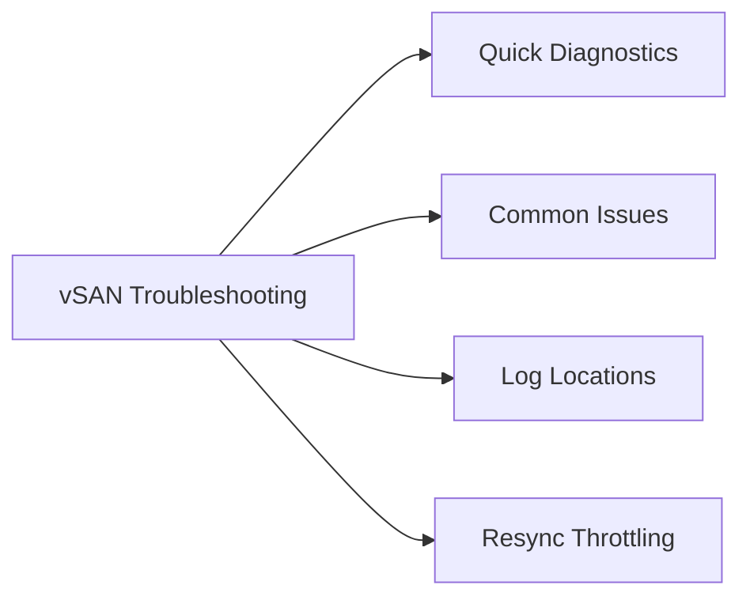

# vSAN Troubleshooting

Reference procedures for diagnosing vSAN issues.

<div class="kb-grid kb-grid-3">
<a class="kb-card" href="resync-review/"><strong>Resync Review</strong><span>Reviewing resync activity, object health, and assessing rebuild impact on cluster performance.</span></a>
</div>



## Quick Diagnostics

### Cluster Health Overview

```bash
# Via ESXi shell on any cluster host
esxcli vsan cluster get            # Cluster UUID, membership
esxcli vsan health cluster list    # List all health test results
esxcli vsan health cluster get -t "Overall cluster health"
```

### Object Health

```bash
# List unhealthy objects
esxcli vsan debug object list | grep -v "healthy"

# Get detail on a specific object
esxcli vsan debug object get -u <object-uuid>

# Check resync progress
esxcli vsan debug resync list       # Current resync operations
esxcli vsan debug resync summary    # Summary of resync bytes remaining
```

### Disk and Host Diagnostics

```bash
# Check disk groups
esxcli vsan storage list

# Check disk health
esxcli vsan storage check

# Check network partition (all hosts must see all others)
esxcli vsan network ip list
esxcli vsan debug controller list
```

## Common Issues

| Symptom | Likely Cause | First Check |
|---|---|---|
| vSAN object degraded | Host or disk failure | vSAN Health → Disk Health |
| High resync traffic | Host just came back / disk replaced | `esxcli vsan debug resync summary` |
| vSAN latency elevated | Disk congestion or network issue | Aria Ops → vSAN → Disk Latency dashboard |
| Cluster capacity low | Thin provisioning over-allocation | vSAN capacity widget; check slack space |
| vSAN Health alarm: "Unicast agent unreachable" | Network issue on vSAN VMkernel | Ping vSAN VMK IPs between all hosts |
| Policy compliance = 0% | All required witnesses/replicas gone | Check host count vs. FTT policy |

## Log Locations

```bash
# vSAN observer / diagnostic bundle
# vCenter UI → Cluster → Monitor → vSAN → Support → Generate Cluster Support Bundle

# Live vSAN logs on ESXi host
tail -f /var/run/log/vmkernel.log | grep -i vsan
```

## Resync Throttling

During planned maintenance, throttle resync bandwidth to reduce impact on production workloads:

```bash
# On cluster hosts — throttle resync to 25% of max
esxcli vsan debug resync throttle -p 25

# Remove throttle when maintenance is complete
esxcli vsan debug resync throttle -p 100
```
