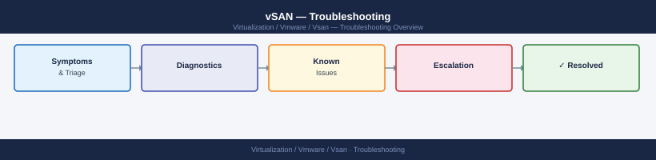

---
tags:
  - troubleshooting
  - vmware
  - vsan
  - vsphere-8
search:
  boost: 1.5
---
# vSAN — Troubleshooting

Troubleshooting reference for VMware vSAN. Covers common failure patterns, diagnostic commands, log collection, and escalation procedures for engaging VMware support.

*Applies to: vSAN 7.x / 8.x*

<a class="kb-card" href="common-issues/">
  <strong>Common Issues</strong>
  Frequently seen problems and resolution steps.
</a>

<a class="kb-card" href="diagnostics/">
  <strong>Diagnostics</strong>
  Log locations, diagnostic commands, and data collection.
</a>

<a class="kb-card" href="escalation/">
  <strong>Escalation</strong>
  When and how to escalate to VMware support.
</a>

