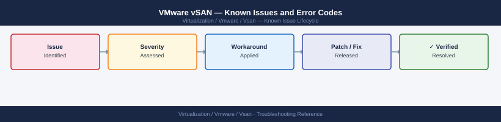

---
tags:
  - troubleshooting
  - vsan
  - vmware
  - known-issues
  - vsphere-8
---
# VMware vSAN — Known Issues and Error Codes

<div class="kb-summary">
Catalog of known vSAN bugs, error codes, and workarounds including degraded component handling, resync issues, and health check false positives.

*Applies to: vSAN 7.x / 8.x (ESA and OSA)*
</div>



```d2
direction: down

symptom: Identify Symptom {shape: diamond}
degraded_objects_and_resync: "Degraded Objects and Resync" {shape: rectangle}
health_check_false_positives: "Health Check False Positives" {shape: rectangle}
capacity_and_encryption: "Capacity and Encryption" {shape: rectangle}
file_services: "File Services" {shape: rectangle}
stretched_cluster: "Stretched Cluster" {shape: rectangle}
resolution: Resolve or Escalate {shape: oval}

symptom -> degraded_objects_and_resync: investigate
symptom -> health_check_false_positives: investigate
symptom -> capacity_and_encryption: investigate
symptom -> file_services: investigate
symptom -> stretched_cluster: investigate
degraded_objects_and_resync -> resolution
health_check_false_positives -> resolution
capacity_and_encryption -> resolution
file_services -> resolution
stretched_cluster -> resolution
```

## Before you begin

- Check `esxcli vsan health cluster list` for active health alarms before assuming a known bug.
- vSAN ESA (Express Storage Architecture) and OSA (Original Storage Architecture) have separate bug tracks — note which applies.
- Run `cmmds-tool find -t DOM_OBJECT` to inspect object health directly.

## Degraded Objects and Resync

| Error / Symptom | Affected Versions | Cause | Workaround / Fix | Fixed In |
|---|---|---|---|---|
| Resync stuck at 0 bytes remaining but objects still degraded | vSAN 7.x | DOM owner reassignment race during resync | Run `esxcli vsan debug resync summary get`; restart DOM owner VM or reboot ESXi host | 7.0 U3 |
| Objects show `Absent` after host maintenance exit | vSAN 7.x / 8.x | Component rebuild delayed by 60-minute timer | Wait 60 minutes after maintenance exit; accelerate with `esxcli vsan debug resync start` | N/A |
| `Immediate resync` not triggering after disk replacement | vSAN 7.0 U1 | Disk claimed but DOM not triggering rebuild | Restart `vsanmgmtd` on owning host | 7.0 U2 |

## Health Check False Positives

| Error / Symptom | Affected Versions | Cause | Workaround / Fix | Fixed In |
|---|---|---|---|---|
| `vSAN Build Recommendation` health alarm after upgrade | vSAN 7.x / 8.x | CEIP / Cloud Health comparison uses stale build database | Disable or acknowledge; update CEIP opt-in to refresh | N/A |
| `Controller firmware` health check fails on qualified HBA | vSAN 7.x | HBA firmware on HCL but health check uses stale HCL cache | Sync HCL database: `esxcli vsan cluster hcl-db sync` | N/A |
| `Unicast agent` alarm on healthy stretched cluster witness | vSAN 7.x | Witness appliance reports unicast agent warning falsely | Confirm witness connectivity via `esxcli vsan cluster unicastagent list` | 7.0 U3 |

## Capacity and Encryption

| Error / Symptom | Affected Versions | Cause | Workaround / Fix | Fixed In |
|---|---|---|---|---|
| Deduplication savings drop to 0% unexpectedly | vSAN OSA 7.x | Dedup engine paused during high-load resync | Dedup resumes automatically when resync completes | N/A |
| vSAN encryption key re-key fails: `KMS unreachable` | vSAN 7.x / 8.x | KMS not reachable from all ESXi hosts (not just vCenter) | Ensure KMS reachable on port 5696 from all ESXi VMkernel management IPs | N/A |
| Capacity alarm at 70% even with correct object policy | vSAN 7.x | Slack space reserved for rebuild operations counts toward used capacity | Normal behavior; expand cluster or reduce FTT policy | N/A |

## File Services

| Error / Symptom | Affected Versions | Cause | Workaround / Fix | Fixed In |
|---|---|---|---|---|
| vSAN File Services NFS share returns `Access Denied` after ESXi upgrade | vSAN 7.0 U2 | File service agent VM NFS export config reset during upgrade | Re-configure NFS share permissions via vSAN File Service UI | 7.0 U3 |

## Stretched Cluster

| Error / Symptom | Affected Versions | Cause | Workaround / Fix | Fixed In |
|---|---|---|---|---|
| Witness appliance loses vSAN connectivity after IP change | vSAN 7.x / 8.x | vSAN unicast agent cache uses old IP | Update preferred fault domain and witness IP; re-add witness via vSAN → Configure → Fault Domains | N/A |
| Split-brain after network partition: preferred site not winning | vSAN 7.x | Partition bias config not set or overridden by `vSANForceProvisioning` | Confirm `vSAN.DOMOwnerForceProvisioning = 0`; verify preferred fault domain | N/A |

## See also

- [VMware vSAN — Common Issues](common-issues/)
- [VMware ESXi — Known Issues](../../esxi/troubleshooting/known-issues.md)
- [VMware vCenter — Known Issues](../../vcenter/troubleshooting/known-issues.md)
