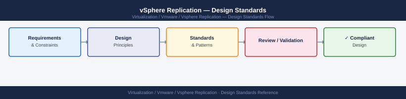

---
tags:
  - architecture
  - vmware
  - vsphere-replication
---
# vSphere Replication — Design Standards

<div class="kb-summary">
Design Standards reference covering VRA Sizing, VRS Sizing, Bandwidth Estimation, RPO Selection, Target Datastore Sizing and 3 more sections.

*Applies to: vSphere Replication 8.x*
</div>


  Sizing and Bandwidth Design

---

## VRA Sizing

| Deployment Size | VMs Replicated | vCPU | RAM | Disk |
|---|---|---|---|---|
| Small | Up to 200 | 2 | 8 GB | 100 GB |
| Medium | Up to 500 | 4 | 16 GB | 100 GB |
| Large | Up to 2000 (with VRS) | 4 | 16 GB | 100 GB |

A single VRA can handle up to 500 replicated VMs. Above 500, deploy vSphere Replication Servers (VRS) to distribute the load.

---

## VRS Sizing

| VRS Count | Additional VMs |
|---|---|
| 1 VRS | +500 VMs (total 1000 with 1 VRA + 1 VRS) |
| 2 VRS | +1000 VMs (total 1500) |
| Each additional VRS | +500 VMs |

---

## Bandwidth Estimation

Use this formula to estimate replication bandwidth:

```text
Required bandwidth (Mbps) = (Daily change rate in GB × 8) / (86400 × RPO in seconds)

Example:
  VM with 200 GB disk, 5% daily change rate = 10 GB changed/day
  RPO: 1 hour (3600 seconds)
  Bandwidth = (10 × 1024 × 8) / (86400 × 3600 / 3600) = ~81600 / 86400 = ~0.95 Mbps per VM
```

Rule of thumb: assume 1–2 Mbps per VM for typical enterprise workloads with 1-hour RPO. High-churn databases may require 5–10 Mbps per VM.

| Workload Type | Typical Change Rate | Bandwidth (1hr RPO) |
|---|---|---|
| File/Print server | 1–2% daily | <0.5 Mbps |
| Web/App server | 2–5% daily | 1–2 Mbps |
| Database (moderate) | 5–15% daily | 3–8 Mbps |
| Database (high-write) | 15–30% daily | 8–20 Mbps |

---

## RPO Selection

| RPO | Minimum Required Bandwidth | Notes |
|---|---|---|
| 5 minutes | High — 12× the 1-hour bandwidth | Suitable only for low-churn, high-bandwidth links |
| 15 minutes | Moderate-high | Practical minimum for most workloads |
| 1 hour | Moderate | Good balance — recommended default |
| 4 hours | Low | Acceptable for non-critical workloads |
| 24 hours | Minimal | Only for batch/archive workloads |

---

## Target Datastore Sizing

```text
Target datastore required space per VM =
  Source disk size + (N recovery point instances × average delta size)

  Default recovery point instances: 3
  Each delta = ~1–5% of VM disk size (depends on churn)

Example:
  100 GB VM, 3 recovery points, 2 GB average delta per point
  Required: 100 GB + (3 × 2 GB) = 106 GB minimum
```

Add 20% headroom on top of this estimate.

---

## Replication Network Design

| Design Choice | Recommendation |
|---|---|
| Dedicated VLAN | Yes — isolate replication traffic from production traffic |
| MTU | 9000 (jumbo frames) for high-throughput replication |
| WAN acceleration | Optional — reduces bandwidth but adds latency |
| Encryption | Enable per-VM if replicating over untrusted WAN |
| Firewall | TCP 31031 (source ESXi → target VRA) must be open |

---

## Latency Limits

vSphere Replication is tested and supported with up to 100ms RTT between sites. For links with >100ms RTT:
- Increase RPO to reduce required bandwidth
- Contact VMware Support for guidance on high-latency deployments

---

## Naming Conventions

| Object | Convention | Example |
|---|---|---|
| VRA appliance | `vra-<site>` | `vra-london`, `vra-amsterdam` |
| VRS appliance | `vrs-<site>-<number>` | `vrs-london-01` |
| Replication groups (in SRM) | `<workload>-vr-pg` | `sql-vr-pg`, `webapp-vr-pg` |

## See also

- [vSphere Replication — How It Works](../how-it-works/)
- [vSphere Replication — Deploy](../../deploy/)
