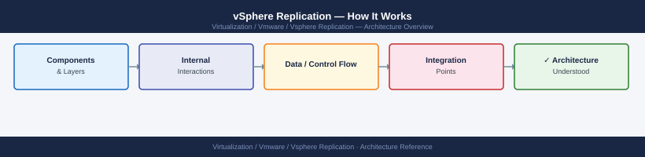
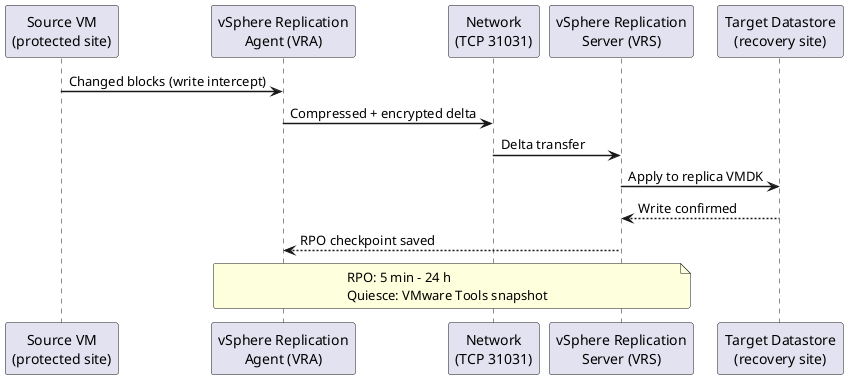
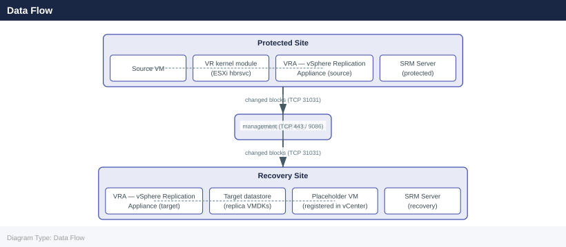

---
tags:
  - architecture
  - vmware
  - vsphere-replication
---
# vSphere Replication — How It Works

<div class="kb-summary">
How It Works reference covering Replication Engine — ESXi Kernel Module, Data Flow, RPO Mechanics, VRA Role — vSphere Replication Appliance, VRS — vSphere Replication Server (Scale-Out) and 2 more sections.

*Applies to: vSphere Replication 8.x*
</div>




## Replication Engine — ESXi Kernel Module

vSphere Replication operates at the hypervisor level using a kernel module (`hbr` — Host-Based Replication) loaded on each ESXi host. This module intercepts write I/Os to VM virtual disks and tracks which disk blocks have changed since the last replication cycle — functionally equivalent to Changed Block Tracking (CBT) but implemented as a separate subsystem within the VMkernel.

The tracking is per-VMDK. When a VM disk write occurs, the kernel module marks the corresponding block in a bitmap. At the end of each replication cycle, changed blocks are read from the source datastore and transmitted to the target VRA. This approach is storage-agnostic — it does not rely on array-level snapshotting or replication, and works with any datastore type: VMFS, NFS, vSAN.

Key distinction from CBT: CBT (used by backup tools) is VMware-managed and exposed via the VDDK API. The hbr tracking is internal to the replication subsystem and cannot be queried via the backup APIs. Both can run simultaneously without conflict.

### hbrsvc — The Replication Daemon

The `hbrsvc` service runs on each ESXi host that has VMs configured for replication. It is responsible for:

- Maintaining the changed-block bitmap for each replicated VMDK
- Managing the TCP connection from the source ESXi host to the target VRA on port 31031
- Executing the data transfer at each replication cycle end
- Reporting replication status back to the vSphere Replication Management Server (VRMS) on the VRA

```bash
# Check hbrsvc status on ESXi host (via SSH to ESXi)
/etc/init.d/hbrsvc status

# List active replication tasks on the host
esxcli hbr replication list

# Show detailed replication state for all VMs on this host
esxcli hbr replication getstate

# View hbrsvc log on ESXi
tail -f /var/log/hbr.log

# Check if hbr kernel module is loaded
vmkload_mod -l | grep hbr

# Show hbr replication stats for a specific VM (by moref or VM ID)
esxcli hbr replication getstate -i <vmid>
```


```text title="Expected output"
hbrsvc is running.
VM-1234 (prod-web-01): Replication State: Active, RPO: 5 minutes, Last sync: 2024-01-15 14:32:18 UTC
VM-5678 (prod-db-02): Replication State: Active, RPO: 15 minutes, Last sync: 2024-01-15 14:31:45 UTC
VM-9012 (dev-app-03): Replication State: Paused, RPO: N/A, Last sync: 2024-01-15 13:22:10 UTC

VM-1234 (prod-web-01):
  State: Active
  RPO: 5 minutes
  Checkpoint: 2024-01-15 14:32:18.123456 UTC
  Replicated Data: 45.2 GB
  Network Throughput: 12.5 Mbps

2024-01-15T14:35:22.456Z [hbrsvc] Replication checkpoint completed for VM-1234
2024-01-15T14:35:45.789Z [hbrsvc] Syncing VM-5678 checkpoint data
2024-01-15T14:36:01.234Z [hbrsvc] Network latency detected: 125ms to replication server
2024-01-15T14:36:15.567Z [hbrsvc] Checkpoint VM-9012 paused by user request

hbr 1.0.0 loaded
```

!!! warning "Common errors"
    **`hbrsvc is stopped.`** — Run `service hbrsvc start` or `/etc/init.d/hbrsvc start` to restart the replication service.
    **`Error: Unknown command or invalid option`** — Verify the ESXi version supports the `esxcli hbr` command (requires vSphere Replication 8.0+) and check command syntax against your version's documentation.
    **`No replication tasks found`** — Confirm that replication is configured for VMs on this host by checking the vSphere Replication appliance management interface and verifying target site connectivity.
### Changed Block Tracking vs hbr Bitmap

| Property | CBT (Backup) | hbr (VR) |
|---|---|---|
| Scope | Per-VMDK snapshot delta | Per-VMDK continuous write tracking |
| Reset trigger | Snapshot create/delete | RPO cycle completion |
| API exposure | VDDK QueryChangedDiskAreas | Internal — not externally queryable |
| Storage dependency | None | None |
| Simultaneous operation | Compatible | Can run alongside CBT |
| Consistency model | Crash-consistent (or quiesced) | Crash-consistent (or quiesced with VMware Tools) |

---

## Data Flow



```text
Source Site                                    Target Site
-----------                                    -----------
VM VMDK Write
     |
ESXi hbr kernel module
  (tracks changed blocks in bitmap)
     |
  [RPO cycle expires]
     |
hbrsvc reads changed blocks
  from source datastore
     |
TCP 31031 ──────────────────────────────────► VRA HMS
                                               (target site)
                                                    |
                                              Write changed blocks
                                              to replica VMDK
                                              on target datastore
                                                    |
                                              Update recovery point
                                              instance (snapshot)
                                                    |
                                              VRMS updates replication
                                              status in vCenter DB
```

The source VRA (VRMS) handles management and scheduling only. Replication data does NOT route through the source-site VRA — it flows directly from the ESXi host running the VM to the target-site VRA's HMS service.

### Port Reference

| Port | Protocol | Direction | Purpose |
|---|---|---|---|
| 31031 | TCP | Source ESXi → Target VRA | Replication data stream |
| 44046 | TCP | VRA ↔ VRA | VRA-to-VRA management (pairing, control) |
| 443 | HTTPS | VRA → vCenter | VRA registration and vCenter API calls |
| 8043 | HTTPS | vCenter → VRA | vCenter plugin calling VR management API |
| 5480 | HTTPS | Admin → VRA | VAMI appliance management UI |
| 22 | SSH | Admin → VRA | Appliance CLI access |

---

## RPO Mechanics

RPO (Recovery Point Objective) is configured per VM and specifies the maximum acceptable data loss window. Supported range: **5 minutes to 24 hours** (in 5-minute increments up to 1 hour, then in 1-hour increments up to 24 hours).

### How RPO Is Met

vSphere Replication uses a continuous-tracking model within each RPO window — not a scheduled snapshot-then-transfer approach:

1. The hbr module tracks every write to the VMDK continuously from the moment replication is configured
2. When the RPO timer elapses, hbrsvc transmits the accumulated changed blocks to the target VRA
3. The VRA at the target site writes these blocks into the replica VMDK
4. A new recovery point instance is created at the target site
5. The RPO timer resets and tracking continues

If the data transfer completes before the RPO timer expires, the system is ahead of its RPO — actual recovery point age will be less than the configured value. If the transfer takes longer than the RPO window (insufficient bandwidth or excessive change rate), the VM enters RPO violation.

### Delta Calculation

The replication engine does not diff full disk images each cycle. The hbr bitmap accumulated during the previous RPO window defines exactly which blocks changed. Only those blocks are read from the source datastore and transmitted. Transfer size is proportional to the VM's write I/O rate, not its total disk size.

Example:
- VM total disk: 500 GB
- Write rate: 10 GB/day
- RPO: 1 hour
- Transfer per cycle: `10 GB ÷ 24 hours ≈ 416 MB per cycle`

### RPO Compliance States

| Status | Meaning |
|---|---|
| OK (green) | Last successful sync completed within configured RPO window |
| Warning (yellow) | Replication lag approaching RPO threshold (>80% of RPO elapsed) |
| Error (red) | No successful sync within the RPO window — recovery point is stale |
| Not started | Initial full sync in progress — no recovery point available yet |
| Paused | Replication manually paused — RPO compliance suspended |

A VM in RPO violation cannot be recovered to a point within the configured RPO window. The most recent recovery point may be older than the RPO specifies.

---

## VRA Role — vSphere Replication Appliance

The VRA is a Linux-based virtual appliance deployed at each site. It runs two primary services:

| Service | Systemd Name | Function |
|---|---|---|
| HMS | `hms` | Host Management Service — receives replication data from source ESXi hbrsvc, writes to target datastore, manages recovery point instances |
| VRMS | `vrms` | vSphere Replication Management Server — registers with vCenter as extension, exposes VR plugin UI, manages site pairing and replication configuration |

### Recovery Point Instances

At the target site, the VRA maintains multiple recovery point instances per VM. Each instance represents a consistent state of the VM's disks at a specific point in time, implemented as VMDK snapshots on the target datastore.

- Default: 3 recovery point instances per VM
- Configurable range: 1–24 instances
- Storage overhead: base replica VMDK + (N × average changed data per cycle)
- Instances are managed as a ring buffer — oldest is discarded when a new one is created and the max count is reached

```text
Target Datastore Layout (per replicated VM):
  <VM-name>/
    <VM-name>.vmdk          ← base replica disk (merged latest state)
    <VM-name>-000001.vmdk   ← delta disk for recovery point N-2
    <VM-name>-000002.vmdk   ← delta disk for recovery point N-1
    <VM-name>-000003.vmdk   ← delta disk for recovery point N (most recent)
    <VM-name>.hbr           ← replication metadata
    <VM-name>.vrepl         ← replication state file
```

### VRA Services Management

```bash
# SSH to VRA appliance
ssh admin@<VRA-FQDN>

# Check HMS service (replication data reception)
systemctl status hms

# Check VRMS service (management/UI layer)
systemctl status vrms

# Restart HMS — interrupts active data transfer momentarily
systemctl restart hms

# Restart VRMS — reloads management layer; does not interrupt data plane
systemctl restart vrms

# Tail HMS log
tail -f /var/log/vmware/hms/hms.log

# Tail VRMS log
tail -f /var/log/vmware/vrms/vrms.log

# List all VR-related services
systemctl list-units | grep -E 'hms|vrms|lighttpd'
```


```text title="Expected output"
admin@vra-prod-01.corp.local's password: 
● hms.service - VMware vSphere Replication HMS
     Loaded: loaded (/etc/systemd/system/hms.service; enabled; vendor preset: enabled)
     Active: active (running) since Wed 2024-01-17 14:32:18 UTC; 2 days ago
   Main PID: 2847 (java)
      Tasks: 47 (limit: 4915)
     Memory: 512.3M
        CPU: 2h 14m 32s
● vrms.service - VMware vSphere Replication VRMS
     Loaded: loaded (/etc/systemd/system/vrms.service; enabled; vendor preset: enabled)
     Active: active (running) since Wed 2024-01-17 14:32:25 UTC; 2 days ago
   Main PID: 3156 (java)
      Tasks: 52 (limit: 4915)
     Memory: 768.1M
        CPU: 3h 8m 19s
=== HMS restart ===
2024-01-17T14:45:22.891Z INFO [HMS-Bootstrap] Initializing replication data receiver on port 44046
2024-01-17T14:45:23.156Z INFO [HMS-Bootstrap] HMS service started successfully
=== VRMS restart ===
2024-01-17T14:45:31.402Z INFO [VRMS-UI] Management layer reloaded
2024-01-17T14:45:31.598Z INFO [VRMS-UI] Web console available at https://vra-prod-01.corp.local:5480
=== HMS log tail ===
2024-01-17T14:45:22.891Z INFO Replication queue depth: 847 objects
2024-01-17T14:45:23.156Z INFO Data transfer rate: 156.2 MB/s
2024-01-17T14:45:24.203Z WARN Incoming replication from site-b delayed by 2.3s
=== VRMS log tail ===
2024-01-17T14:45:31.402Z INFO UI session established for user admin
2024-01-17T14:45:31.598Z INFO vSphere Replication dashboard loaded
=== Service list ===
hms.service                                    loaded active running   VMware vSphere Replication HMS
vrms.service                                   loaded active running   VMware vSphere Replication VRMS
lighttpd.service                               loaded active running   Lightweight HTTP Server
```

!!! warning "Common errors"
    **`Connection refused`** — Verify the VRA appliance hostname/IP is correct and SSH port 22 is accessible from your management network.
    **`Unit hms.service not found`** — Confirm you are connected to a valid VRA appliance; this service only exists on vSphere Replication Appliance instances.
    **`Permission denied`** — Use `sudo systemctl restart hms` or ensure the admin account has passwordless sudo configured in `/etc/sudoers.d/`.
---

## VRS — vSphere Replication Server (Scale-Out)

The VRS is an optional scale-out component deployed when VM count exceeds single-VRA capacity. VRS instances run only the HMS service (replication data reception) — VRMS runs only on the VRA.

### When to Deploy VRS

- Small VRA handles up to ~500 concurrent replication streams
- Each VRS handles approximately 1000 additional streams
- VRS instances register with the primary VRA and are assigned replication streams by the VRA's scheduler
- Source ESXi hosts send data directly to the assigned VRS instance, bypassing the VRA data plane

### VRS Architecture

```text
Source Site ESXi Hosts
        |
        | TCP 31031 (replication data)
        |
        ├─────────────────► Target VRA (HMS)
        |                    manages first ~500 streams
        |
        ├─────────────────► VRS-1 (HMS scale-out)
        |                    handles next ~1000 streams
        |
        └─────────────────► VRS-2 (HMS scale-out)
                             handles next ~1000 streams

Target VRA (VRMS) coordinates all VRS assignments
```

```bash
# On VRA: list registered VRS instances via REST API
curl -k -u admin:<password> \
  https://<VRA-FQDN>:8043/api/vrs/instances

# On a VRS appliance: check HMS service
ssh admin@<VRS-FQDN>
systemctl status hms

# Check VRS log
tail -f /var/log/vmware/hms/hms.log
```


```text title="Expected output"
[
  {
    "id": "vrs-prod-01",
    "hostname": "vrs-prod-01.corp.local",
    "ipAddress": "192.168.10.45",
    "version": "8.7.0.1",
    "status": "REGISTERED",
    "lastHeartbeat": "2024-01-15T14:32:18Z"
  },
  {
    "id": "vrs-prod-02",
    "hostname": "vrs-prod-02.corp.local",
    "ipAddress": "192.168.10.46",
    "version": "8.7.0.1",
    "status": "REGISTERED",
    "lastHeartbeat": "2024-01-15T14:31:52Z"
  }
]

● hms.service - VMware vSphere Replication HMS Service
     Loaded: loaded (/etc/systemd/system/hms.service; enabled; vendor preset: enabled)
     Active: active (running) since Mon 2024-01-15 14:28:33 UTC; 3h 47min ago
       Docs: man:hms(8)
   Main PID: 2847 (java)
      Tasks: 42 (limit: 4915)
     Memory: 487.3M
        CPU: 2min 14.328s
     CGroup: /system.slice/hms.service
             └─2847 /usr/lib/jvm/java-11-openjdk-amd64/bin/java -Xmx1024m...

2024-01-15 14:32:41,203 [main] INFO  com.vmware.hms.replication - Replication task completed for VM: prod-web-01 (uuid: 50186e42-a1b2-4c3d-8e9f-2b7a4c8d9e1f)
2024-01-15 14:32:38,891 [pool-12-thread-4] DEBUG com.vmware.hms.transport - Heartbeat received from VRA: vra-prod.corp.local
2024-01-15 14:32:35,445 [pool-8-thread-2] INFO  com.vmware.hms.sync - Synchronizing 3 pending recovery points
2024-01-15 14:32:22,156 [main] WARN  com.vmware.hms.network - Network latency detected: 145ms to source site
```

!!! warning "Common errors"
    **`curl: (60) SSL certificate problem: self signed certificate`** — Add `-k` flag to skip certificate verification, or import the VRA's CA certificate into your system trust store.
    **`ssh: connect to host <VRS-FQDN> port 22 refused`** — Verify the VRS appliance is powered on and SSH is enabled; check firewall rules between your admin host and the VRS management network.
    **`tail: cannot open '/var/log/vmware/hms/hms.log' for reading: Permission denied`** — Run the tail command with `sudo` or ensure your user account has read permissions on the HMS log directory.
---

## Consistency Groups

vSphere Replication standalone does not provide native consistency groups. Each VM is replicated independently. Multi-VM applications requiring crash-consistent recovery across all tiers simultaneously cannot guarantee this with standalone VR alone.

**SRM provides the equivalent** via Protection Groups: all VMs in an SRM protection group are recovered together in a coordinated workflow. SRM enforces VM recovery ordering (boot sequence, inter-VM dependencies) and uses VR API to trigger recovery of all group members atomically.

For standalone VR deployments without SRM:
- Schedule a maintenance window to pause and force-sync all related VMs simultaneously
- Use VMware Tools guest quiescing (`vmware-tools-daemon --quiesce`) before initiating a sync for application-consistent instances
- Document VM groupings manually for recovery runbook sequencing

---

## Integration with SRM

When SRM is deployed, it orchestrates vSphere Replication through the VR API. SRM does not replace VR — the VR data plane continues to operate identically.

Interaction model:
- VR handles ongoing replication (unchanged when SRM is present)
- SRM uses VR protection groups configured in the SRM UI (VMs must already be replicated via VR)
- During a test or live recovery, SRM calls the VR API to:
  1. Select the recovery point instance to promote
  2. Promote the replica VMDK to a usable VM at the target site (unmount snapshot chain, make disk writable)
  3. Register and power on the VM according to recovery plan boot order
- After a test, SRM calls the VR API to revert the test VM and resume replication from the current production state

The VR API endpoint consumed by SRM: `https://<VRA-FQDN>:8043/api/`

SRM requires:
- VRA at both sites reachable and paired
- VR extension registered in both source and target vCenter
- All VMs in an SRM protection group must be actively replicating via VR (green status) before a recovery plan can execute

## See also

- [vSphere Replication — Design Standards](../design-standards/)
- [vSphere Replication — Deploy](../../deploy/)
- [vSphere Replication — Integrations](../integrations/)
