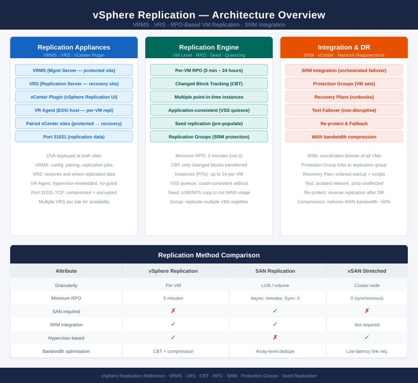

# vSphere Replication — Architecture

<div class="kb-summary">
vSphere Replication is a hypervisor-based asynchronous replication solution managed by the VRMS appliance, providing VM-level RPO control without requiring SAN-based replication.
</div>

```
┌───────────────────────────────── vSphere Replication — Architecture ──────────────────────────────────┐
│                                                                                                       │
│   ┌───────────────────────────────────────────────────────────────────────────────────────────────┐   │
│   │    vSphere Replication (VR): per-VM async replication from source vCenter to target vCenter   │   │
│   │   VR appliance (VRMS) per site; VR server (VRS) handles bulk of replication traffic per site  │   │
│   │     Replication granularity: per-VMDK; RPO configurable from 5 minutes to 24 hours per VM     │   │
│   │       Network compression and encryption of replication traffic; FQDN-resolved endpoints      │   │
│   │    Site Recovery Manager integration: VR seeds VM copies used for SRM orchestrated failover   │   │
│   └───────────────────────────────────────────────────────────────────────────────────────────────┘   │
│                                                                                                       │
│    How-it-works defines VR appliances · integrations connect SRM · standards govern RPO and sizing    │
│                                                                                                       │
│                  ▼                                ▼                                ▼                  │
│                                                                                                       │
│   ┌─────────────────────────────┐  ┌─────────────────────────────┐  ┌─────────────────────────────┐   │
│   │         How It Works        │  │         Integrations        │  │       Design Standards      │   │
│   │        VRMS per site        │  │       SRM integration       │  │       RPO per VM class      │   │
│   │         VRS per site        │  │        vCenter plugin       │  │       Bandwidth sizing      │   │
│   │         Per-VMDK rep        │  │        Storage compat       │  │        Encryption on        │   │
│   │       RPO 5 min-24 hr       │  │        vSAN as target       │  │        Compression on       │   │
│   │       Traffic encrypt       │  │       NFS/VMFS target       │  │       Max VMs per VRS       │   │
│   │          Delta sync         │  │        Aria Ops intg        │  │         FQDN config         │   │
│   └─────────────────────────────┘  └─────────────────────────────┘  └─────────────────────────────┘   │
│                                                                                                       │
│    How-it-works covers VR appliances and RPO · integrations connect SRM and storage · standards govern│
│                                                                                                       │
│                  ▼                                ▼                                ▼                  │
│                                                                                                       │
│   ┌───────────────────────────────────────────────────────────────────────────────────────────────┐   │
│   │   How It Works   │   Integrations   │    Design Stds    │    Deployment    │     Key Stds     │   │
│   │  VRMS per site   │   SRM pairing    │     RPO tiers     │   VRMS deploy    │  RPO per class   │   │
│   │   VRS per site   │  vCenter plugin  │    BW planning    │    VRS deploy    │ Encrypt traffic  │   │
│   │   Per-VMDK rep   │   vSAN target    │    Compress on    │   Site pairing   │    Max VM/VRS    │   │
│   │    Delta sync    │   NFS/VMFS tgt   │    FQDN config    │    Multi-VRS     │  Storage policy  │   │
│   └───────────────────────────────────────────────────────────────────────────────────────────────┘   │
│                                                                                                       │
│  Physical Infrastructure (the hardware everything above runs on):                                     │
│  x86 VMs (VRMS + VRS) · RAM DIMMs · WAN link for replication traffic · Target storage (vSAN/NFS/VMFS) │
│                                                                                                       │
│  Key terms:                                                                                           │
│                                                                                                       │
│  VRMS               = vSphere Replication Management Server; registers with vCenter; manages replicati│
│  VRS                = vSphere Replication Server; handles the bulk replication data transfer per site │
│  Per-VMDK replication = Each virtual disk replicated independently; exclude swap VMDKs to save bandwid│
│  RPO                = Recovery Point Objective; minimum 5 minutes in VR; defines max data loss window │
│  Delta sync         = Changed block tracking (CBT) used to send only modified blocks each replication │
│  Site pairing       = vCenter-level trust relationship between source and target VR sites             │
│  Replication target = Datastore on target site where replica VMDK files are stored                    │
│  Traffic encryption = TLS-encrypted replication stream between source VRS and target VRS              │
│  Compression        = Network compression of replication data; reduces bandwidth at cost of CPU       │
│  SRM integration    = Site Recovery Manager uses VR as the replication provider for orchestrated failo│
│  vSAN target        = vSAN datastore on target site used as replication destination; policy-based     │
│  Changed block track = CBT bitmap tracking written blocks in a VMDK; enables efficient delta replicati│
│                                                                                                       │
└───────────────────────────────────────────────────────────────────────────────────────────────────────┘
```



<div class="kb-grid kb-grid-3">
<a class="kb-card" href="how-it-works/"><strong>How It Works</strong><span>Architecture overview, topology, and how it fits in the stack.</span></a>
<a class="kb-card" href="integrations/"><strong>Integrations</strong><span>Integration with other platforms and services.</span></a>
<a class="kb-card" href="design-standards/"><strong>Design Standards</strong><span>Naming conventions, design rules, and configuration baselines.</span></a>
</div>
