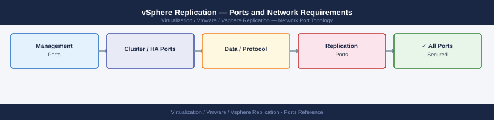

---
tags:
  - vsphere-replication
  - networking
  - firewall
  - ports
  - dr
  - vsphere
---
# vSphere Replication — Ports and Network Requirements

<div class="kb-summary">
Firewall port reference for VMware vSphere Replication (VR). Covers the VR Appliance management interface, inter-site appliance pairing, and the actual VM replication data transfer path between ESXi hosts. Used standalone or as the replication engine behind SRM.

*Applies to: vSphere Replication 8.x*
</div>



## Before you begin

- The most critical firewall entry is ESXi → ESXi port 31031 TCP across the inter-site WAN firewall — this carries the actual VM replication data
- The VR Appliance uses its management IP for all API communication (vCenter and inter-site); no separate data IP
- If used with SRM, the SRM server also needs pairing ports — see [SRM — Ports](../../srm/architecture/ports/)

## Inbound — Admin to VR Appliance

| Port | Protocol | Source | Purpose |
|---|---|---|---|
| 8043 | TCP | Admin browsers | vSphere Replication web management UI |
| 443 | TCP | REST API clients | VR REST API |
| 5480 | TCP | Admin workstations | VAMI appliance management |
| 22 | TCP | Jump hosts | SSH — VR Appliance OS access |

## VR Appliance Within Site

| Port | Protocol | Source | Destination | Purpose |
|---|---|---|---|---|
| 443 | TCP | VR Appliance | vCenter Server | VR ↔ vCenter (VM registration, replication policy, task status) |
| 31031 | TCP | VR Appliance | ESXi hosts | VR → ESXi agent — replication topology queries |

## VR Appliance — Inter-Site (Cross WAN Firewall)

| Port | Protocol | Between | Purpose |
|---|---|---|---|
| 10443 | TCP | Protected VR Appliance ↔ Recovery VR Appliance | VR site pair management channel |
| 44046 | TCP | Protected VR Appliance ↔ Recovery VR Appliance | VR alternate management channel |

## VM Replication Data — ESXi to ESXi (Cross WAN Firewall)

The actual VM replication data flows directly between ESXi hosts — highest bandwidth traffic.

| Port | Protocol | Between | Purpose |
|---|---|---|---|
| 31031 | TCP | Protected site ESXi → Recovery site ESXi | vSphere Replication data transfer |
| 44046 | TCP | Protected site ESXi → Recovery site ESXi | vSphere Replication fallback data port |

## Firewall Zone Summary

| From | To | Ports | Notes |
|---|---|---|---|
| Admin browsers | VR Appliance | 8043, 443 | Management UI |
| VR Appliance | vCenter | 443 | Local site coordination |
| Protected VR | Recovery VR | 10443, 44046 | Inter-site pairing |
| Protected ESXi | Recovery ESXi | 31031, 44046 | VM data — open on WAN firewall; plan for bandwidth |

## Verify

```bash
# From protected site ESXi — test replication data port to recovery ESXi
nc -zv <recovery-esxi-ip> 31031

# From VR Appliance — test inter-site VR pairing port
nc -zv <remote-vr-appliance-ip> 10443

# From admin workstation — test VR UI
curl -sk -o /dev/null -w "%{http_code}" https://<vr-appliance-ip>:8043/

# From VR Appliance — test vCenter reachability
curl -sk -o /dev/null -w "%{http_code}" https://<vcenter-ip>/rest/com/vmware/cis/session
```

## See also

- [vSphere Replication — Architecture](how-it-works/)
- [SRM — Ports](../../srm/architecture/ports.md)
- [ESXi — Ports](../../esxi/architecture/ports.md)
