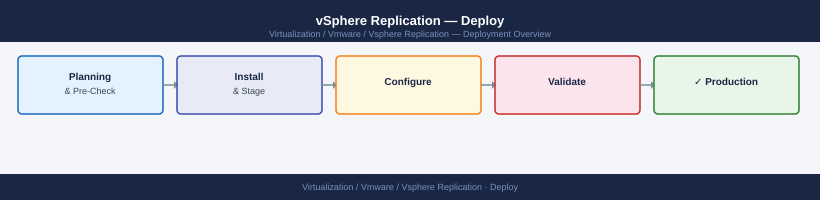
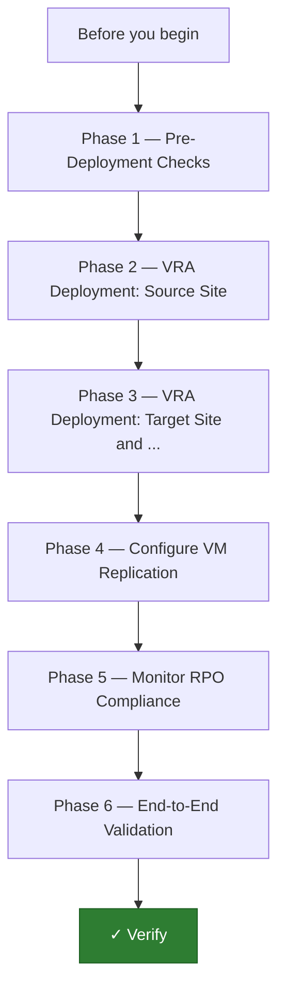

---
tags:
  - deployment
  - vmware
  - vsphere-replication
search:
  boost: 1.5
---
# vSphere Replication — Deploy

<div class="kb-summary">
End-to-end deployment guide for vSphere Replication. Covers VRA OVA deployment at source and target sites, vCenter registration, site pairing, per-VM replication configuration with RPO and MPIT settings, and RPO compliance validation.

*Applies to: vSphere Replication 8.x*
</div>



---




## Before you begin

- **Access:** vCenter Administrator role and SSH access to VCSA/ESXi hosts
- **Environment:** DNS, NTP, and network connectivity verified before starting
- **Change management:** change request approved; maintenance window scheduled
- **Rollback:** snapshot or backup taken immediately before deployment begins
- **Time estimate:** 30–90 minutes — do not start if less than 2 hours are available

---

## Phase 1 — Pre-Deployment Checks

**Exit criterion:** Network ports verified, DNS confirmed, NTP synchronized, target datastore capacity assessed, inter-site latency measured.

### Network Port Validation

vSphere Replication requires the following ports between sites. Confirm with your firewall team before deployment.

| Port | Protocol | Direction | Purpose |
|---|---|---|---|
| 31031 | TCP | Source ESXi hosts → Target VRA | Replication data stream (hbrsvc → HMS) |
| 44046 | TCP | VRA ↔ VRA (both directions) | VRA-to-VRA management and site pairing |
| 443 | HTTPS | VRA → vCenter (both sites) | VRA registration and vCenter API |
| 8043 | HTTPS | vCenter → VRA (both sites) | vCenter plugin calling VR management API |
| 5480 | HTTPS | Admin → VRA | VAMI appliance management UI |

```bash
# Test port 31031 from source ESXi host to target VRA IP (after VRA deployed)
# Run from source ESXi host SSH session:
nc -zv <target-VRA-IP> 31031

# Test VRA pairing port 44046
nc -zv <remote-VRA-IP> 44046

# Test from management workstation (pre-VRA deployment)
# Use a temporary test host to verify firewall rules are open
nc -zv <target-site-management-IP> 443
```

### DNS Validation

```bash
# VRA FQDNs must resolve from both sites before deployment
nslookup vra-siteA.example.local
nslookup vra-siteB.example.local

# Verify PTR records also exist
nslookup <planned VRA site-A IP>
nslookup <planned VRA site-B IP>
```

### Inter-Site Latency Check

```bash
# Measure round-trip latency between sites (must be ≤ 200 ms for stable replication)
# Run from source ESXi host to target site management IP
ping -c 20 <target-site-gateway-or-host-IP>
# Maximum acceptable: 200 ms average RTT; excessive jitter causes RPO violations
```

### Target Datastore Capacity Estimate

Estimate target storage required:

```text
Per replicated VM:
  - Base replica disk: same size as source VMDK
  - MPIT delta disks: (write rate × RPO × MPIT count)
  
Example (3 VMs, 200 GB each, 1 hr RPO, 3 MPIT):
  Base:   3 × 200 GB = 600 GB
  Deltas: 3 × (avg 5 GB per cycle × 3 instances) = 45 GB
  Total:  ~650 GB minimum; add 20% safety margin
```

---

## Phase 2 — VRA Deployment: Source Site

**Exit criterion:** Source site VRA deployed, registered with source vCenter, and VR plugin visible in vSphere Client.

### Deploy VRA OVA at Source Site

```text
vCenter (source site) → Deploy OVF Template
  Source: VMware-vSphere-Replication-<version>.ovf

  Step 1: VM name and folder
    Name: vra-siteA
    Folder: Infrastructure VMs

  Step 2: Compute resource
    Select: host or cluster for the VRA VM

  Step 3: Storage
    Storage policy: default
    Datastore: management datastore (≥ 20 GB free)

  Step 4: Network
    Network: Management portgroup

  Step 5: Customize template
    Hostname: vra-siteA.example.local
    IP Address: 10.10.10.50
    Subnet Mask: 255.255.255.0
    Default Gateway: 10.10.10.1
    DNS Server: 10.10.10.53
    NTP Server: ntp.example.local
    Admin password: <strong password>
    Root password: <strong password>
    → Deploy (~5 minutes)
```

### Register VRA with Source vCenter

```text
VRA VAMI: https://vra-siteA.example.local:5480
  Login: admin / <password>
  Configuration → vCenter Server
    vCenter Address: vcenter-siteA.example.local
    vCenter Port: 443
    SSO Admin Username: administrator@vsphere.local
    SSO Admin Password: <password>
    → Register
    Accept vCenter certificate thumbprint → OK
```

### Verify Registration

```bash
# Verify VR plugin is active in vSphere Client
# vSphere Client → Menu → Site Recovery
# VRA should appear as a Replication Appliance

# Verify HMS and VRMS services on VRA
ssh admin@vra-siteA.example.local
systemctl status hms
systemctl status vrms
# Both should show: active (running)
```

---

## Phase 3 — VRA Deployment: Target Site and Site Pairing

**Exit criterion:** Target site VRA deployed and registered; site pair established between both VRAs; both sites visible in vSphere Client Site Recovery.

### Deploy VRA OVA at Target Site

Deploy using the same procedure as Phase 2 but targeting the recovery site:

```text
VRA name: vra-siteB
IP: 10.20.10.50 (example target site IP)
vCenter to register with: vcenter-siteB.example.local
```

```bash
# Verify target VRA services
ssh admin@vra-siteB.example.local
systemctl status hms
systemctl status vrms
```

### Pair the Sites

```text
vCenter (source site) → Menu → Site Recovery → New Site Pair

  Step 1: Site pair details
    PSC / vCenter Server of remote site: vcenter-siteB.example.local
    SSO username: administrator@vsphere.local
    SSO password: <remote vCenter SSO password>

  Step 2: Remote site services
    Select VRA: vra-siteB.example.local
    Accept certificate thumbprints for:
      - Remote vCenter
      - Remote VRA (vra-siteB)
    → Pair

  Pairing completes in ~2 minutes
```

### Verify Site Pair

```bash
# Check pairing status via VRA API
curl -sk -u admin:<password> \
  https://vra-siteA.example.local:8043/api/sites \
  | python3 -m json.tool | grep -E '"name"|"status"'
# Expected: both sites listed, status Connected

# In vSphere Client: Site Recovery → Sites
# Both sites should show: Connected
```

---

## Phase 4 — Configure VM Replication

**Exit criterion:** At least one test VM fully configured for replication; initial sync completed; status shows Syncing or OK.

### Configure Replication on a VM

```text
vSphere Client → [source VM] → right-click → Configure Replication
  (or: Site Recovery → Replications → New Replication)

  Step 1: Target site
    Replication type: vSphere Replication
    Target site: siteB (paired site)

  Step 2: Target location
    Target datastore: ds-siteB-replica (target datastore)
    Target folder: Replicas (optional subfolder)

  Step 3: Replication settings
    RPO: 1 hour  (minimum 5 minutes; maximum 24 hours)
    Enable multiple point in time (MPIT): Yes
    Instances: 3  (range 1–24)
    Quiesce: Yes (requires VMware Tools — application-consistent)
    Network compression: Yes (recommended for WAN links)

  Step 4: Recovery settings
    Network mapping: leave default or specify target portgroup

  Step 5: Review → Finish
```

### Monitor Initial Full Sync

```bash
# vSphere Client → Site Recovery → Replications
# Status: "Initial Full Sync" → progress percentage shown
# Large disks may take hours over WAN; can seed from backup media to reduce transfer

# Check hbrsvc on source ESXi host (SSH to ESXi)
esxcli hbr replication list
# Expected: VM listed with state "SYNCING"

esxcli hbr replication getstate
# Shows per-VM replication stats including bytes transferred
```

### Configure Multiple VMs (Batch)

```powershell
# PowerCLI: configure replication for all VMs in a folder
Connect-VIServer vcenter-siteA.example.local
$vms = Get-VM -Location (Get-Folder "Production-VMs")
foreach ($vm in $vms) {
    $vm | Get-VmReplication  # check if already configured
    # Use vSphere Replication API or Site Recovery UI for batch config
}
```

---

## Phase 5 — Monitor RPO Compliance

**Exit criterion:** All configured VMs showing RPO status OK (green); no persistent violations; bandwidth usage within capacity.

### Check RPO Status

```bash
# vSphere Client → Site Recovery → Replications
# Each VM shows RPO status:
#   Green (OK):     last sync within configured RPO window
#   Yellow (Warn):  >80% of RPO elapsed since last sync
#   Red (Error):    RPO violated — most recent recovery point is stale

# Check VRMS logs for replication errors
ssh admin@vra-siteA.example.local
tail -100 /var/log/vmware/vrms/vrms.log | grep -i "error\|warn\|violation"

# Check HMS logs (data reception at target)
ssh admin@vra-siteB.example.local
tail -100 /var/log/vmware/hms/hms.log | grep -i "error\|warn"
```

### Verify hbrsvc on Source ESXi Hosts

```bash
# SSH to a source ESXi host
ssh root@esxi-siteA-01.example.local

# List active replications
esxcli hbr replication list

# Show detailed state (including last sync time and next expected sync)
esxcli hbr replication getstate

# Check hbr kernel module is loaded
vmkload_mod -l | grep hbr
# Expected: hbr module present

# View hbr log
tail -50 /var/log/hbr.log | grep -i "error\|warn"
```

### Configure Replication Alerts

```text
vSphere Client → [VM] → Monitor → vSphere Replication → Manage Notifications
  Add email notification for: RPO violation, replication error, full sync triggered
```

---

## Phase 6 — End-to-End Validation

**Exit criterion:** All replication health checks pass. RPO met. MPIT snapshots present. Sign off.

### Verify All VM RPO Status

```bash
# All replicated VMs should show green RPO status
# vSphere Client → Site Recovery → Replications
# Filter: Status = Error or Warning → resolve before sign-off

# Check replication lag via VRA API
curl -sk -u admin:<password> \
  https://vra-siteA.example.local:8043/api/vms \
  | python3 -m json.tool | grep -E '"vmName"|"rpoStatus"|"lastReplicationTime"'
```

### Verify MPIT Recovery Points

```bash
# Verify MPIT snapshots captured at target site
# vSphere Client → Site Recovery → Replications → [VM] → Recovery Points
# Multiple instances should be listed (matching configured MPIT count)

# Check target datastore for replica VMDK structure
# Target datastore should contain:
#   <vm-name>.vmdk         (base replica)
#   <vm-name>-000001.vmdk  (delta disk for recovery point 1)
#   <vm-name>-000002.vmdk  (delta disk for recovery point 2)
```

### Test Planned Migration (Non-Destructive)

```bash
# Test recovery using a test VM (not production) before sign-off
# vSphere Client → Site Recovery → Replications → [test VM] → Migrate

# Planned migration (graceful):
#   1. Source VM quiesced and final sync triggered
#   2. VM powered off at source
#   3. Replica promoted to running VM at target
#   4. Verify VM boots and application responds

# After test: reprotect VM to resume replication
# vSphere Client → [migrated VM at target] → Configure Replication (back to source)
```

### VRA Service Health

```bash
# Both site VRAs: verify HMS and VRMS healthy
ssh admin@vra-siteA.example.local
systemctl status hms vrms
# Both: active (running)

ssh admin@vra-siteB.example.local
systemctl status hms vrms
# Both: active (running)

# Verify VRA API health endpoint
curl -sk https://vra-siteA.example.local/api/rest/vr/health
curl -sk https://vra-siteB.example.local/api/rest/vr/health
# Expected: {"status":"OK"} or equivalent healthy response
```

### Post-Deployment Checklist

| Item | Check |
|---|---|
| Source VRA | Registered with source vCenter; VRMS running |
| Target VRA | Registered with target vCenter; HMS and VRMS running |
| Site pair | Both sites show Connected in Site Recovery |
| Ports 31031/44046 | Open between sites; confirmed with nc tests |
| Inter-site latency | < 200 ms average RTT |
| Initial sync | All configured VMs completed initial full sync |
| RPO compliance | All VMs green (OK) RPO status |
| MPIT snapshots | Recovery point instances present at target |
| DNS | VRA FQDNs resolve from both sites forward and reverse |
| NTP | VRA appliances and vCenter drift < 5 seconds |
| Alerts | Email notifications configured for RPO violations |
| Target datastore | Adequate free space; < 70% used |
| Recovery test | Planned migration test completed on test VM |

---

## See also

- [vSphere Replication — How It Works](../architecture/how-it-works/)
- [vSphere Replication — Health Checks](../operations/health-checks/)
- [vSphere Replication — Common Issues](../troubleshooting/common-issues/)

## Verify

- **vSphere Client:** confirm the component is visible and shows a healthy status
- **Alarms:** Home → Alarms — no new critical alarms after deployment
- **Logs:** review vmware.log / recent events for any errors in the first 5 minutes
