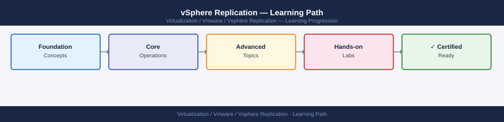

---
tags:
  - learning-path
  - vmware
  - vsphere-replication
---
# vSphere Replication — Learning Path

Recommended reading order for VMware vSphere Replication. Follow these stages in order to build a complete mental model before working with it in production.

*Applies to: vSphere Replication 8.x*

## Stage 1 — Architecture
**Goal**: Understand how vSphere Replication transfers VM data at the hypervisor level to achieve RPO-based DR without array dependency.
**Read in this order**:
- [How It Works](../architecture/how-it-works/) — VRA (vSphere Replication Appliance) agent on ESXi, VRS (vSphere Replication Server) at the recovery site, replication traffic path, RPO tracking, and replication seed usage for initial sync
- [Design Standards](../architecture/design-standards/) — RPO targets vs. network bandwidth requirements, VRS sizing per VM count, multi-site topology options, and replication seed strategies for large VMs
- [Integrations](../architecture/integrations/) — SRM integration (VRS as replication provider), vCenter inventory alignment across sites, and network requirements (ports, QoS) for replication traffic

**Why first**: vSphere Replication's RPO guarantees depend on available bandwidth and VRS capacity; understanding sizing requirements before enabling replication prevents RPO violations on heavily-written VMs.

---

## Stage 2 — Deployment
**Goal**: Deploy VRA at the protected site and VRS at the recovery site, pair them with vCenter, and configure replication for a test VM.
**Read**:
- [Deploy](../deploy/) — VRA OVA deployment and vCenter registration, VRS deployment at recovery site, site pairing via vSphere Replication UI, and replication seed creation for large VMs
- [Install & Upgrade](../operations/install-upgrade/) — VRA and VRS upgrade sequence (recovery site first when SRM-integrated), post-upgrade replication health validation, and compatibility matrix with vCenter and SRM versions

**Why second**: VRA and VRS must be paired and network-validated before any VM is enabled for replication; enabling replication before validating connectivity wastes the initial full-sync window.

---

## Stage 3 — Operations
**Goal**: Monitor RPO compliance, manage replication lifecycle, and execute non-disruptive test recoveries routinely.
**Read in this order**:
- [Health Checks](../operations/health-checks/) — run the routine first on every shift
- [CLI Reference](../operations/cli-reference/) — vSphere Replication REST API and PowerCLI cmdlets for replication status, RPO lag queries, and recovery point listing
- [Procedures](../operations/procedures/) — enabling/disabling VM replication, RPO adjustment, test recovery execution (non-disruptive), planned failover sequence, and failback workflow
- [Backup & Restore](../operations/backup-restore/) — VRA configuration backup, VRS database backup, and appliance restore for VRA failure scenarios
- [Scripts](../operations/scripts/) — PowerCLI scripts for bulk replication status reporting, RPO compliance dashboards, and automated test recovery scheduling

**Why third**: Test recovery is the primary validation mechanism; it must be performed routinely to confirm recovery points are consistent and recoverable before a real event.

---

## Stage 4 — Security
**Goal**: Encrypt replication traffic and restrict access to replication management to authorised DR operators.
**Read**:
- [Access Control](../security/access-control/) — vCenter permissions required to configure replication, VRS management access scoping, and SRM role separation from replication operator roles
- [Authentication](../security/authentication/) — vCenter SSO for VRA management UI, service account credential requirements for site pairing, and certificate trust between VRA and VRS
- [Encryption](../security/encryption/) — replication traffic encryption option (AES-256 in-flight), VRA management TLS certificate rotation, and encrypted VM replication compatibility with vSAN encryption
- [Hardening](../security/hardening/) — restricting VRA and VRS management interfaces to management networks, disabling unused VRA services, and audit log configuration for replication operations

**Why fourth**: Replication traffic encryption adds CPU overhead to ESXi hosts; it must be evaluated against RPO requirements and host capacity before being enabled on high-change VMs.

---

## Stage 5 — Troubleshooting
**Goal**: Diagnose RPO violations, replication sync failures, and test recovery errors before they become DR readiness gaps.
**Read**:
- [Common Issues](../troubleshooting/common-issues/) — RPO violation alerts, replication sync stuck in progress, VRA-VRS connectivity loss, test recovery snapshot cleanup failures, and seed import errors
- [Diagnostics](../troubleshooting/diagnostics/) — VRA and VRS log file locations, replication task event log in vSphere Client, and network throughput diagnostics for replication paths
- [Escalation](../troubleshooting/escalation/) — GSS data requirements for vSphere Replication SRs, VRA/VRS log bundle export, and SR classification for data-loss or persistent RPO violation scenarios

**Why last**: Troubleshooting makes most sense once you know the normal operating state.

---

## See also

- [vSphere Replication — Deploy](../deploy/)
- [vSphere Replication — Procedures](../operations/procedures/)
- [vSphere Replication — Common Issues](../troubleshooting/common-issues/)
