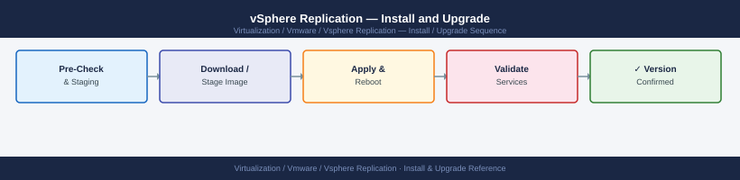

---
tags:
  - operations
  - vmware
  - vsphere-replication
---
# vSphere Replication — Install and Upgrade


<div class="kb-summary">
Install and Upgrade reference covering Prerequisites, VRA OVA Deployment, Register VRA with vCenter, Deploy VRS (Scale-Out Server), Pair Sites and 3 more sections.

*Applies to: vSphere Replication 8.x*
</div>



  VR Deployment and Upgrade Workflow


---

```d2
direction: right

hub: "vSphere Replication\nOperations" {shape: hexagon}
prerequisites: "Prerequisites" {shape: rectangle}
vra_ova_deployment: "VRA OVA Deployment" {shape: rectangle}
register_vra_with_vcenter: "Register VRA with vCenter" {shape: rectangle}
deploy_vrs_scaleout_server: "Deploy VRS (Scale-Out Server)" {shape: rectangle}
pair_sites: "Pair Sites" {shape: rectangle}
upgrade_process: "Upgrade Process" {shape: rectangle}

hub -> prerequisites
hub -> vra_ova_deployment
hub -> register_vra_with_vcenter
hub -> deploy_vrs_scaleout_server
hub -> pair_sites
hub -> upgrade_process
```

## Before you begin

- **Access:** vCenter Administrator at both protected and recovery sites; access to the VR appliance VAMI (`https://<vra-ip>:5480`)
- **Timing:** VRS deployment is non-disruptive; site pairing requires a brief VR service restart — safe during business hours
- **Dependencies:** vCenter deployed and healthy at both sites; TCP 31031 open between sites (replication traffic); TCP 443 between VR appliances (management); DNS resolves VR FQDN from both sites
- **Logging:** record VR appliance IPs and FQDNs; capture the site pairing confirmation and certificate fingerprints

---

!!! warning "Host enters maintenance mode"
    ESXi remediation puts hosts into maintenance mode, triggering DRS evacuation. Confirm DRS is Fully Automated and HA admission control is satisfied before starting.
## Prerequisites

| Requirement | Detail |
|---|---|
| vCenter | Supported version (check interopmatrix.vmware.com) |
| DNS | FQDN for VRA resolvable from both sites |
| Network | TCP 31031 (source ESXi → target VRA), TCP 44046 (VRA-to-VRA), TCP 443 (VRA → vCenter) |
| NTP | VRA and vCenter time synchronized (±5 seconds) |
| Storage | Sufficient datastore space at target site for replica VMDKs |
| License | vSphere Replication included with vSphere Essentials Plus and higher |

---

## VRA OVA Deployment

Deploy a VRA at each site (protected site and recovery site):

```yaml
vCenter → Deploy OVF Template
  Source: VMware-vSphere-Replication-<version>.ovf

  Step 1: Name and folder
    Name: vra-london
    Folder: Infrastructure VMs

  Step 2: Compute resource
    Select: host or cluster for VRA VM

  Step 3: Storage
    Storage policy: default (VRA needs minimal disk)
    Datastore: management datastore

  Step 4: Network
    Network: Management portgroup

  Step 5: Customize template
    IP Address: 10.10.10.50 (static)
    Subnet Mask: 255.255.255.0
    Gateway: 10.10.10.1
    DNS: 10.10.10.10
    NTP: ntp.example.local
    Admin password: <set strong password>
    Root password: <set strong password>

  → Deploy (takes ~5 minutes)
```

---

## Register VRA with vCenter

After deployment, register VRA with vCenter:

```text
VRA VAMI UI: https://vra-london.example.local:5480
  Configuration → vCenter Server
    vCenter Address: vcenter-london.example.local
    Username: administrator@vsphere.local
    Password: <password>
    Accept certificate
    → Register
```

After registration, VRA appears in vCenter → Site Recovery as a Replication Appliance.

---

## Deploy VRS (Scale-Out Server)

For environments with >500 replicated VMs, deploy additional VRS appliances:

```text
vCenter → Site Recovery → vSphere Replication → Replication Servers → Deploy

  Same OVF as VRA, but select: Deploy as Replication Server
  Configure: same network settings
  After deploy: it auto-registers with the VRA
```

---

## Pair Sites

```text
vCenter (Protected Site) → Site Recovery → New Site Pair
  Remote vCenter: vcenter-amsterdam.example.local
  SSO credentials for remote vCenter: administrator@vsphere.local
  Remote VRA: vra-amsterdam.example.local
  Accept certificate thumbprints for both VRA appliances
  → Pair
```

After pairing, configure replications on individual VMs:
```text
vCenter → [VM] → right-click → Configure Replication
```

---

## Upgrade Process

Upgrade VRA by redeploying from new OVA (not in-place):

1. **Take a snapshot of the existing VRA VM** before starting
2. **Redeploy from new OVA** with same IP configuration
3. VRA re-registers with vCenter automatically (if same IP)
4. Existing replications resume without data loss — only the appliance is replaced

> Upgrade Protected Site VRA first (or either order — VRA upgrades are non-disruptive to replications)

```bash
# After redeployment, verify service is up:
ssh admin@vra-london.example.local
systemctl status hms
```

Check Site Recovery → Sites → both sites still Connected after upgrade.

---

## Version Compatibility

Check the Interoperability Matrix before upgrading:
- https://interopmatrix.vmware.com
- Key dependencies: VR version ↔ vSphere version ↔ SRM version (if paired with SRM)
- VRA must be same version on both sites before pairing

---

## Post-Install Verification

```bash
# Verify VRA health
curl -sk https://vra-london.example.local/api/rest/vr/health

# Configure a test VM replication:
# vCenter → [any test VM] → Configure Replication
#   Target site: amsterdam, RPO: 1 hour
#   Verify initial sync starts (status: Syncing)
#   Wait for initial sync to complete (status: OK)
```

---

## See also

- [vSphere Replication — Health Checks](health-checks/)
- [vSphere Replication — Common Issues](../troubleshooting/common-issues/)
- [vSphere Replication — Procedures](procedures/)

## Verify

- **Alarms:** vSphere Client → Home → Alarms — no new critical alarms after the operation
- **Events:** monitor the vCenter Events view for the affected object for 5 minutes
- **Health check:** run the morning health-check sequence for the affected product tier
