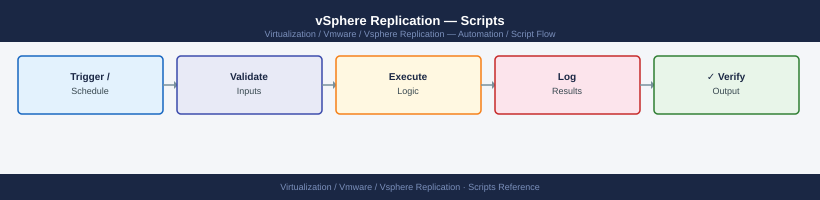

---
tags:
  - operations
  - vmware
  - vsphere-replication
---
# vSphere Replication — Scripts


<div class="kb-summary">
Scripts reference covering Get All Replicated VMs and RPO Compliance, Export Replication Status Report, Identify VMs Without Replication, Check VRA Disk Usage via REST API, Alert on VMs with Replication Lag Exceeding Threshold.

*Applies to: vSphere Replication 8.x*
</div>



  VR Automation via PowerCLI + REST API + Python


---

```d2
direction: right

hub: "vSphere Replication\nOperations" {shape: hexagon}
get_all_replicated_vms_and_rpo_compl: "Get All Replicated VMs and RPO Compliance" {shape: rectangle}
export_replication_status_report: "Export Replication Status Report" {shape: rectangle}
identify_vms_without_replication: "Identify VMs Without Replication" {shape: rectangle}
check_vra_disk_usage_via_rest_api: "Check VRA Disk Usage via REST API" {shape: rectangle}
alert_on_vms_with_replication_lag_ex: "Alert on VMs with Replication Lag Exceeding Threshold" {shape: rectangle}
verify: "Verify" {shape: rectangle}

hub -> get_all_replicated_vms_and_rpo_compl
hub -> export_replication_status_report
hub -> identify_vms_without_replication
hub -> check_vra_disk_usage_via_rest_api
hub -> alert_on_vms_with_replication_lag_ex
hub -> verify
```

## Before you begin

- **Access:** vCenter read-only minimum; Administrator role for remediation steps
- **Timing:** safe to run during business hours unless a step is marked ⚠ (causes interruption)
- **Dependencies:** no active upgrades or migrations on the same infrastructure
- **Logging:** capture command output — paste into the change record on completion

---

## Get All Replicated VMs and RPO Compliance

```powershell
#!/usr/bin/env pwsh
# Requires VMware.VimAutomation.Srm module

Connect-VIServer -Server vcenter-london.example.local
$srm = Connect-SrmServer -SrmServerAddress srm-london.example.local -Credential (Get-Credential)

$pgs = $srm.ExtensionData.Protection.ListProtectionGroups()
$results = @()

foreach ($pg in $pgs) {
    $vms = $srm.ExtensionData.Protection.ListProtectedVms($pg)
    foreach ($vm in $vms) {
        $results += [PSCustomObject]@{
            ProtectionGroup  = $pg.Name
            VMName           = $vm.Vm.Name
            State            = $vm.State
            ReplicationState = $vm.ReplicationState
            RPOCompliant     = ($vm.ReplicationState -eq "OK")
        }
    }
}

# Report non-compliant VMs
$nonCompliant = $results | Where-Object { -not $_.RPOCompliant }
if ($nonCompliant.Count -gt 0) {
    Write-Warning "VMs NOT in RPO compliance:"
    $nonCompliant | Format-Table -AutoSize
} else {
    Write-Host "All $($results.Count) VMs are within RPO."
}

$results | Export-Csv "vr-rpo-report-$(Get-Date -Format yyyyMMdd).csv" -NoTypeInformation
```

---

## Export Replication Status Report

```powershell
$pgs = $srm.ExtensionData.Protection.ListProtectionGroups()
$report = @()

foreach ($pg in $pgs) {
    $vms = $srm.ExtensionData.Protection.ListProtectedVms($pg)
    foreach ($vm in $vms) {
        $vmObj = Get-VM -Name $vm.Vm.Name -ErrorAction SilentlyContinue
        $report += [PSCustomObject]@{
            VM               = $vm.Vm.Name
            ProtectionGroup  = $pg.Name
            ReplicationState = $vm.ReplicationState
            State            = $vm.State
            DatastoreCluster = $vmObj.DatastoreIdList | Select-Object -First 1
        }
    }
}

$report | Sort-Object ReplicationState, VM |
  Export-Csv "vr-status-$(Get-Date -Format yyyyMMdd-HHmm).csv" -NoTypeInformation
Write-Host "Report: $($report.Count) VMs exported"
```

---

## Identify VMs Without Replication

```powershell
# Find VMs in a cluster that have no replication configured
$allVMs = Get-VM -Location (Get-Cluster "Production-Cluster")

# Get list of VMs that ARE replicated
$replicatedNames = @()
foreach ($pg in $srm.ExtensionData.Protection.ListProtectionGroups()) {
    $srm.ExtensionData.Protection.ListProtectedVms($pg) | 
        ForEach-Object { $replicatedNames += $_.Vm.Name }
}

# Compare
$notReplicated = $allVMs | Where-Object { $_.Name -notin $replicatedNames }
Write-Host "VMs without replication:"
$notReplicated | Select-Object Name, PowerState, NumCpu, MemoryGB | Format-Table
$notReplicated | Export-Csv "vms-not-replicated.csv" -NoTypeInformation
```

---

## Check VRA Disk Usage via REST API

```python
#!/usr/bin/env python3
import requests

VRA_HOST = "vra-london.example.local"
USER = "admin"
PASS = "changeme"

# Authenticate
auth_resp = requests.post(
    f"https://{VRA_HOST}/api/rest/vr/authentication/token",
    json={"username": USER, "password": PASS},
    verify=False
)
token = auth_resp.json().get("token", "")
headers = {"Authorization": f"Bearer {token}"}

# Get VRA health/disk info
health = requests.get(
    f"https://{VRA_HOST}/api/rest/vr/health",
    headers=headers, verify=False
).json()

print(f"VRA Status: {health.get('status')}")
for component in health.get("components", []):
    print(f"  {component.get('name')}: {component.get('health')}")
```

---

## Alert on VMs with Replication Lag Exceeding Threshold

```powershell
param(
    [int]$MaxLagMinutes = 90  # Alert if lag > 90 minutes (for 1-hour RPO VMs)
)

Connect-VIServer -Server vcenter-london.example.local
$srm = Connect-SrmServer -SrmServerAddress srm-london.example.local -Credential (Get-Credential)

$alerts = @()
foreach ($pg in $srm.ExtensionData.Protection.ListProtectionGroups()) {
    foreach ($vm in $srm.ExtensionData.Protection.ListProtectedVms($pg)) {
        if ($vm.ReplicationState -ne "OK") {
            $alerts += [PSCustomObject]@{
                VM    = $vm.Vm.Name
                PG    = $pg.Name
                State = $vm.ReplicationState
            }
        }
    }
}

if ($alerts.Count -gt 0) {
    Write-Warning "REPLICATION ALERTS:"
    $alerts | Format-Table -AutoSize
    # Could send email or webhook here
    exit 1
} else {
    Write-Host "OK: all replications within expected state"
    exit 0
}
```

---

## See also

- [vSphere Replication — CLI Reference](cli-reference/)
- [vSphere Replication — Procedures](procedures/)

## Verify

- **Alarms:** vSphere Client → Home → Alarms — no new critical alarms after the operation
- **Events:** monitor the vCenter Events view for the affected object for 5 minutes
- **Health check:** run the morning health-check sequence for the affected product tier
