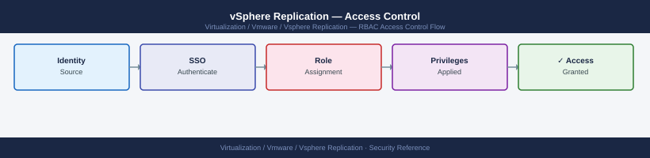

---
tags:
  - security
  - vmware
  - vsphere-replication
---
# vSphere Replication — Access Control


<div class="kb-summary">
Access Control reference covering vSphere Replication Uses vCenter RBAC, VR-Specific vCenter Privileges, Recommended Role Assignments, VRA Appliance Admin Credentials, Network-Level Access Control and 2 more sections.

*Applies to: vSphere Replication 8.x*
</div>



  vSphere Replication RBAC (via vCenter)


---

```d2
direction: down

external: External / Untrusted {shape: rectangle}
vsphere_replication_uses_vcenter_rba: "vSphere Replication Uses vCenter RBAC" {shape: rectangle}
vrspecific_vcenter_privileges: "VR-Specific vCenter Privileges" {shape: rectangle}
recommended_role_assignments: "Recommended Role Assignments" {shape: rectangle}
vra_appliance_admin_credentials: "VRA Appliance Admin Credentials" {shape: rectangle}
networklevel_access_control: "Network-Level Access Control" {shape: rectangle}
srm_service_account_permissions_for_: "SRM Service Account Permissions for VR" {shape: rectangle}
core: "vSphere Replication Core" {shape: hexagon}

external -> vsphere_replication_uses_vcenter_rba: traffic in
vsphere_replication_uses_vcenter_rba -> vrspecific_vcenter_privileges
vrspecific_vcenter_privileges -> recommended_role_assignments
recommended_role_assignments -> vra_appliance_admin_credentials
vra_appliance_admin_credentials -> networklevel_access_control
networklevel_access_control -> srm_service_account_permissions_for_
srm_service_account_permissions_for_ -> core: secured path
```

## Before you begin

- **Access:** vCenter Administrator role
- **Change management:** security changes require CAB approval in most environments
- **Rollback plan:** document current state before any security control change
- **Testing:** validate in a non-production environment first where possible

---

## vSphere Replication Uses vCenter RBAC

vSphere Replication has no separate user store. All access control is managed through vCenter permissions using VR-specific privileges.

---

## VR-Specific vCenter Privileges

| Privilege Group | Key Privileges |
|---|---|
| vSphere Replication → Monitor | View replication status and history |
| vSphere Replication → Manage | Configure/modify replications, pause/resume |
| vSphere Replication → Recover | Initiate recovery (failover) — highest privilege |

---

## Recommended Role Assignments

```text
vCenter → Administration → Roles → Create Custom Role

Role: VR-Operator
  Privileges:
    vSphere Replication → Monitor
    vSphere Replication → Manage
    Virtual machine → Inventory (view)
    Datastore → Browse

Role: VR-Recovery
  Privileges (adds to VR-Operator):
    vSphere Replication → Recover
    Virtual machine → Provisioning → Deploy template
    Virtual machine → Interaction → Power On
```

```yaml
vCenter → Administration → Global Permissions → Add Permission
  Group: CORP\VR-Operators → Role: VR-Operator
  Group: CORP\DR-Recovery-Team → Role: VR-Recovery
  Propagate: Yes
```

---

## VRA Appliance Admin Credentials

The VRA appliance has its own local admin account, separate from vCenter:

| Account | Usage |
|---|---|
| `admin` | VRA VAMI (web UI on port 5480) and REST API access |
| `root` | SSH access for deep debugging — restrict via firewall |

Change default admin password immediately after deployment:
```text
VRA VAMI → Administration → Change Admin Password
```

Restrict SSH access to VRA to jump host IPs only (see Hardening page).

---

## Network-Level Access Control

| Source | Destination | Port | Protocol | Purpose |
|---|---|---|---|---|
| Management workstations | VRA | 5480 | TCP | VAMI admin UI |
| Management workstations | VRA | 443 | TCP | VRA REST API |
| ESXi hosts (source) | VRA (target) | 31031 | TCP | Replication data |
| VRA (protected) | VRA (recovery) | 44046 | TCP | VRA-to-VRA management |
| VRA | vCenter | 443 | TCP | vCenter registration |

Block direct access to port 31031 from any source other than source ESXi management IPs. This port receives replication data and should not be accessible from untrusted networks.

---

## SRM Service Account Permissions for VR

When using SRM to manage vSphere Replication-based protection groups, SRM needs these vCenter permissions:

- vSphere Replication → Monitor
- vSphere Replication → Manage  
- vSphere Replication → Recover

These are in addition to SRM's standard vCenter privileges (documented in SRM installation guide).

---

## Audit Access to Recovery Operations

All VR recovery operations are logged as vCenter events. Monitor:

```text
vCenter → Monitor → Events → filter by "vr." (vSphere Replication events prefix)
```

Key events to alert on:
- Recovery initiated (especially outside of planned maintenance windows)
- Replication removed from a protected VM
- Site pairing configuration changed

## See also

- [vSphere Replication — Authentication](authentication/)
- [vSphere Replication — Hardening](hardening/)
