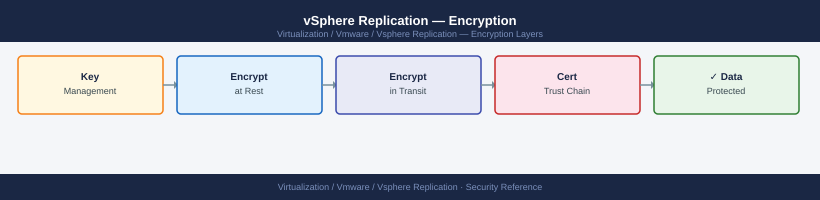

---
tags:
  - security
  - vmware
  - vsphere-replication
---
# vSphere Replication — Encryption


<div class="kb-summary">
Encryption reference covering Data in Transit, Replication Data Encryption (Per-VM), Encryption at Rest on Target Datastore, KMS Consideration for Encrypted VMs, Certificate Management for VRA and 1 more sections.

*Applies to: vSphere Replication 8.x*
</div>



  VR Encryption Coverage


---

```d2
direction: down

external: External / Untrusted {shape: rectangle}
data_in_transit: "Data in Transit" {shape: rectangle}
replication_data_encryption_pervm: "Replication Data Encryption (Per-VM)" {shape: rectangle}
encryption_at_rest_on_target_datasto: "Encryption at Rest on Target Datastore" {shape: rectangle}
kms_consideration_for_encrypted_vms: "KMS Consideration for Encrypted VMs" {shape: rectangle}
certificate_management_for_vra: "Certificate Management for VRA" {shape: rectangle}
tls_hardening_on_vra: "TLS Hardening on VRA" {shape: rectangle}
core: "vSphere Replication Core" {shape: hexagon}

external -> data_in_transit: traffic in
data_in_transit -> replication_data_encryption_pervm
replication_data_encryption_pervm -> encryption_at_rest_on_target_datasto
encryption_at_rest_on_target_datasto -> kms_consideration_for_encrypted_vms
kms_consideration_for_encrypted_vms -> certificate_management_for_vra
certificate_management_for_vra -> tls_hardening_on_vra
tls_hardening_on_vra -> core: secured path
```

## Before you begin

- **Access:** vCenter Administrator role
- **Change management:** security changes require CAB approval in most environments
- **Rollback plan:** document current state before any security control change
- **Testing:** validate in a non-production environment first where possible

---

## Data in Transit

| Traffic Path | Encryption | Notes |
|---|---|---|
| Source ESXi → Target VRA (replication data) | Optional | Enable per-VM in replication config |
| VRA → VRA (management) | TLS 1.2+ | TCP 44046 — always encrypted |
| VRA → vCenter | TLS 1.2+ | TCP 443 |
| Browser → VRA VAMI | TLS 1.2+ | TCP 5480 |
| REST API client → VRA | TLS 1.2+ | TCP 443 |

---

## Replication Data Encryption (Per-VM)

Enable encryption when configuring or editing a replication:

```text
vCenter → [VM] → right-click → Configure/Edit Replication
  Encryption: Enable Replication Traffic Encryption
  Algorithm: AES-256 (automatic)
```

**Performance impact:** AES-256 encryption adds ~5–10% CPU overhead on the source ESXi host. For VMs on a private, trusted LAN, encryption may not be necessary. For VMs replicating over WAN links, enable encryption.

---

## Encryption at Rest on Target Datastore

VR replica files (`.vrepl` VMDKs) are stored on the target datastore without application-level encryption by VR itself. Protect replica data at rest using:

1. **vSAN Encryption** at the target site (encrypts all data on vSAN)
2. **vSphere VM Encryption** — apply an encrypted storage policy to the datastore used for replicas
3. **Hardware storage encryption** — if the target array supports data-at-rest encryption

If source VM uses vSphere VM Encryption and is replicated with VR, the replica at the target site must also be on an encrypted datastore (or vSAN) — VR replicates the encrypted ciphertext, but the VM cannot be powered on at the target site without access to the key management server (KMS).

---

## KMS Consideration for Encrypted VMs

If source VMs use vSphere VM Encryption:

- The KMS must be accessible from the **target site vCenter** for recovered VMs to power on
- Options:
  1. **Shared KMS** (accessible from both sites) — simplest
  2. **Replicated KMS** (KeyControl clusters mirrored across sites)
  3. **Per-site KMS** — recovered VMs must be re-keyed after failover (adds recovery complexity)

Document the KMS architecture in your DR plan.

---

## Certificate Management for VRA

VRA ships with a self-signed certificate. Replace with a CA-signed certificate:

### Replace via VRA VAMI

```text
https://vra-london.example.local:5480 → SSL → Upload Certificate
  Upload: PEM certificate (server cert + chain)
  Upload: PEM private key (no passphrase)
  Save → VRA VAMI restarts
```

### Replace via REST API

```bash
CERT_B64=$(base64 -i vra-london.crt | tr -d '\n')
KEY_B64=$(base64 -i vra-london.key | tr -d '\n')

curl -sk -X PUT "https://vra-london.example.local/api/rest/vr/ssl/certificate" \
  -H "Authorization: Bearer $TOKEN" \
  -H "Content-Type: application/json" \
  -d "{\"certificate\": \"$CERT_B64\", \"private_key\": \"$KEY_B64\"}"
```

After replacing the VRA certificate, update the thumbprint stored in the site pair:
```text
Site Recovery → Sites → [pair] → Edit → Refresh Thumbprints
```

---

## TLS Hardening on VRA

```bash
ssh admin@vra-london.example.local

# Check current TLS configuration:
sudo openssl s_client -connect vra-london.example.local:443 -tls1 2>&1 | grep "Cipher"
# Should show "no peer certificate available" or handshake failure for TLS 1.0/1.1

# VRA's TLS config is managed by the appliance framework — updating nginx config:
sudo vim /opt/vmware/etc/nginx/nginx.conf
# Set: ssl_protocols TLSv1.2 TLSv1.3;
sudo systemctl reload nginx
```

## See also

- [vSphere Replication — Hardening](hardening/)
- [vSphere Replication — Health Checks](../operations/health-checks/)
