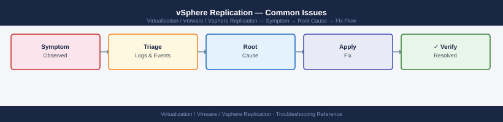
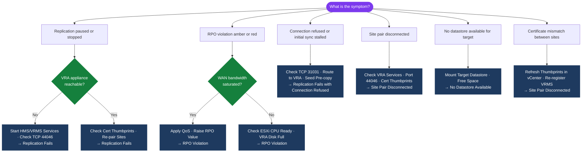

---
tags:
  - troubleshooting
  - vmware
  - vsphere-replication
search:
  boost: 1.5
---
# vSphere Replication — Common Issues



```text
   Configure Replication → Step 4: Seeds → Use existing data
   ```

3. **Schedule full sync during low-traffic window**: VR throttles to available bandwidth

---

```d2
direction: down

symptom: Identify Symptom {shape: diamond}
diagnostic_flow: "Diagnostic Flow" {shape: rectangle}
replication_fails_with_connection_re: "Replication Fails with 'Connection Refused' / 'Connection Ti" {shape: rectangle}
verify_resolution: "Verify resolution" {shape: rectangle}
resolution: Resolve or Escalate {shape: oval}

symptom -> diagnostic_flow: investigate
symptom -> replication_fails_with_connection_re: investigate
symptom -> verify_resolution: investigate
diagnostic_flow -> resolution
replication_fails_with_connection_re -> resolution
verify_resolution -> resolution
```

## Diagnostic Flow



---

## Before you begin

- **Access:** SSH to vCenter Shell and ESXi hosts; vSphere Client read access
- **Gather first:** recent error message text, event timestamps, and affected object names
- **Scope:** confirm whether the issue affects a single object, host, cluster, or site
- **Escalation:** open a vendor support ticket before running any destructive step
- **Logging:** document each command and output — required if escalation is needed

---

## Replication Fails with "Connection Refused" / "Connection Timeout"

**Symptoms:** Replication status error: network connectivity to target VRA

```bash
# From source ESXi host shell:
nc -vz vra-amsterdam.example.local 31031
# If connection refused → firewall blocking TCP 31031
# If timeout → no route to target VRA

# Verify from ESXi:
vmkping -I vmk0 <target-VRA-IP>
```
```bash
ssh admin@vra-london.example.local
df -h
# Check /opt partition — VRA appliance partition

# Clear old log files if disk is full:
sudo find /opt/vmware/logs -name "*.log" -mtime +30 -delete
sudo journalctl --vacuum-size=500M
```
```bash
vCenter → [VRA VM] → Edit Settings → Disk → increase size
Then expand filesystem inside VRA:
  sudo growpart /dev/sda 1
  sudo resize2fs /dev/sda1
```

---

## See also

- [vSphere Replication — Diagnostics](diagnostics/)
- [vSphere Replication — Escalation](escalation/)
- [vSphere Replication — Health Checks](../operations/health-checks/)

## Verify resolution

- **Alarms cleared:** Home → Alarms — the triggering alarm is no longer active
- **Event log:** confirm no new related error events in the last 5 minutes
- **Functional test:** perform the action that was failing (connect, vMotion, storage I/O) — confirm it succeeds
- **Monitor:** leave the vSphere Client open for 10 minutes and confirm the issue does not recur
