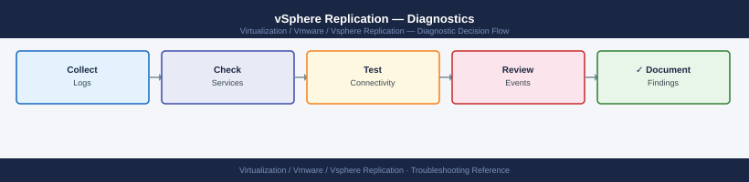

---
tags:
  - troubleshooting
  - vmware
  - vsphere-replication
search:
  boost: 1.5
---
# vSphere Replication — Diagnostics

<div class="kb-summary">
vSphere Replication (VR) diagnostic commands: check VRA service status with systemctl, inspect HMS and VRMS logs, test replication port 31031 from the source ESXi host, verify hbrsvc on the source host, check the REST API health endpoint, capture replication traffic with pktcap-uw, and collect the VAMI support bundle for VMware SRs.

*Applies to: vSphere Replication 8.x*
</div>



```mermaid
graph TD
    A([vSphere Replication Issue]) --> B{What type of problem?}
    B -->|VRA UI or API unreachable| C[systemctl status hms vrms nginx\njournalctl -u hms -n 100]
    B -->|Replication lag or stuck transfer| D[nc -zv target-VRA 31031 from source ESXi\nCheck hbrsvc on source ESXi]
    B -->|Replication task stuck in vCenter| E[vCenter → Monitor → Recent Tasks\nFilter for HBR or vSphere Replication]
    B -->|Certificate error| F[openssl s_client -connect VRA:443\nCheck notAfter date]
    B -->|VRA services running but replication fails| G[Check hbr.log on source ESXi\nRead per-VM replication error]
    B -->|VRA can't reach vCenter| H[Test TCP 443 to vCenter from VRA\nnc -zv vcenter-ip 443]
    C --> I{Which service down?}
    I -->|hms not running| J[systemctl start hms\nCheck disk: df -h /]
    I -->|vrms not running| K[systemctl start vrms\njournalctl -u vrms -n 50 for error]
    D --> L{Port 31031 reachable?}
    L -->|No| M[Check firewall rules between sites\nVerify target VRA IP and routing]
    L -->|Yes, still lagging| N[Check hbr.log for bandwidth or timeout errors\nCheck VMkernel adapter used for replication]
    E --> O[Cancel stuck task if > 30 min\nvCenter → Recent Tasks → right-click Cancel]
    F --> P[Check cert via VAMI\nhttps://VRA:5480 → Certificate → Renew]
    G --> Q[tail /var/log/hbr.log | grep -i error\nCompare replication timestamps]
    H --> R[Check DNS resolution of vCenter from VRA\nnslookup vcenter-fqdn]
    J --> S[Collect VRA VAMI support bundle\nhttps://VRA:5480 → Support → Generate]
    K --> S
    M --> S
    N --> S
    O --> S
    P --> S
    Q --> S
    R --> S
    S --> T[Open VMware SR\nAttach bundle and replication task ID]

    classDef dark fill:#1e3a5f,color:#fff
    classDef action fill:#78350f,color:#fff
    classDef escalate fill:#991b1b,color:#fff
    class A,B,I,L dark
    class C,D,E,F,G,H,J,K,M,N,O,P,Q,R action
    class S,T escalate
```

```d2
direction: down

symptom: Identify Symptom {shape: diamond}
step_1_check_vra_service_status: "Step 1 — Check VRA service status" {shape: rectangle}
step_2_check_vra_rest_api_health: "Step 2 — Check VRA REST API health" {shape: rectangle}
step_3_read_vra_logs: "Step 3 — Read VRA logs" {shape: rectangle}
step_4_test_connectivity_from_source: "Step 4 — Test connectivity from source ESXi to target VRA" {shape: rectangle}
step_5_check_hbrsvc_on_source_esxi: "Step 5 — Check hbrsvc on source ESXi" {shape: rectangle}
step_6_verify_vra_certificate: "Step 6 — Verify VRA certificate" {shape: rectangle}
resolution: Resolve or Escalate {shape: oval}

symptom -> step_1_check_vra_service_status: investigate
symptom -> step_2_check_vra_rest_api_health: investigate
symptom -> step_3_read_vra_logs: investigate
symptom -> step_4_test_connectivity_from_source: investigate
symptom -> step_5_check_hbrsvc_on_source_esxi: investigate
symptom -> step_6_verify_vra_certificate: investigate
step_1_check_vra_service_status -> resolution
step_2_check_vra_rest_api_health -> resolution
step_3_read_vra_logs -> resolution
step_4_test_connectivity_from_source -> resolution
step_5_check_hbrsvc_on_source_esxi -> resolution
step_6_verify_vra_certificate -> resolution
```

## Before you begin

- **Access:** SSH to the VRA appliance (`admin` user) at each site; SSH to the source ESXi hosts; vCenter Client access to view replication tasks
- **Gather first:** the specific symptom (replication lag, error in vCenter UI, VRA unreachable), the VM name being replicated, the source and target site VRA IP addresses, and the time the issue started
- **Scope:** confirm whether the issue affects one VM, one replication group, or all replications to/from a specific VRA

---

## Step 1 — Check VRA service status

```bash
# SSH to the VRA appliance
ssh admin@<vra-ip>

# Check core VRA services
systemctl status hms     # Home Management Server — must be active
systemctl status vrms    # VR Management Service — must be active
systemctl status nginx   # API gateway — must be active

# Expected: all three should be active (running)

# Recent service events (useful for crash or restart diagnosis)
journalctl -u hms -n 100 --no-pager
journalctl -u vrms -n 100 --no-pager

# Check disk space (full disk = VRA service failures)
df -h /
# Expected: < 80% used

# Restart a specific service if stopped
systemctl start hms
systemctl start vrms
```

---

## Step 2 — Check VRA REST API health

```bash
# Quick health check — no authentication required
curl -sk "https://<vra-ip>/api/rest/vr/health"
# Expected: 200 OK with JSON health response

# Get an authentication token for detailed queries
TOKEN=$(curl -sk -X POST \
  "https://<vra-ip>/api/rest/vr/authentication/token" \
  -H "Content-Type: application/json" \
  -d '{"username":"admin","password":"<password>"}' \
  | python3 -c "import json,sys; print(json.load(sys.stdin).get('token',''))")

echo $TOKEN
# Expected: JWT string; empty = auth failed

# List all replications with their state and lag
curl -sk -H "Authorization: Bearer $TOKEN" \
  "https://<vra-ip>/api/rest/vr/replications" \
  | python3 -c "
import json,sys
for r in json.load(sys.stdin).get('replications', []):
    print(r.get('vmName',''), '|', r.get('replicationState',''), '|', 'lag:', r.get('rpo',''))
"
# Look for: replicationState = ERROR or lag exceeding the configured RPO
```

---

## Step 3 — Read VRA logs

```bash
# SSH to VRA
ssh admin@<vra-ip>

# HMS log directory (management and vCenter registration events)
ls /opt/vmware/logs/hms/
tail -100 /opt/vmware/logs/hms/hms.log | grep -i "error\|exception\|fail"

# VRMS log directory (replication workflow events)
ls /opt/vmware/logs/vrms/
tail -100 /opt/vmware/logs/vrms/vrms.log | grep -i "error\|exception\|fail"

# Follow logs in real time during a failing operation
journalctl -u hms -f
journalctl -u vrms -f

# Nginx log (API gateway; for 5xx errors from the UI or API)
journalctl -u nginx -n 50 --no-pager | grep -i "error\|warn"
```

---

## Step 4 — Test connectivity from source ESXi to target VRA

All replication data flows from the source ESXi host to the **target** VRA on TCP 31031.

```bash
# SSH to the source ESXi host
ssh root@<source-esxi-ip>

# Test replication data port (31031) to the TARGET VRA
nc -vz <target-vra-ip> 31031
# Expected: "Connection to <ip> 31031 port [tcp] succeeded!"
# Failure: "Connection refused" or timeout → firewall rule missing

# Test VRA management inter-site port (44046)
nc -vz <target-vra-ip> 44046
# Expected: success
# This port is used for VRA-to-VRA management communication

# VMkernel ping to target VRA (tests Layer 3 from the VMK used for replication)
vmkping -I vmk0 <target-vra-ip>

# Check which VMkernel adapter is used for replication
esxcli network ip interface list | grep -v "^--"
# The hbrsvc daemon uses vmk0 by default unless overridden
```

If TCP 31031 test fails:
1. Check firewall rules between the source and target networks
2. Verify the target VRA IP address configured in vCenter → Site Recovery → vSphere Replication
3. Confirm Layer 3 routing between sites for the management VLANs

---

## Step 5 — Check hbrsvc on source ESXi

```bash
# SSH to source ESXi host
ssh root@<source-esxi-host>

# Check the replication daemon
/etc/init.d/hbrsvc status
# Expected: Running

# Restart hbrsvc if stopped (safe — does not delete replications)
/etc/init.d/hbrsvc restart

# View hbr.log for per-VM replication events
tail -100 /var/log/hbr.log
grep -i "error\|fail\|disconnect" /var/log/hbr.log | tail -30

# Check for hbr activity in hostd.log
grep -i "hbr\|replication" /var/log/hostd.log | tail -30

# List active replication processes on this host
esxcli vm process list | grep -i replication
```

---

## Step 6 — Verify VRA certificate

Expired certificates cause TLS handshake failures between VRA and vCenter and between VRA appliances.

```bash
# Check source VRA management certificate
echo | openssl s_client \
  -connect <vra-source-fqdn>:443 \
  -servername <vra-source-fqdn> 2>/dev/null \
  | openssl x509 -noout -dates -subject -issuer
# Expected: notAfter date > 30 days in the future

# Check inter-site VRA certificate (port 44046)
echo | openssl s_client \
  -connect <vra-target-fqdn>:44046 2>/dev/null \
  | openssl x509 -noout -dates -subject

# If certificate is expired, renew via VAMI
# Browse to: https://<vra-ip>:5480 → Certificate → Renew Certificate

# Capture network traffic on the replication port for deep debugging
# On source ESXi host:
pktcap-uw --vmk vmk0 --dstport 31031 -o /tmp/hbr-capture.pcap --count 1000
scp root@<esxi-host>:/tmp/hbr-capture.pcap /local/path/
# Analyze in Wireshark: filter for TCP RST or TLS handshake failure
```

---

## Step 7 — Collect VRA support bundle for VMware SR

```bash
# Via VAMI (recommended)
# Browse to: https://<vra-ip>:5480
# Navigate to: Support → Generate Support Bundle → Download
# The bundle includes: all VRA logs, configuration, service state

# Via SSH if VAMI is unreachable
ssh admin@<vra-ip>
/opt/vmware/support/support-bundle.sh
# Output: /tmp/vr-support-<timestamp>.tar.gz

# Transfer the bundle
scp admin@<vra-ip>:/tmp/vr-support-*.tar.gz /local/path/

# Include in VMware SR:
# - VRA VAMI support bundle from both source and target sites
# - hbr.log excerpt from the source ESXi host (grep for the affected VM name)
# - Replication task ID from vCenter → Monitor → Recent Tasks
# - VR version: VRA UI → About (vSphere Replication version)
# - Network connectivity test results (nc -vz output for port 31031 and 44046)
```

---

## Log locations

| Component | Path / Command | What to look for |
|---|---|---|
| HMS (VRA) | `/opt/vmware/logs/hms/hms.log` | vCenter registration, management events |
| VRMS (VRA) | `/opt/vmware/logs/vrms/vrms.log` | Replication workflow orchestration errors |
| hbrsvc (ESXi) | `/var/log/hbr.log` | Per-VM replication transfer events and errors |
| hostd (ESXi) | `/var/log/hostd.log` | VM operations and hbrsvc interaction |
| VRA system | `journalctl -u hms` / `journalctl -u vrms` | Service start/stop and crash events |

---

## See also

- [vSphere Replication — Common Issues](../common-issues/)
- [vSphere Replication — Escalation](../escalation/)

## Verify resolution

- `curl -sk https://<vra-ip>/api/rest/vr/health` returns 200 OK from both source and target VRA
- `GET /api/rest/vr/replications` shows all VMs with replicationState = SYNCING or IDLE (not ERROR)
- `nc -zv <target-vra-ip> 31031` from the source ESXi host succeeds
- vCenter → Monitor → Recent Tasks shows no stuck or failed replication tasks for the affected VM
- The replication lag (RPO) for the affected VM is within the configured target
