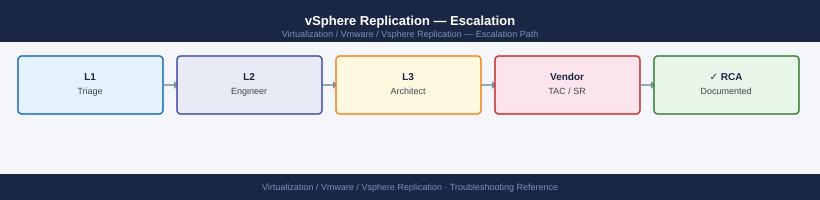

---
tags:
  - troubleshooting
  - vmware
  - vsphere-replication
search:
  boost: 1.5
---
# vSphere Replication — Escalation

<div class="kb-summary">
How to escalate VMware vSphere Replication issues to Broadcom support: what data to collect from both sites, step-by-step case creation on support.broadcom.com, and the escalation path when progress stalls.

*Applies to: vSphere Replication 8.x*
</div>



---

```d2
direction: down

symptom: Identify Symptom {shape: diamond}
preescalation_selfcheck: "Pre-Escalation Self-Check" {shape: rectangle}
stepbystep_data_collection: "Step-by-Step Data Collection" {shape: rectangle}
how_to_open_the_sr_on_supportbroadco: "How to Open the SR on support.broadcom.com" {shape: rectangle}
escalation_path: "Escalation Path" {shape: rectangle}
what_not_to_do: "What NOT to Do" {shape: rectangle}
useful_commands_for_case_updates: "Useful Commands for Case Updates" {shape: rectangle}
resolution: Resolve or Escalate {shape: oval}

symptom -> preescalation_selfcheck: investigate
symptom -> stepbystep_data_collection: investigate
symptom -> how_to_open_the_sr_on_supportbroadco: investigate
symptom -> escalation_path: investigate
symptom -> what_not_to_do: investigate
symptom -> useful_commands_for_case_updates: investigate
preescalation_selfcheck -> resolution
stepbystep_data_collection -> resolution
how_to_open_the_sr_on_supportbroadco -> resolution
escalation_path -> resolution
what_not_to_do -> resolution
useful_commands_for_case_updates -> resolution
```

## Before you begin

- **Access required:** VRA VAMI admin access (`https://<vra-ip>:5480`) on both sites; SSH root access to ESXi source hosts; vCenter admin access on both sites; Broadcom support account at support.broadcom.com with active vSphere Replication entitlement
- **Bundles from BOTH sites are required** — GSS will ask for the protected-site VRA bundle and the recovery-site VRA bundle in their first response. Collect them immediately before any state changes
- **Do NOT restart the VRA appliance** without GSS direction — VRA restart during an active replication may cause the VMs to go into a "Not Configured" state that requires re-seeding
- **If SRM is also involved:** open a single VMware Support case (SRM and VR teams collaborate internally) and include SRM bundles from both sites in addition to VRA bundles

---

## Pre-Escalation Self-Check

Run these before opening the case.

| Check | Where to look | Expected result |
|---|---|---|
| VR version | VRA VAMI → Summary → Version | Note full VR version + build |
| VRA appliance status | VRA VAMI → Summary → Services | All services Running |
| Site pair status | vSphere Client → Site Recovery → Sites | Site pair Connected |
| Replication status | vSphere Client → Site Recovery → Replications | All replications OK; no RPO violations |
| RPO trend | vSphere Client → Site Recovery → Replications → each VM | RPO trend not increasing |
| vCenter connectivity | VRA VAMI → Configuration → vCenter Server | vCenter Connected |
| ESXi hbr.log | SSH to source ESXi: `tail -100 /var/log/hbr.log` | No repeated error entries |
| VR version at recovery site | Recovery site VRA VAMI → Summary | Matches protected-site VR version |

---

## Step-by-Step Data Collection

### 1. Get the VR version and VRA status

1. Browse to the protected-site VRA VAMI at `https://<vra-protected-ip>:5480`.
2. Click **Summary** → note the VR version and build number.
3. Click **Services** → note which services are Running and which (if any) are Stopped.
4. Repeat on the recovery-site VRA (`https://<vra-recovery-ip>:5480`).

### 2. Generate the VRA support bundle (both sites)

1. In the VRA VAMI: click **Support** → **Download Support Bundle**.
2. Wait 3–10 minutes for the bundle to generate.
3. Download the resulting archive.

Repeat this on BOTH the protected-site and recovery-site VRA appliances.

```bash
# Alternative: generate via VRA CLI (SSH to VRA)
ssh root@<vra-ip>

# Trigger support bundle generation
/etc/rc3.d/*vrms/scripts/vr-support.sh

# Bundle is written to /tmp/
ls -lh /tmp/vr-support*.zip
```

### 3. Collect ESXi replication logs from the source host

```bash
# SSH to the source ESXi host as root
ssh root@<source-esxi-ip>

# VR host-based log (shows per-VM replication traffic at the ESXi level)
tail -300 /var/log/hbr.log | grep -i "error\|fail\|exception\|warn"

# Host daemon log (general ESXi host operations)
tail -200 /var/log/hostd.log | grep -i "replication\|vr\|hbr"

# Copy log off the host
scp root@<source-esxi-ip>:/var/log/hbr.log /tmp/hbr-$(hostname).log
```

### 4. Export vCenter system logs

In vSphere Client:
1. Navigate to the vCenter → **Actions** → **Export System Logs**.
2. Select all components.
3. Export and download.

Repeat on the vCenter at the recovery site.

### 5. Capture replication status

In vSphere Client at both sites:
1. Navigate to **Site Recovery** → **Replications**.
2. Take a screenshot showing the replication status of all VMs at the time of the issue.
3. Note which VMs are in **Error**, **RPO Violation**, or any state other than **OK**.

### 6. Write the timeline

```text
VR version: 8.8.0 build XXXXXXXX (protected site)
VR version: 8.8.0 build XXXXXXXX (recovery site)
vCenter (protected): vcenter-prod.corp.local (vSphere 8.0.2)
vCenter (recovery): vcenter-dr.corp.local (vSphere 8.0.2)
Issue first observed: 2026-06-14 08:00 UTC
Last confirmed replication: 2026-06-14 06:00 UTC
Changes in 24h before the issue:
  - 07:00: vSphere 8.0.1 to 8.0.2 upgrade completed on protected-site vCenter
  - 08:00: All 200 VMs show "Not Configured" replication status
  - 08:10: VRA VAMI at protected site shows vCenter connection: Disconnected
Steps already taken:
  - VRA VAMI: vCenter server shows disconnected despite correct credentials
  - vSphere Client: site pair shows "Not Configured" (was Connected before upgrade)
  - Did NOT restart VRA or reconfigure the site pair
Blast radius: All 200 VMs no longer replicating; DR capability at risk
SRM involvement: SRM 8.8 paired at both sites; SRM SR opened in parallel (case XXXXXXX)
```

---

## How to Open the SR on support.broadcom.com

1. Go to **support.broadcom.com** and sign in with your Broadcom account.

2. Click **Open a Support Request**.

3. Under **Product Group**, select **VMware Cloud Foundation and Virtualization** → **VMware vSphere Replication**.

4. Under **Version**, select your VR version from Step 1.

5. Under **Severity**, select:
   - **Severity 1 — Critical**: Active DR recovery operation is failing; VMs cannot be started at the recovery site; data is at immediate risk; no workaround
   - **Severity 2 — High**: All replications are stopped; DR capability is degraded; no active recovery in progress; data at risk if replication is not restored
   - **Severity 3 — Medium**: A subset of VMs are in RPO violation; single VR configuration issue; workaround exists
   - **Severity 4 — Low**: General how-to question, pre-upgrade planning, minor UI issue

6. In the **Summary** field: product + symptom + scope. Example: `vSphere Replication 8.8 — all 200 VMs show Not Configured after protected-site vCenter upgrade 8.0.1 to 8.0.2, VRA vCenter connection lost`.

7. In the **Description** field, paste:
   - VR versions from both sites (Step 1)
   - VRA service status from Step 1
   - The key error from Step 3 (hbr.log or VAMI message)
   - The timeline from Step 6
   - Include the SRM case number if a parallel SRM case is open

8. Under **Attachments**, upload:
   - VRA support bundles from BOTH sites (Step 2)
   - ESXi hbr.log from the source host (Step 3)
   - vCenter system logs from both sites (Step 4)

9. Click **Submit**. You will receive a case number by email immediately.

10. **Severity 1 only:** call Broadcom/VMware support after submission:
    - North America: +1 877-486-9273 (24×7 for Severity 1)
    - EMEA: +44 (0)3453 700 100
    - State "Severity 1 — vSphere Replication — active recovery failing, DR capability lost" at the start of the call.

---

## Escalation Path

```text
Step 1 — Open case at support.broadcom.com with both-site VRA bundles and ESXi hbr.log
         ↓
Step 2 — T1 support engineer acknowledges (Sev1: < 30 min; Sev2: < 2 hr)
         ↓
Step 3 — If no meaningful progress in 30 minutes for Sev1 or 2 hours for Sev2:
         → Reply in case: "Requesting escalation to vSphere Replication Senior Engineer"
         → State: "[all replications down / active recovery failing / DR capability lost]"
         ↓
Step 4 — VR T2 Senior Engineer is assigned
         → They will review hbrsrv.log and the site-pair configuration
         → Have VRA SSH access and vCenter credentials for both sites ready
         ↓
Step 5 — If the issue is specific to the SRM + VR integration:
         → VMware handles SRM and VR under the same case (they coordinate internally)
         → Include the SRM recovery plan log in the case if SRM is also affected
         ↓
Step 6 — For Sev1 with active recovery failing, unresolved after 2 hours:
         → Request CritSit escalation; contact your Broadcom TAM or Account Executive
```

---

## What NOT to Do

| Do NOT do this | Why | What to do instead |
|---|---|---|
| Restart the VRA appliance without GSS direction | VRA restart during an active or broken replication can push VMs into "Not Configured" state, requiring full re-seeding | Let GSS review VRA logs before any appliance restart |
| Configure new replications during the investigation | Adding new replications changes the VRA state and configuration GSS is analysing | Freeze all replication configuration changes until the case is resolved |
| Remove and re-add the SRM site pairing | Breaks the SRM to VR integration state; requires full re-configuration which takes hours | Only un-pair if GSS explicitly directs you to after reviewing the pair configuration |
| Reconfigure ESXi vmkernels (vSAN, management, VR vmk) | Changes the network topology VR uses for replication traffic; disrupts active replications | Freeze all vmkernel changes during the incident |
| Power off VMs at the protected site while GSS is diagnosing | Changes the replication state GSS is tracking; may force recovery site VMs into an inconsistent snapshot state | Hold all VM power operations at the protected site until GSS advises |
| Run vSphere Replication re-configure on an already-broken replication | Changes the seed state for that VM; GSS may need the original seed data for recovery | Leave all existing replications in their current state; let GSS direct any re-seed |

---

## Useful Commands for Case Updates

```bash
# SSH to the VRA appliance as root — paste into every case update

# VR appliance service status
service vmware-vrms status
service vmware-h4 status

# VRA server log (orchestration, site-pair, RPO tracking)
tail -200 /var/log/vmware/hbrsrv/hbrsrv.log | grep -i "error\|fail\|exception"
```

```bash
# SSH to the source ESXi host as root

# Per-VM replication status at host level
tail -200 /var/log/hbr.log | grep -i "error\|fail"

# Replication vmkernel (ensure VR vmk is present)
esxcli network ip interface list | grep -i "replication\|hbr"
```

---

## Support SLA Reference

| Severity | Definition | Initial Response SLA |
|---|---|---|
| Sev 1 — Critical | Active DR recovery failing; DR capability lost; data at risk | < 30 min (24×7) |
| Sev 2 — High | All replications down; DR capability degraded; no active recovery | < 2 hours (24×7) |
| Sev 3 — Medium | Subset of VMs in RPO violation; single VR config issue; workaround exists | < 8 hours |
| Sev 4 — Low | How-to, planning, compatibility question, minor issue | Next business day |

---

## See also

- [vSphere Replication — Diagnostics](diagnostics/)
- [vSphere Replication — Common Issues](common-issues/)

---

## Verify resolution

- In vSphere Client → Site Recovery → **Sites**: site pair shows Connected
- Check **Replications**: all replications show **OK** with no RPO violations
- Confirm the RPO trend is decreasing (data is flowing from protected to recovery site)
- Verify on the VRA VAMI at both sites: all services show Running; vCenter connection shows Connected
- Run `tail -50 /var/log/hbr.log` on the source ESXi and confirm no error entries
- Monitor for 30 minutes to confirm all VMs maintain their replication and RPO stays within policy
