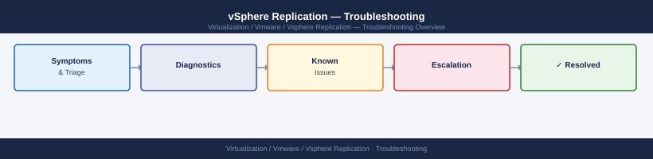

---
tags:
  - troubleshooting
  - vmware
  - vsphere-replication
search:
  boost: 1.5
---
# vSphere Replication — Troubleshooting

Diagnosing vSphere Replication RPO violations, VR server connectivity, delta disk errors, and replication task failures.

*Applies to: vSphere Replication 8.x*

<a class="kb-card" href="common-issues/">
  <strong>Common Issues</strong>
  Frequently seen problems and resolution steps.
</a>

<a class="kb-card" href="diagnostics/">
  <strong>Diagnostics</strong>
  Log locations, diagnostic commands, and data collection.
</a>

<a class="kb-card" href="escalation/">
  <strong>Escalation</strong>
  When and how to escalate to VMware support.
</a>

