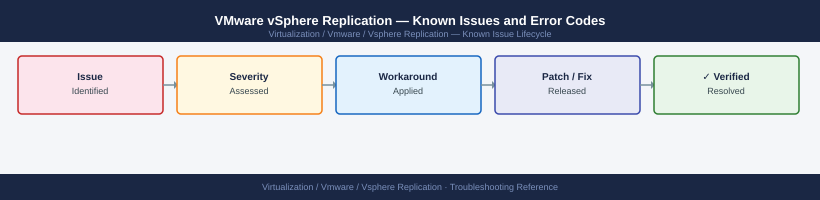

---
tags:
  - troubleshooting
  - vsphere-replication
  - vmware
  - known-issues
---
# VMware vSphere Replication — Known Issues and Error Codes

<div class="kb-summary">
Catalog of known vSphere Replication bugs, error codes, and workarounds covering replication configuration, RPO violations, and appliance issues.

*Applies to: vSphere Replication 8.x*
</div>



```d2
direction: down

symptom: Identify Symptom {shape: diamond}
replication_configuration: "Replication Configuration" {shape: rectangle}
rpo_and_sync: "RPO and Sync" {shape: rectangle}
appliance: "Appliance" {shape: rectangle}
resolution: Resolve or Escalate {shape: oval}

symptom -> replication_configuration: investigate
symptom -> rpo_and_sync: investigate
symptom -> appliance: investigate
replication_configuration -> resolution
rpo_and_sync -> resolution
appliance -> resolution
```

## Before you begin

- vSphere Replication errors appear in the vSphere Client under `vSphere Replication → VMs` — expand the replication entry for status.
- Collect logs from the VRMS (vSphere Replication Management Server) appliance at `/opt/vmware/hms/logs/`.

## Replication Configuration

| Error / Symptom | Affected Versions | Cause | Workaround / Fix | Fixed In |
|---|---|---|---|---|
| `Cannot configure replication — target datastore full` | VR 8.x | Insufficient space on target for seed/full sync | Free space or select different target datastore; enable thin provisioning | N/A |
| `Replication seed failed` for large VMs (>2 TB) | VR 8.x | Seed copy times out during low-bandwidth window | Use offline seed (export/import VMDK manually); configure replication after seed in place | N/A |
| `Replication paused — quiesce failed` on Windows VM | VR 8.x | VSS quiesce failing due to VSS writer error in guest | Disable application quiescing in replication settings; investigate VSS error in guest Windows Event Log | N/A |

## RPO and Sync

| Error / Symptom | Affected Versions | Cause | Workaround / Fix | Fixed In |
|---|---|---|---|---|
| RPO alarm despite recent successful sync | VR 8.x | RPO calculation includes quiesce time; large VMs exceed window | Increase RPO target; reduce VM change rate or quiesce timeout | N/A |
| Replication stalled at 0% delta | VR 8.x | ESXi changed block tracking (CBT) reset | Reset CBT: power off VM, disable CBT, re-enable CBT, power on; replication resumes | N/A |

## Appliance

| Error / Symptom | Affected Versions | Cause | Workaround / Fix | Fixed In |
|---|---|---|---|---|
| VRMS UI unavailable — `Connection Refused` on port 8043 | VR 8.x | `hms` service crashed (OOM or cert issue) | SSH to VRMS; restart: `service hms restart` | N/A |
| VRMS registration lost after VCSA certificate replacement | VR 8.x | VRMS extension certificate trust invalidated | Re-register VRMS extension in vCenter via VRMS VAMI → Configuration | N/A |

## See also

- [VMware vSphere Replication — Common Issues](../common-issues/)
- [VMware SRM — Known Issues](../../srm/troubleshooting/known-issues.md)
- [VMware vCenter — Known Issues](../../vcenter/troubleshooting/known-issues.md)
