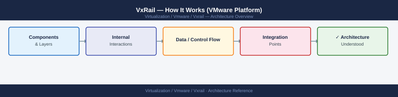
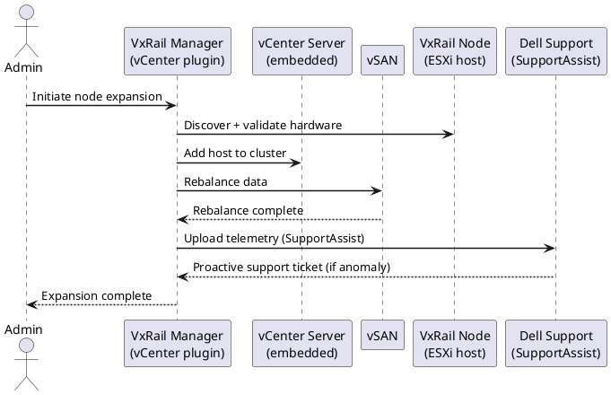

---
tags:
  - architecture
  - vmware
  - vxrail
---
# VxRail — How It Works (VMware Platform)

<div class="kb-summary">
Dell VxRail is a hyper-converged infrastructure (HCI) appliance that combines compute, storage, and networking in a pre-integrated, factory-configured unit. VxRail is built on VMware vSphere and vSAN, and is exclusively managed through the VxRail Manager plugin within vCenter.

*Applies to: VxRail 7.x · 8.x*
</div>


 Every VxRail cluster runs vSAN as its storage layer — there is no shared external storage in a standard VxRail deployment.

VxRail is a jointly engineered product between Dell Technologies and Broadcom (VMware). Software lifecycle is managed through Dell's VxRail Lifecycle Manager (LCM), which orchestrates updates to ESXi, vCenter, vSAN, and hardware firmware as a single bundle.

---



## Architecture Overview

```d2
direction: right

VXM: "VxRail Manager\n(VM on first node" {shape: rectangle}
VC: "vCenter Server\n(embedded or external" {shape: rectangle}
CL: "vSphere Cluster" {shape: rectangle}
N1: "VxRail Node 1\nESXi + vSAN Disk Groups" {shape: rectangle}
N2: "VxRail Node 2\nESXi + vSAN Disk Groups" {shape: rectangle}
N3: "VxRail Node 3\nESXi + vSAN Disk Groups" {shape: rectangle}
DS: "vSAN Datastore\n(distributed across all nodes" {shape: rectangle}
DELL: "Dell Support APIs\nSYS ID, iDRAC" {shape: rectangle}

VXM -> VC
VC -> CL
CL -> N1
CL -> N2
CL -> N3
N1 -> DS
N2 -> DS
N3 -> DS
VXM -> DELL
```

---

## Key Components

| Component | Purpose |
|---|---|
| **VxRail Manager** | Cluster lifecycle, expansion, LCM orchestration; deployed as a VM |
| **vCenter Server** | vSphere cluster management — embedded or customer-provided external |
| **vSAN** | Distributed storage layer; all node storage pooled into one vSAN datastore |
| **iDRAC** | Dell out-of-band management on each node; used by VxRail for hardware health |
| **VxRail LCM** | Lifecycle Manager; orchestrates bundles of ESXi + vCenter + firmware updates |

---

## Node Architecture

Each VxRail node is a Dell PowerEdge server configured at the factory to run ESXi.

| VxRail Family | Platform | Form Factor | Typical Use |
|---|---|---|---|
| E Series | PowerEdge R750/R650 | 2U | General compute; All-Flash or Hybrid |
| P Series | PowerEdge R750 | 2U | Performance-optimised; All-Flash |
| G Series | PowerEdge R750/R450 | 1U/2U | Graphics / GPU workloads |
| S Series | PowerEdge R450/R350 | 1U | Storage-dense configurations |

| Component | Description |
|---|---|
| CPU | 1 or 2 Intel Xeon Scalable processors |
| Memory | ECC DDR5 (Gen 14/15 nodes) |
| Cache Tier | NVMe SSD (required for Hybrid vSAN; optional for All-Flash) |
| Capacity Tier | NVMe SSD (All-Flash) or SAS/SATA HDD (Hybrid) |
| Boot Device | M.2 SD card or M.2 NVMe (not part of vSAN disk groups) |
| iDRAC | Dedicated OOB management port on each node |

---

## vSAN Integration

### Disk Group Design

Each VxRail node contributes one or more vSAN disk groups — a cache disk plus capacity disks. vSAN ESA (Express Storage Architecture) on newer models uses a single-tier NVMe design without a separate cache disk.

```bash
# View disk groups on a node (SSH to ESXi host)
esxcli vsan storage list | grep -E "Disk Group|Is SSD|Device:"
```


```text title="Expected output"
Disk Group: 1
Device: naa.5001405a1b2c3d4e
Is SSD: true
Device: naa.5001405a1b2c3d4f
Is SSD: false
Device: naa.5001405a1b2c3d50
Is SSD: false
Disk Group: 2
Device: naa.5001405a1b2c3d51
Is SSD: true
Device: naa.5001405a1b2c3d52
Is SSD: false
...
```

!!! warning "Common errors"
    **`Error: Unknown command or namespace vsan storage list.`** — Verify VSAN is licensed and enabled on the cluster, then SSH directly to an ESXi host that is part of the VSAN cluster.
    **`Connection refused`** — Ensure SSH is enabled on the ESXi host (Configuration > Security Profile > Services > SSH) and you are using the correct hostname/IP and credentials.
### vSAN Policies and FTT

| Policy | FTT | Minimum Nodes | Data Copies |
|---|---|---|---|
| RAID-1 (Mirroring), FTT=1 | 1 host failure | 3 nodes | 2 copies |
| RAID-1 (Mirroring), FTT=2 | 2 host failures | 5 nodes | 3 copies |
| RAID-5 (Erasure Coding), FTT=1 | 1 host failure | 4 nodes | ~1.33x overhead |
| RAID-6 (Erasure Coding), FTT=2 | 2 host failures | 6 nodes | ~1.5x overhead |

```powershell
# PowerCLI — list vSAN storage policies
Get-SpbmStoragePolicy | Where-Object {$_.Name -like "vSAN*"} | Select-Object Name, Description

# Check policy compliance for all VMs
Get-VM | Get-SpbmEntityConfiguration | Select-Object Entity, StoragePolicy, ComplianceStatus
```

---

## Network Architecture

| Network | Purpose | Recommended MTU |
|---|---|---|
| Management | ESXi management, vCenter, VxRail Manager | 1500 |
| vMotion | Live migration of VMs between nodes | 9000 |
| vSAN | vSAN storage traffic between nodes | 9000 |
| VM Network | VM workload traffic | 1500 or 9000 |

Jumbo frames (MTU 9000) are required on the vMotion and vSAN networks end-to-end, including physical switch ports.

---

## Deployment Models

### Single-Site Cluster

Standard deployment: 4+ nodes in a single physical location sharing one vSAN datastore. Minimum 3 nodes (with RAID-1 FTT=1).

### Two-Node VxRail (Remote Office)

Two VxRail nodes with a vSAN Witness Appliance hosted remotely. Provides FTT=1 with only 2 physical nodes — suitable for branch office deployments.

```text
Site A: Node 1 + Node 2
Remote: vSAN Witness Appliance (1 vCPU, 8 GB RAM VM)
```

### Stretched Cluster (Metro)

Nodes distributed across two physical sites with a vSAN Witness in a third site. Provides site-level HA. Requires sub-5ms RTT between sites for vSAN traffic.

---

## VxRail Manager

VxRail Manager is a Linux appliance VM deployed on the first VxRail node during initial configuration. It integrates as a vCenter plugin.

**Functions:** initial cluster configuration, node health monitoring, node expansion, LCM orchestration, VxRail alarms in vCenter, REST API.

```bash
# VxRail Manager REST API
https://<vxrail-manager-ip>/rest/vxm/v1/

# Get cluster summary
curl -sk -u 'admin:password' \
  "https://<vxrail-manager-ip>/rest/vxm/v1/cluster" | python3 -m json.tool

# Get LCM upgrade status
curl -sk -u 'admin:password' \
  "https://<vxrail-manager-ip>/rest/vxm/v1/lcm/upgrade" | python3 -m json.tool
```


```text title="Expected output"
{
  "id": "cluster-001",
  "name": "vxrail-prod-cluster",
  "version": "7.0.540",
  "health": "Healthy",
  "nodes": 4,
  "storage_capacity_gb": 102400,
  "used_capacity_gb": 67584,
  "vsan_enabled": true,
  "stretched_cluster": false,
  "last_health_check": "2024-01-15T14:32:18Z"
}
{
  "upgrade_status": "Completed",
  "current_version": "7.0.540",
  "target_version": "7.0.540",
  "progress_percentage": 100,
  "last_upgrade_time": "2024-01-10T08:45:22Z",
  "nodes_upgraded": 4,
  "nodes_total": 4,
  "estimated_time_remaining": 0
}
```

!!! warning "Common errors"
    **`curl: (60) SSL certificate problem: self signed certificate`** — Add the `-k` flag (already present) or import the VxRail Manager's CA certificate into your system trust store.
    **`curl: (7) Failed to connect to <vxrail-manager-ip> port 443: Connection refused`** — Verify the VxRail Manager IP address is correct and the REST API service is running with `systemctl status vxrail-rest-api`.
    **`jq: parse error: Invalid JSON text at line 1`** — Ensure python3 is installed and the API response is valid JSON; test with `curl -sk -u 'admin:password' "https://<vxrail-manager-ip>/rest/vxm/v1/cluster"` without piping to check raw output.
| Account | Default Username | Notes |
|---|---|---|
| VxRail Manager local admin | `mystic` | Change on first login |

---

## Supported Version Matrix

Always validate the Dell VxRail Software Compatibility Matrix before upgrades.

| VxRail LCM Bundle | ESXi Version | vCenter Version | vSAN Version |
|---|---|---|---|
| VxRail 8.0.x | ESXi 8.0 Ux | vCenter 8.0 Ux | vSAN 8.0 |
| VxRail 7.0.4xx | ESXi 7.0 U3 | vCenter 7.0 U3 | vSAN 7.0 U3 |

VxRail upgrades always move the entire stack (ESXi + vCenter + vSAN + firmware) to a tested bundle version. Partial upgrades are not supported.

## See also

- [VxRail — Design Standards](../design-standards/)
- [VxRail — Deploy](../../deploy/)
- [VxRail — Integrations](../integrations/)
